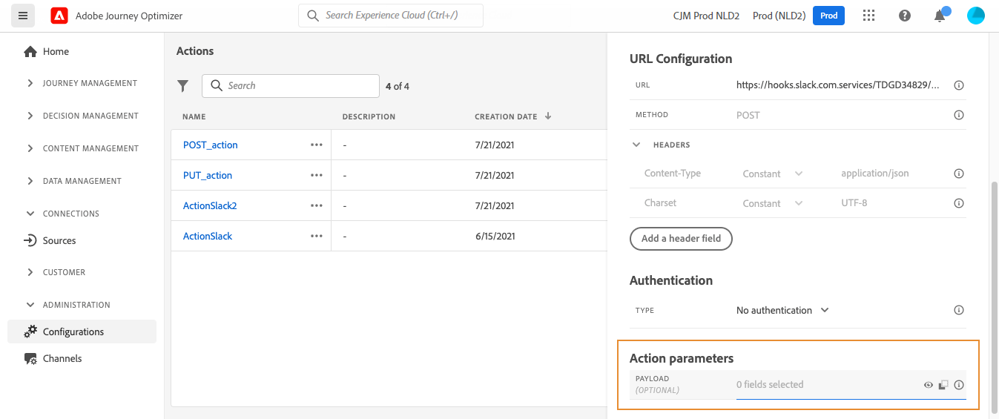

# Konfigurera en anpassad åtgärd {#configure-an-action}

>[!CONTEXTUALHELP]
>id="ajo_journey_action_custom_configuration"
>title="Anpassade åtgärder"
>abstract="Om du använder ett tredjepartssystem för att skicka meddelanden eller om du vill att resor ska skicka API-anrop till ett tredjepartssystem, använder du anpassade åtgärder för att konfigurera anslutningen till din resa. Du kan till exempel ansluta till följande system med anpassade åtgärder: Epsilon, Slack, [Adobe Developer](https://developer.adobe.com), Firebase osv."

Om du använder ett tredjepartssystem för att skicka meddelanden eller om du vill att resor ska skicka API-anrop till ett tredjepartssystem, använder du anpassade åtgärder för att konfigurera anslutningen till din resa. Du kan till exempel ansluta till följande system med anpassade åtgärder: Epsilon, Slack, [Adobe Developer](https://developer.adobe.com){target=&quot;_blank&quot;}, Firebase osv.

Anpassade åtgärder är ytterligare åtgärder som definieras av tekniska användare och görs tillgängliga för marknadsförare. När de är konfigurerade visas de på den vänstra paletten på din resa i **[!UICONTROL Action]** kategori. Läs mer i [den här sidan](../building-journeys/about-journey-activities.md#action-activities).

## Begränsningar{#custom-actions-limitations}

Anpassade åtgärder har några begränsningar som anges i [den här sidan](../start/limitations.md).

I anpassade åtgärdsparametrar kan du skicka en enkel samling samt en samling med objekt. Läs mer om begränsningar för samlingar i [den här sidan](../building-journeys/collections.md#limitations).

Observera också att de anpassade åtgärdsparametrarna har ett förväntat format (exempel: sträng, decimal osv.). Du måste vara försiktig med att ta hänsyn till dessa förväntade format. Läs mer om detta [användningsfall](../building-journeys/collections.md).

## Konfigurationssteg {#configuration-steps}

Här följer de huvudsteg som krävs för att konfigurera en anpassad åtgärd:

1. Välj **[!UICONTROL Configurations]**. I  **[!UICONTROL Actions]** avsnitt, klicka **[!UICONTROL Manage]**. Klicka **[!UICONTROL Create Action]** för att skapa en ny åtgärd. Åtgärdskonfigurationsrutan öppnas till höger på skärmen.

   

1. Ange ett namn för åtgärden.

   >[!NOTE]
   >
   >Använd inte blanksteg eller specialtecken. Använd maximalt 30 tecken.

1. Lägg till en beskrivning av åtgärden. Det här steget är valfritt.
1. Antalet resor som använder den här åtgärden visas i **[!UICONTROL Used in]** fält. Du kan klicka på **[!UICONTROL View journeys]** om du vill visa en lista över resor som använder den här åtgärden.
1. Välj kanalen som är relaterad till den här anpassade åtgärden: **E-post**, **SMS**, eller **Push-meddelande**. Det kommer att förifylla det obligatoriska fältet för marknadsföringsåtgärder med standardmarknadsföringsåtgärden för den valda kanalen. Om du väljer **övriga** kommer inga marknadsföringsåtgärder att definieras.
1. Om du vill tillämpa en regel för samtycke på den här anpassade åtgärden väljer du lämplig **Obligatorisk marknadsföringsåtgärd**. Se [det här avsnittet](../action/about-custom-action-configuration.md#consent-management).
1. Definiera de olika **[!UICONTROL URL Configuration]** parametrar. Se [det här avsnittet](../action/about-custom-action-configuration.md#url-configuration).
1. Konfigurera **[!UICONTROL Authentication]** -avsnitt. Den här konfigurationen är densamma som för datakällor.  Se [det här avsnittet](../datasource/external-data-sources.md#custom-authentication-mode).
1. Definiera **[!UICONTROL Action parameters]**. Se [det här avsnittet](../action/about-custom-action-configuration.md#define-the-message-parameters).
1. 
1. Klicka på **[!UICONTROL Save]**.

   Den anpassade åtgärden är nu konfigurerad och klar att användas på dina resor. Läs [den här sidan](../building-journeys/about-journey-activities.md#action-activities).

   >[!NOTE]
   >
   >När en anpassad åtgärd används i en resa är de flesta parametrar skrivskyddade. Du kan bara ändra **[!UICONTROL Name]**, **[!UICONTROL Description]**, **[!UICONTROL URL]** fält och **[!UICONTROL Authentication]** -avsnitt.

## URL-konfiguration {#url-configuration}

När du konfigurerar en anpassad åtgärd måste du definiera följande **[!UICONTROL URL Configuration]** parametrar:

1. I **[!UICONTROL URL]** anger du URL-adressen för den externa tjänsten:

   * Om URL:en är statisk anger du URL:en i det här fältet.

   * Om URL:en innehåller en dynamisk sökväg anger du bara den statiska delen av URL:en, det vill säga schemat, värden, porten och, eventuellt, en statisk del av sökvägen.

      Exempel: `https://xxx.yyy.com/somethingstatic/`

      Du anger den dynamiska sökvägen för URL:en när du lägger till den anpassade åtgärden på en resa. [Läs mer](../building-journeys/using-custom-actions.md).
   >[!NOTE]
   >
   >Av säkerhetsskäl rekommenderar vi starkt att du använder HTTPS-schemat för URL:en. Vi tillåter inte användning av Adobe-adresser som inte är offentliga och användning av IP-adresser.
   >
   >Endast standardportar tillåts när en anpassad åtgärd definieras: 80 för http och 443 för https.

1. Välj samtalet **[!UICONTROL Method]**: kan vara antingen **[!UICONTROL POST]** eller **[!UICONTROL PUT]**.

   >[!NOTE]
   >
   > The **DELETE** -metoden stöds inte. Om du behöver uppdatera en befintlig resurs väljer du **PUT** -metod.

1. I **[!UICONTROL Headers]** definierar du HTTP-rubrikerna för det begärandemeddelande som ska skickas till den externa tjänsten:
   1. Om du vill lägga till ett rubrikfält klickar du på **[!UICONTROL Add a header field]**.
   1. Ange huvudfältets nyckel.
   1. Om du vill ange ett dynamiskt värde för nyckelvärdepar väljer du **[!UICONTROL Variable]**. Annars väljer du **[!UICONTROL Constant]**.

      Du kan till exempel ange ett dynamiskt värde för en tidsstämpel.

   1. Om du har valt **[!UICONTROL Constant]** anger du sedan konstantvärdet.

      Om du har valt **[!UICONTROL Variable]** anger du den här variabeln när du lägger till den anpassade åtgärden på en resa. [Läs mer](../building-journeys/using-custom-actions.md).

      

   1. Om du vill ta bort ett rubrikfält pekar du på rubrikfältet och klickar på **[!UICONTROL Delete]** ikon.
   The **[!UICONTROL Content-Type]** och **[!UICONTROL Charset]** rubrikfält anges som standard. Du kan inte ändra eller ta bort dessa fält.

   När du har lagt till den anpassade åtgärden för en resa kan du fortfarande lägga till rubrikfält i den om resan är i utkaststatus. Om du inte vill att resan ska påverkas av konfigurationsändringar duplicerar du den anpassade åtgärden och lägger till rubrikfälten i den nya anpassade åtgärden.

   >[!NOTE]
   >
   >Huvuden valideras enligt fälttolkningsregler. Läs mer i [den här dokumentationen](https://tools.ietf.org/html/rfc7230#section-3.2.4){_blank}.

## Definiera åtgärdsparametrarna {#define-the-message-parameters}

I **[!UICONTROL Action parameters]** klistra in ett exempel på JSON-nyttolasten som ska skickas till den externa tjänsten.

>[!NOTE]
>
>Fältnamn i nyttolasten får inte innehålla &quot;.&quot; tecken. De kan inte börja med tecknet &quot;$&quot;.

Du kan definiera parametertypen (t.ex.: sträng, heltal osv.).

Du kan också välja mellan att ange om en parameter är en konstant eller en variabel:

* Konstant innebär att parametervärdet definieras av en teknisk person i åtgärdskonfigurationsfönstret. Värdet är alltid detsamma oavsett resa. Det kommer inte att variera och marknadsföraren kommer inte att se det när han eller hon använder den anpassade åtgärden under resan. Det kan till exempel vara ett ID som tredjepartssystemet förväntar sig. I så fall är fältet till höger om växlingskonstanten/variabeln det värde som skickas.
* Variabel innebär att parameterns värde varierar. Marknadsförare som använder den här anpassade åtgärden under en resa kan skicka det värde de vill ha eller ange var värdet för den här parametern ska hämtas (t.ex. från händelsen, från Adobe Experience Platform). I så fall är fältet till höger om växlingskonstanten/variabeln den etikett marknadsförarna kommer att se under resan för att namnge den här parametern.

## Medgivandehantering {#consent-management}

Kunderna kan nu definiera regler för medgivande, relaterade till sekretess, för att styra utgående data under körningen av åtgärden. En samtyckesprincip fungerar som ett uttryck för profilattribut och anger regler för att definiera om en åtgärd kan utföras för den angivna profilen eller inte.

Samtycke om anpassad åtgärd, pas message encore Conxent a tel type de communication ou utilization de tel type de donnée champs dans profile qui vont sticker ce medgivande coté AEP nuvelles regles de type policies auj gouGovernance policies. Exempel på Restric-e-postmarknadsföring. Associera etikett (C4/C5) med marknadsföringsåtgärder. Quand tu definition une destination,type de marketing action. Ex SFTP crée une dest qui va exporting des données vers ce sftp, tu flague ce sftp avec marketing action. Egelement concept de marketing action rajoutée dans custom action, email/SMS/push marketing action. Anpassad.

Etiketter: quand tu def data set (oÜ stocker tes données), onglet data gouGovernance, pr chaque attribut tu peux definr le type de label associé a cet attribut. Landskodsmärkning C3/C4. Labels ootb, tu peux en def d&#39;autres en fonction besoin.

— Jira-kommentarer—

beskriva&quot;ytterligare marknadsföringsåtgärder&quot; som ett sätt för en yrkesutövare att förklara&quot;avsikten&quot; med en anpassad åtgärd, t.ex. Min egen åtgärd är att träna upp kommunikation, nyhetsbrev, träningskommunikation osv.

Beskriv omfattningen av medgivandet för den första releasen:

- Marknadsföringsåtgärder och attribut som används i personalisering i anpassade åtgärder beaktas
- För segmentutlösta resor (som inleds med ett lässegment) beaktas de attribut som används som villkor i det segmentet
- Alla aktiviteter som används i en resa, förutom ett Lässegment eller en anpassad åtgärd, beaktas inte
- Segmentkvalificering beaktas inte, även om den används för att påbörja en resa

Beskriv att en profil som utesluts genom en medgivandeprincip i en anpassad åtgärd fortfarande kommer att fortsätta under resan (ISO med meddelande- och nedtryckningslista)

Påminnelse som beskriver förväntad fördröjning: https://wiki.corp.adobe.com/display/DMSArchitecture/Consent+Latency
+ korrigera AJO-fördröjning från 1 till 6 timmar

två typer av latens som ska dokumenteras:

- På den där Carolina Infante vet jag inte vad vi kan säga:

Kan vi bekräfta om &quot;UPS Projection/Export&quot; behöver utföras eller inte, för att uppdatera fältet &quot;contentTo&quot; på profilnivå (i vetskap om att det är det vi använder vid körning)? Om så är fallet bör vi nog säga att det skulle ta upp till 48 timmar, men om så inte är fallet talar vi bara om&quot;fördröjning av förtäring + insamlingsfördröjning&quot; (så några sekunder till några timmar i värsta fall om det finns toppar eller driftstopp och/eller om det tar lång tid för kunden att samla in en uppdatering från användaren).

- Fördröjning för samtyckespolicy, skulle jag säga upp till 6 timmar eftersom direktresor kommer att dra in medgivandepolicyer var sjätte timme. Carolina Infante, vet du om vi påverkas av filterfördröjning?
