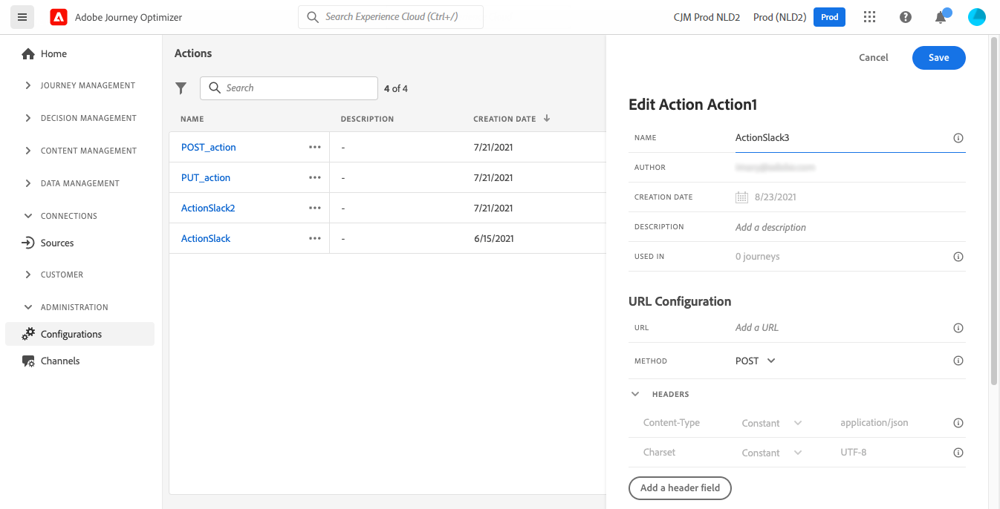

# Konfigurera en anpassad åtgärd {#configure-an-action}

>[!CONTEXTUALHELP]
>id="ajo_journey_action_custom_configuration"
>title="Anpassade åtgärder"
>abstract="Om du använder ett tredjepartssystem för att skicka meddelanden eller om du vill att resor ska skicka API-anrop till ett tredjepartssystem, använder du anpassade åtgärder för att konfigurera anslutningen till din resa. Du kan till exempel ansluta till följande system med anpassade åtgärder: Epsilon, Slack, [Adobe Developer](https://developer.adobe.com), Firebase osv."

Om du använder ett tredjepartssystem för att skicka meddelanden eller om du vill att resor ska skicka API-anrop till ett tredjepartssystem, använder du anpassade åtgärder för att konfigurera anslutningen till din resa. Du kan till exempel ansluta till följande system med anpassade åtgärder: Epsilon, Slack, [Adobe Developer](https://developer.adobe.com){target="_blank"}, Firebase osv.

Anpassade åtgärder är ytterligare åtgärder som definieras av tekniska användare och görs tillgängliga för marknadsförare. När de är konfigurerade visas de på den vänstra paletten på din resa i **[!UICONTROL Action]** kategori. Läs mer i [den här sidan](../building-journeys/about-journey-activities.md#action-activities).

## Begränsningar{#custom-actions-limitations}

Anpassade åtgärder har några begränsningar som anges i [den här sidan](../start/guardrails.md).

I anpassade åtgärdsparametrar kan du skicka en enkel samling samt en samling med objekt. Läs mer om begränsningar för samlingar i [den här sidan](../building-journeys/collections.md#limitations).

Observera också att de anpassade åtgärdsparametrarna har ett förväntat format (till exempel sträng, decimal). Du måste vara försiktig med att ta hänsyn till dessa förväntade format. Läs mer om detta [användningsfall](../building-journeys/collections.md).

## God praxis{#custom-action-enhancements-best-practices}

En begränsning på 150 000 anrop över 30 sekunder har definierats för alla anpassade åtgärder. Den här gränsen har fastställts baserat på kundanvändning för att skydda externa slutpunkter som har anpassats efter anpassade åtgärder. Du måste ta hänsyn till detta vid målgruppsbaserade resor genom att definiera en lämplig läsfrekvens (5 000 profiler/er när anpassade åtgärder används). Om det behövs kan du åsidosätta den här inställningen genom att definiera en större begränsning för begränsning eller begränsning via våra API:er för begränsning/begränsning. Läs [den här sidan](../configuration/external-systems.md).

Du bör inte ange allmänna slutpunkter som mål med anpassade åtgärder av olika anledningar:

* Utan korrekt capping eller strypning finns det risk för att för många anrop skickas till en offentlig slutpunkt som kanske inte stöder den volymen.
* Profildata kan skickas via anpassade åtgärder, så att målgruppsanpassning för en publik slutpunkt kan leda till oavsiktlig delning av personlig information externt.
* Du har ingen kontroll över vilka data som returneras av offentliga slutpunkter. Om en slutpunkt ändrar sitt API eller börjar skicka felaktig information, kommer dessa att göras tillgängliga i den kommunikation som skickas, med potentiella negativa konsekvenser.

## Samtycke- och datahantering {#privacy}

I Journey Optimizer kan du tillämpa policyer för datastyrning och samtycke på anpassade åtgärder för att förhindra att specifika fält exporteras till tredjepartssystem eller utesluta kunder som inte har samtyckt till att ta emot e-post, push eller SMS-kommunikation. Mer information finns på följande sidor:

* [Datastyrning](../action/action-privacy.md).
* [Godkännande](../action/action-privacy.md).

## Konfigurationssteg {#configuration-steps}

Här följer de huvudsteg som krävs för att konfigurera en anpassad åtgärd:

1. I avsnittet ADMINISTRATION-menyn väljer du **[!UICONTROL Configurations]**. I  **[!UICONTROL Actions]** avsnitt, klicka **[!UICONTROL Manage]**. Klicka **[!UICONTROL Create Action]** för att skapa en ny åtgärd. Åtgärdskonfigurationsrutan öppnas till höger på skärmen.

   

1. Ange ett namn för åtgärden.

   >[!NOTE]
   >
   >Använd inte blanksteg eller specialtecken. Använd maximalt 30 tecken.

1. Lägg till en beskrivning av åtgärden. Det här steget är valfritt.
1. Antalet resor som använder den här åtgärden visas i **[!UICONTROL Used in]** fält. Du kan klicka på **[!UICONTROL View journeys]** om du vill visa en lista över resor som använder den här åtgärden.
1. Definiera de olika **[!UICONTROL URL Configuration]** parametrar. Läs [den här sidan](../action/about-custom-action-configuration.md#url-configuration).
1. Konfigurera **[!UICONTROL Authentication]** -avsnitt. Den här konfigurationen är densamma som för datakällor.  Se [det här avsnittet](../datasource/external-data-sources.md#custom-authentication-mode).
1. Definiera **[!UICONTROL Action parameters]**. Läs [den här sidan](../action/about-custom-action-configuration.md#define-the-message-parameters).
1. Klicka på **[!UICONTROL Save]**.

   Den anpassade åtgärden är nu konfigurerad och klar att användas på dina resor. Läs [den här sidan](../building-journeys/about-journey-activities.md#action-activities).

   >[!NOTE]
   >
   >När en anpassad åtgärd används i en resa är de flesta parametrar skrivskyddade. Du kan bara ändra **[!UICONTROL Name]**, **[!UICONTROL Description]**, **[!UICONTROL URL]** fält och **[!UICONTROL Authentication]** -avsnitt.

## Konfiguration av slutpunkt {#url-configuration}

När du konfigurerar en anpassad åtgärd måste du definiera följande **[!UICONTROL Endpoint Configuration]** parametrar:

{width="70%" align="left"}

1. I **[!UICONTROL URL]** anger du URL-adressen för den externa tjänsten:

   * Om URL:en är statisk anger du URL:en i det här fältet.

   * Om URL:en innehåller en dynamisk sökväg anger du bara den statiska delen av URL:en, det vill säga schemat, värden, porten och, eventuellt, en statisk del av sökvägen.

     Exempel: `https://xxx.yyy.com/somethingstatic/`

     Du anger den dynamiska sökvägen för URL:en när du lägger till den anpassade åtgärden på en resa. [Läs mer](../building-journeys/using-custom-actions.md).

   >[!NOTE]
   >
   >Av säkerhetsskäl rekommenderar vi starkt att du använder HTTPS-schemat för URL:en. Vi tillåter inte användning av Adobe-adresser som inte är offentliga och användning av IP-adresser.
   >
   >Endast standardportar tillåts när en anpassad åtgärd definieras: 80 för http och 443 för https.

1. Välj samtalet **[!UICONTROL Method]**: det kan vara antingen **[!UICONTROL POST]**, **[!UICONTROL GET]** eller **[!UICONTROL PUT]**.

   >[!NOTE]
   >
   > The **DELETE** -metoden stöds inte. Om du behöver uppdatera en befintlig resurs väljer du **PUT** -metod.

1. Definiera rubriker och frågeparametrar:

   * I **[!UICONTROL Headers]** avsnitt, klicka **[!UICONTROL Add a header field]** för att definiera HTTP-rubrikerna för det begärandemeddelande som ska skickas till den externa tjänsten. The **[!UICONTROL Content-Type]** och **[!UICONTROL Charset]** rubrikfält anges som standard. Du kan inte ändra eller ta bort dessa fält.

   * I **[!UICONTROL Query parameters]** avsnitt, klicka **[!UICONTROL Add a Query parameter field]** för att definiera de parametrar som du vill lägga till i URL-adressen.

   

1. Ange fältets etikett eller namn.

1. Välj typ: **[!UICONTROL Constant]** eller **[!UICONTROL Variable]**. Om du har valt **[!UICONTROL Constant]** anger du sedan det konstanta värdet i **[!UICONTROL Value]** fält. Om du har valt **[!UICONTROL Variable]** anger du den här variabeln när du lägger till den anpassade åtgärden på en resa. [Läs mer](../building-journeys/using-custom-actions.md).

   

   >[!NOTE]
   >
   >När du har lagt till den anpassade åtgärden för en resa kan du fortfarande lägga till huvud- eller frågeparameterfält i den om resan är i utkaststatus. Om du inte vill att resan ska påverkas av konfigurationsändringar duplicerar du den anpassade åtgärden och lägger till fälten till den nya anpassade åtgärden.
   >
   >Huvuden valideras enligt fälttolkningsregler. Läs mer i [den här dokumentationen](https://tools.ietf.org/html/rfc7230#section-3.2.4){_blank}.

## Definiera nyttolastparametrarna {#define-the-message-parameters}

1. I **[!UICONTROL Request]** klistra in ett exempel på JSON-nyttolasten som ska skickas till den externa tjänsten. Det här fältet är valfritt och endast tillgängligt för anropsmetoder för POST och PUT.

1. I **[!UICONTROL Response]** klistra in ett exempel på nyttolasten som returneras av anropet. Det här fältet är valfritt och tillgängligt för alla anropsmetoder. Detaljerad information om hur du utnyttjar API-anropssvar i anpassade åtgärder finns i [den här sidan](../action/action-response.md).

>[!NOTE]
>
>Svarsfunktionen finns för närvarande i betaversionen.

{width="70%" align="left"}

>[!NOTE]
>
>Nyttolastexemplet får inte innehålla null-värden. Fältnamn i nyttolasten får inte innehålla &quot;.&quot; tecken. De kan inte börja med tecknet &quot;$&quot;.

Du kan definiera parametertypen (t.ex. sträng, heltal).

Du kan också välja mellan att ange om en parameter är en konstant eller en variabel:

* **Konstant** betyder att parameterns värde definieras av en teknisk person i åtgärdskonfigurationsfönstret. Värdet är alltid detsamma oavsett resa. Det kommer inte att variera och marknadsföraren kommer inte att se det när han eller hon använder den anpassade åtgärden under resan. Det kan till exempel vara ett ID som tredjepartssystemet förväntar sig. I så fall är fältet till höger om växlingskonstanten/variabeln det värde som skickas.
* **Variabel** betyder att parameterns värde kommer att variera. Marknadsförare som använder den här anpassade åtgärden under en resa kan skicka det värde de vill ha eller ange var värdet för den här parametern ska hämtas (t.ex. från händelsen, från Adobe Experience Platform). I så fall är fältet till höger om växlingskonstanten/variabeln den etikett marknadsförarna kommer att se under resan för att namnge den här parametern.

