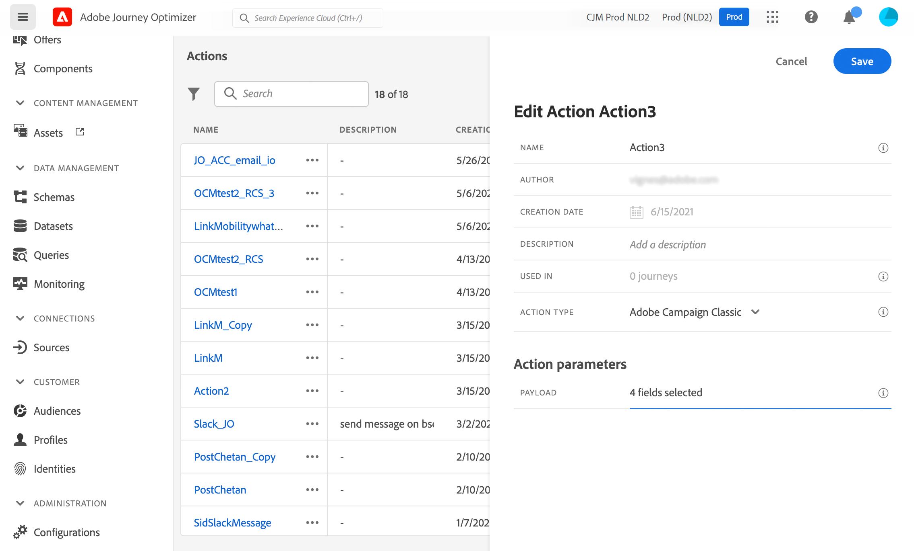

# Integrera med Adobe Campaign v7/v8 {#integrating-with-adobe-campaign-v7-v8}

>[!CONTEXTUALHELP]
>id="ajo_journey_action_acc"
>title="Adobe Campaign v7/v8-åtgärder"
>abstract="Den här integreringen är tillgänglig för Adobe Campaign v7 och v8. Det gör att du kan skicka e-post, push-meddelanden och SMS med Adobe Campaign Transactional Messaging-funktioner. Anslutningen mellan Journey Optimizer- och Campaign-instanserna konfigureras av Adobe vid etableringstidpunkten."

Om du har Adobe Campaign Classic v7 eller Campaign v8 finns det en specifik anpassad åtgärd att utföra på dina resor för att integrera Adobe Journey Optimizer och Adobe Campaign. Tack vare den här integreringen kan du skicka e-post, push-meddelanden och SMS med Adobe Campaign Transactional Messaging-funktioner. Läs mer i det här [heltäckande användningsexemplet](../building-journeys/ajo-ac.md).

För varje konfigurerad åtgärd finns en [kampanjåtgärdsaktivitet](../building-journeys/using-adobe-campaign-v7-v8.md) tillgänglig på paletten Resursdesigner.

## Aktivering {#access}

På begäran konfigureras anslutningen mellan Journey Optimizer- och Adobe Campaign-miljöerna av Adobe vid etableringstidpunkten. Om du inte har begärt att få ansluta vid etableringstidpunkten kontaktar du Adobe Journey Optimizer support för att begära aktiveringen. Du måste ange följande information:

>[!BEGINTABS]

>[!TAB För Adobe Journey Optimizer]

* Organisations-ID (Adobe OrgID)
* Namn på sandlåda

>[!TAB För Adobe Campaign]

* URL för kampanjserver
* URL för realtidsserver
* Din Adobe Campaign-version

>[!ENDTABS]


## Skyddsritningar och begränsningar {#important-notes}

* Det finns ingen begränsning för meddelanden. Systemet avbryter antalet meddelanden som kan skickas till 4 000 per 5 minuter, baserat på den aktuella Campaign SLA. Därför bör Journey Optimizer endast användas i enstaka fall (enskilda evenemang, inte målgrupper).

* Du måste konfigurera en åtgärd på arbetsytan per mall att använda. Du måste konfigurera en åtgärd i Journey Optimizer för varje mall som du vill använda från Adobe Campaign.

* Vi rekommenderar att du använder ett dedikerat meddelandecenter eller en Managed Services-instans för den här integreringen för att undvika att påverka andra Campaign-åtgärder som du har påbörjat. Marknadsföringsservern kan vara värd eller lokal.<!--The build required is 21.1 Release Candidate or greater. -->

* Det finns ingen validering av att nyttolasten eller kampanjmeddelandet är korrekt.

* Du kan inte använda en Campaign-åtgärd med en publikkvalificeringshändelse.

## Förhandskrav {#prerequisites}

I Adobe Campaign måste du skapa och publicera ett transaktionsmeddelande och tillhörande händelse. Mer information finns i [Adobe Campaign-dokumentationen](https://experienceleague.adobe.com/sv/docs/campaign/campaign-v8/send/real-time/transactional){target="_blank"}.

Du kan skapa din JSON-nyttolast som motsvarar varje meddelande enligt mönstret nedan. Du klistrar sedan in denna nyttolast när du konfigurerar åtgärden i Journey Optimizer (se nedan).

+++ Exempel

```json
{
    "channel": "email",
    "eventType": "welcome",
    "email": "Email address",
    "ctx": {
        "firstName": "First name"
    }
}
```

* **kanal**: kanalen som är definierad för din transaktionsmall för Campaign
* **eventType**: det interna namnet på Campaign-händelsen
* **ctx**: variabel baserad på den personalisering du har i meddelandet

+++

## Konfigurera åtgärden {#configure-action}

I Journey Optimizer måste du konfigurera en åtgärd per transaktionsmeddelande.

Så här skapar du en Campaign-åtgärd:

1. Skapa en ny åtgärd. [Lär dig skapa anpassade åtgärder](../action/action.md).
1. Ange namn och beskrivning.
1. Markera **[!UICONTROL Action type]** i fältet **[!UICONTROL Adobe Campaign Classic]**.
   
1. Klicka i fältet **[!UICONTROL Payload]** och klistra in ett exempel på JSON-nyttolasten som motsvarar Campaign-meddelandet. Kontakta Adobe för att få denna nyttolast.
1. Ange att varje fält ska vara statiskt eller variabelt baserat på om du vill att det ska mappas på arbetsytan på resan. Till exempel ska fält som e-postkanalsparametrar och anpassningsfält (`ctx`) vanligtvis anges som variabler så att de kan anpassas dynamiskt under resan.
1. Klicka på **[!UICONTROL Save]**.

## Uppdatera en befintlig åtgärd {#update-action}

Om du behöver uppdatera en befintlig anpassad åtgärd för Campaign v7/v8, till exempel när slutpunkten för realtid (RT) ändras efter den första konfigurationen, gör du så här:

1. Välj **[!UICONTROL Administration]** på menyn **[!UICONTROL Configurations]** och gå sedan till **[!UICONTROL Actions]**.
1. Leta upp och välj den Campaign-åtgärd som du vill uppdatera i åtgärdslistan.
1. Klicka på **[!UICONTROL Edit]** för att öppna åtgärdskonfigurationen.
1. Uppdatera fältet **[!UICONTROL URL]** med den nya URL:en för RT-slutpunkten. Kontrollera att slutpunktsformatet är korrekt och kan nås.
1. Om det behövs uppdaterar du konfigurationen **[!UICONTROL Payload]** så att den matchar eventuella ändringar i strukturen för transaktionsmeddelandet för Campaign.
1. Klicka på **[!UICONTROL Test]** för att validera anslutningen till den nya slutpunkten. Kontrollera att testet returnerar ett godkänt svar innan du fortsätter.
1. Klicka på **[!UICONTROL Save]** när du har validerat för att tillämpa ändringarna.

>[!NOTE]
>
>Alla resor som använder den här åtgärden använder den uppdaterade konfigurationen automatiskt. Om du har direktresor med den här åtgärden bör du övervaka dem noga efter att du har uppdaterat slutpunkten för att säkerställa korrekt meddelandeleverans.

