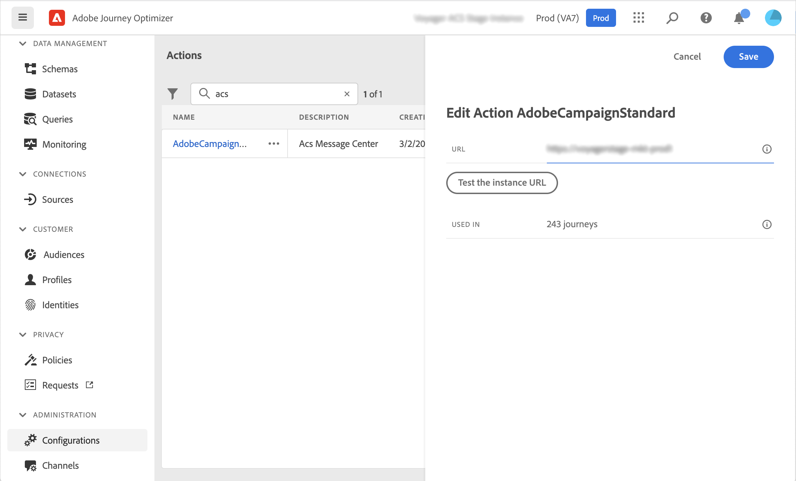

# Integrera med Adobe Campaign Standard {#using_adobe_campaign_standard}

Om du har Adobe Campaign Standard finns det en inbyggd åtgärd som tillåter anslutning till Adobe Campaign Standard. Du kan skicka e-post, push-meddelanden och SMS med Adobe Campaign Standard Transactional Messaging-funktioner.

Campaign Standard transaktionsmeddelande och tillhörande händelse måste publiceras för att kunna användas i Journey Optimizer. Om händelsen publiceras men meddelandet inte visas, visas den inte i Journey Optimizer-gränssnittet. Om meddelandet publiceras men dess associerade händelse inte är det, visas det i Journey Optimizer-gränssnittet, men det går inte att använda det.

## Skyddsritningar och begränsningar {#important-notes}

* En begränsning på 4 000 anrop per 5 minuter definieras automatiskt för Adobe Campaign Standard-åtgärder. Läs mer om SLA för transaktionsmeddelanden i [Adobe Campaign Standard produktbeskrivning](https://helpx.adobe.com/se/legal/product-descriptions/campaign-standard.html){target="_blank"}.

* Integreringen med Adobe Campaign Standard görs via en särskild inbyggd åtgärd i åtgärdslistan. Detta måste konfigureras för varje sandlåda.

* Du kan inte använda en Campaign Standard-åtgärd med en publikkvalificering eller en målgruppsaktivitet.

* En resa kan inte använda både [inbyggda kanalåtgärder](../building-journeys/journeys-message.md) och [Campaign Standard-åtgärder](../building-journeys/using-adobe-campaign-standard.md).

## Konfigurera åtgärden {#configure-action}

I Journey Optimizer måste du konfigurera en åtgärd per transaktionsmeddelande.

Så här konfigurerar du en Campaign Standard-åtgärd:

1. Välj **[!UICONTROL Configurations]** i ADMINISTRATION-menyavsnittet.

1. Klicka på **[!UICONTROL Actions]** i avsnittet **[!UICONTROL Manage]**. Listan med åtgärder visas.

1. Välj den inbyggda **[!UICONTROL AdobeCampaignStandard]**-åtgärden. Åtgärdskonfigurationsrutan öppnas till höger på skärmen.

   

1. Kopiera din Adobe Campaign Standard-instans-URL och klistra in den i fältet **[!UICONTROL URL]**.

1. Klicka på **[!UICONTROL Test the instance URL]** för att testa instansens giltighet.

   >[!NOTE]
   >
   >Detta test verifierar att
   >
   >* Värden är &quot;.campaign.adobe.com&quot;, &quot;.campaign-sandbox.adobe.com&quot;, &quot;.campaign-demo.adobe.com&quot;, &quot;.ats.adobe.com&quot; eller &quot;.adls.adobe.com&quot;
   >
   >* URL:en börjar med https
   >
   >* Organisationen som är associerad med den här Adobe Campaign Standard-instansen är densamma som Journey Optimizer-organisationen

När konfigurationen är klar är tre åtgärder tillgängliga i kategorin **[!UICONTROL Action]** när du utformar en resa: **[!UICONTROL Email]**, **[!UICONTROL Push]**, **[!UICONTROL SMS]**. [Lär dig använda dem](../building-journeys/using-adobe-campaign-standard.md).

Använd en **Reactions**-händelse för att reagera på spårningsdata som är relaterade till ett Campaign Standard-meddelande som skickas inom samma resa:

* För push-meddelanden kan resor reagera på klickade, skickade eller misslyckade meddelanden.

* För SMS-meddelanden kan resor reagera på skickade eller felaktiga meddelanden.

* För e-postmeddelanden kan resor reagera på klickade, skickade, öppnade eller misslyckade meddelanden. [Läs mer om reaktionshändelser](../building-journeys/reaction-events.md).

När du använder ett tredjepartssystem för att skicka meddelanden måste du lägga till och konfigurera en anpassad åtgärd. [Läs mer om konfiguration av anpassad åtgärd](../action/about-custom-action-configuration.md).