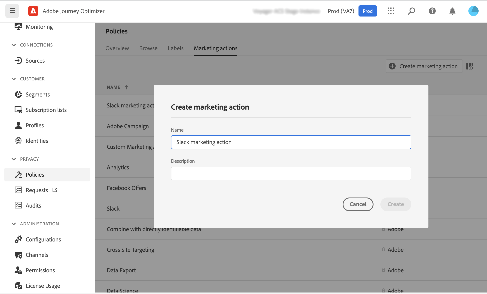

# Dataförvaltning {#restrict-fields}

>[!CONTEXTUALHELP]
>id="ajo_data_governance_policy_violation"
>title="Överträdelse av databehandlingspolicy"
>abstract="Om systemet identifierar ett begränsat fält i en resa/kampanj, eller en anpassad åtgärd, visas ett fel som hindrar dig från att publicera det. Använd datalänksdiagrammet i den här dialogrutan för att förstå vilka andra konfigurationsändringar som behöver göras innan du kan aktivera din resa eller kampanj."

## Kom igång med policyer för datastyrning {#gs}

Med sitt ramverk [Dataanvändningsmärkning och Tvingande (DULE)](https://experienceleague.adobe.com/docs/experience-platform/data-governance/home.html?lang=sv-SE){target="_blank"} kan du med Adobe Experience Platform hantera och tillämpa datastyrningsprinciper i alla kanaler genom att **etikettera fälten** och skapa **marknadsföringsåtgärder** för varje kanal.

När etiketter och marknadsföringsåtgärder har definierats kan du skapa **datastyrningsprinciper** som länkar dessa två element. Du kan till exempel skapa en profil som associerar en ePHI-etikett med en marknadsföringsåtgärd som riktar sig mot e-postmarknadsföring, så att fält som är märkta som ePHI inte används för att anpassa e-postmeddelanden. [Lär dig hur du skapar datastyrningsprinciper](#policy)

När ni har skapat styrningspolicyer kan ni använda marknadsföringsåtgärderna på era resor/kampanjer och resor med anpassade åtgärder.
[Lär dig hur du använder marknadsföringsåtgärder i Journey Optimizer](#apply-marketing-actions)

När du skapar en resa eller kampanj, efter att ha valt en kanalkonfiguration eller lagt till en anpassad åtgärd, verifierar systemet om marknadsföringsåtgärden i meddelandekanalskonfigurationen eller den anpassade åtgärden ingår i en datastyrningspolicy. I så fall kontrollerar systemen om några fält från målgruppen eller meddelandepersonaliseringen är märkta och begränsade enligt policyn. Om en sådan etikett upptäcks blockeras publiceringen av resan eller kampanjen. [Lär dig hur du upptäcker brott mot datahanteringsprinciper](#violation)

## Skapa etiketter och marknadsföringsåtgärder {#labels-marketing-actions}

Det första steget för att genomdriva en policy för datastyrning är att skapa etiketter och bifoga dem till fält som du vill begränsa användningen av och marknadsföringsåtgärder för var och en av kanalerna.

1. Klicka på **Profiler** under **Integritet** på den vänstra menyn.

1. Välj fliken **Etiketter** och klicka på **Skapa etikett**.

1. Ange ett namn och ett eget namn för etiketten. Exempel: _ePHI1_.

1. Klicka på **Scheman** under **Datahantering** på den vänstra menyn och klicka sedan på knappen **Använd åtkomst- och datastyrningsetiketter** . Markera ditt schema och fält (t.ex. &quot;blodtyp&quot;) och markera den etikett som skapats tidigare, _ePHI1_ i vårt exempel.

   

1. Gå tillbaka till menyn **Profiler**, välj fliken **Marknadsföringsåtgärd** och klicka på **Skapa marknadsföringsåtgärd**. Vi rekommenderar att ni skapar en marknadsföringsåtgärd för varje kanal och varje anpassad åtgärd från tredje part som används på era resor. Låt oss till exempel skapa en _Slack-marknadsföringsåtgärd_ som ska användas för din anpassade Slack-åtgärd.

   

## Skapa en datastyrningspolicy {#policy}

Nu när etiketter och marknadsföringsåtgärder har skapats kan ni länka samman dem till policyer för datastyrning. Om du vill göra det väljer du fliken **Bläddra**, klickar på **Skapa princip** och väljer **Datastyrningsprincip**. Markera etiketten (_ePHI1_) och marknadsföringsåtgärden (_Slack marknadsföringsåtgärd_).

När du ska använda din anpassade Slack-åtgärd som konfigurerats med _Slack marknadsföringsåtgärd_ på en resa, kommer den associerade principen att utnyttjas.

## Använda marknadsföringsåtgärder i Journey Optimizer {#apply-marketing-actions}

För att datahanteringsprinciper ska kunna tillämpas i Journey Optimizer måste ni vidta marknadsföringsåtgärder för era resor, kampanjer eller anpassade åtgärder.

### Använd marknadsföringsåtgärder på resor och kampanjer {#journeys-campaigns}

När du har skapat styrningsprinciper måste du tillämpa de relevanta marknadsföringsåtgärderna på dina **kanalkonfigurationer** för Journey Optimizer. Följ dessa steg för att göra detta:

1. Gå till **[!UICONTROL Channels]** > **[!UICONTROL General settings]** > **[!UICONTROL Channel configurations]**-menyn.

1. Öppna en befintlig kanalkonfiguration eller skapa en ny.

1. I fältet **[!UICONTROL Marketing action]** väljer du de marknadsföringsåtgärder som ska associeras med resorna/kampanjerna med den här konfigurationen. Alla policyer för samtycke och datastyrning som är kopplade till marknadsföringsåtgärden utnyttjas för att ta hänsyn till era kunders preferenser och de begränsningar som har fastställts för känsliga områden. [Läs mer](../action/consent.md#surface-marketing-actions)

   

1. Slutför konfigurationsinställningarna för kanalerna och spara dem. [Lär dig hur du ställer in kanalkonfiguration](../configuration/channel-surfaces.md).

1. När du skapar ett meddelande i din resa eller kampanj väljer du den relevanta kanalkonfigurationen. Slutför konfigurationen av resan eller kampanjen och spara den.

Innan resan eller kampanjen aktiveras verifieras om marknadsföringsåtgärden i den valda kanalkonfigurationen ingår i en datastyrningspolicy. I så fall kontrollerar systemen om några fält från målgruppen eller meddelandepersonaliseringen är märkta och begränsade enligt policyn.

Om systemet identifierar ett begränsat fält visas ett fel som hindrar dig från att publicera resan eller kampanjen. [Lär dig hur du upptäcker brott mot styrningsprinciper](#violation)

{zoomable="yes"}

*Analyssteg för policyöverträdelse för resor och kampanjer*

### Använd marknadsföringsåtgärder på anpassade åtgärder {#custom-actions}

>[!NOTE]
>
>Reseåtgärder för Campaign v7/v8 och Campaign Standard stöds inte.

Låt oss ta ett exempel på det blodtypsfält som du behöver begränsa från att exporteras till en tredje part med anpassade åtgärder. För att göra det måste ni tillämpa marknadsföringsåtgärden på er anpassade åtgärd, och sedan bygga upp kundresan och lägga till en anpassad åtgärd i den.

1. Klicka på **Konfigurationer** under **Administration** på den vänstra menyn och välj **Åtgärder**.

1. Öppna en anpassad Slack-åtgärd. När du konfigurerar en anpassad åtgärd kan två fält användas för datastyrning.

   

   * I fältet **Kanal** kan du välja kanalen som är relaterad till den här anpassade åtgärden. Det fyller i fältet **Obligatorisk marknadsföringsåtgärd** med standardmarknadsföringsåtgärden för den valda kanalen. Om du väljer **other** definieras ingen marknadsföringsåtgärd som standard. I vårt exempel väljer vi kanalen **other**.

   * Med den **obligatoriska marknadsföringsåtgärden** kan du definiera marknadsföringsåtgärden som är relaterad till din anpassade åtgärd. Om du till exempel använder den anpassade åtgärden för att skicka e-post med en tredje part kan du välja **E-postmarknadsföring**. I vårt exempel väljer vi _Slack marknadsföringsåtgärd_. De styrningsprinciper som är kopplade till marknadsföringsåtgärden hämtas och utnyttjas.

   De andra stegen för att konfigurera en anpassad åtgärd beskrivs i [det här avsnittet](../action/about-custom-action-configuration.md#consent-management).

1. Klicka på **Resor** på den vänstra menyn under **Resehantering**.

1. Skapa din resa och lägg till en anpassad åtgärd. När du lägger till en anpassad åtgärd under en resa kan du hantera datastyrning med flera alternativ. Klicka på **Visa skrivskyddade fält** om du vill visa alla parametrar.

   

   * Marknadsföringsåtgärden **Kanal** och **Obligatorisk**, som definieras när den anpassade åtgärden konfigureras, visas längst upp på skärmen. Du kan inte ändra dessa fält.

   * Du kan definiera en **ytterligare marknadsföringsåtgärd** för att ange typen av anpassad åtgärd. På så sätt kan du definiera syftet med den anpassade åtgärden under den här resan. Utöver den nödvändiga marknadsföringsåtgärden, som vanligtvis är specifik för en kanal, kan ni definiera ytterligare en marknadsföringsåtgärd som är specifik för den anpassade åtgärden under den här resan. Exempel: en träningskommunikation, ett nyhetsbrev, ett friskvårdsmeddelande osv. Både den marknadsföringsåtgärd som krävs och den ytterligare marknadsföringsåtgärden gäller. I vårt exempel använder vi inte någon ytterligare marknadsföringsåtgärd.

Om ett av fälten med etiketten _ePHI1_ (blodet i vårt exempel) identifieras i åtgärdsparametrarna visas ett fel som förhindrar dig från att publicera resan. [Lär dig hur du upptäcker brott mot styrningsprinciper](#violation)

{zoomable="yes"}

*Analyssteg för policyöverträdelse för anpassade åtgärder för resor*

## Identifiera policyöverträdelse {#violation}

Om systemet identifierar ett begränsat fält i en resa/kampanj, eller en anpassad åtgärd, visas ett fel som hindrar dig från att publicera det.

Fel visas från knappen **[!UICONTROL Alerts]**. Välj felet om du vill visa detaljerad information om den överträdelse av datastyrningsprincipen som har inträffat.

Den här dialogrutan anger att den aktuella resan/kampanjkonfigurationen bryter mot en befintlig datastyrningspolicy. Använd datalänksdiagrammet för att förstå vilka andra konfigurationsändringar som behöver göras innan du kan aktivera din resa eller kampanj.

Detaljerad information finns i [informationen om brott mot dataanvändningsprincipen](https://experienceleague.adobe.com/sv/docs/experience-platform/data-governance/enforcement/auto-enforcement#data-usage-violation){_blank}.
