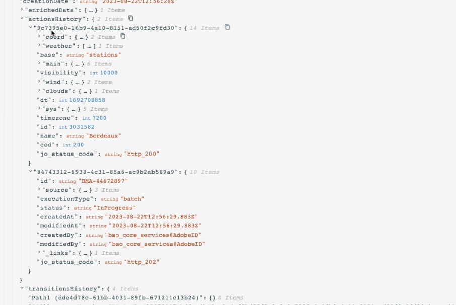

# Använd API-anropssvar i anpassade åtgärder {#custom-action-enhancements}

Du kan utnyttja API-anropssvar i anpassade åtgärder och samordna dina resor baserat på dessa svar.

<!--
You can now leverage API call responses in custom actions and orchestrate your journeys based on these responses.

This capability was previously only available when using data sources. You can now use it with custom actions. 
-->

## Viktiga anteckningar{#custom-action-enhancements-notes}

<!--
* Custom actions should only be used with private or internal endpoints, and used with an appropriate capping or throttling limit. See [this page](../configuration/external-systems.md). 
-->

* Skalära arrayer stöds i svarsnyttolasten:

  ```
  "dummyScalarArray": [
  "val1",
  "val2"
  ]
  ```

* Heterogena arrayer stöds inte i svarsnyttolasten:

  ```
  "dummyRandomArray": [
  20,
  "aafw",
  false
  ]
  ```

<!--
## Best practices{#custom-action-enhancements-best-practices}

A capping limit of 5000 calls/s is defined for all custom actions. This limit has been set based on customers usage, to protect external endpoints targeted by custom actions. You need to take this into account in your audience-based journeys by defining an appropriate reading rate (5000 profiles/s when custom actions are used). If needed, you can override this setting by defining a greater capping or throttling limit through our Capping/Throttling APIs. See [this page](../configuration/external-systems.md).

You should not target public endpoints with custom actions for various reasons:

* Without proper capping or throttling, there is a risk of sending too many calls to a public endpoint that may not support such volume.
* Profile data can be sent through custom actions, so targeting a public endpoint could lead to inadvertently sharing personal information externally.
* You have no control on the data being returned by public endpoints. If an endpoint changes its API or starts sending incorrect information, those will be made available in communications sent, with potential negative impacts.
-->

<!--
## Define the custom action {#define-custom-action}

When defining the custom action, two enhancements have been made available: the addition of the GET method and the new payload response field. The other options and parameters are unchanged. See [this page](../action/about-custom-action-configuration.md).

### Endpoint configuration {#endpoint-configuration}

The **URL configuration** section has been renamed **Endpoint configuration**.

In the **Method** drop-down, you can now select **GET**.

{width="70%" align="left"}

### Payloads {#payloads-new}

The **Action parameters** section has been renamed **Payloads**. Two fields are available:

* The **Request** field: this field is only available for POST and PUT calling methods.
* The **Response** field: this is the new capability. This field as available for all calling methods.

>[!NOTE]
> 
>Both these fields are optional.

{width="70%" align="left"}
-->

## Konfigurera den anpassade åtgärden {#config-response}

1. Skapa den anpassade åtgärden. Se [den här sidan](../action/about-custom-action-configuration.md).

1. Klicka i fältet **Svar**.

   {width="80%" align="left"}

1. Klistra in ett exempel på nyttolasten som returneras av anropet. Kontrollera att fälttyperna är korrekta (sträng, heltal osv.). Här är ett exempel på nyttolast för svar som fångats in under anropet. Vår lokala slutpunkt skickar antalet förmånspoäng och statusen för en profil.

   ```
   {
   "customerID" : "xY12hye",    
   "status":"gold",
   "points": 1290 }
   ```

   {width="80%" align="left"}

   Varje gång API anropas hämtas alla fält som ingår i nyttolastexemplet.

1. Vi lägger också till customerID som frågeparameter.

   {width="80%" align="left"}

1. Klicka på **Spara**.

## Utnyttja svarsalternativen under en resa {#response-in-journey}

Lägg bara till den anpassade åtgärden på en resa. Du kan sedan utnyttja svarsnyttolastfälten under förhållanden, andra åtgärder och meddelandepersonalisering.

Du kan till exempel lägga till ett villkor för att kontrollera antalet förmånspoäng. När personen kommer in på restaurangen skickar din lokala slutpunkt ett samtal med profilens lojalitetsinformation. Du kan skicka en push-funktion om profilen är en guldkund. Om ett fel upptäcks i samtalet skickar du en anpassad åtgärd till systemadministratören.


1. Lägg till din händelse och den anpassade lojalitetsåtgärden som skapades tidigare.

1. I den anpassade lojalitetsåtgärden kopplar du frågeparametern för kund-ID till profil-ID:t. Markera alternativet **Lägg till en alternativ sökväg om en timeout eller ett fel inträffar**.

   

1. Lägg till ett villkor i den första grenen och använd den avancerade redigeraren för att utnyttja åtgärdssvarsfälten, under noden **Kontext** .

   

1. Lägg sedan till push-meddelanden och anpassa meddelandet med svarsfälten. I vårt exempel personaliserar vi innehållet med hjälp av antalet kundpoäng och kundens status. Åtgärdssvarsfälten är tillgängliga under **Sammanhangsberoende attribut** > **Journey Orchestration** > **Åtgärder**.

   

   >[!NOTE]
   >
   >Varje profil som anger den anpassade åtgärden utlöser ett anrop. Även om svaret alltid är detsamma kommer Journey fortfarande att ringa ett samtal per profil.

1. Lägg till ett villkor i timeout- och felgrenen och utnyttja det inbyggda fältet **jo_status_code**. I vårt exempel använder vi
   **http_400** -feltyp. Se [det här avsnittet](#error-status).

   ```
   @action{ActionLoyalty.jo_status_code} == "http_400"
   ```

   

1. Lägg till en anpassad åtgärd som ska skickas till din organisation.

   

## Loggar för testläge {#test-mode-logs}

I testläge har du åtkomst till statusloggar som är relaterade till anpassade åtgärdssvar. Om du har definierat anpassade åtgärder med svar under din resa, visas ett **actionsHistory** -avsnitt i loggarna med den nyttolast som returneras av den externa slutpunkten (som ett svar från den anpassade åtgärden). Detta kan vara mycket användbart när det gäller felsökning.



## Felstatus {#error-status}

Fältet **jo_status_code** är alltid tillgängligt även när ingen svarsnyttolast har definierats.

Här är möjliga värden för det här fältet:

* http-statuskod: http_`<HTTP API call returned code>`, till exempel http_200 eller http_400
* timeout-fel: **timeout**
* capping-fel: **cApped**
* internt fel: **internalError**

Ett åtgärdsanrop hanteras av fel när den returnerade http-koden är större än 2xx eller om ett fel inträffar. I sådana fall skickas resan till den särskilda tidsgränsen eller felavdelningen.

>[!WARNING]
>
>Endast nyligen skapade anpassade åtgärder inkluderar fältet **jo_status_code** som är körklar. Om du vill använda den med en befintlig anpassad åtgärd måste du uppdatera åtgärden. Du kan till exempel uppdatera beskrivningen och spara den.

## Uttryckssyntax {#exp-syntax}

Här är syntaxen:

```json
#@action{myAction.myField} 
```

Här är några exempel:

```json
 // action response field
 @action{<action name>.<path to the field>}
 @action{ActionLoyalty.status}
```

```json
 // action response field
 @action{<action name>.<path to the field>, defaultValue: <default value expression>}
 @action{ActionLoyalty.points, defaultValue: 0}
 @action{ActionLoyalty.points, defaultValue: @event{myEvent.newPoints}}
```

När du ändrar samlingar i ett anpassat åtgärdssvar kan du förlita dig på `currentActionField` för att komma åt det aktuella objektet:

```json
count(
@action{MyAction.MyCollection.all(
currentActionField.description == "abc"
)}
)
```

### Använda anpassade åtgärdssvar i inbyggda kanaler {#response-in-channels}

Svarsnyttolastfält från anpassade åtgärder kan användas i inbyggda kanaler (e-post, push, SMS) för meddelandepersonalisering. Detta inkluderar möjligheten att iterera över arrayer och kapslade datastrukturer som returneras av externa API:er.

<!--For detailed examples and syntax for iterating over custom action response data in messages, refer to [Iterate over contextual data with Handlebars](../personalization/personalization-contexts.md#custom-action-responses).-->

## Ytterligare resurser

Mer information finns på följande sidor:

* [Fältreferenser](../building-journeys/expression/field-references.md).
* [Funktioner för att hantera samlingar](../building-journeys/expression/collection-management-functions.md)
