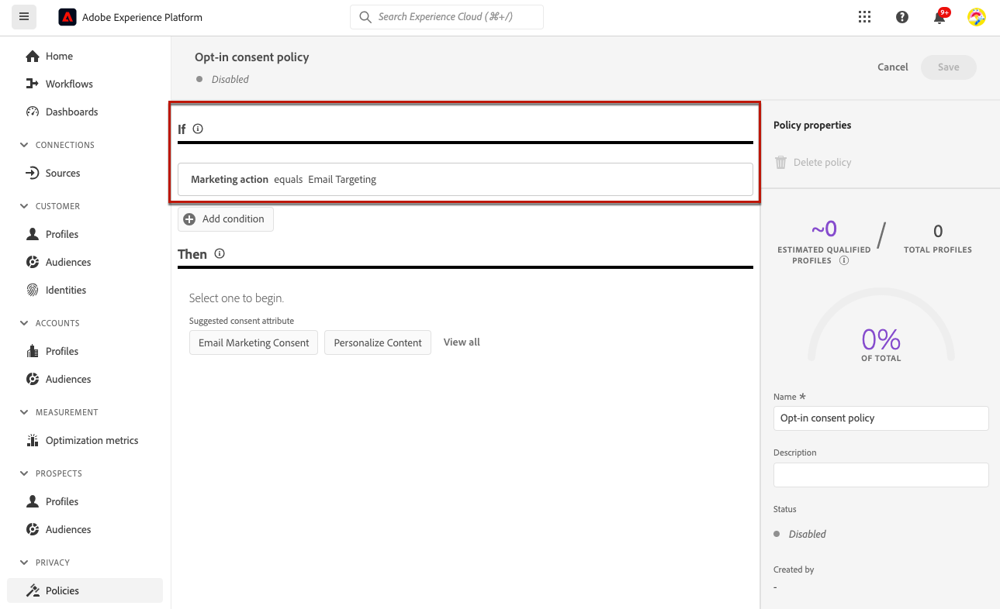
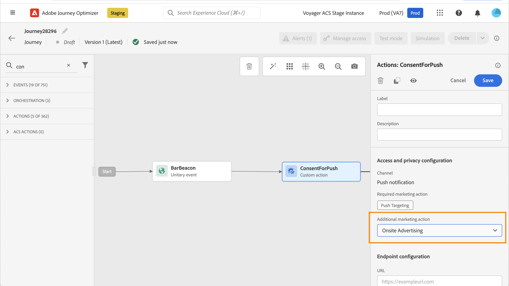

# Arbeta med policyer för samtycke {#consent-management}

Dina data kan begränsas av din organisation eller av juridiska bestämmelser. Det är därför viktigt att se till att dataåtgärderna i Journey Optimizer är kompatibla med [dataanvändningsprinciper](https://experienceleague.adobe.com/docs/experience-platform/data-governance/policies/overview.html){target="_blank"}. Dessa profiler är Adobe Experience Platform-regler som definierar vilka marknadsföringsåtgärder du får utföra på data.

Som standard, om en profil har valt att inte ta emot meddelanden från dig, kommer motsvarande profil att uteslutas från efterföljande leveranser. Du kan skapa en **medgivandeprincip** som åsidosätter den här standardlogiken. Du kan till exempel skapa en samtyckespolicy i Experience Platform för att exkludera kunder som inte har samtyckt till att ta emot kommunikation för en viss kanal. Om det inte finns någon anpassad princip gäller standardprincipen.

>[!IMPORTANT]
>
>Samtyckespolicyer är för närvarande bara tillgängliga för organisationer som har köpt Adobe **Healthcare Shield** eller **Privacy and Security Shield** som tillägg.

De viktigaste stegen för att tillämpa policyer för samtycke är följande:

1. Skapa en samtyckespolicy i Adobe Experience Platform med en associerad marknadsföringsåtgärd. [Lär dig hur du skapar en medgivandeprincip](https://experienceleague.adobe.com/docs/experience-platform/data-governance/policies/user-guide.html#consent-policy){target="_blank"}

2. Använd samtyckesregler i Adobe Journey Optimizer med kanalkonfigurationer eller anpassade åtgärder för kundresan.

   * Skapa en kanalkonfiguration med en associerad marknadsföringsåtgärd. När du skapar en kommunikation med kanalkonfigurationen ärver den marknadsföringsåtgärd som har associerats och tillämpar de motsvarande medgivandepolicyer som definieras i Adobe Experience Platform. [Lär dig hur du kan utnyttja medgivandeprinciper via kanalkonfigurationer](#surface-marketing-actions)

   * På resenivå kan du antingen:

      * Koppla en kanal och en marknadsföringsåtgärd till en anpassad åtgärd när den konfigureras. [Lär dig hur du kan utnyttja medgivandeprinciper när du konfigurerar en anpassad åtgärd](#consent-custom-action)
      * Definiera ytterligare en marknadsföringsåtgärd när du lägger till en anpassad åtgärd under en resa. [Lär dig hur du kan utnyttja medgivandeprinciper när du lägger till en anpassad åtgärd under en resa](#consent-journey)

## Utnyttja samtyckespolicyer via kanalkonfigurationer {#surface-marketing-actions}

I [!DNL Journey Optimizer] hanteras samtycke av Experience Platform [Consent schema](https://experienceleague.adobe.com/docs/experience-platform/xdm/field-groups/profile/consents.html){target="_blank"}. Som standard är värdet för medgivandefältet tomt och behandlas som samtycke för att ta emot dina meddelanden. Du kan ändra det här standardvärdet vid introduktion till ett av de möjliga värden som anges [här](https://experienceleague.adobe.com/docs/experience-platform/xdm/data-types/consents.html#choice-values){target="_blank"}.

Om du vill ändra värdet på fältet för samtycke kan du skapa en anpassad samtyckespolicy där du definierar en marknadsföringsåtgärd och de villkor som åtgärden utförs under. [Läs mer om marknadsföringsåtgärder](https://experienceleague.adobe.com/docs/experience-platform/data-governance/policies/overview.html#marketing-actions){target="_blank"}

Om du till exempel vill skapa en samtyckespolicy för att endast rikta sig till profiler som har samtyckt till att ta emot e-postmeddelanden följer du stegen nedan.

1. Kontrollera att din organisation har köpt Adobe **Healthcare Shield** eller **Privacy and Security Shield** som tillägg. [Läs mer](https://experienceleague.adobe.com/docs/events/customer-data-management-voices-recordings/governance/healthcare-shield.html){target="_blank"}

1. Skapa en anpassad princip (från menyn **[!UICONTROL Privacy]** > **[!UICONTROL Policies]**) i Adobe Experience Platform. [Lär dig hur](https://experienceleague.adobe.com/docs/experience-platform/data-governance/policies/user-guide.html#create-policy){target="_blank"}

   <!---->

1. Välj typen **[!UICONTROL Consent policy]** och konfigurera ett villkor enligt följande. [Lär dig hur du konfigurerar principer för samtycke](https://experienceleague.adobe.com/docs/experience-platform/data-governance/policies/user-guide.html#consent-policy){target="_blank"}

   1. Under avsnittet **[!UICONTROL If]** väljer du standardmarknadsföringsåtgärden **[!UICONTROL Email Targeting]**.

      <!---->

      >[!NOTE]
      >
      >De viktigaste marknadsföringsåtgärderna som tillhandahålls av Adobe visas i [den här tabellen](https://experienceleague.adobe.com/docs/experience-platform/data-governance/policies/overview.html?lang=en#core-actions){target="_blank"}. Stegen för att skapa en anpassad marknadsföringsåtgärd visas i [det här avsnittet](https://experienceleague.adobe.com/docs/experience-platform/data-governance/policies/user-guide.html#create-marketing-action){target="_blank"}.

   1. Välj vad som ska hända när marknadsföringsåtgärden gäller. I det här exemplet väljer du **[!UICONTROL Email Marketing Consent]**.

   

1. Spara och [aktivera](https://experienceleague.adobe.com/docs/experience-platform/data-governance/policies/user-guide.html#enable){target="_blank"} den här principen.

1. Skapa en e-postkanalskonfiguration i Journey Optimizer. [Lär dig hur](../configuration/channel-surfaces.md#create-channel-surface)

1. Välj marknadsföringsåtgärden **[!UICONTROL Email Targeting]** i e-postkonfigurationsinformationen.

   

Alla policyer för samtycke som är kopplade till den marknadsföringsåtgärden utnyttjas automatiskt för att ta hänsyn till kundernas preferenser.

I det här exemplet skickas därför alla [e-postmeddelanden](../email/create-email.md) som använder den konfigurationen i en kampanj eller en resa endast till de profiler som har godkänt att ta emot e-postmeddelanden från dig. Profiler som inte har samtyckt till att ta emot e-postmeddelanden exkluderas.

## Utnyttja policyer för medgivande genom anpassade åtgärder {#journey-custom-actions}

### Viktiga anteckningar {#important-notes}

I Journey Optimizer kan man också utnyttja medgivande i anpassade åtgärder. Om du vill använda den med inbyggda meddelandefunktioner måste du använda en villkorsaktivitet för att filtrera kunder under kundresan.

Med samtyckeshantering analyseras två olika reseaktiviteter:

* Läsande målgrupp: den hämtade målgruppen beaktas.
* Anpassad åtgärd: samtyckeshantering tar hänsyn till de attribut som används ([åtgärdsparametrar](../action/about-custom-action-configuration.md#define-the-message-parameters)) samt till de marknadsföringsåtgärder som har definierats (obligatorisk marknadsföringsåtgärd och ytterligare marknadsföringsåtgärder).
* Attribut som är en del av en fältgrupp som använder det färdiga unionsschemat stöds inte. De här attributen döljs i gränssnittet. Du måste skapa en annan fältgrupp med ett annat schema.
* Samtyckesprinciper gäller bara när en marknadsföringsåtgärd (obligatorisk eller ytterligare) har ställts in på den anpassade åtgärdsnivån.

Alla andra aktiviteter som används under en resa beaktas inte. Om du påbörjar en resa med en publikkompetens beaktas inte målgruppen.

Om en profil utesluts under en resa genom en samtyckespolicy i en anpassad åtgärd, skickas inte meddelandet till honom, men han fortsätter resan. Profilen går inte till timeout och felsökväg när ett villkor används.

Innan du uppdaterar principer i en anpassad åtgärd som har placerats på en resa måste du se till att resan inte innehåller något fel.

<!--
There are two types of latency regarding the use of consent policies:

* **User latency**: the delay from the time a profile changes a consent settings to the moment it is applied in Experience Platform. This can take up to 48h. 
* **Consent policy latency**: the delay from the time a consent policy is created or updated to the moment it is applied. This can take up to 6 hours
-->

### Utnyttja medgivandeprinciper när en anpassad åtgärd konfigureras{#consent-custom-action}

När du konfigurerar en anpassad åtgärd kan två fält användas för samtyckeshantering.

I fältet **Kanal** kan du välja kanalen som är relaterad till den här anpassade åtgärden. Det fyller i fältet **Obligatorisk marknadsföringsåtgärd** med standardmarknadsföringsåtgärden för den valda kanalen. Om du väljer **other** definieras ingen marknadsföringsåtgärd som standard.

Med den **obligatoriska marknadsföringsåtgärden** kan du definiera marknadsföringsåtgärden som är relaterad till din anpassade åtgärd. Om du till exempel använder den anpassade åtgärden för att skicka e-post kan du välja **E-postmarknadsföring**. När de används under en resa hämtas och utnyttjas alla medgivandepolicyer som är kopplade till den marknadsföringsåtgärden. En standardmarknadsföringsåtgärd har valts, men du kan klicka på nedpilen för att välja alla tillgängliga marknadsföringsåtgärder från listan.

För vissa typer av viktig kommunikation, t.ex. ett transaktionsmeddelande som skickas för att återställa klientens lösenord, kanske du inte vill tillämpa en godkännandeprincip. Du väljer sedan **Ingen** i fältet **Obligatorisk marknadsföringsåtgärd**.

De andra stegen för att konfigurera en anpassad åtgärd beskrivs i [det här avsnittet](../action/about-custom-action-configuration.md#consent-management).

### Utnyttja policyer för samtycke när du lägger till en anpassad åtgärd under en resa {#consent-journey}

När du lägger till den anpassade åtgärden på en resa kan du hantera samtycke med flera alternativ. Klicka på **Visa skrivskyddade fält** om du vill visa alla parametrar.

Marknadsföringsåtgärden **Kanal** och **Obligatorisk**, som definieras när den anpassade åtgärden konfigureras, visas längst upp på skärmen. Du kan inte ändra dessa fält.

Du kan definiera en **ytterligare marknadsföringsåtgärd** för att ange typen av anpassad åtgärd. På så sätt kan du definiera syftet med den anpassade åtgärden under den här resan. Utöver den nödvändiga marknadsföringsåtgärden, som vanligtvis är specifik för en kanal, kan ni definiera ytterligare en marknadsföringsåtgärd som är specifik för den anpassade åtgärden under den här resan. Exempel: en träningskommunikation, ett nyhetsbrev, ett friskvårdsmeddelande osv. Både den marknadsföringsåtgärd som krävs och den ytterligare marknadsföringsåtgärden gäller.

Klicka på knappen **Uppdatera profiler** längst ned på skärmen för att uppdatera och kontrollera listan med profiler som har tagits i beaktande för den här anpassade åtgärden. Detta är endast avsett som information, när en resa byggs. Med direktresor hämtas och uppdateras godkännandepolicyer automatiskt var sjätte timme.

<!--
The following data is taken into account for consent:

* marketing actions and additional marketing actions defined in the custom action
* action parameters defined in the custom action, see this [section](../action/about-custom-action-configuration.md#define-the-message-parameters) 
* attributes used as criteria in a segment when the journey starts with a Read segment, see this [section](../building-journeys/read-audience.md) 

>[!NOTE]
>
>Please note that there can be a latency when updating the list of policies applied, refer to this [this section](../action/consent.md#important-notes).
-->

De andra stegen för att konfigurera en anpassad åtgärd under en resa beskrivs i [det här avsnittet](../building-journeys/using-custom-actions.md).
