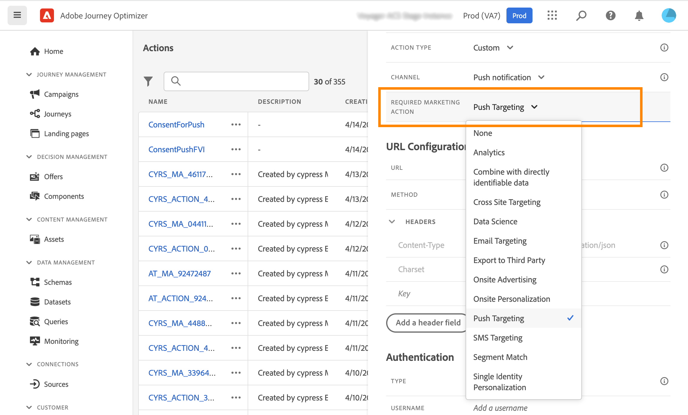
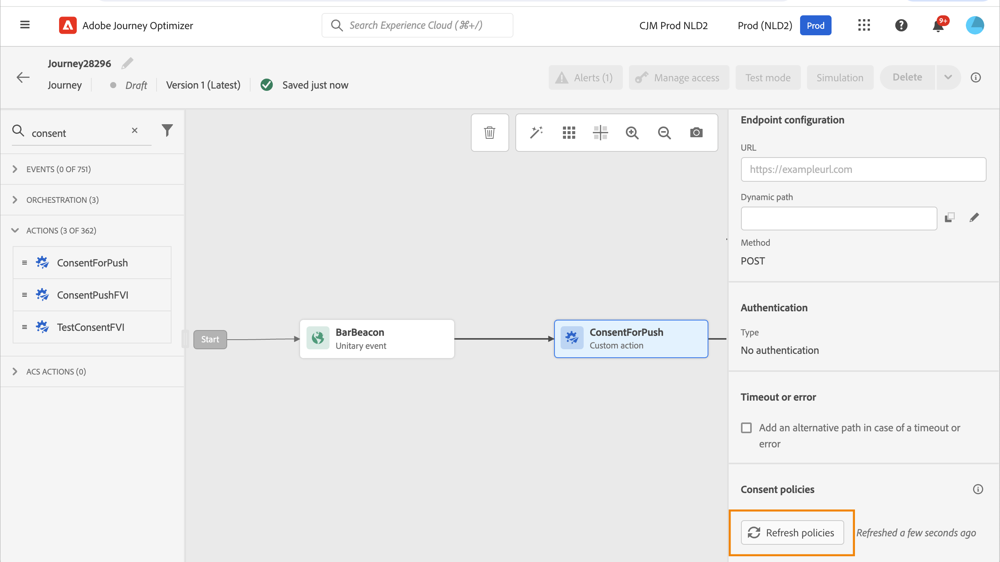

# Arbeta med policyer för samtycke {#consent-management}

Med Adobe Experience Platform kan ni enkelt införa och tillämpa marknadsföringspolicyer för att respektera kundernas samtycke. Samtyckesregler definieras i Adobe Experience Platform. Se [den här dokumentationen](https://experienceleague.adobe.com/docs/experience-platform/data-governance/policies/user-guide.html#consent-policy).

I Journey Optimizer kan du tillämpa dessa medgivandeprinciper på dina anpassade åtgärder. Du kan till exempel definiera regler för samtycke för att exkludera kunder som inte har samtyckt till att ta emot e-post, push eller SMS.

>[!NOTE]
>
>Samtyckespolicyer är för närvarande bara tillgängliga för organisationer som har köpt tilläggserbjudandet för hälso- och sjukvård.

I Journey Optimizer definieras samtycke på flera nivåer:

* när **konfigurera en anpassad åtgärd** kan ni definiera en kanal- och marknadsföringsåtgärd. Se det här [section](../action/consent.md#consent-custom-action).
* när du lägger till **anpassad åtgärd i en resa** kan ni definiera ytterligare en marknadsföringsåtgärd. Se det här [section](../action/consent.md#consent-journey).

## Viktiga anteckningar {#important-notes}

I Journey Optimizer kan man utnyttja samtycke i anpassade åtgärder. Om du vill använda den med inbyggda meddelandefunktioner måste du använda en villkorsaktivitet för att filtrera kunder under kundresan.

Med samtyckeshantering analyseras två olika reseaktiviteter:

* Läsare: den hämtade målgruppen beaktas.
* Anpassad åtgärd: när det gäller hantering av samtycke beaktas de attribut som används ([åtgärdsparametrar](../action/about-custom-action-configuration.md#define-the-message-parameters)) och de definierade marknadsföringsåtgärderna (nödvändiga marknadsföringsåtgärder och ytterligare marknadsföringsåtgärder).
* Attribut som är en del av en fältgrupp som använder det färdiga unionsschemat stöds inte. Dessa attribut döljs från gränssnittet. Du måste skapa en annan fältgrupp med ett annat schema.
* Samtyckesprinciper gäller bara när en marknadsföringsåtgärd (obligatorisk eller ytterligare) har ställts in på den anpassade åtgärdsnivån.

Alla andra aktiviteter som används under en resa beaktas inte. Om du påbörjar en resa med en publikkompetens beaktas inte målgruppen.

Om en profil utesluts under en resa genom en samtyckespolicy i en anpassad åtgärd, skickas inte meddelandet till honom, men han fortsätter resan. Profilen går inte till timeout och felsökväg när ett villkor används.

Innan du uppdaterar principer i en anpassad åtgärd som har placerats på en resa måste du se till att resan inte innehåller något fel.

<!--
There are two types of latency regarding the use of consent policies:

* **User latency**: the delay from the time a profile changes a consent settings to the moment it is applied in Experience Platform. This can take up to 48h. 
* **Consent policy latency**: the delay from the time a consent policy is created or updated to the moment it is applied. This can take up to 6 hours
-->

## Konfigurera den anpassade åtgärden {#consent-custom-action}

>[!CONTEXTUALHELP]
>id="ajo_consent_required_marketing_action_admin"
>title="Definiera en obligatorisk marknadsföringsåtgärd"
>abstract="Med den obligatoriska marknadsföringsåtgärden kan ni definiera de marknadsföringsåtgärder som är kopplade till er anpassade åtgärd. Om du till exempel använder den anpassade åtgärden för att skicka e-post kan du välja E-postmarknadsföring. När de används under en resa hämtas och utnyttjas alla medgivandepolicyer som är kopplade till den marknadsföringsåtgärden. Detta kan inte ändras på arbetsytan."

När du konfigurerar en anpassad åtgärd kan två fält användas för samtyckeshantering.

The **Kanal** kan du välja kanal för den här anpassade åtgärden: **E-post**, **SMS**, eller **Push-meddelande**. Den fyller i **Obligatorisk marknadsföringsåtgärd** fält med standardmarknadsföringsåtgärd för den valda kanalen. Om du väljer **övriga**, kommer inga marknadsföringsåtgärder att definieras som standard.

The **Obligatorisk marknadsföringsåtgärd** gör att du kan definiera de marknadsföringsåtgärder som är kopplade till din anpassade åtgärd. Om du till exempel använder den anpassade åtgärden för att skicka e-post kan du välja **Målgruppsanpassning**. När de används under en resa hämtas och utnyttjas alla medgivandepolicyer som är kopplade till den marknadsföringsåtgärden. En standardmarknadsföringsåtgärd har valts, men du kan klicka på nedpilen för att välja alla tillgängliga marknadsföringsåtgärder från listan.

För vissa typer av viktig kommunikation, t.ex. ett transaktionsmeddelande som skickas för att återställa klientens lösenord, kanske du inte vill tillämpa en godkännandeprincip. Sedan väljer du **Ingen** i **Obligatorisk marknadsföringsåtgärd** fält.

De andra stegen för att konfigurera en anpassad åtgärd finns i [det här avsnittet](../action/about-custom-action-configuration.md#consent-management).

### Bygga resan {#consent-journey}

>[!CONTEXTUALHELP]
>id="ajo_consent_required_marketing_action_canvas"
>title="Obligatorisk marknadsföringsåtgärd"
>abstract="En nödvändig marknadsföringsåtgärd definieras när en anpassad åtgärd skapas. Denna nödvändiga marknadsföringsåtgärd kan inte tas bort från åtgärden eller ändras."

>[!CONTEXTUALHELP]
>id="ajo_consent_additional_marketing_action_canvas"
>title="Ytterligare marknadsföringsåtgärder"
>abstract="Lägg till ytterligare en marknadsföringsåtgärd utöver den som krävs. Samtyckesprinciper som är relaterade till båda marknadsföringsåtgärderna kommer att verkställas."

>[!CONTEXTUALHELP]
>id="ajo_consent_refresh_policies_canvas"
>title="Visualisera medgivandeprinciper som ska gälla vid körning"
>abstract="Marknadsföringsåtgärder lägger in medgivandeprinciper som kombinerar åtgärdsparametrar och individuella profiler för att filtrera bort användare. Hämta den senaste definitionen av dessa profiler genom att klicka på knappen för att uppdatera."

När du lägger till den anpassade åtgärden på en resa kan du hantera samtycke med flera alternativ. Klicka på **Visa skrivskyddade fält** för att visa alla parametrar.

The **Kanal** och **Obligatorisk marknadsföringsåtgärd**, som definieras när den anpassade åtgärden konfigureras, visas längst upp på skärmen. Du kan inte ändra dessa fält.

Du kan definiera en **Ytterligare marknadsföringsåtgärder** för att ange typ av anpassad åtgärd. På så sätt kan du definiera syftet med den anpassade åtgärden under den här resan. Utöver den nödvändiga marknadsföringsåtgärden, som vanligtvis är specifik för en kanal, kan ni definiera ytterligare en marknadsföringsåtgärd som är specifik för den anpassade åtgärden under den här resan. Till exempel: ett träningskommunikation, ett nyhetsbrev, ett friskvårdsmeddelande osv. Både den marknadsföringsåtgärd som krävs och den ytterligare marknadsföringsåtgärden gäller.

Klicka på **Uppdatera profiler** längst ned på skärmen för att uppdatera och kontrollera listan med profiler som har beaktats för den här anpassade åtgärden. Detta är endast avsett som information, när en resa byggs. Med direktresor hämtas och uppdateras godkännandepolicyer automatiskt var sjätte timme.

<!--
The following data is taken into account for consent:

* marketing actions and additional marketing actions defined in the custom action
* action parameters defined in the custom action, see this [section](../action/about-custom-action-configuration.md#define-the-message-parameters) 
* attributes used as criteria in a segment when the journey starts with a Read segment, see this [section](../building-journeys/read-audience.md) 

>[!NOTE]
>
>Please note that there can be a latency when updating the list of policies applied, refer to this [this section](../action/consent.md#important-notes).
-->

De andra stegen för att konfigurera en anpassad åtgärd under en resa beskrivs i [det här avsnittet](../building-journeys/using-custom-actions.md).
