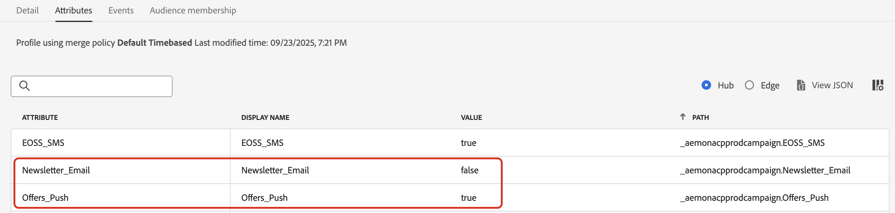

# Hantera kundernas preferenser {#preference-center}

>[!AVAILABILITY]
>
>Den här funktionen är för närvarande endast tillgänglig för organisationer som har köpt Adobe **Healthcare Shield** eller **Privacy and Security Shield** som tillägg.

I ett modernt ekosystem för automatiserad marknadsföring engagerar varumärken kunder över olika kontaktytor och står inför risken för irrelevant eller överdriven kommunikation, vilket leder till bortfall, skräppostklagomål och efterlevnadsrisker. Det är därför de måste hantera sina kunders preferenser för att få realtidsinsikter om sin målgrupp och leverera personaliserad, respektfull kommunikation.

Med [!DNL Adobe Journey Optimizer] kan du, genom att använda [medgivandeprinciper](consent.md), respektera dina kunders önskemål<!-- in terms of **channels** and **topics**-->. Detta garanterar att [!DNL Journey Optimizer] endast riktar sig till kunder baserat på deras val <!-- their preferred channels and on the subscription topics-->, samtidigt som deras samtycke respekteras.

Om du vill hantera dina användarinställningar med [!DNL Journey Optimizer] kan du:

* Få kundernas samtycke till att välja in/ut för valfri intern utgående kanal. Skapa till exempel en medgivandeprincip i [!DNL Experience Platform] för att exkludera kunder som inte har samtyckt till att ta emot kommunikation för en viss kanal. Tillämpa sedan den här principen för samtycke i [!DNL Journey Optimizer] med en e-postkanalskonfiguration. [Lär dig hur](consent.md#surface-marketing-actions)

  >[!NOTE]
  >
  >De kanaler som stöds är Email, Push, SMS och InApp.<!--To check-->

* Fråga dina kunder vilka ämnen de vill prenumerera på (t.ex. vilken typ av kommunikation de accepterar att ta emot eller inte). [Lär dig hur](#manage-preferences)

>[!IMPORTANT]
>
>Godkännande har företräde framför inställningar. En av dina kunder har till exempel angett att deras kanal är e-post och att de har gått med på att ta emot nyhetsbrev <!-- they are interested in yoga-->. Om de inte har tagit emot någon kommunikation från dig kan de dock inte anges som mål för ett e-postnyhetsbrev som du skickar<!-- on yoga-->.

## Inställningar för att spela in och använda {#manage-preferences}

Med medgivandeprinciper i [!DNL Journey Optimizer] kan du hantera dina kunders preferenser centralt. På så sätt kan ni se till att ni bara riktar in er på kunderna baserat på de ämnen de valde, samtidigt som ni respekterar deras samtycke. Följ stegen nedan för att göra detta.

Anta att du vill rikta in dig på kundresor och kampanjer baserat på deras kommunikationsinställningar i flera olika prenumerationsämnen (*nyhetsbrev*, *erbjudanden* och *nya produktlanseringar*).

1. Definiera inställningsattribut med den booleska operatorn på profilnivå <!--how??-->. Du kan till exempel ange:

   * *Newsletter_Email* - Boolean (true/false)
   * *Offers_Push* - Boolean (sant/falskt)
   * *Nya produktstarter* - Boolean (sant/falskt)

   Dessa attribut hämtas i schemat för en profilaktiverad [datamängd](../data/get-started-datasets.md) och mappas till den [enhetliga kundprofilen](../audience/get-started-profiles.md).

   >[!NOTE]
   >
   >Kundens samtycke och kontaktpreferenser är komplexa ämnen. Om du vill veta hur samtycke och sammanhangsinställningar kan samlas in, bearbetas och filtreras i [!DNL Experience Platform] rekommenderar vi att du läser följande dokument:
   >
   >* Mer information om schemafältgrupper som krävs för att samla in medgivandedata finns på [den här sidan](https://experienceleague.adobe.com/en/docs/experience-platform/landing/governance-privacy-security/consent/adobe/overview){target="_blank"}. Den innehåller detaljerad information om hur ni hanterar data om samtycke som ni har samlat in från era kunder och integrerar dem i era lagrade kundprofiler.
   >* Mer information om fältgruppen för samtycke och inställningar finns på [den här sidan](https://experienceleague.adobe.com/en/docs/experience-platform/xdm/field-groups/profile/consents#ingest){target="_blank"}.
   >* Följ stegen i [det här avsnittet](https://experienceleague.adobe.com/en/docs/experience-platform/landing/governance-privacy-security/consent/adobe/dataset#custom-consent){target="_blank"} om du vill lägga till anpassade inställningsfält i schemat.

1. Skapa en sida som fångar upp kundernas önskemål. Använd någon av följande metoder:

   * Skapa en webbsida för att registrera dina kunders önskemål med [Adobe Experience Platform Web SDK](https://experienceleague.adobe.com/en/docs/experience-platform/web-sdk/home){target="_blank"}.

   * Använd en [!DNL Journey Optimizer] [landningssida](../landing-pages/create-lp.md) som innehåller formulär för att fånga upp dina kunders preferenser via profildata.  [Läs mer om formulär](../landing-pages/lp-forms.md) <!--Forms not released/announced yet - TBC-->

     >[!NOTE]
     >
     >Se till att domänen för landningssidan som används tillhör det övre varumärket och inte ett undervarumärke. De inställningar som samlas in lagras i profildata som ligger överst på varumärkesnivå.

1. På den här sidan kan kunderna uppdatera sina inställningar, t.ex. ämnesvis prenumeration, genom att markera eller avmarkera kryssrutor.

   Varje åtgärd utlöser en medgivandehändelse som sparas mot motsvarande profilattribut (`true` för avanmäld, `false` för avanmäld) genom att data hämtas till det profilaktiverade dataschemat <!-- that contains the corresponding preference fields-->.

   <!--Record your users' preferences through the web page or landing page that you created. The data is saved against the corresponding profile, meaning that the preference data is ingested into a Profile-enabled dataset whose schema contains consent/preference fields.-->

   En användare <!--whose email address is john.black@lumamail.com--> gick med på att ta emot push-erbjudanden men vill inte ta emot nyhetsbrev via e-post. Motsvarande profil uppdateras enligt följande:

   {width=80%}

<!--The corresponding profile dataset is updated as follows:

|Attribute = Email id | Attribute = Offers_Push | Attribute = Newsletters_Email |
|---------|----------|---------|
| john.black@lumamail.com | Y | N |-->

    >[ !OBS!]
    >
    >Inkommande händelser för samtycke matas in i kundprofilen och säkerställer uppdateringar i realtid. Varje profil återspeglar de senaste alternativen för prenumerationsinställningarna.

1. Skapa en anpassad princip (från menyn **[!UICONTROL Privacy]** > **[!UICONTROL Policies]**) i Adobe Experience Platform. [Lär dig hur](https://experienceleague.adobe.com/docs/experience-platform/data-governance/policies/user-guide.html#create-policy){target="_blank"}

   >[!AVAILABILITY]
   >
   >Samtyckespolicyer är för närvarande bara tillgängliga för organisationer som har köpt Adobe **Healthcare Shield** eller **Privacy and Security Shield** som tillägg. [Läs mer om policyer för medgivande](consent.md)

   Om du vill använda profiler för samtycke måste det finnas inställningsattribut i profildata. Därför måste du definiera dessa attribut på profilnivå (som beskrivs i steg 1).

1. Välj typen **[!UICONTROL Consent policy]** och konfigurera ett villkor enligt följande. [Lär dig hur du konfigurerar principer för samtycke](https://experienceleague.adobe.com/docs/experience-platform/data-governance/policies/user-guide.html#consent-policy){target="_blank"}

<!--Consent policies are comprised of two logical components:

* **If**: The condition that will trigger the policy check, based on a certain marketing action (email, SMS, push, custom action, etc.) being performed, the presence of certain data usage labels, or a combination of the two.

* **Then**: The consent attribute must be present for a profile to be included in the action that triggered the policy. More than one field can also be selected.-->

    Om du till exempel bara vill skicka kommunikation till kunder som inte har valt att ta emot nyhetsbrev via e-post skapar du en anpassad princip och definierar följande villkor:
    
    * Om **[!UICONTROL Marketing action]** är lika med **[!UICONTROL Email]*
    
    * Då finns inte **[!UICONTROL Newsletter_Email]*** **[!UICONTROL false]* Eller &#x200B;** [!UICONTROL Newsletter_Email] **&#x200B; är lika med &#x200B;** [!UICONTROL false]*
    
    &rbrace;{width=80%}
    
    >[!TIP]
    >
    >Den profilaktiverade datauppsättningen måste innehålla profilattributet **[!UICONTROL Newsletter_Email]** med värdet &quot;true&quot; (som i steg 1.)

1. När du har skapat principen för samtycke kan du återanvända den i [!DNL Journey Optimizer] med [kanalkonfigurationer](consent.md#surface-marketing-actions) eller [kundens anpassade åtgärder](consent.md#journey-custom-actions).

1. Nu kan du använda dessa kanalkonfigurationer eller anpassade åtgärder på dina resor och kampanjer för att se till att dina <!--targeted-->-kunders önskemål respekteras.
