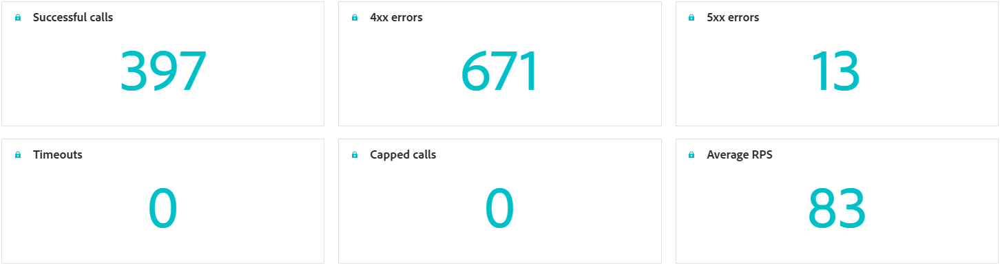

# Övervaka anpassade åtgärder {#reporting}

>[!CONTEXTUALHELP]
>id="ajo_campaigns_custom_actions_monitor"
>title="Övervaka anpassade åtgärder"
>abstract="På rapportsidan **[!UICONTROL Custom action]** kan du spåra prestanda och tillförlitlighet för API-anrop som du gör på resor till tredjepartssystem."

På rapportsidan **[!UICONTROL Custom action]** kan du övervaka tillförlitligheten och prestandan för API-anrop som görs från resor till tredjepartssystem. Med hjälp av dessa rapporter kan du snabbt identifiera integreringsproblem, flaskhalsar för fördröjning eller begränsningar för begränsning/begränsning som kan påverka leveransen.

Sidan för rapportering av anpassade åtgärder fungerar som andra heltidsrapporter i Journey Optimizer. Mer information om kontrollpanelsfunktioner finns i [den här dokumentationen](../reports/report-cja-manage.md).

Om du vill komma åt rapportsidan **[!UICONTROL Custom action]** klickar du på  på din **[!UICONTROL Actions]**-hemsida.

➡️ [Läs mer om konfiguration för anpassade åtgärder](../action/about-custom-action-configuration.md)

Utöver rapportsidan **[!UICONTROL Custom action]** kan du använda **[!DNL Adobe Experience Platform Query Service]** för att skapa frågor för att rapportera anpassade mått för åtgärdsprestanda. Frågeexempel finns i [det här avsnittet](../reports/query-examples.md).

## KPI:er {#kpis}

**[!UICONTROL Custom action]** KPI:er (Key Performance Indicators) fungerar som en centraliserad kontrollpanel, som ger en samlad bild av drifthälsan och tillförlitligheten för dina anpassade åtgärdsanrop. Med dessa mätvärden kan ni utvärdera prestanda, identifiera flaskhalsar och säkerställa stabil integrering med externa system.

+++ Läs mer om KPI:er för anpassade åtgärder

* **[!UICONTROL Successful calls]**: Totalt antal HTTP-anrop som returnerade ett giltigt svar utan fel.

* **[!UICONTROL 4xx/5xx errors]**: Antal misslyckade anrop på grund av fel på klientsidan (4xx) eller serversidan (5xx). Konfigurationsproblem eller slutpunktsfel markeras.

* **[!UICONTROL Timeouts]**: Antal anrop som misslyckades eftersom de överskred den maximala svarstiden. Detta hjälper till att identifiera fördröjnings- eller prestandaproblem med externa slutpunkter.

* **[!UICONTROL Capped calls]**: Antal anrop som blockerats på grund av begränsningsgränser, vilket säkerställer att efterföljande system inte är överbelastade.

* **[!UICONTROL Average RPS]**: Antal begäranden per sekund som har bearbetats av den anpassade åtgärden i det valda tidsintervallet.

* **[!UICONTROL Average latency]**: Genomsnittlig svarstid från början till slut (i millisekunder) för alla HTTP-anrop, inklusive slutförda anrop, fel och timeout.

* **[!UICONTROL Average successful latency]**: Genomsnittlig svarstid från slutpunkt till slutpunkt (i millisekunder) endast för slutförda anrop, exklusive misslyckade begäranden och timeout.

* **[!UICONTROL Average queue time]**: Genomsnittlig tid (i millisekunder) för samtal som väntar i körningskön innan de skickas. Detta gäller endast för strypta slutpunkter, där Journey Optimizer placerar anrop i kö när dataflödesgränsen nås.

+++

## Samtal över tid {#calls}

Diagrammet **[!UICONTROL Calls over time]** visar trenden för KPI för HTTP-anrop över den tidsperiod som valts för rapporten. Tidseriens granularitet beror på det valda tidsintervallet. Exempel:

* För en 7-dagarsrapport visar varje datapunkt nyckeltal för en dag.
* Om du väljer ett 1-dagars tidsintervall visas nyckeltal per timme i diagrammet.
* Om du väljer ett 1-timmars tidsintervall visas nyckeltal per minut i diagrammet.

➡️[I avsnittet KPI:er finns en beskrivning av HTTP-anropsmåtten ](#kpis)

## Latens över tid {#latency-overtime}

Diagrammet **[!UICONTROL Latency over time]** visar trenden för fördröjningsmått under den valda tidsperioden. I den här tidsserievyn kan du spåra prestandamönster, identifiera perioder med hög fördröjning och övervaka effekten av optimeringar eller systemändringar över tid.

➡️[En beskrivning av svarstiderna finns i avsnittet KPI:er ](#kpis)

## Uppdelning av samtal {#breakdown}

Tabellen **[!UICONTROL Calls breakdown]** innehåller en hierarkisk uppdelning av HTTP-anropsmåtten, från de totala måtten per slutpunkt på den översta nivån till måtten per anpassad åtgärd, med varje slutpunkt ned till de resor som är beroende av dem på den nedersta nivån.

➡️[I avsnittet KPI:er finns en beskrivning av HTTP-anropsmåtten ](#kpis)

## Uppdelning av svarstid {#latency-breakdown}

Tabellen **[!UICONTROL Latency breakdown]** innehåller en detaljerad beskrivning av svarstiderna för dina anpassade åtgärder. I den här vyn kan du identifiera vilka specifika slutpunkter eller åtgärder som har prestandaproblem, så att du effektivt kan identifiera och åtgärda flaskhalsar med fördröjning.

➡️[En beskrivning av svarstiderna finns i avsnittet KPI:er ](#kpis)

