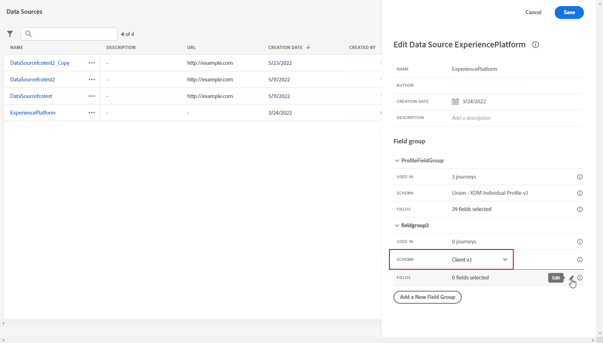

# Attributbaserad åtkomstkontroll {#attribute-based-access}

Med den attributbaserade åtkomstkontrollen kan ni definiera behörigheter för att hantera dataåtkomst för specifika team eller grupper av användare. Syftet är att skydda känsliga digitala resurser mot obehöriga användare och ge ytterligare skydd för personuppgifter.

Använd den attributbaserade åtkomstkontrollen i Adobe Journey Optimizer för att skydda data och ge specifik åtkomst till specifika fältelement som XDM-scheman (Experience Data Model), profilattribut och målgrupper.

En mer detaljerad lista över de termer som används med attributbaserad åtkomstkontroll finns i [Adobe Experience Platform-dokumentationen](https://experienceleague.adobe.com/docs/experience-platform/access-control/abac/overview.html){target="_blank"}.

I det här exemplet läggs en etikett till i schemafältet **Nationalitet** för att hindra obehöriga användare från att använda den. Så här fungerar det:

1. Skapa en ny **[!UICONTROL Role]** och tilldela den med motsvarande **[!UICONTROL Label]** så att användare kan komma åt och använda schemafältet.

1. Tilldela ett **[!UICONTROL Label]** till schemafältet **Nationalitet** i Adobe Experience Platform.

1. Använd **[!UICONTROL Schema field]** i Adobe Journey Optimizer.

Observera att **[!UICONTROL Roles]**, **[!UICONTROL Policies]** och **[!UICONTROL Products]** också kan nås med det attributbaserade API:t för åtkomstkontroll. Mer information finns i denna [dokumentation](https://experienceleague.adobe.com/docs/experience-platform/access-control/abac/abac-api/overview.html){target="_blank"}.

## Skapa en roll och tilldela etiketter {#assign-role}

>[!IMPORTANT]
>
>&#x200B;>Skapa en profil innan du hanterar behörigheter för en roll. Mer information finns i [Adobe Experience Platform-dokumentationen](https://experienceleague.adobe.com/docs/experience-platform/access-control/abac/permissions-ui/policies.html){target="_blank"}.

**[!UICONTROL Roles]** är en uppsättning användare som delar samma behörigheter, etiketter och sandlådor i din organisation. Varje användare som tillhör en **[!UICONTROL Role]** har rätt till de Adobe-program och -tjänster som ingår i produkten. Du kan också skapa egna **[!UICONTROL Roles]** för att finjustera användarnas åtkomst till vissa funktioner eller objekt i gränssnittet.

Om du vill ge de valda användarna åtkomst till fältet **Medborgarskap** med etiketten C2 skapar du en ny **[!UICONTROL Role]** med en specifik uppsättning användare och ger dem etiketten C2, så att de kan använda informationen **Medborgarskap** i en **[!UICONTROL Journey]** .

1. Välj [!DNL Permissions] på den vänstra panelmenyn i produkten **[!UICONTROL Role]** och klicka på **[!UICONTROL Create role]**. Observera att du även kan lägga till **[!UICONTROL Label]** i inbyggda roller.

   

1. Lägg till en **[!UICONTROL Name]** och **[!UICONTROL Description]** i din nya **[!UICONTROL Role]** här: Begränsad rolldemografi.

1. Välj **[!UICONTROL Sandbox]** i listrutan.

   

1. Klicka på **[!UICONTROL Resources]** på menyn **[!UICONTROL Adobe Experience Platform]** för att öppna de olika funktionerna. Här väljer vi **[!UICONTROL Journeys]**.

   

1. I listrutan väljer du den **[!UICONTROL Permissions]** som är länkad till den valda funktionen, till exempel **[!UICONTROL View journeys]** eller **[!UICONTROL Publish journeys]**.

   

1. När du har sparat din nya **[!UICONTROL Role]** klickar du på **[!UICONTROL Properties]** för att ytterligare konfigurera åtkomst till din roll.

   

1. Klicka på **[!UICONTROL Add users]** på fliken **[!UICONTROL Users]**.

   

1. På fliken **[!UICONTROL Labels]** väljer du **[!UICONTROL Add label]**.

   

1. Markera **[!UICONTROL Labels]** som du vill lägga till i din roll och klicka på **[!UICONTROL Save]**. I det här exemplet ger du etiketten C2 så att användare får tillgång till det tidigare begränsade schemats fält.

   

Användarna i den **begränsade rollen demografisk** har nu åtkomst till C2-märkta objekt.

## Tilldela etiketter till ett objekt i Adobe Experience Platform {#assign-label}

>[!WARNING]
>
>Felaktig etikettanvändning kan bryta åtkomsten för människor och utlösa policyöverträdelser.

**[!UICONTROL Labels]** kan användas för att tilldela specifika funktionsområden med hjälp av attributbaserad åtkomstkontroll. I det här exemplet är åtkomsten till fältet **Nationalitet** begränsad. Det här fältet är endast tillgängligt för användare med motsvarande **[!UICONTROL Label]** tilldelat till **[!UICONTROL Role]**.

Observera att du även kan lägga till **[!UICONTROL Label]** i **[!UICONTROL Schema]**, **[!UICONTROL Datasets]** och **[!UICONTROL Audiences]**.

1. Skapa din **[!UICONTROL Schema]**. Mer information finns i [den här dokumentationen](https://experienceleague.adobe.com/docs/experience-platform/xdm/schema/composition.html){target="_blank"}.

   

1. I den nyligen skapade **[!UICONTROL Schema]** lägger vi först till fältgruppen **[!UICONTROL Demographic details]** som innehåller fältet **Nationalitet**.

   

1. På fliken **[!UICONTROL Labels]** kontrollerar du det begränsade fältnamnet här **Nationalitet**. Välj sedan **[!UICONTROL Edit governance labels]** på den högra panelmenyn.

   

1. Välj motsvarande **[!UICONTROL Label]**, i det här fallet C2 - Data kan inte exporteras till en tredje part. En detaljerad lista över tillgängliga etiketter finns på [den här sidan](https://experienceleague.adobe.com/docs/experience-platform/data-governance/labels/reference.html#contract-labels){target="_blank"}.

   

1. Anpassa schemat ytterligare vid behov och aktivera det sedan. Detaljerade anvisningar om hur du aktiverar ditt schema finns på [sidan](https://experienceleague.adobe.com/docs/experience-platform/xdm/ui/resources/schemas.html#profile){target="_blank"}.

Fältet i ditt schema är nu bara synligt och användbart för användare som är en del av en roll som har angetts med C2-etiketten. Genom att tillämpa en **[!UICONTROL Label]** på din **[!UICONTROL Field name]**, kommer **[!UICONTROL Label]** automatiskt att gälla för fältet **Nationalitet** i alla skapade scheman.

## Få åtkomst till märkta objekt i Adobe Journey Optimizer {#attribute-access-ajo}

När fältnamnet **Nationalitet** har etiketterats i ett nytt schema och en ny roll, kan effekten av den här begränsningen observeras i Adobe Journey Optimizer. I detta exempel:

* Användare X, med åtkomst till objekt med etiketten C2, skapar en resa med ett villkor som har det begränsade **[!UICONTROL Field name]** som mål.
* Användare Y, utan åtkomst till objekt med etiketten C2, försöker publicera resan.

1. Konfigurera **[!UICONTROL Data source]** från Adobe Journey Optimizer med ditt nya schema.

   

1. Lägg till en ny **[!UICONTROL Field group]** av dina nyskapade **[!UICONTROL Schema]** i den inbyggda **[!UICONTROL Data source]**. Du kan också skapa en ny extern **[!UICONTROL data source]** och associerad **[!UICONTROL Field groups]**.

   

1. När du har valt **[!UICONTROL Schema]** som du skapat tidigare klickar du på **[!UICONTROL Edit]** i kategorin **[!UICONTROL Fields]**.

   

1. Markera **[!UICONTROL Field name]** som du vill ha som mål. Här väljer vi det begränsade fältet **Nationalitet**.

   

1. Skapa en resa som skickar ett e-postmeddelande till användare med en viss nationalitet. Lägg till en **[!UICONTROL Event]** och en **[!UICONTROL Condition]**.

   

1. Välj det begränsade fältet **Medborgarskap** för att börja bygga ditt uttryck.

   

1. Redigera din **[!UICONTROL Condition]** för att rikta in dig på en specifik population med det begränsade fältet **Nationalitet**.

   

1. Anpassa din resa efter behov, här lägger vi till en **[!UICONTROL Email]**-åtgärd.

   

Om Användare Y, utan åtkomst till etikett C2-objekt, behöver åtkomst till den här resan med det begränsade fältet:

* Användare Y kan inte använda det begränsade fältnamnet eftersom det inte visas.
* Användare Y kan inte redigera uttrycket med det begränsade fältnamnet i avancerat läge. Följande fel visas: `The expression is invalid. Field is no longer available or you do not have enough permission to see it`.
* Användare Y kan ta bort uttrycket.
* Användare Y kan inte testa resan.
* Användare Y kan inte publicera resan.