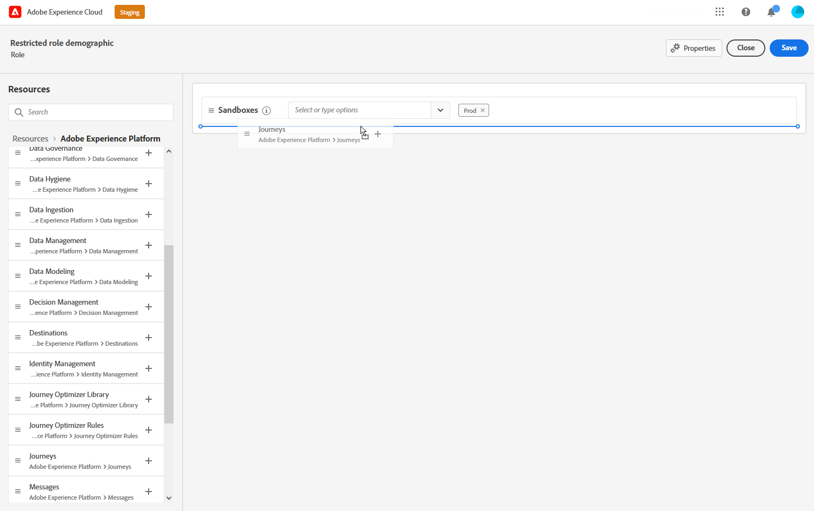

# Attributbaserad åtkomstkontroll {#attribute-based-access}

Med attributbaserad åtkomstkontroll (ABAC) kan du definiera behörigheter för att hantera dataåtkomst för specifika team eller grupper av användare. Syftet är att skydda känsliga digitala resurser mot obehöriga användare, vilket ger ytterligare skydd för personuppgifter.

I Adobe Journey Optimizer kan du med ABAC skydda data och ge specifik åtkomst till specifika fältelement, inklusive XDM-scheman (Experience Data Model), profilattribut och målgrupper.

En mer detaljerad lista över de termer som används med ABAC finns i [Adobe Experience Platform-dokumentationen](https://experienceleague.adobe.com/docs/experience-platform/access-control/abac/overview.html).

I det här exemplet vill vi lägga till en etikett i schemafältet **Nationalitet** för att hindra obehöriga användare från att använda den. För att detta ska fungera måste du utföra följande steg:

1. Skapa en ny **[!UICONTROL Role]** och tilldela den med motsvarande **[!UICONTROL Label]** så att användare kan komma åt och använda schemafältet.

1. Tilldela ett **[!UICONTROL Label]** till schemafältet **Nationalitet** i Adobe Experience Platform.

1. Använd **[!UICONTROL Schema field]** i Adobe Journey Optimizer.

Observera att **[!UICONTROL Roles]**, **[!UICONTROL Policies]** och **[!UICONTROL Products]** också kan nås med det attributbaserade åtkomstkontrolls-API:t. Mer information finns i [dokumentationen](https://experienceleague.adobe.com/docs/experience-platform/access-control/abac/abac-api/overview.html).

## Skapa en roll och tilldela etiketter {#assign-role}

>[!IMPORTANT]
>
>Innan du hanterar behörigheter för en roll måste du skapa en profil. Mer information finns i [Adobe Experience Platform-dokumentationen](https://experienceleague.adobe.com/docs/experience-platform/access-control/abac/permissions-ui/policies.html).

**[!UICONTROL Roles]** är en uppsättning användare som delar samma behörigheter, etiketter och sandlådor i din organisation. Alla användare som tillhör en **[!UICONTROL Role]** har rätt till de program och tjänster i Adobe som ingår i produkten.
Du kan också skapa en egen **[!UICONTROL Roles]** om du vill finjustera användarnas åtkomst till vissa funktioner eller objekt i gränssnittet.

Vi vill nu ge utvalda användare åtkomst till fältet **Medborgarskap**, märkt C2. För att kunna göra det måste vi skapa en ny **[!UICONTROL Role]** med en specifik uppsättning användare och ge dem etiketten C2 så att de kan använda informationen om **nationalitet** i en **[!UICONTROL Journey]**.

1. Välj **[!UICONTROL Role]** på den vänstra panelmenyn i produkten [!DNL Permissions] och klicka på **[!UICONTROL Create role]**. Observera att du även kan lägga till **[!UICONTROL Label]** i inbyggda roller.

   

1. Lägg till en **[!UICONTROL Name]** och **[!UICONTROL Description]** i din nya **[!UICONTROL Role]** här: Begränsad rolldemografi.

1. Välj **[!UICONTROL Sandbox]** i listrutan.

   

1. Klicka på **[!UICONTROL Adobe Experience Platform]** på menyn **[!UICONTROL Resources]** för att öppna de olika funktionerna. Här väljer vi **[!UICONTROL Journeys]**.

   

1. I listrutan väljer du den **[!UICONTROL Permissions]** som är länkad till den valda funktionen, till exempel **[!UICONTROL View journeys]** eller **[!UICONTROL Publish journeys]**.

   

1. När du har sparat din nya **[!UICONTROL Role]** klickar du på **[!UICONTROL Properties]** för att ytterligare konfigurera åtkomst till din roll.

   

1. Klicka på **[!UICONTROL Add users]** på fliken **[!UICONTROL Users]**.

   

1. På fliken **[!UICONTROL Labels]** väljer du **[!UICONTROL Add label]**.

   

1. Markera **[!UICONTROL Labels]** som du vill lägga till i din roll och klicka på **[!UICONTROL Save]**. I det här exemplet ger vi användare etiketten C2 åtkomst till det tidigare begränsade schemats fält.

   

Användarna i den begränsade rollen demografisk **har nu åtkomst till de C2-märkta objekten.**

## Tilldela etiketter till ett objekt i Adobe Experience Platform {#assign-label}

>[!WARNING]
>
>Felaktig etikettanvändning kan bryta åtkomsten till personer och utlösa policyöverträdelser.

**[!UICONTROL Labels]** kan användas för att tilldela specifika funktionsområden med hjälp av attributbaserad åtkomstkontroll.
I det här exemplet vill vi begränsa åtkomsten till fältet **Nationalitet**. Det här fältet är endast tillgängligt för användare med motsvarande **[!UICONTROL Label]** till deras **[!UICONTROL Role]**.

Observera att du även kan lägga till **[!UICONTROL Label]** i **[!UICONTROL Schema]**, **[!UICONTROL Datasets]** och **[!UICONTROL Audiences]**.

1. Skapa din **[!UICONTROL Schema]**. Mer information finns i [den här dokumentationen](https://experienceleague.adobe.com/docs/experience-platform/xdm/schema/composition.html).

   

1. I den nyligen skapade **[!UICONTROL Schema]** lägger vi först till fältgruppen **[!UICONTROL Demographic details]** som innehåller fältet **Nationalitet**.

   

1. På fliken **[!UICONTROL Labels]** kontrollerar du det begränsade fältnamnet här **Nationalitet**. Välj sedan **[!UICONTROL Edit governance labels]** på den högra panelmenyn.

   

1. Välj motsvarande **[!UICONTROL Label]**, i det här fallet C2 - Data kan inte exporteras till en tredje part. En detaljerad lista över tillgängliga etiketter finns på [den här sidan](https://experienceleague.adobe.com/docs/experience-platform/data-governance/labels/reference.html#contract-labels).

   

1. Anpassa schemat ytterligare om det behövs och aktivera det sedan. Detaljerade anvisningar om hur du aktiverar ditt schema finns på [sidan](https://experienceleague.adobe.com/docs/experience-platform/xdm/ui/resources/schemas.html#profile).

Fältet i schemat är nu bara synligt och kan nu bara användas av användare som är en del av en roll som har angetts med C2-etiketten.
Genom att tillämpa en **[!UICONTROL Label]** på din **[!UICONTROL Field name]**, observera att **[!UICONTROL Label]** automatiskt kommer att tillämpas på fältet **Nationalitet** i alla skapade scheman.

## Få åtkomst till märkta objekt i Adobe Journey Optimizer {#attribute-access-ajo}

När vi har etiketterat fältnamnet **Nationalitet** i ett nytt schema och vår nya roll, kan vi nu se hur den här begränsningen påverkar Adobe Journey Optimizer.
Till exempel kommer den första användaren X med åtkomst till objekt som är märkta C2 att skapa en resa med ett villkor som har den begränsade **[!UICONTROL Field name]** som mål. En andra användare, Y, utan åtkomst till objekt som är märkta C2, måste sedan publicera resan.

1. Från Adobe Journey Optimizer måste du först konfigurera **[!UICONTROL Data source]** med ditt nya schema.

   

1. Lägg till en ny **[!UICONTROL Field group]** av dina nyskapade **[!UICONTROL Schema]** i den inbyggda **[!UICONTROL Data source]**. Du kan också skapa en ny extern **[!UICONTROL data source]** och associerad **[!UICONTROL Field groups]**.

   

1. När du har valt **[!UICONTROL Schema]** som du skapat tidigare klickar du på **[!UICONTROL Edit]** i kategorin **[!UICONTROL Fields]**.

   

1. Markera **[!UICONTROL Field name]** som du vill ha som mål. Här väljer vi det begränsade fältet **Nationalitet**.

   

1. Skapa sedan en resa som skickar ett e-postmeddelande till användare med en viss nationalitet. Lägg till en **[!UICONTROL Event]** och sedan en **[!UICONTROL Condition]**.

   

1. Välj det begränsade fältet **Medborgarskap** för att börja bygga ditt uttryck.

   

1. Redigera din **[!UICONTROL Condition]** för att rikta in dig på en specifik population med det begränsade fältet **Nationalitet**.

   

1. Anpassa din resa efter behov, här lägger vi till en **[!UICONTROL Email]**-åtgärd.

   

Om användaren Y utan åtkomst till etikett C2-objekt behöver komma åt den här resan med det här begränsade fältet:

* Användare Y kan inte använda det begränsade fältnamnet eftersom det inte visas.

* Användare Y kan inte redigera uttrycket med det begränsade fältnamnet i avancerat läge. Följande fel visas `The expression is invalid. Field is no longer available or you don't have enough permission to see it`.

* Användare Y kan ta bort uttrycket.

* Användare Y kan inte testa resan.

* Användare Y kan inte publicera resan.
