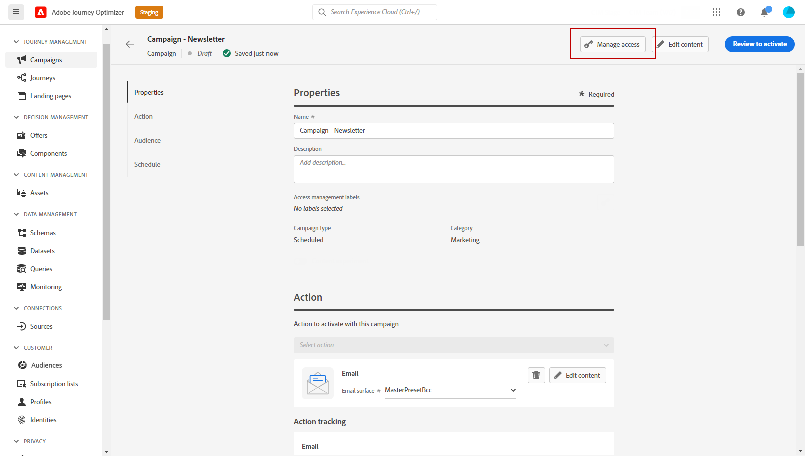

# Åtkomstkontroll på objektnivå {#object-level-access}

>[!CONTEXTUALHELP]
>id="ajo_olac_manage_access"
>title="Åtkomsthanteringsetiketter"
>abstract="Du kan begränsa åtkomsten till ett objekt baserat på åtkomstetiketter. Detta tillvägagångssätt skyddar känsliga digitala resurser från obehöriga användare och säkerställer ytterligare skydd av personuppgifter. **Se till att endast markera etiketter som du har behörighet för.**"

Du kan begränsa åtkomsten till ett objekt baserat på åtkomstetiketter. Detta tillvägagångssätt skyddar känsliga digitala resurser från obehöriga användare och säkerställer ytterligare skydd av personuppgifter.

Med OLAC-funktionen (Object level access control) kan du definiera behörigheter för att hantera dataåtkomst för ett urval av objekt:

* Resa
* Campaign
* Mall
* Fragment
* Landningssida
* Erbjudande
* Statisk insamling av erbjudanden
* Beslut om erbjudandet
* Kanalkonfiguration
* IP-värmerapport

## Förhandskrav {#prereq-labels}

Om du vill kunna [skapa etiketter](#create-labels) måste du tillhöra en roll med behörigheten **[!UICONTROL Manage usage labels]**.

Om du vill kunna [tilldela etiketter](#assign-labels) måste du tillhöra en roll med behörigheten **Hantera**, dvs. [!DNL Manage journeys], [!DNL Manage Campaigns] eller [!DNL Manage decisions]. Utan den här behörigheten är knappen **[!UICONTROL Manage access]** nedtonad.

Läs mer om behörigheter i [det här avsnittet](../administration/permissions.md).

## Skapa etiketter {#create-labels}

Med **[!UICONTROL Labels]** kan du kategorisera datauppsättningar och fält enligt användarprofiler som gäller för dessa data. **[!UICONTROL Labels]** kan användas när som helst, vilket ger flexibilitet i hur du styr data.

Använd etiketter för att ge åtkomst till användare och tillämpa regler för datastyrning och samtycke. Dessa styrningsetiketter kan påverka förbrukningen i efterföljande led.

Du kan skapa etiketter i produkten [!DNL Permissions]. Mer information finns i [Adobe Experience Platform-dokumentationen](https://experienceleague.adobe.com/docs/experience-platform/access-control/abac/permissions-ui/labels.html?lang=sv-SE){target="_blank"}.

Du kan också skapa **[!UICONTROL Labels]** direkt i Journey Optimizer. Så här skapar du en etikett:

1. Klicka på knappen **[!UICONTROL Campaign]** från ett Adobe Journey Optimizer-objekt, till exempel ett nyskapat **[!UICONTROL Manage access]**.

   

1. Klicka på **[!UICONTROL Manage access]** i fönstret **[!UICONTROL Create label]**.

   

1. Konfigurera etiketten. Du måste ange:

   * **[!UICONTROL Name]**
   * **[!UICONTROL Friendly name]**
   * **[!UICONTROL Description]**

   

1. Klicka på **[!UICONTROL Create]** om du vill spara **[!UICONTROL Label]**.

Din nyskapade **[!UICONTROL Label]** är nu tillgänglig i listan. Om det behövs kan du ändra det i [!DNL Permissions]-produkten.

## Tilldela etiketter {#assign-labels}

Så här tilldelar du anpassade eller grundläggande dataanvändningsetiketter till dina Journey Optimizer-objekt:

1. Klicka på knappen **[!UICONTROL Campaign]** från ett Adobe Journey Optimizer-objekt, till exempel ett nyskapat **[!UICONTROL Manage access]**.

   

1. I fönstret **[!UICONTROL Manage access]** väljer du egna etiketter eller etiketter för kärndataanvändning för att hantera åtkomst till det här objektet.

   Mer information om etiketter för användning av kärndata finns på [den här sidan](https://experienceleague.adobe.com/docs/experience-platform/data-governance/labels/reference.html?lang=sv-SE){target="_blank"}.

   

1. Klicka på **[!UICONTROL Save]** om du vill använda den här etikettbegränsningen.

För att få åtkomst till det här objektet måste användarna ha den specifika **[!UICONTROL Label]** i sin **[!UICONTROL Roles]**. En användare med etiketten C1 har till exempel bara åtkomst till objekt som är märkta med C1 eller som inte är märkta.

Mer information om hur du tilldelar en **[!UICONTROL Label]** till en **[!UICONTROL Role]** finns på [den här sidan](https://experienceleague.adobe.com/docs/experience-platform/access-control/abac/permissions-ui/permissions.html?lang=sv-SE#manage-labels-for-a-role){target="_blank"}.
