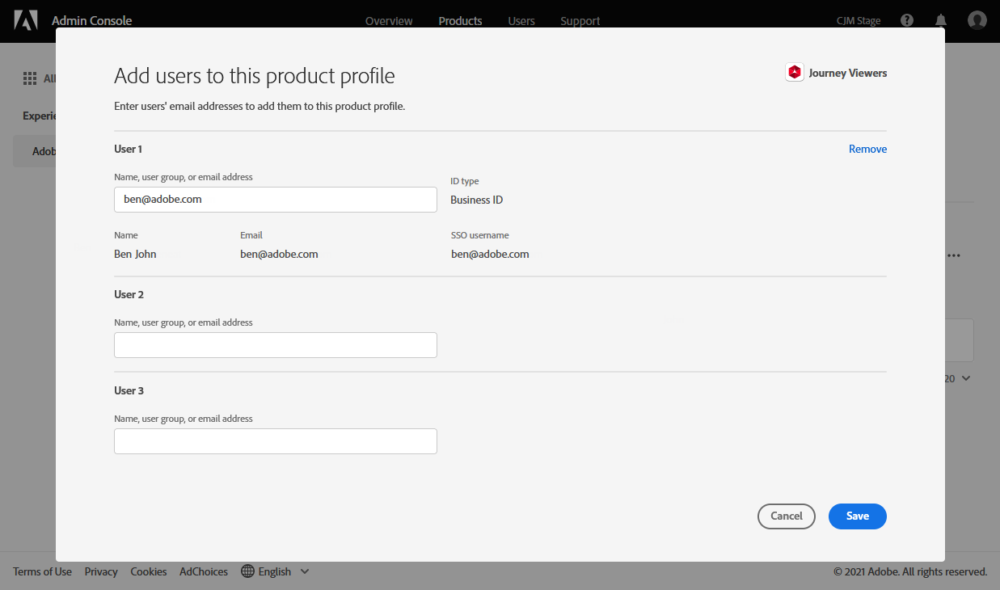
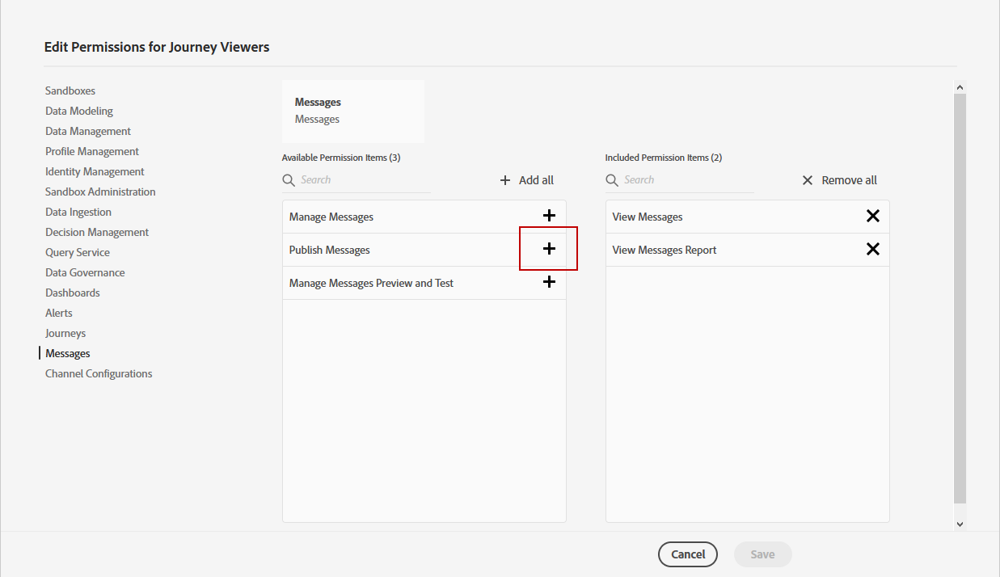

# Hantera användare och produktprofiler {#manage-permissions}

>[!IMPORTANT]
>
> Var och en av de procedurer som beskrivs nedan kan endast utföras av en **[!UICONTROL Product]** eller **[!UICONTROL System]** administratör. Mer information finns i [Dokumentation till Admin Console](https://helpx.adobe.com/enterprise/admin-guide.html/enterprise/using/admin-roles.ug.html).

**[!UICONTROL Product profiles]** är uppsättningar användare som delar samma behörigheter och sandlådor i organisationen.

The [!DNL Journey Optimizer] kan du välja mellan olika färdiga **[!UICONTROL Product profiles]** med olika behörighetsnivåer att tilldela användarna. Mer information om **[!UICONTROL Product profiles]**, se [page](ootb-product-profiles.md).

Varje användare som tillhör en **[!UICONTROL Product profiles]** har rätt till de program och tjänster i Adobe som ingår i produkten.

Du kan också skapa egna **[!UICONTROL Product profiles]** om du vill finjustera användarnas åtkomst till vissa funktioner eller objekt i gränssnittet.

## Tilldela en produktprofil {#assigning-product-profile}

Du kan välja att tilldela en färdig eller anpassad **[!UICONTROL Product profile]** för användarna.

Listan med alla färdiga produktprofiler med tilldelade behörigheter finns i [Inbyggda produktprofiler](ootb-product-profiles.md) -avsnitt.

Tilldela en **[!UICONTROL Product profile]**:

1. I [!DNL Admin Console], från **[!UICONTROL Products]** väljer du **[!UICONTROL Experience Cloud - Platform powered applications]** produkt.

1. Välj en **[!UICONTROL Product profile]**.  

   

1. Klicka på **[!UICONTROL Add user]** på fliken **[!UICONTROL Users]**.

   

1. Skriv in användarens namn eller e-postadress och markera användaren.

   Om användaren inte redan har skapats i [!DNL Admin Console], se [Lägga till användardokumentation](https://helpx.adobe.com/enterprise/admin-guide.html/enterprise/using/manage-users-individually.ug.html#add-users).

   

1. Utför samma steg som ovan för att lägga till andra användare i **[!UICONTROL Product profile]**. Klicka sedan på **[!UICONTROL Save]**.

Användaren får sedan ett e-postmeddelande som omdirigerar denne till din instans i .

Mer information om användarhantering finns i [Admin Console dokumentation](https://helpx.adobe.com/enterprise/admin-guide.html/enterprise/using/manage-users-individually.ug.html).

När du får åtkomst till instansen visas en specifik vy beroende på de tilldelade behörigheterna i **[!UICONTROL Product profile]**. Om användaren inte har rätt åtkomst till en funktion visas följande skärm.

## Redigera en befintlig produktprofil {#edit-product-profile}

För färdiga eller anpassade **[!UICONTROL Product profiles]** kan du när som helst bestämma om du vill lägga till eller ta bort behörigheter.

I det här exemplet vill vi lägga till **[!UICONTROL Permissions]** i relation till **[!UICONTROL Message]** funktioner för användare som har tilldelats visningsprogrammet för resan **[!UICONTROL Product profile]**. Användarna kan sedan publicera meddelanden.

Observera att om du ändrar ett ej ifyllt program eller anpassat **[!UICONTROL Product profile]** påverkar det alla användare som tilldelas detta **[!UICONTROL Product profile]**.

1. I [!DNL Admin Console], från **[!UICONTROL Products]** väljer du **[!UICONTROL Experience Cloud - Platform powered applications]** produkt.

1. Välj visningsprogrammet för resan **[!UICONTROL Product profile]**.

1. Klicka på fliken **[!UICONTROL Permissions]**.  

   The **[!UICONTROL Permissions]** -fliken visar en lista med funktioner som gäller för **[!UICONTROL Experience Cloud - Platform powered applications]** produkt.

   

1. Välj **[!UICONTROL Messages]** funktioner.

   

1. Från **[!UICONTROL Available Permission Items]** väljer du de behörigheter du vill tilldela **[!UICONTROL Product profile]** genom att klicka på plusikonen (+).

   Här lägger vi till **[!UICONTROL Publish messages]** behörighet.

   

1. Klicka vid behov på X-ikonen under **[!UICONTROL Included Permission Items]** bredvid respektive behörighet till din produktprofil.

1. Klicka på **[!UICONTROL Save]** när du är klar.

   

Om det behövs kan du även skapa en ny produktprofil med specifika behörigheter. Mer information finns i [Skapa en produktprofil](#create-product-profile).

## Skapa en produktprofil {#create-product-profile}

[!DNL Journey Optimizer] kan du skapa egna **[!UICONTROL Product profiles]** och tilldela en uppsättning behörigheter och sandlådor till användarna. Med **[!UICONTROL Product profiles]** kan du tillåta eller neka åtkomst till vissa funktioner eller objekt i gränssnittet.

Mer information om hur du skapar och hanterar sandlådor finns i [Adobe Experience Platform-dokumentation](https://experienceleague.adobe.com/docs/experience-platform/sandbox/ui/user-guide.html){target=&quot;_blank&quot;}.

I det här exemplet skapar vi en produktprofil med namnet **Skrivskyddade resor** där vi ger läsbehörighet till resefunktionen. Användare kommer endast att kunna komma åt och visa resor och kommer inte att kunna komma åt andra funktioner som **[!UICONTROL Decision management]** eller **[!UICONTROL Messages]** in [!DNL Journey Optimizer].

För att skapa **Skrivskyddade resor** **[!UICONTROL product profiles]**:

1. Öppna [!DNL Admin Console].

1. Från **[!UICONTROL Products]** väljer du **[!UICONTROL Experience Cloud - Platform powered applications]** produkt.

1. Klicka på **[!UICONTROL New Profile]**.

   

1. Lägg till en **[!UICONTROL Product Profile Name]**, **[!UICONTROL Display Name]** och **[!UICONTROL Description]** för dina nya **[!UICONTROL product profiles]**.

   

1. I kategorin **[!UICONTROL Notifications]** väljer du om användare ska meddelas via e-post när de läggs till i eller tas bort från den här produktprofilen.

1. När du är klar klickar du på **[!UICONTROL Save]** och välja dina nya **[!UICONTROL product profiles]**.

1. Om du vill lägga till behörigheter för användare så att de får åtkomst till olika funktioner väljer du **[!UICONTROL Permissions]** -fliken.

1. Välj mellan olika funktioner som **[!UICONTROL Messages]**, **[!UICONTROL Segments]** eller **[!UICONTROL Decision management]** finns i [!DNL Journey Optimizer] som visas på den vänstra menyn.

   Här väljer vi **[!UICONTROL Journeys]** funktioner.

   

1. Från **[!UICONTROL Available Permission Items]** väljer du de behörigheter du vill tilldela **[!UICONTROL Product profile]** genom att klicka på plusikonen (+).

   Här väljer vi **[!UICONTROL View journeys]** och **[!UICONTROL View journeys event, data sources, actions]**.

   

1. Välj **[!UICONTROL Sandbox access]** möjlighet att välja vilka sandlådor som ska tilldelas **[!UICONTROL Product profile]**.

   

1. Klicka på plusikonen (+) i **[!UICONTROL Available Permissions Items]** för att tilldela sandlådor till profilen. [Läs mer om sandlådor](sandboxes.md).

1. Klicka på **[!UICONTROL Save]** när du är klar.

Dina **[!UICONTROL Product profile]** har nu skapats och konfigurerats. Du måste nu tilldela den till användare.

Mer information om att skapa och hantera produktprofiler finns i [Admin Console dokumentation](https://helpx.adobe.com/enterprise/admin-guide.html/enterprise/using/manage-product-profiles.ug.html).
