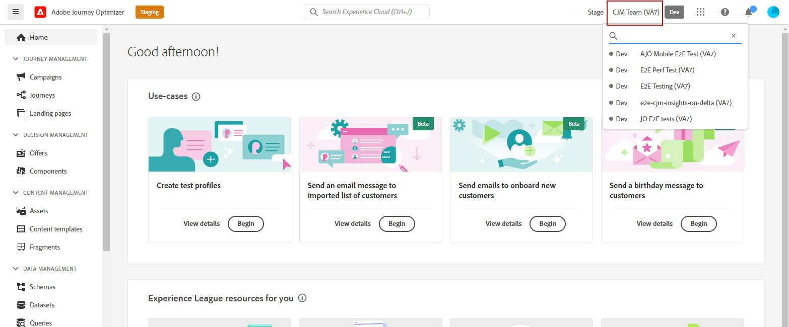

# Använda och tilldela sandlådor {#sandboxes}

## Använda sandlådor {#using-sandbox}

Med [!DNL Journey Optimizer] kan du partitionera instansen i separata virtuella miljöer som kallas sandlådor. Sandlådor tilldelas via roller i behörigheter. [Lär dig tilldela sandlådor](permissions.md#create-product-profile).

[!DNL Journey Optimizer] speglar Adobe Experience Platform-sandlådor som har skapats för en viss organisation. Sandlådorna i Adobe Experience Platform kan skapas eller återställas från din instans i Adobe Experience Platform. [Läs mer i användarhandboken för Sandbox](https://experienceleague.adobe.com/docs/experience-platform/sandbox/ui/user-guide.html?lang=sv-SE){target="_blank"}.

Du hittar kontrollen för sandlådeväxlaren högst upp till höger på skärmen, bredvid organisationens namn. Klicka på den för närvarande aktiva sandlådan i väljaren för att växla från en sandlåda till en annan och välj sedan en annan sandlåda på rullgardinsmenyn.

➡️ [Läs mer om sandlådor i den här videon](#video)

## Tilldela sandlådor {#assign-sandboxes}

>[!IMPORTANT]
>
> Sandlådehantering kan bara utföras av en **[!UICONTROL Product]**- eller **[!UICONTROL System]**-administratör.

Du kan välja att tilldela olika sandlådor till körklara eller anpassade **[!UICONTROL Roles]**.

Så här tilldelar du sandlådor:

1. Välj en [!DNL Permissions] på fliken **[!UICONTROL Roles]**.**[!UICONTROL Role]**

   

1. Klicka på **[!UICONTROL Edit]**.

1. I resurslistrutan **[!UICONTROL Sandboxes]** väljer du den sandlåda som ska tilldelas din roll.

   

1. Om det behövs klickar du på X-ikonen bredvid den för att ta bort sandlådeåtkomst från **[!UICONTROL Role]**.

   

1. Klicka på **[!UICONTROL Save]**.

## Åtkomst till innehåll {#content-access}

Om du vill konfigurera innehållets tillgänglighet tilldelar du en delad mapp till varje sandlåda. Du kan skapa och konfigurera delade mappar på fliken **[!UICONTROL Storage]** som visas i [!DNL Admin Console] för administratörer. Om du har åtkomst till [!DNL Admin Console] som systemadministratör kan du skapa delade mappar och lägga till delegater med olika åtkomstnivåer i dina delade mappar.

Observera att för att ditt innehåll ska kunna synkroniseras med rätt sandlåda måste du följa samma syntax som sandlådan. Om din sandlåda till exempel kallas för&quot;utveckling&quot; ska din delade mapp ha samma namn.

[Lär dig hantera delade mappar](https://helpx.adobe.com/se/enterprise/admin-guide.html/enterprise/using/manage-adobe-storage.ug.html){target="_blank"}.

## Instruktionsvideo{#video}

Förstå vad sandlådor är och hur du skiljer mellan utvecklings- och produktionssandlådor. Lär dig hur du skapar, återställer och tar bort sandlådor.

>[!VIDEO](https://video.tv.adobe.com/v/334355?quality=12)