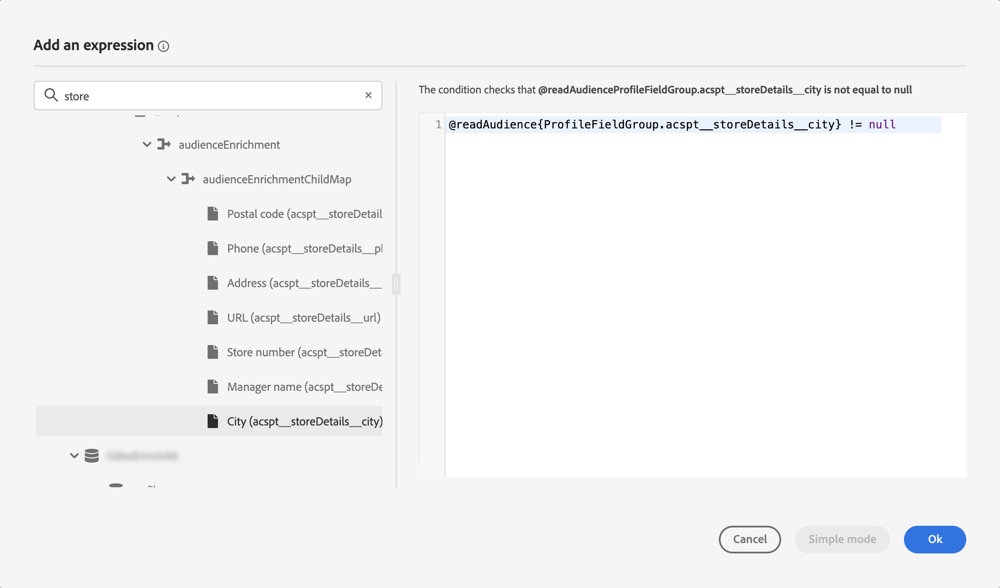

# Kom igång med Adobe Experience Platform målgrupper {#about-segments}

>[!CONTEXTUALHELP]
>id="ajo_campaigns_content_experiment_segment"
>title="Målgrupp"
>abstract="Genom att utnyttja kundprofildata i realtid kan Adobe Experience Platform enkelt skapa segmentdefinitioner för att skapa målgrupper som fångar upp kundernas unika beteenden och önskemål."

>[!CONTEXTUALHELP]
>id="ajo_campaigns_audience"
>title="Välj kampanjmålgrupp"
>abstract="I den här listan visas alla tillgängliga Adobe Experience Platform-målgrupper. Välj målgrupp för er kampanj. Meddelandet som konfigurerats i kampanjen skickas till alla personer som tillhör den valda målgruppen. [Läs mer om målgrupper](../audience/about-audiences.md)"

En målgrupp är en uppsättning personer som har liknande beteenden och/eller egenskaper. Läs mer om målgrupper i [dokumentationen för Adobe Experience Platform segmenteringstjänst](https://experienceleague.adobe.com/docs/experience-platform/segmentation/home.html){target="_blank"}.

Med [!DNL Journey Optimizer] kan du skapa Adobe Experience Platform-målgrupper direkt från menyn **[!UICONTROL Audiences]** och utnyttja dem i dina resor eller kampanjer.

Målgrupper kan genereras på olika sätt:

* **Segmentdefinitioner**: Skapa en ny målgruppsdefinition med Adobe Experience Platform segmenteringstjänst. [Lär dig hur du skapar segmentdefinitioner](creating-a-segment-definition.md)

* **Anpassad överföring**: Importera en målgrupp med en CSV-fil. Lär dig hur du importerar målgrupper i Adobe Experience Platform [dokumentation för segmenteringstjänsten](https://experienceleague.adobe.com/en/docs/experience-platform/segmentation/ui/audience-portal#import-audience){target="_blank"}.

* **Målgruppskomposition**: Skapa ett dispositionsarbetsflöde för att kombinera befintliga Adobe Experience Platform-målgrupper till en visuell arbetsyta och utnyttja olika aktiviteter (dela, exkludera..) för att skapa nya målgrupper. [Kom igång med målgruppsdisposition](get-started-audience-orchestration.md)

* **Federated Audience Composition**: Federate-datauppsättningar direkt från ditt befintliga datalager för att skapa och berika Adobe Experience Platform-målgrupper och attribut i ett och samma system. Läs guiden om [Federated Audience Composition](https://experienceleague.adobe.com/sv/docs/federated-audience-composition/using/home).

Mer information om hur du använder målgrupper med anpassad uppladdning och federerad målgruppskomposition i [!DNL Journey Optimizer] finns i [det här avsnittet](custom-upload-fac.md).

## Målgrupper i [!DNL Journey Optimizer] {#segments-in-journey-optimizer}

I kampanjer och resor kan ni välja alla målgrupper som genereras med segmentdefinitioner, anpassad uppladdning, arbetsflöden för disposition eller Federated Audience Composition.

>[!AVAILABILITY]
>
>Användningen av målgrupper och attribut från målgruppssammansättning är för närvarande inte tillgänglig för användning med hälso- och sjukvårdsskölden eller skölden för skydd av privatlivet och säkerheten. [Lär dig använda attribut för målgruppsberikning i Journey Optimizer](../audience/about-audiences.md#enrichment)

Du kan utnyttja målgrupper i **[!DNL Journey Optimizer]** på olika sätt:

* Välj en målgrupp för en **kampanj**, där meddelandet skickas till alla personer som tillhör den valda målgruppen. [Lär dig definiera målgruppen för en kampanj](../campaigns/create-campaign.md#define-the-audience-audience).

* Använd en **Läs målgruppsorganisation** i en resa för att få alla personer i målgruppen att komma in på resan och ta emot de meddelanden som ingår i din resa. Säg att ni har en&quot;silverkund&quot; som målgrupp. Med den här aktiviteten kan ni få alla silverkunder att ta sig in på en resa och skicka en serie personaliserade meddelanden till dem. [Lär dig konfigurera en målgruppsaktivitet för läsning](../building-journeys/read-audience.md#configuring-segment-trigger-activity).

* Använd aktiviteten **Villkor** i en resa för att skapa villkor baserat på målgruppsmedlemskap. [Lär dig hur du använder målgrupper i villkor](../building-journeys/condition-activity.md#using-a-segment).

* Använd aktiviteten **Målgruppskvalificering** för att få enskilda personer att komma in på eller gå framåt i resan baserat på Adobe Experience Platform målgruppsinkomster och utträden. Du kan till exempel få alla nya silverkunder att resa och skicka meddelanden till dem. Mer information om hur du använder den här aktiviteten finns i [Lär dig hur du konfigurerar en målgruppsklassificeringsaktivitet](../building-journeys/audience-qualification-events.md).

  >[!NOTE]
  >
  >På grund av gruppbeskaffenheten hos målgrupper som skapats med kompositionsarbetsflöden, anpassad uppladdning eller Federated Audience Composition, kan du inte rikta in dessa målgrupper i en&quot;Audience Qualification&quot;-aktivitet. Endast målgrupper som skapats med segmentdefinitioner kan utnyttjas i den här aktiviteten.

## Använd attribut för målgruppsberikning {#enrichment}

När ni riktar in er på en målgrupp som skapats med kompositionsarbetsflöden, en anpassad (CSV-fil) målgrupp eller Federated Audience Composition, kan ni utnyttja anrikningsattribut från dessa målgrupper för att bygga upp er resa och personalisera era budskap.

>[!NOTE]
>
>Publiker som har skapats via anpassad CSV-filöverföring före 1 oktober 2024 är inte berättigade till personlig anpassning. Om du vill använda attribut från dessa målgrupper och utnyttja den här funktionen fullt ut kan du återskapa och överföra externa CSV-mottagare som importerats före detta datum.
>
>Samtyckesprofiler stöder inte anrikningsattribut. Alla regler för samtyckespolicy bör därför endast baseras på attribut som finns i profilen.

Här är de åtgärder du kan utföra med hjälp av målgruppernas anrikningsattribut:

* **Skapa flera sökvägar i en resa** baserat på regler som utnyttjar målpublikens anrikningsattribut. Det gör du genom att rikta in målgruppen med en [Läs målgrupp](../building-journeys/read-audience.md) -aktivitet och sedan skapa regler i en [Villkor](../building-journeys/condition-activity.md) -aktivitet baserat på målgruppens anrikningsattribut.

  {width="70%" zoomable="yes"}

* **Anpassa dina meddelanden** på resor eller i kampanjer genom att lägga till anrikningsattribut från målgruppen i personaliseringsredigeraren. [Lär dig arbeta med personaliseringsredigeraren](../personalization/personalization-build-expressions.md)

  {width="70%" zoomable="yes"}

>[!IMPORTANT]
>
>Om du vill använda anrikningsattribut från målgrupper som skapats med dispositionsarbetsflöden måste du se till att de läggs till i en fältgrupp i Data Source för ExperiencePlatform.
>
+++ Lär dig hur du lägger till anrikningsattribut i en fältgrupp>
>
1. Navigera till Administration > Konfiguration > Datakällor.
1. Markera Experience Platform och skapa eller redigera en fältgrupp.
1. Välj lämpligt schema i schemaväljaren. Schemats namn kommer att ha följande format: &#39;Schema for audiensId:&#39; + målgruppens ID. Du kan hitta målgruppens ID på skärmen med målgruppsinformation i målgruppslagret.
1. Öppna fältväljaren, sök efter de anrikningsattribut som du vill lägga till och markera kryssrutan bredvid dem.
1. Spara ändringarna.
1. När anrikningsattributen har lagts till i en fältgrupp kan du använda dem i Journey Optimizer på de platser som listas ovan.
>
Detaljerad information om datakällor finns i följande avsnitt:
>
* [Arbeta med Adobe Experience Platform datakälla](../datasource/adobe-experience-platform-data-source.md)
* [Konfigurera en datakälla](../datasource/configure-data-sources.md)
>
+++

## Metoder för utvärdering av målgrupper {#evaluation-method-in-journey-optimizer}

I Adobe Journey Optimizer genereras målgrupper från segmentdefinitioner med hjälp av någon av de tre utvärderingsmetoderna nedan.

+++ Direktuppspelningssegmentering

Profillistan för målgruppen hålls uppdaterad i realtid när nya data flödar in i systemet.

Direktuppspelningssegmentering är en kontinuerlig process för datamarkering som uppdaterar era målgrupper som svar på användaraktivitet. När en segmentdefinition har skapats och målgruppen har sparats, tillämpas segmentdefinitionen på inkommande data till Journey Optimizer. Det innebär att enskilda personer läggs till eller tas bort från målgruppen när deras profildata ändras, vilket säkerställer att målgruppen alltid är relevant. [Läs mer](https://experienceleague.adobe.com/docs/experience-platform/segmentation/ui/streaming-segmentation.html){target="_blank"}

>[!NOTE]
>
Se till att använda rätt händelser som villkor för direktuppspelningssegmentering. [Läs mer](#streaming-segmentation-events-guardrails)

+++

+++ Gruppsegmentering

Profillistan för publiken utvärderas var 24:e timme.

Gruppsegmentering är ett alternativ till direktuppspelningssegmentering som bearbetar alla profildata samtidigt genom segmentdefinitioner. Detta skapar en ögonblicksbild av målgruppen som kan sparas och exporteras för användning. Till skillnad från direktuppspelningssegmentering kommer gruppsegmentering inte att kontinuerligt uppdatera målgruppslistan i realtid, och nya data som kommer in efter gruppbearbetningen kommer inte att återspeglas i målgruppen förrän nästa gruppbearbetning. [Läs mer](https://experienceleague.adobe.com/docs/experience-platform/segmentation/home.html#batch){target="_blank"}

+++

+++ Edge segmentering

Edge-segmentering är möjligheten att omedelbart utvärdera segment i Adobe Experience Platform [på kanten](https://experienceleague.adobe.com/docs/experience-platform/edge/home.html){target="_blank"}, vilket möjliggör användning av personalisering på samma sida och nästa sida. För närvarande kan endast utvalda frågetyper utvärderas med kantsegmentering. [Läs mer](https://experienceleague.adobe.com/docs/experience-platform/segmentation/ui/edge-segmentation.html#query-types){target="_blank"}

+++

Om du vet vilken utvärderingsmetod du vill använda väljer du den i listrutan. Du kan också klicka på mappikonen för bläddringsikonen med ett förstoringsglas för att visa en lista över tillgängliga metoder för utvärdering av segmentdefinitioner. [Läs mer](https://experienceleague.adobe.com/docs/experience-platform/segmentation/ui/segment-builder.html#segment-properties){target="_blank"}

<!--The determination between batch segmentation and streaming segmentation is made by the system for each audience, based on the complexity and the cost of evaluating the segment definition rule. You can view the evaluation method for each audience in the **[!UICONTROL Evaluation method]** column of the audience list.
    

>[!NOTE]
>
>If the **[!UICONTROL Evaluation method]** column does not display, you  need to add it using configuration button on the top right of the list.-->

När du har definierat en målgrupp för första gången läggs profiler till i målgruppen när de kvalificerar sig.

Det kan ta upp till 24 timmar att fylla målgruppen med tidigare data. När målgruppen har fyllts i på nytt hålls målgruppen kontinuerligt uppdaterad och alltid redo för målinriktning.

### Händelseanvändning med direktuppspelningssegmentering {#streaming-segmentation-events-guardrails}

Strömmande segmentering är användbart för personalisering i realtid med värdefulla användningsexempel. Det är dock viktigt att välja rätt [händelser](https://experienceleague.adobe.com/docs/experience-platform/segmentation/ui/segment-builder.html#events){target="_blank"} som ska användas som segmenteringskriterier.

Därför bör du undvika följande händelser för optimala prestanda vid direktuppspelningssegmentering:

* **Meddelandet öppnat** händelse för interaktionstyp

  När du skapade din målgrupp blev användningen av **Message Opened**-interaktionshändelser otillförlitlig, eftersom de inte är faktiska indikatorer för användaraktivitet och kan påverka segmenteringsprestanda negativt. Läs varför i det här [Adobe-blogginlägget](https://blog.adobe.com/en/publish/2021/06/24/what-apples-mail-privacy-protection-means-for-email-marketers){target="_blank"}. Adobe rekommenderar därför att interaktionshändelser för **Öppna meddelande** inte används med direktuppspelningssegmentering. Använd istället riktiga användaraktivitetssignaler som klickningar, köp eller beacon-data.

* **Meddelande skickat** Feedback-statushändelse

  Feedback-händelsen **Meddelande skickat** används ofta för frekvens- eller undertryckskontroll innan ett e-postmeddelande skickas. Adobe rekommenderar att du undviker det eftersom det sätter tryck på prestandan och kan orsaka att systemet försämras. Använd därför affärsregler i stället för **Meddelanden som skickas** för frekvens- eller undertryckningslogik. Observera att det inom kort kommer att finnas ett dagligt tak för frekvenser för enskilda profiler, vilket kompletterar den befintliga månadsgränsen för affärsregler.

>[!NOTE]
>
Du kan använda händelserna **Meddelande öppnat** och **Meddelande skickat** i gruppsegmentering utan några prestandaproblem.

## Vanliga frågor och svar om målgruppskomposition och anpassad överföring {#faq}

I följande avsnitt visas vanliga frågor om hur målgrupper som skapats med dispositionsarbetsflöden och anpassade uppladdningar (CSV-filer) används i Journey Optimizer.

+++ Var kan jag använda målgrupper från målgruppsdisposition och anpassad uppladdning inom Journey Optimizer?

Målgrupper från målgruppssammansättning och anpassad uppladdning kan hämtas antingen från kampanjer och resor. [Lär dig målinrikta målgrupper i [!DNL Journey Optimizer]](#segments-in-journey-optimizer)

* I **kampanjer** visas de här målgrupperna i målgruppsväljaren efter att du klickat på knappen Välj målgrupp.

* I **Journeys** kan du använda dessa målgrupper i en&quot;Läs målgrupp&quot;-aktivitet under valet av målgrupp och i en&quot;Villkor&quot;-aktivitet för kontroller av målgruppsmedlemskap. På grund av deras gruppkaraktär visas dock inte dessa målgrupper i aktiviteten&quot;Audience Qualification&quot;.

  >[!NOTE]
  >
  Om&quot;Inkrementell läsning&quot; är aktiverat i en återkommande resa hämtas profiler endast vid den första upprepningen, eftersom dessa målgrupper är fasta.

Dessutom kan dessa målgrupper användas i personaliseringsredigeraren för att personalisera meddelanden under resor och kampanjer. [Lär dig arbeta med personaliseringsredigeraren](../personalization/personalization-build-expressions.md)

+++

+++ Vad är anrikningsattribut?

Enrichment-attribut är ytterligare attribut som är sammanhangsberoende och specifika för en viss målgrupp. De är inte associerade med profilen och används vanligtvis för personalisering.

Anrikningsattribut är länkade till en målgrupp via en [Berika](composition-canvas.md#enrich) -aktivitet i målgruppssammansättning eller via den anpassade överföringsprocessen.

+++

+++ Var kan jag använda anrikningsattribut i Journey Optimizer?

Anrikningsattribut från publikens komposition kan användas inom följande områden. [Lär dig använda attribut för målgruppsberikning](#enrichment)

* Villkorsaktivitet (resor)
* Anpassade åtgärdsattribut (resor)
* Meddelandepersonalisering (resor och kampanjer)

+++

+++ Hur aktiverar jag anrikningsattribut i Journeys?

Om du vill använda anrikningsattribut från målgrupper som skapats med dispositionsarbetsflöden måste du se till att de läggs till i en fältgrupp i Data Source för ExperiencePlatform. Information om hur du lägger till anrikningsattribut i en fältgrupp finns i [det här avsnittet](#enrichment)

+++

+++ När kan jag publicera en målgrupp från en publikkomposition i Journey Optimizer?

Målgrupper från **målgruppskomposition** körs dagligen, så du kan behöva vänta upp till 24 timmar på att använda dem i Journey Optimizer.

+++

+++ Uppdateras värdena för anrikningsattributen när en resa börjar?

För närvarande inte. Även efter vänta- eller händelsnoder är värdena för anrikningsattributen desamma som när resan påbörjades.

+++

+++ Hur kopplas anpassade uppladdningsmålgrupper med profiler?

Under den anpassade överföringsprocessen anger du det CSV-attribut som ska användas som identitet och den profilidentitet som det mappas till. Detta skapar en länk mellan målgruppsdata och profilen. Om CSV-filen innehåller ett identitetsvärde som inte finns i profilen skapas en ny profil med det identitetsvärdet.

Detaljerad information om den anpassade överföringsprocessen finns i Adobe Experience Platform [dokumentation för segmenteringstjänsten](https://experienceleague.adobe.com/docs/experience-platform/segmentation/ui/overview.html#import-audience){target="_blank"}.

+++

+++ Hur färska är mina data i Journey Optimizer?

Data i målgrupper från publiksammansättning och anpassad uppladdning fylls i av Audience Export Service (AES). AES läser profilattribut och målgruppsmedlemskap, som är tillgängligt för dessa målgrupper med följande tidslinjer:

* **Målgruppskomposition**: Daglig export (~24 timmar)
* **Anpassad överföring**: Dedikerat exportjobb (~2 timmar)

Alla resor som utnyttjar en målgrupp från målgruppskomposition eller anpassade uppladdningar i aktiviteten&quot;Läs målgrupp&quot; kommer att ha profilattribut som är lika färska som den senaste grupputvärderingen. Detta inkluderar samtycke/undertryckande under resan.

Dessutom är förbättrade attribut i målgrupper för målgruppssammansättning lika färska som den senaste kompositionen, som kan vara upp till 24 timmar tidigare.

+++

## Instruktionsvideo {#video}

Läs om enhetliga kundprofiler och målgrupper i Journey Optimizer.

>[!VIDEO](https://video.tv.adobe.com/v/3432671?quality=12)
