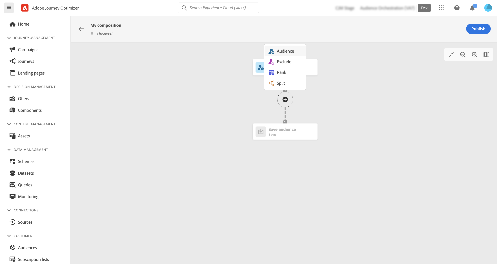

# Arbeta med arbetsytan {#composition-canvas}

>[!BEGINSHADEBOX]

Dokumentationen innehåller detaljerad information om hur du arbetar med målgruppsdispositioner i Adobe Journey Optimizer. Om du inte använder Adobe Journey Optimizer [klicka här](https://experienceleague.adobe.com/docs/experience-platform/segmentation/ui/audience-composition.html){target="_blank"}.

>[!ENDSHADEBOX]

Målgruppsdisposition är en visuell arbetsyta som gör att du kan skapa målgrupper och använda olika aktiviteter (dela, berika osv.).

Stegen för att komponera en målgrupp på arbetsytan är följande:

1. [Definiera era startmålgrupper](#starting-audience)
1. [Lägg till en eller flera aktiviteter](#action-activities)
1. [Spara resultaten till en ny målgrupp](#save)

## Välj den inledande målgruppen {#starting-audience}

Det första steget för att skapa en komposition är att välja en eller flera befintliga målgrupper som grund för din komposition.

1. Välj **[!UICONTROL Audience]** anger aktiviteten sedan en etikett för aktiviteten.

1. Välj målgrupp:

   * Klicka på **[!UICONTROL Add audience]** knapp för att välja en eller flera befintliga målgrupper,
   * Klicka på **[!UICONTROL Build rule]** för att skapa en ny målgruppsdefinition med [Segmenteringstjänst](https://experienceleague.adobe.com/docs/experience-platform/segmentation/ui/overview.html).

   

1. Om du väljer flera målgrupper anger du hur profilerna för dessa målgrupper ska sammanfogas:

* **[!UICONTROL Union]**: inkludera alla profiler från de valda målgrupperna,
* **[!UICONTROL Intersection]**: innehåller profiler som är gemensamma för alla valda målgrupper,
* **[!UICONTROL Exclude overlap]**: innehåller profiler som endast tillhör en av målgrupperna. Profiler som tillhör fler än en publik inkluderas inte.

I det här exemplet vill vi inrikta oss på alla profiler som tillhör publikerna guld och silver.

När målgrupper har valts visas det uppskattade antalet profiler längst ned i aktiviteten.

## Lägg till aktiviteter {#action-activities}

Lägg till aktiviteter efter att du har valt den första målgruppen för att förfina urvalet.

Det gör du genom att klicka på plusknappen (+) på kompositionsbanan och sedan välja önskad aktivitet. Den högra rutan öppnas så att du kan konfigurera den nyligen tillagda aktiviteten.

Tillgängliga aktiviteter är:

* [Målgrupp](#audience): innehåller ytterligare profiler som tillhör en eller flera befintliga målgrupper,
* [Exkludera](#exclude): exkludera profiler som tillhör en befintlig publik eller exkludera profiler som baseras på specifika attribut,
* [Förfina](#enrich): berika publiken med ytterligare attribut från Adobe Experience Platform dataset,
* [Rankning](#rank): Rangordna profiler baserat på ett specifikt attribut, ange antalet profiler som ska behållas och inkluderas i din komposition,
* [Dela](#split): dela upp kompositionen i flera banor baserat på slumpmässiga procentsatser eller attribut.

Du kan lägga till så många **[!UICONTROL Audience]** och **[!UICONTROL Exclude]** aktiviteter efter behov i din sammansättning. Inga ytterligare aktiviteter kan dock läggas till efter **[!UICONTROL Rank]** och **[!UICONTROL Split]** aktiviteter.

Du kan ta bort en aktivitet från arbetsytan när som helst genom att klicka på knappen Ta bort i den högra rutan.  Om aktiviteten som du vill ta bort är överordnad andra aktiviteter i kompositionen visas ett meddelande, som du kan använda för att ange om du bara vill ta bort den markerade aktiviteten eller alla dess underordnade aktiviteter.

### Målgruppsaktivitet {#audience}

>[!CONTEXTUALHELP]
>id="ajo_ao_audience"
>title="Målgruppsaktivitet"
>abstract="Med hjälp av Audience-aktiviteten kan du i din komposition inkludera ytterligare profiler som tillhör en befintlig målgrupp."

>[!CONTEXTUALHELP]
>id="ajo_ao_merge_types"
>title="Sammanfoga typer"
>abstract="Ange hur profilerna för de valda målgrupperna ska sammanfogas."

The **[!UICONTROL Audience]** kan du i din komposition inkludera ytterligare profiler som tillhör en befintlig målgrupp.

Konfigurationen för den här aktiviteten är identisk med startvärdet [Målgruppsaktivitet](#starting-audience).

### Exkludera aktivitet {#exclude}

>[!CONTEXTUALHELP]
>id="ajo_ao_exclude_type"
>title="Uteslut typ"
>abstract="Använd typen Uteslut målgrupp för att exkludera profiler som tillhör en befintlig målgrupp. Med attributtypen Uteslut med kan du exkludera profiler baserat på ett specifikt attribut."

>[!CONTEXTUALHELP]
>id="ajo_ao_exclude"
>title="Exkludera aktivitet"
>abstract="Med aktiviteten Uteslut kan du utesluta profiler från kompositionen genom att välja en befintlig målgrupp eller använda en regel."

The **[!UICONTROL Exclude]** kan du utesluta profiler från din komposition. Det finns två typer av undantag:

* **[!UICONTROL Exclude Audience]**: Uteslut profiler som tillhör en befintlig målgrupp.

  Klicka på **[!UICONTROL Add audience]** och sedan välja den målgrupp som ska uteslutas.

  

* **[!UICONTROL Exclude using attribute]**: Uteslut profiler baserade på ett specifikt attribut.

  Välj det attribut som ska slås upp och ange sedan vilket värde som ska uteslutas. I det här exemplet utesluts vi från dispositionsprofiler vars hemadress är i Japan.

  >[!NOTE]
  >
  >Endast ett exkluderingsvärde kan anges.

  

### Berika aktivitet {#enrich}

>[!CONTEXTUALHELP]
>id="ajo_ao_enrich"
>title="Berika aktivitet"
>abstract="Använd aktiviteten Enrich för att berika publiken med ytterligare attribut från Adobe Experience Platform datamängder. Du kan t.ex. lägga till information om den köpta produkten, som namn, pris eller tillverkare-ID, och använda dessa uppgifter för att anpassa de leveranser som skickas till målgruppen."

>[!CONTEXTUALHELP]
>id="ajo_ao_enrich_dataset"
>title="Datauppsättning för berikning"
>abstract="Välj den datauppsättning för berikning som innehåller de data som du vill associera med målgruppen."

>[!CONTEXTUALHELP]
>id="ajo_ao_enrich_criteria"
>title="Anrikningskriterier"
>abstract="Välj de fält som ska användas som avstämningsnyckel mellan källdatauppsättningen, dvs. målgruppen, och datauppsättningen för anrikning."

>[!CONTEXTUALHELP]
>id="ajo_ao_enrich_attributes"
>title="Attribut för berikning"
>abstract="Välj ett eller flera attribut från datauppsättningen för anrikning som ska kopplas till målgruppen. När kompositionen har publicerats är dessa attribut knutna till målgruppen och kan utnyttjas i Journey Optimizer-kampanjer för att personalisera leveranser."

The **[!UICONTROL Enrich]** Med hjälp av aktivitet kan ni berika er målgrupp med ytterligare attribut från Adobe Experience Platform datamängder. Du kan t.ex. lägga till information om den köpta produkten, som namn, pris eller tillverkare-ID, och använda dessa uppgifter för att anpassa de leveranser som skickas till målgruppen.

Observera följande begränsningar när du arbetar med **[!UICONTROL Enrich]** aktivitet:

* **Datauppsättningar** for enrichment måste vara av posttyp (till skillnad från händelsetyp), och de kan inte vara en systemdatauppsättning eller markeras för profil. De måste vara under 1 GB.
* **Anrikning stöder 1:1-join**. Det innebär att om kopplingsnycklarna har fler än en matchning i datauppsättningen enrichment, väljs en av matchningarna och används för 1:1-kopplingen.
* **Målgrupper kan aktiveras i RTCDP-destinationer**, men deras eventuella anrikningsattribut kan inte det.
* Anrikningsattribut är ännu inte integrerade med policystyrningen. Därför kommer de etiketter för dataanvändning som du använder för dina anrikningsattribut inte att användas i Journey Optimizer kampanjer eller resor.

Så här konfigurerar du aktiviteten:

1. Välj **[!UICONTROL Enrichment dataset]** som innehåller de data som du vill associera med målgruppen.

1. I **[!UICONTROL Enrichment criteria]** väljer du de fält som ska användas som avstämningsnyckel mellan källdatauppsättningen, dvs. målgruppen, och anrikningsdatauppsättningen. I det här exemplet använder vi ID:t för den köpta produkten som avstämningsnyckel.

1. Klicka på **[!UICONTROL Add atttributes]** väljer du sedan ett eller flera attribut från anrikningsdatauppsättningen som ska kopplas till målgruppen.

   

När kompositionen har publicerats kopplas de valda attributen till målgruppen och kan utnyttjas i kampanjer för att personalisera leveranser.

### Rankningsaktivitet {#rank}

>[!CONTEXTUALHELP]
>id="ajo_ao_ranking"
>title="Rankningsaktivitet"
>abstract="Med aktiviteten Rankning kan du rangordna profiler baserat på ett specifikt attribut och inkludera dem i din komposition. Ta till exempel med de 50 profilerna med det största antalet förmånspoäng."

>[!CONTEXTUALHELP]
>id="ajo_ao_rank_profilelimit_text"
>title="Lägg till profilgräns"
>abstract="Aktivera det här alternativet om du vill ange ett maximalt antal profiler som ska ingå i kompositionen."

The **[!UICONTROL Rank]** Med -aktivitet kan du rangordna profiler baserat på ett specifikt attribut och inkludera dem i din komposition. Du kan till exempel inkludera de 50 profilerna med det största antalet förmånspoäng.

1. Markera det attribut som du vill söka efter och ange en rangordningsordning (stigande eller fallande).

   >[!NOTE]
   >
   >Du kan välja attribut med följande datatyper: heltal, tal, kort <!--(other?)-->

1. Växla **[!UICONTROL Add profile limit]** på och ange ett maximalt antal profiler som ska ingå i kompositionen.

   

### Delad aktivitet {#split}

<!-- [!CONTEXTUALHELP]
>id="ajo_ao_control_group_text"
>title="Control Group"
>abstract="Use control groups to isolate a portion of the profiles. This allows you to measure the impact of a marketing activity and make a comparison with the behavior of the rest of the population."-->

>[!CONTEXTUALHELP]
>id="ajo_ao_split"
>title="Delad aktivitet"
>abstract="Med aktiviteten Dela kan du dela upp kompositionen i flera banor. När kompositionen publiceras sparas en publik i Adobe Experience Platform för varje bana."

>[!CONTEXTUALHELP]
>id="ajo_ao_split_type"
>title="Delad text"
>abstract="Använd delningstypen Procent för att slumpmässigt dela upp profiler i flera banor. Med attributdelningstypen kan du dela profiler baserat på ett specifikt attribut."

>[!CONTEXTUALHELP]
>id="ajo_ao_split_otherprofiles_text"
>title="Andra profiler"
>abstract="Aktivera det här alternativet om du vill skapa en ytterligare sökväg med de återstående profilerna som inte matchar något av villkoren som anges i de andra sökvägarna."

The **[!UICONTROL Split]** kan du dela upp kompositionen i flera banor.

Den här åtgärden lägger automatiskt till en **[!UICONTROL Save]** i slutet av varje bana. När kompositionen publiceras sparas en publik i Adobe Experience Platform för varje bana.

Det finns två typer av delade åtgärder:

* **[!UICONTROL Percent split]**: dela upp profiler slumpmässigt i två eller flera banor. Du kan till exempel dela upp profilerna i två olika banor med 50 % vardera. <!--and add an additional path for control group.-->

  

* **[!UICONTROL Attribute split]**: delade profiler baserade på ett specifikt attribut. I det här exemplet delar vi upp profiler baserat på deras rumstypsinställningar.

  

  Så här ställer du in en attributbaserad delningsaktivitet:

   1. Klicka på knappen bredvid **[!UICONTROL Attribute]** för att välja det attribut som ska användas som delningsvillkor.
   1. Lägg till så många banor som behövs. Ange en etikett för varje bana och det värde som ska användas för att avgöra vilka profiler som ska inkluderas i den aktuella sökvägen.

      >[!NOTE]
      >
      >Endast ett värde kan anges för varje sökväg.

   1. Växla på **[!UICONTROL Other profiles]** om du vill skapa ytterligare en sökväg med de återstående profilerna som inte matchar något av villkoren som anges i de andra sökvägarna.

## Spara era målgrupper {#save}

Konfigurera de målgrupper som ska sparas i Adobe Experience Platform.

Om du vill göra det väljer du **[!UICONTROL Save audience]** i slutet av varje bana anger du namnet på den nya målgruppen som ska skapas.

När kompositionen är klar kan du publicera den. [Lär dig hur du skapar kompositioner](create-compositions.md)
