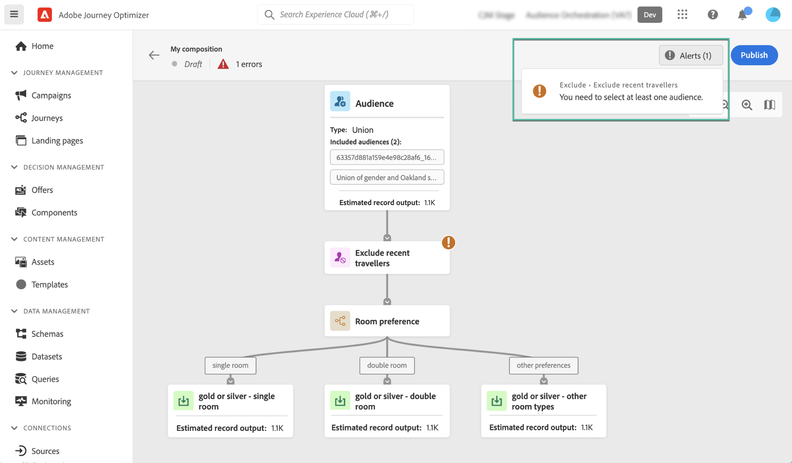

# Skapa ditt första dispositionsarbetsflöde {#create-compositions}

## Skapa ett dispositionsarbetsflöde {#create}

Så här skapar du ett dispositionsarbetsflöde:

1. Öppna **[!UICONTROL Audiences]** meny och välj **[!UICONTROL Create Audience]**.

1. Välj **[!UICONTROL Compose Audience]**.

   

   >[!NOTE]
   >
   >The **[!UICONTROL Build rule]** kan du skapa en ny segmentdefinition med [Segmenteringstjänst](https://experienceleague.adobe.com/docs/experience-platform/segmentation/ui/overview.html).

1. Arbetsytan visas med två standardaktiviteter:

   * **[!UICONTROL Audience]**: startpunkten för kompositionen. Med den här aktiviteten kan du välja en eller flera målgrupper som grund för ditt arbetsflöde,

   * **[!UICONTROL Save]**: det sista steget i kompositionen. Med den här aktiviteten kan du spara resultatet av arbetsflödet till en ny målgrupp.

   Mer information om hur du konfigurerar aktiviteter på arbetsytan för dispositionsarbetsflöden finns i [Arbeta med arbetsytan](composition-canvas.md).

1. Öppna dispositionsegenskaperna för att ange en titel och en beskrivning.

   Om ingen titel har definierats i egenskaperna ställs kompositionens etikett in på &quot;Disposition&quot; följt av datum och tid då den skapades.

   

1. Konfigurera kompositionen genom att lägga till så många aktiviteter som behövs mellan **[!UICONTROL Audience]** och **[!UICONTROL Save]** verksamhet. [Lär dig arbeta med arbetsytan](composition-canvas.md)

   

1. När kompositionen är klar klickar du på **[!UICONTROL Publish]** för att publicera kompositionen och spara målgrupperna i Adobe Experience Platform.

   >[!IMPORTANT]
   >
   >Du kan publicera upp till 10 kompositioner i en given sandlåda. Om du har nått det här tröskelvärdet måste du ta bort en disposition för att frigöra utrymme och publicera en ny.

   Om något fel inträffar under publiceringen visas varningar med information om hur du löser problemet.

   

1. Dispositionen publiceras. De resulterande målgrupperna sparas i Adobe Experience Platform och är redo att målinrikta sig i Journey Optimizer-kampanjer. [Lär dig hur du arbetar med kampanjer](../campaigns/get-started-with-campaigns.md)

## Åtkomst till kompositioner {#access}

>[!CONTEXTUALHELP]
>id="ajo_ao_publish"
>title="Publicera er målgrupp"
>abstract="Publicera materialet för att spara målgrupper i Adobe Experience Platform."

Alla skapade kompositioner kan nås via **[!UICONTROL Compositions]** -fliken. De kan ha flera statusar:

* **[!UICONTROL Draft]**: kompositionen pågår och har inte publicerats.
* **[!UICONTROL Published]**: kompositionen har publicerats, målgrupperna har sparats och är tillgängliga för användning.

>[!NOTE]
>
>Du kan när som helst duplicera eller ta bort en befintlig komposition med hjälp av ellipsknappen i listan.
