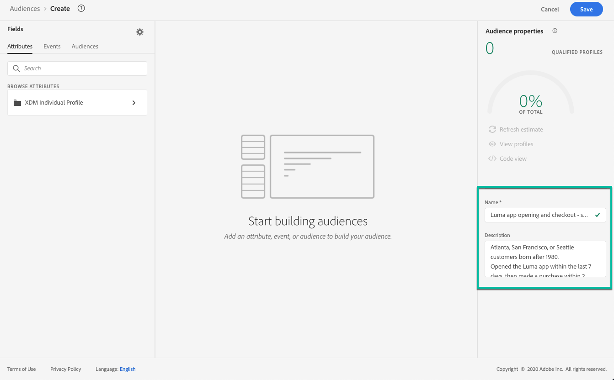
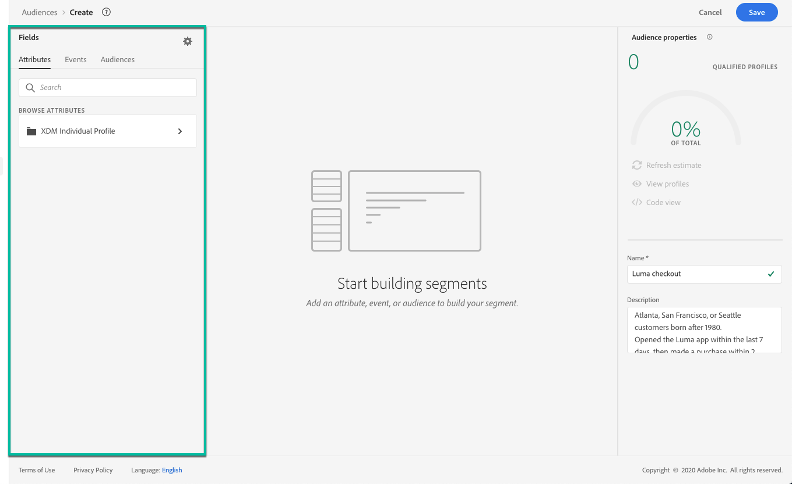
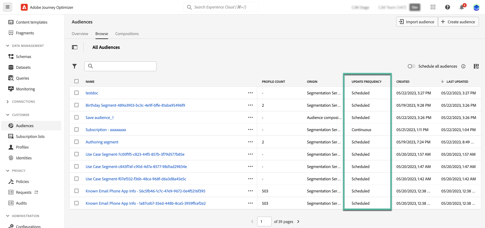

# Skapa segmentdefinitioner {#build-segments}

>[!CONTEXTUALHELP]
>id="ajo_ao_create_rule"
>title="Skapa en regel"
>abstract="Med metoden Skapa regel kan du skapa en ny målgruppsdefinition med Adobe Experience Platform Segmentation Service."

## Skapa en segmentdefinition {#create}

I det här exemplet bygger ni en målgrupp för alla kunder som bor i Atlanta, San Francisco eller Seattle och som är födda efter 1980. Alla dessa kunder måste ha gjort ett köp de senaste 7 dagarna.

➡️ [Lär dig skapa målgrupper i den här videon](#video-segment)

1. Klicka på knappen **[!UICONTROL Audiences]** på menyn **[!UICONTROL Create audience]** och välj **[!UICONTROL Build rule]**.

   

   På segmentdefinitionsskärmen kan du konfigurera alla obligatoriska fält för att definiera målgruppen. Lär dig hur du konfigurerar målgrupper i [dokumentationen för segmenteringstjänsten](https://experienceleague.adobe.com/en/docs/experience-platform/segmentation/methods/overview){target="_blank"}.

   

1. Ange ett namn och en beskrivning (valfritt) för målgruppen i rutan **[!UICONTROL Audience properties]**.

   

1. Dra och släpp önskade fält från den vänstra rutan till arbetsytan i mitten och konfigurera dem efter behov.

   De grundläggande byggstenarna för segmentdefinitioner är **attribut** och **händelser**. Dessutom kan attribut och händelser i befintliga målgrupper användas som komponenter för nya definitioner. [Läs mer i dokumentationen för segmenteringstjänsten](https://experienceleague.adobe.com/en/docs/experience-platform/segmentation/ui/segment-builder#building-blocks){target="_blank"}

   >[!NOTE]
   >
   >Observera att fälten som är tillgängliga i den vänstra rutan varierar beroende på hur scheman **XDM Individual Profile** och **XDM ExperienceEvent** har konfigurerats för din organisation.  Läs mer i [XDM-dokumentationen (Experience Data Model)](https://experienceleague.adobe.com/docs/experience-platform/xdm/home.html?lang=sv){target="_blank"}.

   

   I det här exemplet måste vi förlita oss på fälten **Attribut** och **Händelser** för att skapa målgruppen:

   * **Attribut**: profiler som bor i Atlanta, San Francisco eller Seattle och som är födda efter 1980.

     

   * **Händelser**: profiler som har köpt något under de senaste 7 dagarna.

     

1. När du lägger till och konfigurerar nya fält på arbetsytan uppdateras rutan **[!UICONTROL Audience Properties]** automatiskt med information om de uppskattade profilerna som tillhör målgruppen.

   

1. När målgruppen är klar klickar du på **[!UICONTROL Save]**. Den visas i listan över Adobe Experience Platform målgrupper. Observera att det finns ett sökfält som du kan använda för att söka efter en viss målgrupp i listan.

Publiken är nu redo att användas på era resor. Mer information hittar du i [det här avsnittet](../audience/about-audiences.md).

## Metoder för utvärdering av målgrupper {#evaluation-method-in-journey-optimizer}

I Adobe Journey Optimizer genereras målgrupper från segmentdefinitioner med hjälp av någon av de tre utvärderingsmetoderna nedan.

+++ Direktuppspelningssegmentering

Profillistan för målgruppen hålls uppdaterad i realtid när nya data flödar in i systemet.

Direktuppspelningssegmentering är en kontinuerlig process för datamarkering som uppdaterar era målgrupper som svar på användaraktivitet. När en segmentdefinition har skapats och målgruppen har sparats, tillämpas segmentdefinitionen på inkommande data till Journey Optimizer. Det innebär att enskilda personer läggs till eller tas bort från målgruppen när deras profildata ändras, vilket säkerställer att målgruppen alltid är relevant. [Läs mer i Adobe Experience Platform-dokumentationen](https://experienceleague.adobe.com/docs/experience-platform/segmentation/ui/streaming-segmentation.html){target="_blank"}.

>[!IMPORTANT]
>
>Från och med den 1 november 2024 har direktuppspelningssegmentering inte längre stöd för användning av **send** - och **open** -händelser från Journey Optimizer spårnings- och feedbackdatauppsättningar.
>
>* Den här ändringen gäller alla kundsandlådor och organisationer.
>* Endast skicka- och öppna-händelser påverkas: Klickningar och andra spårningshändelser är fortfarande tillgängliga för direktuppspelningssegmentering.
>* Den här ändringen gäller endast för direktuppspelningssegmentering. Send- och open-händelser kan fortfarande användas i gruppsegment, men om de ingår i ett direktuppspelningssegment utvärderas de gruppvis. Dessutom påverkas även undantagshändelser och studs-/fördröjningshändelser som är ett resultat av skicka-händelser av den här ändringen.
>* Spårning av datainsamling påverkas inte. Evenemang för att skicka och öppna samlas in som vanligt.
>* Reaktionshändelser under resor påverkas inte av denna förändring.

+++

+++ Gruppsegmentering

Profillistan för publiken utvärderas var 24:e timme.

Gruppsegmentering bearbetar alla profildata samtidigt genom segmentdefinitioner, vilket skapar en ögonblicksbild av målgruppen som kan sparas och exporteras för användning. Till skillnad från direktuppspelningssegmentering uppdateras inte målgruppslistan kontinuerligt i realtid. Nya data som kommer in efter gruppbearbetningen återspeglas inte i målgruppen förrän nästa gruppbearbetning. Försök att framtvinga en omedelbar uppdatering åsidosätter inte den dagliga cykeln. Om du vill ha omedelbara stegvisa uppdateringar kan du använda alternativ för direktuppspelning eller segmentering på begäran.

Mer information finns i [dokumentationen för Adobe Experience Platform segmenteringstjänst](https://experienceleague.adobe.com/docs/experience-platform/segmentation/home.html#batch){target="_blank"}

+++

+++ Edge segmentering

Edge-segmentering är möjligheten att omedelbart utvärdera segment i Adobe Experience Platform [på kanten](https://experienceleague.adobe.com/docs/experience-platform/edge/home.html){target="_blank"}, vilket möjliggör användning av samma sida och nästa sida. För närvarande kan endast utvalda frågetyper utvärderas med kantsegmentering. Mer information finns i [dokumentationen för Adobe Experience Platform segmenteringstjänst](https://experienceleague.adobe.com/docs/experience-platform/segmentation/ui/edge-segmentation.html#query-types){target="_blank"}

+++

Om du vet vilken utvärderingsmetod du vill använda väljer du den i listrutan. Du kan också klicka på mappikonen för bläddringsikonen med ett förstoringsglas för att visa en lista över tillgängliga metoder för utvärdering av segmentdefinitioner. Mer information finns i [dokumentationen för Adobe Experience Platform segmenteringstjänst](https://experienceleague.adobe.com/docs/experience-platform/segmentation/ui/segment-builder.html#segment-properties){target="_blank"}.

<!--The determination between batch segmentation and streaming segmentation is made by the system for each audience, based on the complexity and the cost of evaluating the segment definition rule. You can view the evaluation method for each audience in the **[!UICONTROL Evaluation method]** column of the audience list.
    

>[!NOTE]
>
>If the **[!UICONTROL Evaluation method]** column does not display, you  need to add it using configuration button on the top right of the list.-->

När du har definierat en målgrupp för första gången läggs profiler till i målgruppen när de kvalificerar sig. Det kan ta upp till 24 timmar att fylla målgruppen med tidigare data. När målgruppen har fyllts i på nytt hålls målgruppen kontinuerligt uppdaterad och alltid redo för målinriktning.

## Flexibel utvärdering av målgrupper {#flexible}

Med Adobe Experience Platform Audience Portal kan ni köra ett segmenteringsjobb on demand för utvalda målgrupper, vilket säkerställer att ni alltid har de senaste målgruppsdata innan ni kan rikta in dem på Journey Optimizer resor och kampanjer.

Med flexibel målgruppsutvärdering kan ni

1. Skapa ett nytt segment baserat på dina senaste data.
1. Utvärdera målgruppen i realtid för att säkerställa exaktheten. För att göra det väljer du de målgrupper du vill ha utvärderade och väljer&quot;Utvärdera målgrupper&quot;, förutsatt att de uppfyller specifika kriterier (t.ex. personbaserat, ursprung i segmenteringstjänst).
1. Använd den utvärderade målgruppen i Adobe Journey Optimizer-kampanjer eller resor för exakt målinriktning.

Ni kan utvärdera upp till 20 målgrupper i taget, och icke berättigade målgrupper exkluderas automatiskt. Mer information finns i [dokumentationen för Adobe Experience Platform segmenteringstjänst](https://experienceleague.adobe.com/en/docs/experience-platform/segmentation/ui/audience-portal#flexible-audience-evaluation).

## Instruktionsvideo{#video-segment}

Förstå hur Journey Optimizer använder regler för att generera målgrupper och lär sig hur man använder attribut, händelser och befintliga målgrupper för att skapa en målgrupp.

>[!VIDEO](https://video.tv.adobe.com/v/3425020?quality=12)
