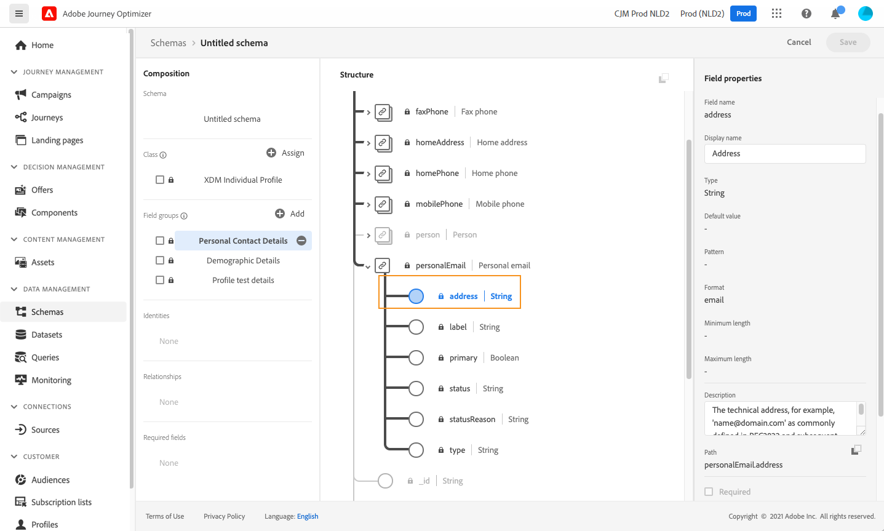
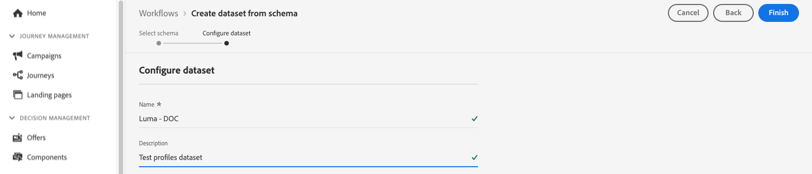
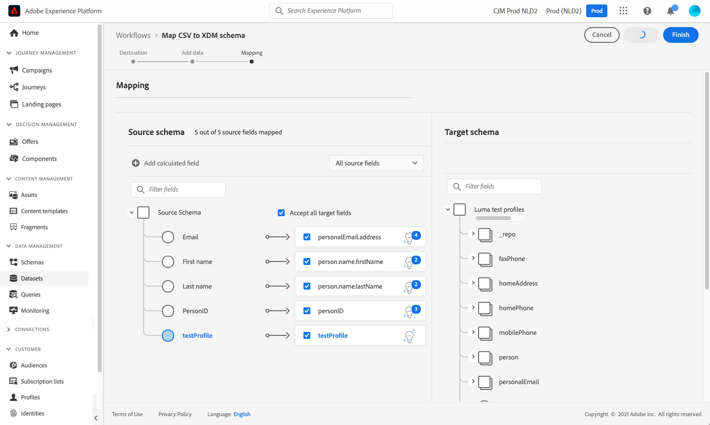
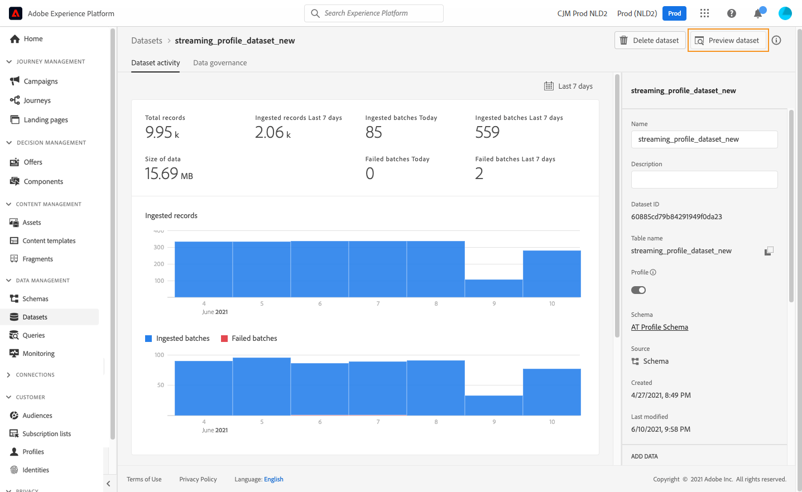

# Skapa testprofiler {#create-test-profiles}

Testprofiler krävs när [testläget](../building-journeys/testing-the-journey.md) används i en resa och när du [förhandsgranskar och testar ditt innehåll](../content-management/preview-test.md).


>[!NOTE]
>
>[!DNL Journey optimizer] tillåter att du testar olika varianter av ditt innehåll genom att förhandsgranska det och skicka korrektur med exempelindata som överförts från en CSV- eller JSON-fil, eller läggs till manuellt. [Lär dig hur du testar innehåll med exempelindata](../test-approve/simulate-sample-input.md)

Det finns flera sätt att skapa testprofiler. På den här sidan hittar du information om:

* Omvandla en [befintlig profil](#turning-profile-into-test) till en testprofil

* Skapa testprofiler genom att överföra en [CSV-fil](#create-test-profiles-csv) eller använda [API-anrop](#create-test-profiles-api).

  Adobe Journey Optimizer tillhandahåller även ett specifikt [användningsfall](#use-case-1) för produkten som underlättar skapandet av testprofiler.

Du kan överföra en JSON-fil till en befintlig datauppsättning. Mer information finns i [dokumentationen för datainmatning](https://experienceleague.adobe.com/docs/experience-platform/ingestion/tutorials/ingest-batch-data.html#add-data-to-dataset){target="_blank"}.

Observera att det liknar att skapa en testprofil att skapa vanliga profiler i Adobe Experience Platform. Mer information finns i [dokumentationen för kundprofilen i realtid](https://experienceleague.adobe.com/docs/experience-platform/profile/home.html?lang=sv){target="_blank"}.

➡️ [Lär dig skapa testprofiler i den här videon](#video)

## Förhandskrav {#test-profile-prerequisites}

Om du vill skapa profiler måste du först skapa ett schema och en datauppsättning i Adobe [!DNL Journey Optimizer].

### Skapa ett schema

Så här skapar du ett **schema**:

1. Klicka på **[!UICONTROL Schemas]** i menyavsnittet DATAHANTERING.
   
1. Klicka på **[!UICONTROL Create schema]** i det övre högra hörnet, välj en schematyp, till exempel **Individual Profile**, och klicka på **Next**.
   
1. Ange ett namn för schemat och klicka på **Slutför**.
   
1. Klicka på **Lägg till** till vänster i avsnittet **Fältgrupper** och välj rätt fältgrupper. Se till att du lägger till fältgruppen **Profiltestinformation**.
   
När du är klar klickar du på **[!UICONTROL Add field groups]**: listan med fältgrupper visas på schemaöversiktsskärmen.
   

   >[!NOTE]
   >
   >Klicka på schemats namn för att uppdatera dess egenskaper.

1. Klicka i listan med fält på det fält som du vill definiera som primär identitet.
   
1. I den högra rutan **[!UICONTROL Field properties]** kontrollerar du alternativen **[!UICONTROL Identity]** och **[!UICONTROL Primary Identity]** och väljer ett namnutrymme. Om du vill att den primära identiteten ska vara en e-postadress väljer du namnutrymmet **[!UICONTROL Email]**. Klicka på **[!UICONTROL Apply]**.
   
1. Markera schemat och aktivera alternativet **[!UICONTROL Profile]** i rutan **[!UICONTROL Schema properties]**.
   
1. Klicka på **Spara**.

>[!NOTE]
>
>Mer information om schemaskapande finns i [XDM-dokumentationen](https://experienceleague.adobe.com/docs/experience-platform/xdm/ui/resources/schemas.html#prerequisites){target="_blank"}.

### Skapa en datauppsättning

Sedan måste du **skapa datauppsättningen** som profilerna ska importeras i. Följ de här stegen:

1. Bläddra till **[!UICONTROL Datasets]** och klicka sedan på **[!UICONTROL Create dataset]**.
   
1. Välj **[!UICONTROL Create dataset from schema]**.
   
1. Markera det tidigare skapade schemat och klicka sedan på **[!UICONTROL Next]**.
   
1. Välj ett namn och klicka sedan på **[!UICONTROL Finish]**.
   
1. Aktivera alternativet **[!UICONTROL Profile]**.
   

>[!NOTE]
>
> Mer information om hur du skapar datauppsättningar finns i [dokumentationen för katalogtjänsten](https://experienceleague.adobe.com/docs/experience-platform/catalog/datasets/user-guide.html#getting-started){target="_blank"}.

## Exempel på användning i produkten{#use-case-1}

På Adobe Journey Optimizer hemsida kan du använda testprofilerna i programmet. Det här användningsexemplet underlättar skapandet av testprofiler som används för att testa resor före publicering.


Klicka på knappen **[!UICONTROL Begin]** för att starta användningsfallet.

Följande information krävs:

1. **Identitetsnamnrymd**: [Identitetsnamnrymden](../audience/get-started-identity.md) som används för att unikt identifiera testprofilerna. Om e-post till exempel används för att identifiera testprofilerna bör identitetsnamnområdet **E-post** markeras. Om den unika identifieraren är telefonnumret bör identitetsnamnområdet **Telefon** väljas.

2. **CSV-fil**: En kommaavgränsad fil som innehåller listan med testprofiler som ska skapas. Användningsfallet förväntar sig ett fördefinierat format för CSV-filen som innehåller listan med testprofiler som ska skapas. Varje rad i filen ska innehålla följande fält i rätt ordning:

   1. **Person-ID**: Unik identifierare för testprofilen. Värdena för det här fältet bör återspegla det valda identitetsnamnutrymmet. (Om till exempel **Telefon** väljs för identitetsnamnområdet bör värdena i det här fältet vara telefonnummer. Om **E-post** är markerat bör värdena i det här fältet vara e-postmeddelanden)
   1. **E-postadress**: Testa profilens e-postadress. (Fältet **Person-ID** och fältet **E-postadress** kan innehålla samma värden om **E-post** har valts som identitetsnamnrymd)
   1. **Förnamn**: Testprofilens förnamn.
   1. **Efternamn**: Testprofilens efternamn.
   1. **Ort**: Testprofilens ort i bostaden
   1. **Land**: Testa profilland för bosättning
   1. **Kön**: Testa profilkön. Tillgängliga värden är **man**, **hona** och **non_specified**

När du har valt identitetsnamnområdet och angett CSV-filen baserat på formatet ovan, väljer du knappen **[!UICONTROL Run]** längst upp till höger. Användningsexemplet kan ta några minuter att slutföra. När användningsärendet har slutförts och testprofilerna har skapats skickas ett meddelande till användaren.

>[!NOTE]
>
>Testprofiler kan åsidosätta befintliga profiler. Innan du kör användningsfallet måste du kontrollera att CSV-filen bara innehåller testprofiler och att den körs mot rätt sandlåda.

<!-- Removed as asked in DOCAC-13605 AJO Test Profiles Using a Journey should be removed
## Turn a profile into a test profile{#turning-profile-into-test}

You can turn an existing profile into a test profile: you can update profiles attributes in the same way as when you create a profile. 

A simple way to do this is by using an **[!UICONTROL Update Profile]** action activity in a journey and change the **testProfile** boolean field from false to true.

Your journey will be composed of a **[!UICONTROL Read Audience]** and an **[!UICONTROL Update Profile]** activity. You first need to create an audience targeting the profiles you want to turn into test profiles. 

>[!NOTE]
>
> Since you will be updating the **testProfile** field, the chosen profiles must include this field. The related schema must have the **Profile test details** field group. See [this section](../audience/creating-test-profiles.md#test-profiles-prerequisites).

1. Browse to **Audiences**, then **Create audience**, in the top right.
     
1. Define a name for your audience and build the audience: choose the field(s) and value(s) to target the profiles you want.
     
1. Click **Save** and check that the profiles are correctly targeted by the audience.
     

    >[!NOTE]
    >
    > Audience calculation can take some time. Learn more about audiences in [this section](../audience/about-audiences.md).

1. Now create a new journey and start with a **[!UICONTROL Read Audience]** orchestration activity.
1. Choose the previously created audience and the namespace that your profiles use.
    
1. Add an **[!UICONTROL Update Profile]** action activity. 
1. Select the schema, the **testProfiles** field, the dataset and set the value to **True**. To perform this, in the **[!UICONTROL VALUE]** field, click the **Pen** icon on the right, select **[!UICONTROL Advanced mode]** and enter **true**.
    
1. Click **[!UICONTROL Publish]**.
1. In the **[!UICONTROL Audiences]** section, check that the profiles have been correctly updated.
    

    >[!NOTE]
    >
    > For more information on the **[!UICONTROL Update Profile]** activity, refer to [this section](../building-journeys/update-profiles.md).
-->

## Skapa en testprofil med en CSV-fil{#create-test-profiles-csv}

I Adobe Experience Platform kan du skapa profiler genom att överföra en CSV-fil som innehåller de olika profilfälten till datauppsättningen. Det här är den enklaste metoden.

1. Skapa en enkel csv-fil med ett kalkylprogram.
1. Lägg till en kolumn för varje fält som behövs. Se till att du lägger till det primära identitetsfältet (&quot;personID&quot; i exemplet ovan) och att fältet&quot;testProfile&quot; har värdet&quot;true&quot;.
   
1. Lägg till en rad per profil och fyll i värdena för varje fält.
   
1. Spara kalkylbladet som en CSV-fil. Se till att kommatecken används som avgränsare.
1. Bläddra till Adobe Experience Platform **arbetsflöden**.
   
1. Välj **Mappa CSV till XDM-schema** och klicka sedan på **Starta**.
   
1. Markera den datauppsättning som du vill importera profilerna till. Klicka på **Nästa**.
   
1. Klicka på **Välj filer** och markera din CSV-fil. När filen har överförts klickar du på **Nästa**.
   
1. Mappa CSV-källfälten till schemafälten och klicka sedan på **Slutför**.
   
1. Dataimporten börjar. Statusen ändras från **Bearbetning** till **Slutfört**. Klicka på **Förhandsgranska datauppsättning** längst upp till höger.
   
1. Kontrollera att testprofilerna har lagts till korrekt.
   

Testprofilerna läggs till och kan nu användas när du testar en resa. Se [det här avsnittet](../building-journeys/testing-the-journey.md).


>[!NOTE]
>
>Mer information om csv-import finns i [dokumentationen för datainmatning](https://experienceleague.adobe.com/docs/experience-platform/ingestion/tutorials/map-a-csv-file.html#tutorials){target="_blank"}.
>


## Skapa testprofiler med API-anrop{#create-test-profiles-api}

Du kan också skapa testprofiler via API-anrop. Läs mer i [Adobe Experience Platform-dokumentation](https://experienceleague.adobe.com/docs/experience-platform/profile/home.html?lang=sv){target="_blank"}.

Du måste använda ett profilschema som innehåller fältgruppen &quot;Profiltestinformation&quot;. Flaggan testProfile ingår i den här fältgruppen.
När du skapar en profil måste du skicka värdet: testProfile = true.

Observera att du även kan uppdatera en befintlig profil för att ändra dess testProfile-flagga till &quot;true&quot;.

Här är ett exempel på ett API-anrop för att skapa en testprofil:

```
curl -X POST \
'https://dcs.adobedc.net/collection/xxxxxxxxxxxxxx' \
-H 'Cache-Control: no-cache' \
-H 'Content-Type: application/json' \
-H 'Postman-Token: xxxxx' \
-H 'cache-control: no-cache' \
-H 'x-api-key: xxxxx' \
-H 'x-gw-ims-org-id: xxxxx' \
-d '{
"header": {
"msgType": "xdmEntityCreate",
"msgId": "xxxxx",
"msgVersion": "xxxxx",
"xactionid":"xxxxx",
"datasetId": "xxxxx",
"imsOrgId": "xxxxx",
"source": {
"name": "Postman"
},
"schemaRef": {
"id": "https://example.adobe.com/mobile/schemas/xxxxx",
"contentType": "application/vnd.adobe.xed-full+json;version=1"
}
},
"body": {
"xdmMeta": {
"schemaRef": {
"contentType": "application/vnd.adobe.xed-full+json;version=1"
}
},
"xdmEntity": {
"_id": "xxxxx",
"_mobile":{
"ECID": "xxxxx"
},
"testProfile":true
}
}
}'
```

## Instruktionsvideo {#video}

Lär dig skapa testprofiler.

>[!VIDEO](https://video.tv.adobe.com/v/334236?quality=12)
