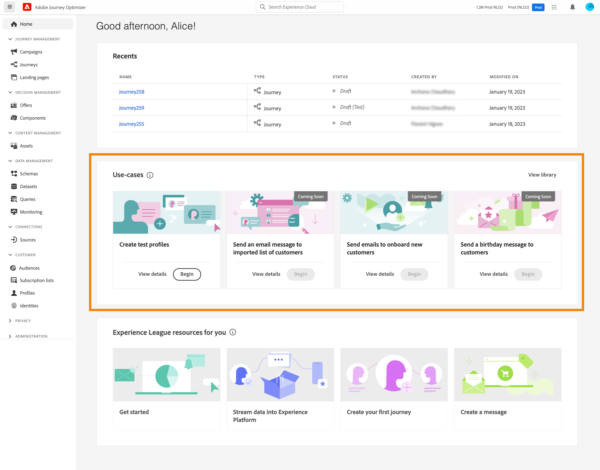
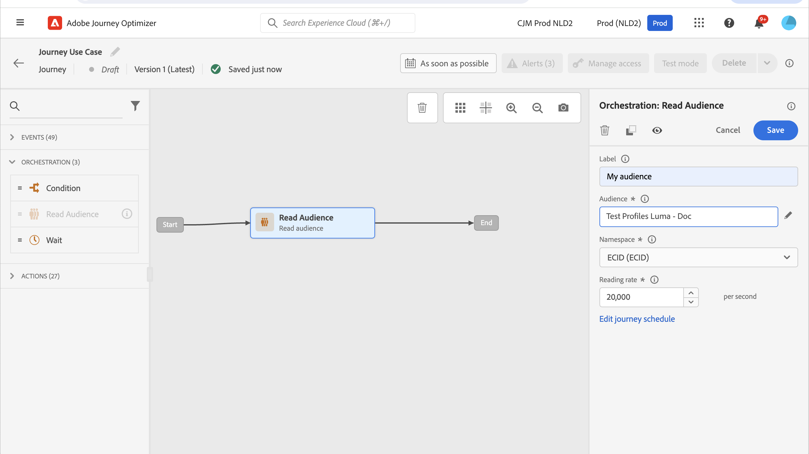

# Skapa testprofiler {#create-test-profiles}

Testprofiler krävs när du använder [testläge](../building-journeys/testing-the-journey.md) på en resa och [förhandsgranska och testa ditt innehåll](../email/preview.md).

Det finns flera sätt att skapa testprofiler. På den här sidan hittar du information om:

* Gör om en [befintlig profil](#turning-profile-into-test) till en testprofil

* Skapa testprofiler genom att överföra en [csv-fil](#create-test-profiles-csv) eller använda [API-samtal](#create-test-profiles-api).

  Förutom dessa två metoder har Adobe Journey Optimizer en [produktanvändningsfall](#use-case-1) för att underlätta skapandet av testprofiler.

Du kan också överföra en json-fil i en befintlig datauppsättning. Mer information finns i [Dokumentation om dataöverföring](https://experienceleague.adobe.com/docs/experience-platform/ingestion/tutorials/ingest-batch-data.html#add-data-to-dataset){target="_blank"}.

Observera att det liknar att skapa en testprofil att skapa vanliga profiler i Adobe Experience Platform. Mer information finns i [Kundprofildokumentation i realtid](https://experienceleague.adobe.com/docs/experience-platform/profile/home.html?lang=sv){target="_blank"}.

➡️ [Lär dig hur du skapar testprofiler i den här videon](#video)

## Förutsättningar {#test-profile-prerequisites}

För att kunna skapa profiler måste du först skapa ett schema och en datauppsättning i Adobe [!DNL Journey Optimizer].

Till **skapa ett schema** gör du så här:

1. Klicka på **[!UICONTROL Schemas]**.
   
1. Klicka **[!UICONTROL Create schema]**, i det övre högra hörnet, väljer du en schematyp, till exempel **Individuell profil** och klicka **Nästa**.
   
1. Ange ett namn för schemat och klicka på **Slutför**.
   
1. I **Fältgrupper** till vänster klickar du på **Lägg till** och välj rätt fältgrupper. Se till att du lägger till **Profiltestdetaljer** fältgrupp.
   
När du är klar klickar du **[!UICONTROL Add field groups]**: listan över fältgrupper visas på schemaöversiktsskärmen.
   

   >[!NOTE]
   >
   >Klicka på schemats namn för att uppdatera dess egenskaper.

1. I listan med fält klickar du på det fält som du vill definiera som primär identitet.
   
1. I **[!UICONTROL Field properties]** höger ruta, kontrollera **[!UICONTROL Identity]** och **[!UICONTROL Primary Identity]** och markera ett namnutrymme. Om du vill att den primära identiteten ska vara en e-postadress väljer du **[!UICONTROL Email]** namnutrymme. Klicka på **[!UICONTROL Apply]**.
   
1. Markera schemat och aktivera **[!UICONTROL Profile]** i **[!UICONTROL Schema properties]** fönster.
   
1. Klicka **Spara**.

>[!NOTE]
>
>Mer information om att skapa scheman finns i [XDM-dokumentation](https://experienceleague.adobe.com/docs/experience-platform/xdm/ui/resources/schemas.html#prerequisites){target="_blank"}.

Då måste du **skapa datauppsättningen** som profilerna ska importeras till. Följ de här stegen:

1. Bläddra till **[!UICONTROL Datasets]** och sedan klicka **[!UICONTROL Create dataset]**.
   
1. Välj **[!UICONTROL Create dataset from schema]**.
   
1. Markera det tidigare skapade schemat och klicka sedan på **[!UICONTROL Next]**.
   
1. Välj ett namn och klicka sedan på **[!UICONTROL Finish]**.
   
1. Aktivera **[!UICONTROL Profile]** alternativ.
   

>[!NOTE]
>
> Mer information om hur du skapar datauppsättningar finns i [Katalogtjänstdokumentation](https://experienceleague.adobe.com/docs/experience-platform/catalog/datasets/user-guide.html#getting-started){target="_blank"}.

## Exempel på användning i produkten{#use-case-1}

På Adobe Journey Optimizer hemsida kan du använda testprofilerna i programmet. Det här användningsexemplet underlättar skapandet av testprofiler som används för att testa resor före publicering.



Klicka på **[!UICONTROL Begin]** för att starta användningsfallet.

Följande information krävs:

1. **Namnutrymme för identitet**: [namnutrymme för identitet](../audience/get-started-identity.md) används för att unikt identifiera testprofilerna. Om e-post till exempel används för att identifiera testprofilerna, kommer identitetsnamnutrymmet **E-post** ska vara markerat. Om den unika identifieraren är telefonnumret är identitetsnamnutrymmet **Telefon** ska vara markerat.

2. **CSV-fil**: En kommaseparerad fil som innehåller listan med testprofiler som ska skapas. Användningsfallet förväntar sig ett fördefinierat format för CSV-filen som innehåller listan med testprofiler som ska skapas. Varje rad i filen ska innehålla följande fält i rätt ordning:

   1. **Person-ID**: Unik identifierare för testprofilen. Värdena för det här fältet bör återspegla det valda identitetsnamnutrymmet. (Som ett exempel, om **Telefon** är markerat för identitetsnamnutrymmet, ska värdena i det här fältet vara telefonnummer. Liknande om **E-post** är markerat och värdena i det här fältet ska vara e-post)
   1. **E-postadress**: Testa profilens e-postadress. (Med **Person-ID** -fältet och **E-postadress** kan innehålla samma värden om **E-post** är markerat som identitetsnamnutrymme)
   1. **Förnamn**: Förnamn för testprofil.
   1. **Efternamn**: Efternamn på testprofil.
   1. **Ort**: Testprofilens ort
   1. **Land**: Testprofilland
   1. **Kön**: Testprofilkön. Tillgängliga värden är **man**, **hona** och **ej angivet**

När du har valt identitetsnamnutrymmet och tillhandahållit CSV-filen baserat på formatet ovan, klickar du på **[!UICONTROL Run]** längst upp till höger. Användningsexemplet kan ta några minuter att slutföra. När användningsärendet har slutförts och testprofilerna har skapats skickas ett meddelande till användaren.

>[!NOTE]
>
>Testprofiler kan åsidosätta befintliga profiler. Innan du kör användningsfallet måste du kontrollera att CSV-filen bara innehåller testprofiler och att den körs mot rätt sandlåda.

## Förvandla en profil till en testprofil{#turning-profile-into-test}

Du kan omvandla en befintlig profil till en testprofil: du kan uppdatera profilattribut på samma sätt som när du skapar en profil.

Ett enkelt sätt är att använda en **[!UICONTROL Update Profile]** aktivitet på en resa och ändra **testProfile** booleskt fält från false till true.

Din resa kommer att bestå av en **[!UICONTROL Read Audience]** och **[!UICONTROL Update Profile]** aktivitet. Först måste ni skapa en målgrupp med de profiler ni vill omvandla till testprofiler.

>[!NOTE]
>
> Eftersom du kommer att uppdatera **testProfile** måste de valda profilerna innehålla det här fältet. Det relaterade schemat måste ha **Profiltestdetaljer** fältgrupp. Se [det här avsnittet](../audience/creating-test-profiles.md#test-profiles-prerequisites).

1. Bläddra till **Målgrupper** sedan **Skapa målgrupper**, längst upp till höger.
   
1. Definiera ett namn för målgruppen och bygg målgruppen: välj de fält och värden som ska användas för de profiler du vill ha.
   
1. Klicka **Spara** och kontrollera att profilerna har rätt målgruppsanpassning.
   

   >[!NOTE]
   >
   > Målgruppsberäkning kan ta lite tid. Läs mer om målgrupper i [det här avsnittet](../audience/about-audiences.md).

1. Skapa en ny resa och börja med en **[!UICONTROL Read Audience]** orkestreringsaktivitet.
1. Välj den målgrupp som skapats tidigare och det namnutrymme som profilerna använder.
   
1. Lägg till en **[!UICONTROL Update Profile]** Åtgärdsaktivitet.
1. Välj schemat, **testProfiles** -fältet, datauppsättningen och ange värdet till **True**. Om du vill göra det här går du till **[!UICONTROL VALUE]** klickar du på **Ritstift** ikon till höger, välj **[!UICONTROL Advanced mode]** och ange **true**.
   
1. Klicka på **[!UICONTROL Publish]**.
1. I **[!UICONTROL Audiences]** kontrollerar du att profilerna har uppdaterats korrekt.
   

   >[!NOTE]
   >
   > Mer information om **[!UICONTROL Update Profile]** aktivitet, se [det här avsnittet](../building-journeys/update-profiles.md).

## Skapa en testprofil med en CSV-fil{#create-test-profiles-csv}

I Adobe Experience Platform kan du skapa profiler genom att överföra en CSV-fil som innehåller de olika profilfälten till datauppsättningen. Det här är den enklaste metoden.

1. Skapa en enkel csv-fil med ett kalkylprogram.
1. Lägg till en kolumn för varje fält som behövs. Se till att du lägger till det primära identitetsfältet (&quot;personID&quot; i exemplet ovan) och att fältet&quot;testProfile&quot; har värdet&quot;true&quot;.
   
1. Lägg till en rad per profil och fyll i värdena för varje fält.
   
1. Spara kalkylbladet som en CSV-fil. Se till att kommatecken används som avgränsare.
1. Bläddra till Adobe Experience Platform **Arbetsflöden**.
   
1. Välj **Mappa CSV till XDM-schema** och sedan klicka **Starta**.
   
1. Markera den datauppsättning som du vill importera profilerna till. Klicka på **Nästa**.
   
1. Klicka **Välj filer** och välj en CSV-fil. När filen har överförts klickar du på **Nästa**.
   
1. Mappa CSV-källfälten till schemafälten och klicka sedan på **Slutför**.
   
1. Dataimporten börjar. Statusen ändras från **Bearbetar** till **Lyckades**. Klicka **Förhandsgranska datauppsättning**, längst upp till höger.
   
1. Kontrollera att testprofilerna har lagts till korrekt.
   

Testprofilerna läggs till och kan nu användas när du testar en resa. Se [det här avsnittet](../building-journeys/testing-the-journey.md).
>[!NOTE]
>
> Mer information om CSV-import finns i [Dokumentation om dataöverföring](https://experienceleague.adobe.com/docs/experience-platform/ingestion/tutorials/map-a-csv-file.html#tutorials){target="_blank"}.

## Skapa testprofiler med API-anrop{#create-test-profiles-api}

Du kan också skapa testprofiler via API-anrop. Läs mer i [Adobe Experience Platform-dokumentation](https://experienceleague.adobe.com/docs/experience-platform/profile/home.html?lang=sv){target="_blank"}.

Du måste använda ett profilschema som innehåller fältgruppen &quot;Profiltestinformation&quot;. Flaggan testProfile ingår i den här fältgruppen.
När du skapar en profil måste du skicka värdet: testProfile = true.

Observera att du även kan uppdatera en befintlig profil för att ändra dess testProfile-flagga till &quot;true&quot;.

Här är ett exempel på ett API-anrop för att skapa en testprofil:

```
curl -X POST \
'https://dcs.adobedc.net/collection/xxxxxxxxxxxxxx' \
-H 'Cache-Control: no-cache' \
-H 'Content-Type: application/json' \
-H 'Postman-Token: xxxxx' \
-H 'cache-control: no-cache' \
-H 'x-api-key: xxxxx' \
-H 'x-gw-ims-org-id: xxxxx' \
-d '{
"header": {
"msgType": "xdmEntityCreate",
"msgId": "xxxxx",
"msgVersion": "xxxxx",
"xactionid":"xxxxx",
"datasetId": "xxxxx",
"imsOrgId": "xxxxx",
"source": {
"name": "Postman"
},
"schemaRef": {
"id": "https://example.adobe.com/mobile/schemas/xxxxx",
"contentType": "application/vnd.adobe.xed-full+json;version=1"
}
},
"body": {
"xdmMeta": {
"schemaRef": {
"contentType": "application/vnd.adobe.xed-full+json;version=1"
}
},
"xdmEntity": {
"_id": "xxxxx",
"_mobile":{
"ECID": "xxxxx"
},
"testProfile":true
}
}
}'
```

## Instruktionsvideo {#video}

Lär dig skapa testprofiler.

>[!VIDEO](https://video.tv.adobe.com/v/334236?quality=12)
