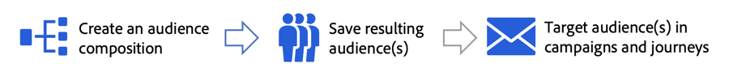
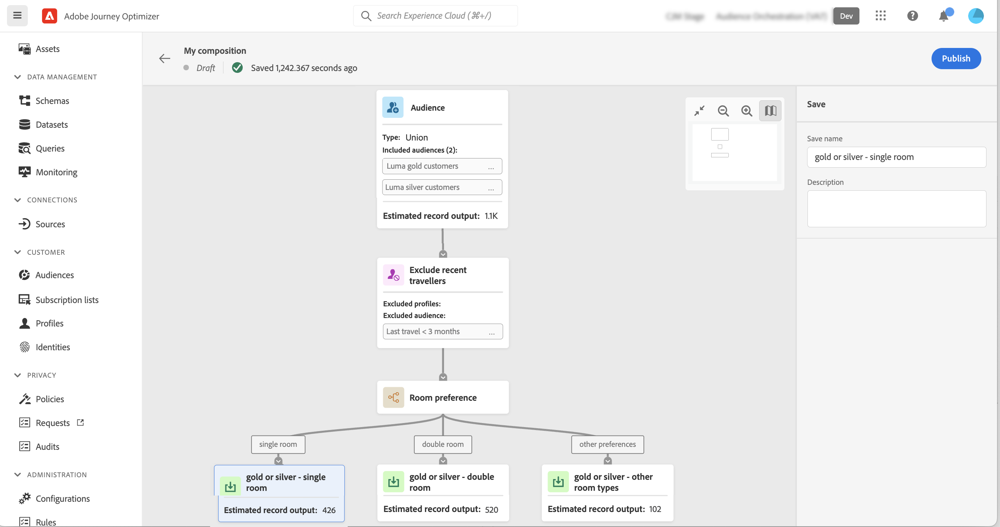

# Kom igång med målgruppsmaterial {#get-start-audience-composition}

>[!CONTEXTUALHELP]
>id="ajo_ao_create_composition"
>title="Skapa en komposition"
>abstract="Skapa ett dispositionsarbetsflöde för att kombinera befintliga Adobe Experience Platform-målgrupper till en visuell arbetsyta och utnyttja olika aktiviteter (dela, exkludera..) för att skapa nya målgrupper."

>[!CONTEXTUALHELP]
>id="ajo_ao_publish"
>title="Publicera er målgrupp"
>abstract="Publicera materialet för att spara målgrupper i Adobe Experience Platform."

>[!CONTEXTUALHELP]
>id="ajo_ao_audience"
>title="Målgruppsaktivitet"
>abstract="Med hjälp av Audience-aktiviteten kan du i din komposition inkludera ytterligare profiler som tillhör en befintlig målgrupp."

>[!CONTEXTUALHELP]
>id="ajo_ao_merge_types"
>title="Sammanfoga typer"
>abstract="Ange hur profilerna för de valda målgrupperna ska sammanfogas."

>[!CONTEXTUALHELP]
>id="ajo_ao_exclude_type"
>title="Uteslut typ"
>abstract="Använd typen Uteslut målgrupp för att exkludera profiler som tillhör en befintlig målgrupp. Med attributtypen Uteslut med kan du exkludera profiler baserat på ett specifikt attribut."

>[!CONTEXTUALHELP]
>id="ajo_ao_exclude"
>title="Exkludera aktivitet"
>abstract="Med aktiviteten Uteslut kan du utesluta profiler från kompositionen genom att välja en befintlig målgrupp eller använda en regel."

>[!CONTEXTUALHELP]
>id="ajo_ao_enrich"
>title="Berika aktivitet"
>abstract="Använd aktiviteten Enrich för att berika publiken med ytterligare attribut från Adobe Experience Platform datamängder. Du kan t.ex. lägga till information om den köpta produkten, som namn, pris eller tillverkare-ID, och använda dessa uppgifter för att anpassa de leveranser som skickas till målgruppen."

>[!CONTEXTUALHELP]
>id="ajo_ao_enrich_dataset"
>title="Datauppsättning för berikning"
>abstract="Välj den datauppsättning för berikning som innehåller de data som du vill associera med målgruppen."

>[!CONTEXTUALHELP]
>id="ajo_ao_enrich_criteria"
>title="Anrikningskriterier"
>abstract="Välj de fält som ska användas som avstämningsnyckel mellan källdatauppsättningen, dvs. målgruppen, och datauppsättningen för anrikning."

>[!CONTEXTUALHELP]
>id="ajo_ao_enrich_attributes"
>title="Attribut för berikning"
>abstract="Välj ett eller flera attribut från datauppsättningen för anrikning som ska kopplas till målgruppen. När kompositionen har publicerats är dessa attribut knutna till målgruppen och kan utnyttjas i Journey Optimizer-kampanjer för att personalisera leveranser."

>[!CONTEXTUALHELP]
>id="ajo_ao_ranking"
>title="Rankningsaktivitet"
>abstract="Med aktiviteten Rankning kan du rangordna profiler baserat på ett specifikt attribut och inkludera dem i din komposition. Ta till exempel med de 50 profilerna med det största antalet förmånspoäng."

>[!CONTEXTUALHELP]
>id="ajo_ao_rank_profilelimit_text"
>title="Lägg till profilgräns"
>abstract="Aktivera det här alternativet om du vill ange ett maximalt antal profiler som ska ingå i kompositionen."

<!-- [!CONTEXTUALHELP]
>id="ajo_ao_control_group_text"
>title="Control Group"
>abstract="Use control groups to isolate a portion of the profiles. This allows you to measure the impact of a marketing activity and make a comparison with the behavior of the rest of the population."-->

>[!CONTEXTUALHELP]
>id="ajo_ao_split"
>title="Delad aktivitet"
>abstract="Med aktiviteten Dela kan du dela upp kompositionen i flera banor. När kompositionen publiceras sparas en publik i Adobe Experience Platform för varje bana."

>[!CONTEXTUALHELP]
>id="ajo_ao_split_type"
>title="Delad text"
>abstract="Använd delningstypen Procent för att slumpmässigt dela upp profiler i flera banor. Med attributdelningstypen kan du dela profiler baserat på ett specifikt attribut."

>[!CONTEXTUALHELP]
>id="ajo_ao_split_otherprofiles_text"
>title="Andra profiler"
>abstract="Aktivera det här alternativet om du vill skapa en ytterligare sökväg med de återstående profilerna som inte matchar något av villkoren som anges i de andra sökvägarna."

>[!BEGINSHADEBOX]

Den här dokumentationen innehåller detaljerad information om hur du arbetar med målgruppsdispositioner i Adobe Journey Optimizer. Om du bara är kund i realtidsprofilen och inte använder Adobe Journey Optimizer [klickar du här](https://experienceleague.adobe.com/docs/experience-platform/segmentation/ui/audience-composition.html){target="_blank"}.

>[!ENDSHADEBOX]

Med målgruppskomposition kan du skapa **kompositionsarbetsflöden**, där du kan kombinera befintliga Adobe Experience Platform-målgrupper till en visuell arbetsyta och utnyttja olika aktiviteter (dela, exkludera..) för att skapa nya målgrupper.

När det är klart sparas de **resulterande målgrupperna** tillbaka till Adobe Experience Platform tillsammans med befintliga målgrupper och kan utnyttjas i Journey Optimizer kampanjer och resor till målkunder. Lär dig målinrikta målgrupper i Journey Optimizer

>[!IMPORTANT]
>
>* Användningen av målgrupper och attribut från målgruppssammansättning är för närvarande inte tillgänglig för användning med hälso- och sjukvårdsskölden eller skölden för skydd av privatlivet och säkerheten.
>
>* Anrikningsattribut är ännu inte integrerade med policystyrningen. Därför kommer de etiketter för dataanvändning som du använder för dina anrikningsattribut inte att användas i Journey Optimizer kampanjer eller resor.

Målgruppskomposition finns på Adobe Journey Optimizer **[!UICONTROL Audiences]**-menyn:

* Fliken **[!UICONTROL Overview]** innehåller en dedikerad instrumentpanel med nyckelvärden som är relaterade till organisationens målgruppsdata. Mer information finns i [Adobe Experience Platform Dashboards guide](https://experienceleague.adobe.com/docs/experience-platform/dashboards/guides/segments.html).

* Fliken **[!UICONTROL Browse]** visar alla befintliga målgrupper som lagras i Adobe Experience Platform.

* På fliken **[!UICONTROL Compositions]** kan du skapa kompositionsarbetsflöden där du kan kombinera och ordna målgrupper för att skapa nya.

## Skapa ett dispositionsarbetsflöde {#create}

Så här skapar du ett dispositionsarbetsflöde:

1. Gå till menyn **[!UICONTROL Audiences]** och välj **[!UICONTROL Create Audience]**.

1. Välj **[!UICONTROL Compose Audience]**.

   

1. Arbetsytan i kompositionen visas med två standardaktiviteter:

   * **[!UICONTROL Audience]**: startpunkten för kompositionen. Med den här aktiviteten kan du välja en eller flera målgrupper som grund för ditt arbetsflöde,

   * **[!UICONTROL Save]**: det sista steget i kompositionen. Med den här aktiviteten kan du spara resultatet av arbetsflödet till en ny målgrupp.

1. Öppna dispositionsegenskaperna för att ange en titel och en beskrivning.

   Om ingen titel har definierats i egenskaperna ställs kompositionens etikett in på &quot;Disposition&quot; följt av datum och tid då den skapades.

   

1. Konfigurera kompositionen genom att lägga till så många aktiviteter som behövs mellan **[!UICONTROL Audience]** och **[!UICONTROL Save]** aktiviteter. Mer information om hur du skapar en komposition finns i [dokumentationen om målgruppskomposition](https://experienceleague.adobe.com/en/docs/experience-platform/segmentation/ui/audience-composition).

   

1. När kompositionen är klar klickar du på knappen **[!UICONTROL Publish]** för att publicera kompositionen och spara målgrupperna i Adobe Experience Platform.

   >[!IMPORTANT]
   >
   >Du kan publicera upp till 10 kompositioner i en given sandlåda. Om du har nått det här tröskelvärdet måste du ta bort en disposition för att frigöra utrymme och publicera en ny.

   Om något fel inträffar under publiceringen visas varningar med information om hur du löser problemet.

   

1. Dispositionen publiceras. Målgrupperna sparas i Adobe Experience Platform och kan nu användas i Journey Optimizer. [Lär dig målinrikta målgrupper i Journey Optimizer](../audience/about-audiences.md#segments-in-journey-optimizer)

>[!NOTE]
>
>Målgrupper från **målgruppskomposition** körs dagligen, så du kan behöva vänta upp till 24 timmar på att använda dem i Journey Optimizer. Förbättrade attribut i målgrupper för målgruppssammansättning är lika fräscha som den senaste kompositionen, som kan vara upp till 24 timmar tidigare.

## Åtkomst till kompositioner {#access}

Alla skapade kompositioner kan nås från fliken **[!UICONTROL Compositions]**. Du kan när som helst duplicera eller ta bort en befintlig komposition med hjälp av ellipsknappen i listan.

Kompositioner kan ha flera statusvärden:

* **[!UICONTROL Draft]**: kompositionen pågår och har inte publicerats.
* **[!UICONTROL Published]**: kompositionen har publicerats, resulterande målgrupper har sparats och är tillgängliga för användning.

>[!NOTE]
>
>Målgruppskomposition är för närvarande inte integrerat med funktionen för återställning av sandlådor. Innan du initierar en sandlådeåterställning måste du ta bort dina kompositioner manuellt för att se till att de associerade målgruppsdata rensas ordentligt. Detaljerad information finns i Adobe Experience Platform [sandlådedokumentation](https://experienceleague.adobe.com/docs/experience-platform/sandbox/ui/user-guide.html#delete-audience-compositions)
