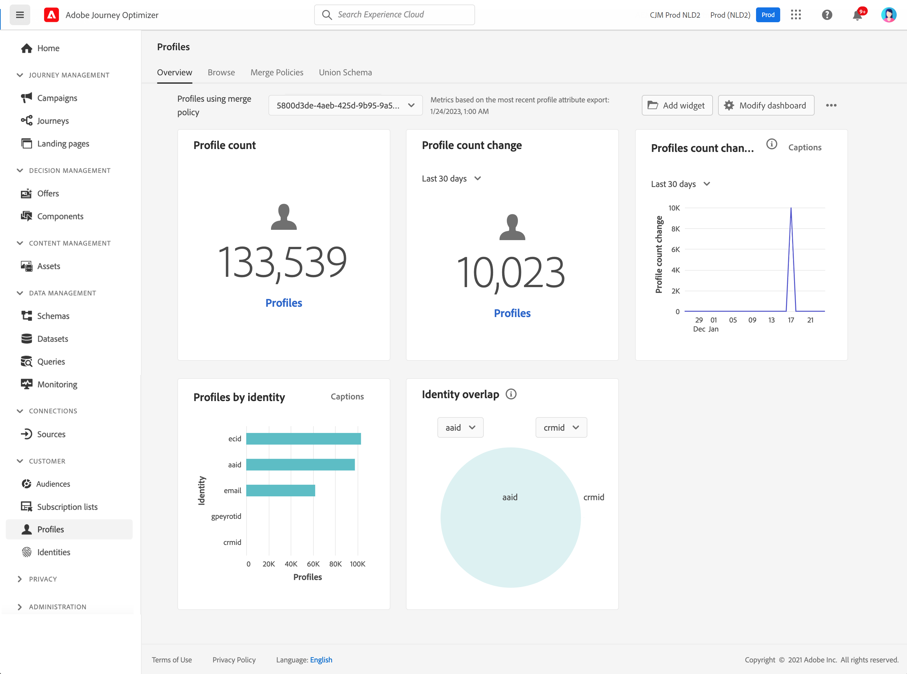

# Kom igång med profiler {#profiles-gs}

## Om profiler

Utnyttja kundprofilen i realtid i [!DNL Adobe Journey Optimizer] för att få en helhetsbild av varje enskild kund genom att kombinera data från flera kanaler, inklusive online, offline, CRM och tredje part. Med **profiler** kan du konsolidera dina kunddata till en enhetlig vy som ger ett åtgärdbart, tidsstämplat konto för varje kundinteraktion.

➡️ [Upptäck den här funktionen i videon](#video)

**Kundprofil i realtid &#x200B;**

Integrera kundattribut och händelser från online, offline och pseudonyma källor i en enda enhetlig profil. &#x200B;Använd profilen för att engagera kunder med personaliserade upplevelser i realtid över flera kontaktytor. &#x200B;

**Datainmatning**

Koppla samman med olika datakällor för att importera beteendedata, transaktionsdata, finansiella data och driftdata. Hämta in data i realtid eller batchvis för att hålla profilerna uppdaterade. &#x200B;

**Identitetsdiagram**

Kombinera data från olika källor med hjälp av kundidentiteter, som lojalitets-ID:n eller system-ID:n för CRM. &#x200B;Skapa en heltäckande bild av kunden genom att mappa relationer mellan olika identiteter inom ett varumärkes datauppsättningar. &#x200B;

**Kundengagemang**

Använd kundprofilen i realtid för att leverera kontextuella, personaliserade upplevelser, som riktade erbjudanden och budskap. &#x200B;Engagera kunder i olika kanaler, inklusive marknadsföringskampanjer, kundsupport och transaktionsuppdateringar. &#x200B;

**Datadelning**

Dela kundprofiler med ledande molnlagringsleverantörer som Amazon Web Services, Microsoft Azure och Google Cloud. Använd delade profiler för rapportering, dataarkivering eller djupare analyser med verktyg för affärsinformation.

## Kontrollpanel för profiler

Om du vill komma åt profiler går du till menyn **[!UICONTROL Customer]** / **[!UICONTROL Profiles]** i den vänstra navigeringsrutan.

>[!NOTE]
>
>Om din organisation inte har använt [!DNL Adobe Journey Optimizer] tidigare och ännu inte har några aktiva profildatauppsättningar eller sammanfogningsprinciper skapade, visas inte instrumentpanelen för **profiler**. I stället visar fliken **Översikt** länkar till Adobe Experience Platform-dokumentation som hjälper dig att komma igång med kundprofilen i realtid. Mer information om hur du arbetar med **profilkontrollpanelen** och detaljerad information om mätvärden som visas på kontrollpanelen finns i [det här avsnittet](https://experienceleague.adobe.com/docs/experience-platform/profile/ui/user-guide.html){target="_blank"}.

Ni kan sammanföra databygment från flera olika källor och kombinera dem för att få en fullständig bild av varje enskild kund. När du sammanför dessa data är sammanfogningsprinciper de regler som används för att bestämma hur data ska prioriteras och vilka data som ska kombineras för att skapa den enhetliga vyn. Läs mer om **Sammanfoga profiler** i den här [dokumentationen](https://experienceleague.adobe.com/docs/experience-platform/profile/merge-policies/ui-guide.html){target="_blank"}.

>[!MORELIKETHIS]
>
>* [Kundprofildokumentation i realtid](https://experienceleague.adobe.com/docs/experience-platform/query/home.html?lang=sv){target="_blank"}
>* [Översikt över kundprofiler i realtid ](https://experienceleague.adobe.com/docs/experience-platform/profile/home.html?lang=sv){target="_blank"}

## Instruktionsvideo {#video}

Lär dig hur Adobe Experience Platform sammanställer och uppdaterar kundprofiler i realtid och hur du kan komma åt och använda dessa profiler.

>[!VIDEO](https://video.tv.adobe.com/v/27251?quality=12)
