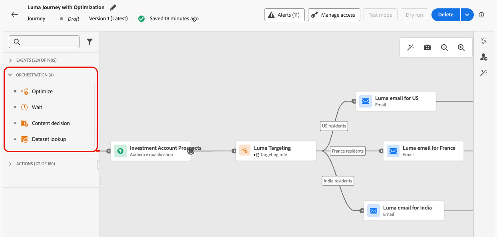

# Kom igång med reseaktiviteter {#about-journey-activities}

Kombinera de olika händelserna, samordningen och åtgärderna för att skapa flerstegsscenarier för olika kanaler.

## Händelseaktiviteter {#event-activities}

Personaliserade resor utlöses av händelser, t.ex. ett onlineköp. När en profil går in på en resa förflyttas de som en individ, och inga två personer följer med på samma hastighet eller längs samma väg. När du påbörjar en resa med en händelse utlöses resan när händelsen tas emot. Varje person på resan följer sedan, individuellt, de steg som definieras på din resa.

Händelser som konfigurerats av den tekniska användaren (se [den här sidan](../event/about-events.md)) visas alla i den första kategorin på paletten, till vänster på skärmen. Följande händelseaktiviteter är tillgängliga:

* [Allmänna händelser](../building-journeys/general-events.md)
* [Reaktion](../building-journeys/reaction-events.md)
* [Målgruppskvalifikation](../building-journeys/audience-qualification-events.md)

Dra och släpp en händelseaktivitet för att starta din resa. Du kan också dubbelklicka på den.

## Orchestration-verksamhet {#orchestration-activities}

Orchestration-aktiviteter är olika villkor som hjälper till att bestämma nästa steg i resan. Dessa villkor kan vara huruvida personen har ett öppet supportärende, väderprognosen på sin aktuella plats, om de slutfört ett köp eller om de uppnått 10 000 förmånspoäng.

På paletten till vänster på skärmen finns följande orkestreringsfunktioner:

<!--* [Optimize](optimize.md)-->
* [Läs målgrupp](read-audience.md)
* [Vänta](wait-activity.md)
* [Innehållsbeslut](content-decision.md)
* [Datauppsättningssökning](dataset-lookup.md)

## Åtgärdsaktiviteter {#action-activities}

Åtgärder är vad du vill ska hända som ett resultat av någon typ av utlösare, som att skicka ett meddelande. Det är den del av resan som kundupplevelsen innebär.

På paletten, till vänster på skärmen, under **[!UICONTROL Events]** och **[!UICONTROL Orchestration]**, hittar du kategorin **[!UICONTROL Actions]**. Följande åtgärdsaktiviteter är tillgängliga:

* [Inbyggda kanalåtgärder](../building-journeys/journeys-message.md)
* [Anpassade åtgärder](../building-journeys/using-custom-actions.md)
* [Hoppa](../building-journeys/jump.md)

Dessa aktiviteter representerar olika tillgängliga kommunikationskanaler. Du kan kombinera dem för att skapa ett flerkanalsscenario.

Du kan också ange specifika åtgärder för att skicka meddelanden:

* Om du använder ett tredjepartssystem för att skicka meddelanden kan du skapa en specifik anpassad åtgärd. [Läs mer](../action/action.md)

* Om du arbetar med Campaign och Journey Optimizer, se följande avsnitt:

   * [[!DNL Journey Optimizer] och Campaign v7/v8](../action/acc-action.md)
   * [[!DNL Journey Optimizer] och Campaign Standard](../action/acs-action.md)
   * [[!DNL Journey Optimizer] och Marketo Engage](../action/marketo-engage.md)

## Bästa praxis {#best-practices}

### Lägga till en etikett

De flesta aktiviteter gör att du kan definiera en **[!UICONTROL Label]**. Detta lägger till ett suffix till namnet som visas under din aktivitet på arbetsytan. Detta är användbart om du använder samma aktivitet flera gånger under resan och vill identifiera dem enklare. Det underlättar även felsökning vid fel och gör rapporter enklare att läsa. Du kan också lägga till en valfri **[!UICONTROL Description]**.

>[!NOTE]
>
>För vissa aktiviteter visas även deras ID i rutan. Detta ID kan användas vid rapportering som en mer stabil nyckel än etiketten, som kan ändras.

### Hantera avancerade parametrar {#advanced-parameters}

De flesta aktiviteter visar ett antal avancerade och/eller tekniska parametrar som du inte kan ändra.

För bättre läsbarhet kan du dölja de här parametrarna med knappen **[!UICONTROL Hide read-only fields]** överst i den högra rutan.

I vissa specifika sammanhang kan du åsidosätta parametrarnas värden för specifik användning. Om du vill framtvinga ett värde klickar du på ikonen **[!UICONTROL Enable parameter override]** till höger om fältet. [Läs mer](../configuration/primary-email-addresses.md#journey-parameters)

>[!NOTE]
>
>Om de avancerade parametrarna är dolda klickar du på knappen **[!UICONTROL Show read-only fields]**
>
>{width=60%}

### Lägg till en alternativ sökväg

När ett fel inträffar i en åtgärd eller ett villkor upphör en individs resa. Det enda sättet att få den att fortsätta är att markera rutan **[!UICONTROL Add an alternative path in case of a timeout or an error]**. Se [det här avsnittet](../building-journeys/using-the-journey-designer.md#paths).

## Felsökning {#troubleshooting}

Kontrollera att alla aktiviteter är konfigurerade korrekt innan du testar och publicerar din resa. Du kan inte utföra tester eller publikationer om fel fortfarande upptäcks av systemet.

Lär dig hur du felsöker fel i aktiviteter och under resan [på den här sidan](troubleshooting.md).

Se även **[Övervakning och felsökning](/help/rp_landing_pages/troubleshoot-journey-landing-page.md)**.
