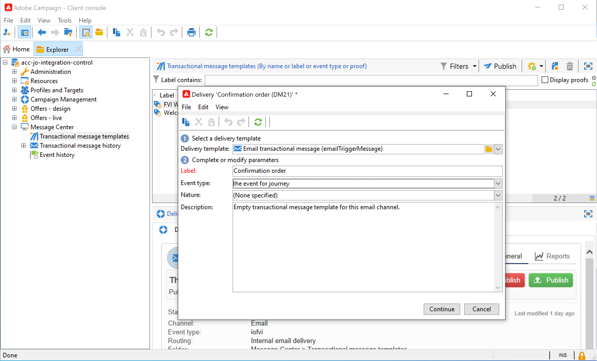
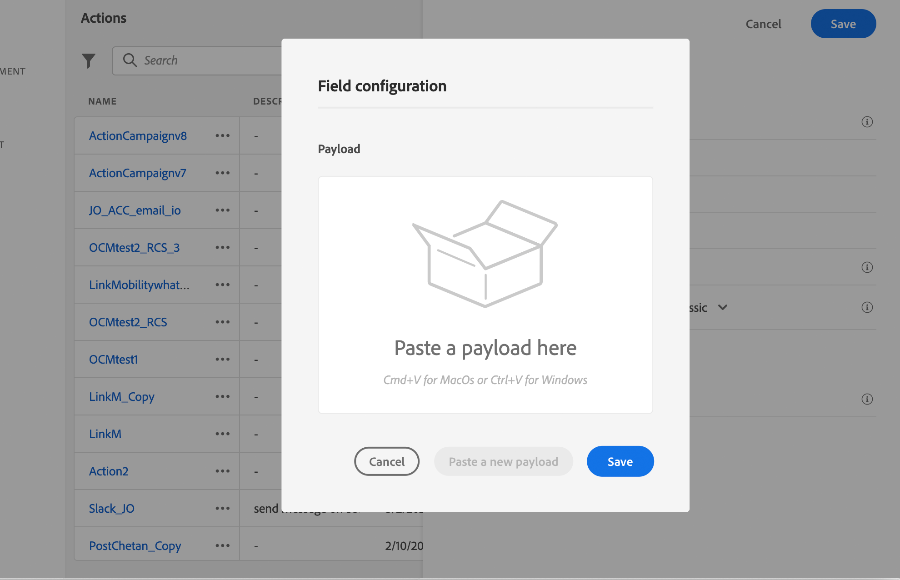

# Skicka ett meddelande med Campaign v7/v8 {#campaign-v7-v8-use-case}

I det här användningsexemplet förklaras alla steg som krävs för att skicka e-post med hjälp av integreringen med Adobe Campaign v7 och Adobe Campaign v8.

>[!NOTE]
>
>För att kunna använda den här integreringen måste du ha Campaign v7/v8 build 9125 eller senare.

Skapa först en transaktionell e-postmall i Campaign. I Journey Optimizer kan du sedan skapa event, action och designa kundresan.

Mer information om Campaign-integrationen finns på följande sidor:

* [Skapa en kampanjåtgärd](../action/acc-action.md)
* [Använda åtgärden i en resa](../building-journeys/using-adobe-campaign-v7-v8.md).

**Adobe Campaign**

Din Campaign-instans måste etableras för den här integreringen. Funktionen för transaktionsmeddelanden måste konfigureras.

1. Logga in på din Campaign-kontrollinstans.

1. Välj uppräkningen **Event type** (eventType) under **Administration** > **Platform** > **Enumerations**. Skapa en ny händelsetyp (&quot;travel-event&quot;, i vårt exempel). Använd händelsetypens interna namn när du skriver JSON-filen senare.

   

1. Koppla från och återanslut till instansen för att skapa.

1. Skapa en ny e-postmall baserad på den händelsetyp som skapats tidigare under **Meddelandecenter** > **Mallar för transaktionsmeddelanden**.

   

1. Designa din mall. I det här exemplet tillämpas personalisering på profilens förnamn och ordernummer. Förnamnet finns i Adobe Experience Platform datakälla och ordernumret är ett fält från händelsen Journey Optimizer. Se till att du använder rätt fältnamn i Campaign.

   

1. Publicera din transaktionsmall.

   

1. Skriv den JSON-nyttolast som motsvarar mallen.

```
{
     "channel": "email",
     "eventType": "journey-event",
     "email": "Email address",
     "ctx": {
          "firstName": "First name", "purchaseOrderNumber": "Purchase order number"
     }
}
```

* För kanalen måste du skriva&quot;email&quot;.
* Använd det interna namnet för händelsetypen som skapades tidigare för eventType.
* E-postadressen blir en variabel, så du kan skriva vilken etikett som helst.
* I ctx är även personaliseringsfälten variabler.

**Journey Optimizer**

1. Skapa en händelse. Inkludera fältet&quot;purchaseOrderNumber&quot;.

   

1. Skapa en åtgärd i Journey Optimizer som motsvarar er Campaign-mall. I listrutan **Åtgärdstyp** väljer du **Adobe Campaign Classic**.

   

1. Klicka på **Nyttolastfältet** och klistra in den JSON som skapades tidigare.

   

1. Ändra **Konstant** till **Variabel** för e-postadressen och de två anpassningsfälten.

   

1. Skapa nu en ny resa och börja med det event som skapats tidigare.

   

1. Lägg till åtgärden och mappa varje fält till rätt fält i Journey Optimizer.

   

1. Testa din resa.

   

1. Nu kan du publicera din resa.
