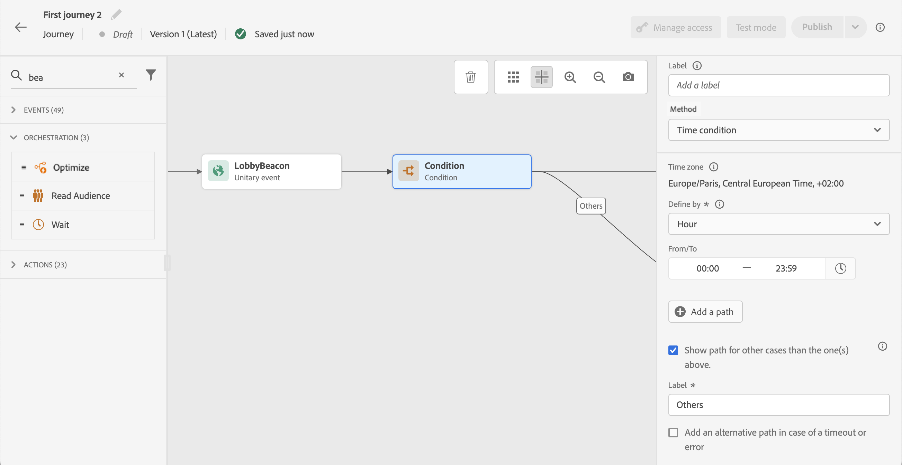
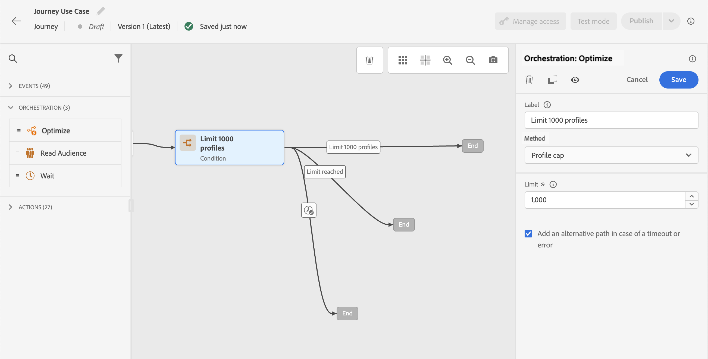

# Villkorsaktivitet {#condition-activity}

## Lägg till en villkorsaktivitet {#add-condition-activity}

>[!CONTEXTUALHELP]
>id="ajo_journey_condition"
>title="Villkorsaktivitet"
>abstract="Med aktiviteten **Villkor** kan du definiera hur enskilda personer ska gå igenom din resa genom att skapa flera sökvägar baserat på specifika kriterier. Du kan också konfigurera en alternativ sökväg för att hantera timeout eller fel, vilket ger en smidig upplevelse."

Med aktiviteten **Villkor** kan du definiera hur enskilda personer ska gå igenom din resa genom att skapa flera sökvägar baserat på specifika kriterier. Du kan också konfigurera en alternativ sökväg för att hantera timeout eller fel, vilket ger en smidig upplevelse.

Följande typer av villkor är tillgängliga:

* [Data, Source-villkor](#data_source_condition)
* [Tidsvillkor](#time_condition)
* [Procentandel av delning](#percentage_split)
* [Datumvillkor](#date_condition)
* [Profilände](#profile_cap)

Du kan också använda en målgrupp i ett resevillkor. [Läs mer](#using-a-segment)

>[!NOTE]
>
>Villkorsutvärderingen misslyckas för profiler som innehåller fler än två enhetsidentiteter i [profilarkivet](https://experienceleague.adobe.com/docs/experience-platform/profile/home.html#profile-data-store){target="_blank"}.

## Lägga till och hantera villkorssökvägar {#about_condition}

>[!CONTEXTUALHELP]
>id="ajo_journey_expression_simple"
>title="Om den enkla uttrycksredigeraren"
>abstract="I redigeringsläget för enkla uttryck kan du utföra enkla frågor baserat på en kombination av fält. Alla tillgängliga fält visas till vänster på skärmen. Dra och släpp fält till huvudzonen. Om du vill kombinera de olika elementen, låser du ihop dem till varandra för att skapa olika grupper och/eller gruppnivåer. Du kan sedan välja en logisk operator för att kombinera element på samma nivå."

När du använder flera villkor under en resa kan du definiera etiketter för var och en av dem för att lättare kunna identifiera dem.

Klicka på **[!UICONTROL Add a path]** om du vill definiera flera villkor. För varje villkor läggs en ny bana till på arbetsytan efter aktiviteten.

Observera att utformningen av resorna har funktionell inverkan. När flera sökvägar definieras efter ett villkor kommer endast den första giltiga sökvägen att köras. Det innebär att du kan ändra prioriteringen av banor genom att placera dem över eller under varandra.

Låt oss ta exemplet med den första sökvägens villkor &quot;Personen är en VIP&quot; och en andra sökvägs villkor &quot;Personen är en man&quot;. Om en person som uppfyller båda villkoren (en man som är VIP) klarar det här steget väljs den första vägen även om den personen också är berättigad till den andra, eftersom den första sökvägen är &quot;ovan&quot;. Om du vill ändra den här prioriteten flyttar du dina aktiviteter i en annan lodrät ordning.

Du kan skapa en annan sökväg för målgrupper som inte uppfyller de definierade villkoren genom att markera **[!UICONTROL Show path for other cases than the one(s) above]**. Observera att det här alternativet inte är tillgängligt vid delning. Se [Procentandel av delning](#percentage_split).

I det enkla läget kan du utföra enkla frågor baserat på en kombination av fält. Alla tillgängliga fält visas till vänster på skärmen. Dra och släpp fält till huvudzonen. Om du vill kombinera de olika elementen, låser du ihop dem till varandra för att skapa olika grupper och/eller gruppnivåer. Du kan sedan välja en logisk operatör för att kombinera element på samma nivå:

* OCH: en korsning av två kriterier. Endast de element som uppfyller alla villkor beaktas.
* ELLER: en förening av två kriterier. Element som matchar minst ett av de två villkoren beaktas.

Om du använder [Adobe Experience Platform segmenteringstjänst](https://experienceleague.adobe.com/docs/experience-platform/segmentation/home.html){target="_blank"} för att skapa dina målgrupper kan du utnyttja dem under dina reseförhållanden. Se [Använda målgrupp i villkor](../building-journeys/condition-activity.md#using-a-segment).

>[!NOTE]
>
>Du kan inte utföra frågor på tidsserier (till exempel en lista över inköp, tidigare klick på meddelanden) med den enkla redigeraren. För detta behöver du den avancerade redigeraren. Läs [den här sidan](expression/expressionadvanced.md).

När ett fel inträffar i en åtgärd eller ett villkor upphör en individs resa. Det enda sättet att få den att fortsätta är att markera rutan **[!UICONTROL Add an alternative path in case of a timeout or an error]**. Se [det här avsnittet](../building-journeys/using-the-journey-designer.md#paths).

I den enkla redigeraren hittar du även kategorin Reseegenskaper, nedanför kategorierna event och datakälla. Denna kategori innehåller tekniska fält som rör resan för en viss profil. Det här är den information som hämtats av systemet från direktresor, till exempel rese-ID:t eller de specifika fel som påträffats. [Läs mer](expression/journey-properties.md)

## Source-villkor för data {#data_source_condition}

Använd en **[!UICONTROL Data Source condition]** för att definiera ett villkor baserat på fält från datakällorna eller händelser som tidigare placerats under resan. Den här typen av villkor definieras med uttrycksredigeraren. Lär dig hur du använder uttrycksredigeraren i [det här avsnittet](expression/expressionadvanced.md).

Om du till exempel riktar dig till en målgrupp med anrikningsattribut som genererats med ett dispositionsarbetsflöde eller en anpassad uppladdning (CSV-fil), kan du använda dessa anrikningsattribut för att bygga upp ditt villkor.

>[!IMPORTANT]
>
>**Hantera saknade eller ej inkapslade attribut**
>
>Om ett schemafält definieras i ditt profilschema men inga data har importerats för det fältet tolkar Journey Optimizer och den underliggande kundprofilen i realtid fältet som `null`. Därför utvärderas villkor som söker efter `isEmpty()`, `isNull()` eller liknande funktioner till `true` även om attributet aldrig har importerats. Detta kan leda till oväntat resebeteende om du inte är medveten om att fältet saknar data.
>
>För att undvika förvirring bör du se till att attributen som du använder i villkorsuttryck har importerats med faktiska data innan profilen kommer in på resan. Du kan verifiera attributvärden i [kundprofilen i realtid](https://experienceleague.adobe.com/docs/experience-platform/profile/home.html?lang=sv){target="_blank"} för att bekräfta om det finns data för fälten som används i dina villkor.

Med den avancerade uttrycksredigeraren kan du ställa in mer avancerade villkor för att hantera samlingar eller använda datakällor som kräver att parametrar skickas. [Läs mer](../datasource/external-data-sources.md).

## Tidsvillkor {#time_condition}

Använd en **[!UICONTROL Time condition]** för att utföra olika åtgärder beroende på timmen på dagen och/eller veckodagen. Du kan till exempel bestämma dig för att skicka push-meddelanden under dagtid och e-postmeddelanden på natten under vardagar.

>[!NOTE]
>
>* Tidszonen är inte specifik för ett villkor och definieras på färdsnivå i reseegenskaperna. Läs mer på [den här sidan](../building-journeys/timezone-management.md).
>
>* Som standard anges **[!UICONTROL Time condition]** som timma, från 00:00 till 12:00.

Tre filtreringsalternativ är tillgängliga:

* Timme: gör att du kan ställa in ett villkor baserat på tidpunkten på dagen. Sedan definierar du start- och sluttider. Enskilda personer anger bara sökvägen under det angivna timintervallet.
* Veckodag: gör att du kan ställa in ett villkor baserat på veckodag. Sedan väljer du vilka dagar du vill att enskilda personer ska ange sökvägen.
* Veckodag och timma: det här alternativet kombinerar de två första alternativen.

## Procentdelning {#percentage_split}

Med det här alternativet kan du slumpmässigt dela målgruppen för att definiera olika åtgärder för varje grupp. Definiera antalet delningar och partitioneringen för varje sökväg. Delningsberäkningen är statistisk eftersom systemet inte kan förutse hur många personer som kommer att flöda i den här kundresan. Därför har delningen en mycket låg felmarginal. Den här funktionen är baserad på en slumpmässig Java-mekanism (se den här [sidan](https://docs.oracle.com/javase/7/docs/api/java/util/Random.html){target="_blank"}).

I testläge väljs alltid den översta grenen när en delning nås. Du kan ordna om placeringen av de delade grenarna om du vill att testet ska välja en annan bana. Se [den här sidan](../building-journeys/testing-the-journey.md)

>[!NOTE]
>
>Observera att det inte finns någon knapp för att lägga till en bana i det procentuella delningsvillkoret. Antalet banor beror på antalet delningar. I delningsvillkor kan du inte lägga till en sökväg för andra fall eftersom det inte kan ske. Folk kommer alltid att gå in på en av de delade vägarna.

## Datumvillkor {#date_condition}

På så sätt kan du definiera ett annat flöde baserat på datumet. Om personen till exempel anger steget under&quot;försäljningsperioden&quot; skickar du ett specifikt meddelande till dem. Resten av året skickar du ett nytt meddelande.

>[!NOTE]
>
>Tidszonen är inte längre specifik för ett villkor och har nu definierats på färdsnivå i färdegenskaperna. Läs [den här sidan](../building-journeys/timezone-management.md).

## Profilände {#profile_cap}

Använd den här villkorstypen om du vill ange ett maximalt antal profiler för en resebana. När den här gränsen nås får de inmatade profilerna en alternativ sökväg. På så sätt kan du vara säker på att dina resor aldrig överskrider den definierade gränsen.

>[!NOTE]
>
>Vi rekommenderar att du definierar ett högt profiltak. Precisionen och sannolikheten för att en population kommer att nå det exakta högsta tillåtna talet ökar bara när det övre gränsvärdet ökar. För små tal (till exempel ett tak på 50) kommer siffrorna inte alltid att matcha upp eftersom gränsen kanske inte nås innan profilerna använder en alternativ sökväg.

<!--You can use this condition type to ramp up the volume of your deliveries. See this [use case](ramp-up-deliveries-uc.md).-->

Standardvärdet är 1 000.

Räknaren gäller bara för den valda reseversionen. Räknaren återställs till noll när resan dupliceras eller när en ny version skapas. Efter en återställning tar de infogade profilerna den nominella sökvägen igen tills räknargränsen nås.

När en övre profil definieras för en återkommande resa återställs inte räknaren efter varje upprepning.

Den nominella banan har alltid företräde framför den alternativa banan, även om du flyttar den alternativa banan ovanför den nominella banan på arbetsytan.

Här följer de tröskelvärden som ska beaktas för att se till att gränsvärdet uppnås:

* För ett lock som är större än 10 000 måste antalet distinkta profiler som ska injiceras vara minst 1,3 gånger det.
* För en kapsyl under 10 000 måste antalet distinkta profiler som ska injiceras vara 1 000 plus kapsylen.

Profilände beaktas inte i testläge.

## Använda målgrupper under förhållanden {#using-a-segment}

I det här avsnittet beskrivs hur du använder en målgrupp i ett resevillkor. Mer information om målgrupper och hur du skapar dem finns i [det här avsnittet](../audience/about-audiences.md).

Följ de här stegen för att använda en målgrupp i ett resevillkor:

1. Öppna en resa, släpp en **[!UICONTROL Condition]**-aktivitet och välj **Data Source Condition**.

   

1. Klicka på **[!UICONTROL Add a path]** för varje extra sökväg som behövs. Klicka på fältet **[!UICONTROL Expression]** för varje sökväg.

1. Till vänster kan du visa **[!UICONTROL Audiences]**-noden. Dra och släpp den målgrupp du vill använda för ditt villkor. Som standard är villkoret för målgruppen sant.

   

   >[!NOTE]
   >
   >Observera att endast de personer som har **Realiserad**-målgruppsdeltagarstatus kommer att betraktas som medlemmar av målgruppen. Mer information om hur du utvärderar en målgrupp finns i [dokumentationen för segmenteringstjänsten](https://experienceleague.adobe.com/docs/experience-platform/segmentation/tutorials/evaluate-a-segment.html#interpret-segment-results){target="_blank"}.
