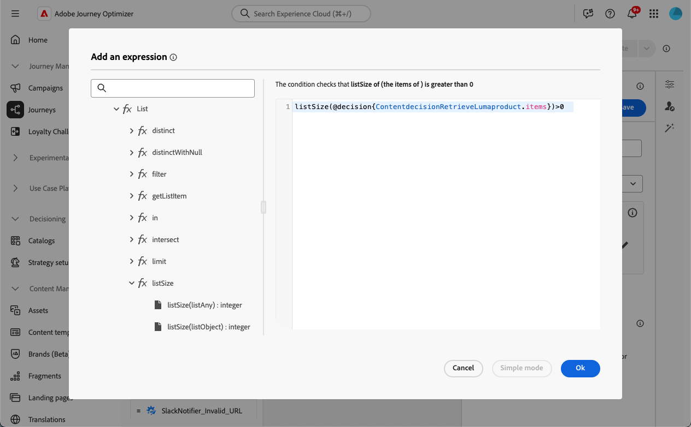

# Aktivitet för innehållsbeslut {#content-decision}

>[!AVAILABILITY]
>
>Den här funktionen är bara tillgänglig för en uppsättning organisationer (begränsad tillgänglighet) och kommer att lanseras globalt i en framtida version.

Med [!DNL Journey Optimizer] kan du inkludera erbjudanden på dina resor via den dedikerade **innehållsbeslutsuppgiften** på arbetsytan för resan. Du kan sedan lägga till andra aktiviteter (till exempel [anpassade åtgärder](../action/about-custom-action-configuration.md)) på dina resor för att rikta in dig på dina målgrupper med dessa personaliserade erbjudanden.

>[!NOTE]
>
>Det går inte att använda utdata från en innehållsbeslutsaktivitet i interna kanalaktiviteter.

Om du vill utnyttja den här funktionen skapar du en resa där du lägger till en [innehållsbeslutsaktivitet](#add-content-decision-activity) för att definiera de erbjudanden som du vill presentera för de berättigade profilerna.

Du kan sedan använda resultatet av innehållsbeslutsaktiviteten i:

* en [villkorsaktivitet](#add-condition-activity), för att flytta profiler till specifika sökvägar baserat på hämtade erbjudanden,

* en [anpassad åtgärd](#add-custom-action), där du kan skicka erbjudandena till externa system.

## Konfigurera en aktivitet för innehållsbeslut {#add-content-decision-activity}

Med hjälp av innehållsbeslutsaktiviteten kan du definiera en beslutsprincip som gör att du kan välja de bästa objekten från [!DNL Journey Optimizer]-beslutet och leverera dem till rätt målgrupp.

<!--Their goal is to select the best offers for each profile, while the campaign/journey authoring allows you to indicate how the selected decision items should be presented, including which item attributes to be included in the message.-->

Följ stegen nedan för att konfigurera aktiviteten **[!UICONTROL Content decision]**.

1. Öppna kategorin **[!UICONTROL Orchestration]** och släpp en **[!UICONTROL Content decision]**-aktivitet på arbetsytan.

   {width=100%}

1. Du kan också lägga till en etikett och en beskrivning till aktiviteten.

1. Klicka på **[!UICONTROL Add decision policy]**. [Läs mer om beslutsprinciper](../experience-decisioning/create-decision.md)

   >[!NOTE]
   >
   >Beslutstillstånd krävs för att skapa en beslutspolicy. [Läs mer](../experience-decisioning/gs-experience-decisioning.md#steps)

1. Välj det antal objekt som du vill returnera. Om du t.ex. väljer 2 visas de två bästa erbjudandena. Klicka på **[!UICONTROL Next]**.

1. I avsnittet **[!UICONTROL Strategy sequence]** väljer du de beslutsobjekt och/eller urvalsstrategier som ska presenteras med beslutspolicyn. [Läs mer](../experience-decisioning/create-decision.md#create-decision)

1. Ordna utvärderingsordningen efter behov.

   När du lägger till flera beslutsobjekt och/eller strategier utvärderas de i sekventiell ordning, vilket anges med siffror till vänster om varje objekt eller grupp av objekt. Om du vill ändra standardsekvensen kan du dra och släppa objekten och/eller grupperna för att ordna om dem som du vill. [Läs mer](../experience-decisioning/create-decision.md#create-decision)

1. (valfritt) Lägg till ett reserverbjudande. [Läs mer](../experience-decisioning/create-decision.md#create-decision)

1. Granska och spara din beslutspolicy.

   {width=70%}<!--reshoot or change screen-->

Du är nu redo att utnyttja resultatet av den här innehållsbeslutsaktiviteten på din resa.

## Skyddsritningar och begränsningar {#guardrails}

**Samtyckesprinciper**

Det tar upp till 48 timmar att genomföra uppdateringar av godkännandepolicyer. Om en beslutspolicy refererar till ett attribut som är knutet till en nyligen uppdaterad medgivandepolicy, kommer ändringarna inte att tillämpas omedelbart.

Om nya profilattribut som omfattas av en samtyckespolicy läggs till i en beslutspolicy kommer de att vara användbara, men den medgivandepolicy som är kopplad till dem kommer inte att tillämpas förrän förseningen har passerat.

Samtyckesregler är endast tillgängliga för organisationer som har Adobe Healthcare Shield eller tillägg till Privacy and Security Shield.

## Använd resultatet från innehållsbeslutsaktiviteten {#use-content-decision-output}

Resultatet av ett innehållsbeslut kan användas i olika reseaktiviteter. Du kan till exempel använda en [villkorsaktivitet](#add-condition-activity) för att flytta profiler till specifika grenar av din resa, baserat på antalet erbjudanden som har hämtats för dem.

Du kan också lägga till en [anpassad åtgärd](#add-custom-action) på din resa för att dela erbjudanden från innehållsbeslutsaktiviteten till ett externt system.

### I en villkorsaktivitet {#add-condition-activity}

Om du vill utnyttja resultatet av en innehållsbeslutsaktivitet kan du lägga till ett villkor i resan, där du definierar uttryck som flyttar profiler till specifika sökvägar med hjälp av data från dessa erbjudanden. Följ stegen nedan.

1. Släpp en **[!UICONTROL Orchestration]**-aktivitet på arbetsytan i kategorin **[!UICONTROL Condition]**. [Läs mer](condition-activity.md#add-condition-activity)

1. (valfritt) Byt namn på **[!UICONTROL Path1]**, som motsvarar det första uttrycket du definierar, till en mer relevant etikett.

1. För den första sökvägen klickar du i fältet **[!UICONTROL Expression]** eller använder redigeringsikonen för att lägga till ett uttryck.

   {width=80%}

1. I popup-fönstret som öppnas växlar du till **[!UICONTROL Advanced mode]** om du vill använda den [avancerade uttrycksredigeraren](expression/expressionadvanced.md).

   >[!CAUTION]
   >
   >Utdata från en innehållsbeslutsnod är bara tillgängliga i **[!UICONTROL Advanced mode]**.

1. Visa noden **[!UICONTROL Context]** och navigera till din beslutsprincip för att visa alla attribut som är tillgängliga i [erbjudandekatalogschemat](../experience-decisioning/catalogs.md#access-catalog-schema).

   

   >[!NOTE]
   >
   >Alla begränsade etiketter som har definierats för ett attribut, antingen i en upplevelsehändelse för resan som används i en beslutsregel (som kontextdata) eller i [erbjudandeschemat](../experience-decisioning/catalogs.md#access-catalog-schema), resulterar i principöverträdelse för DULE eller samtycke. Läs mer om datastyrningsprinciper i [det här avsnittet](../action/action-privacy.md)

1. Använd funktionen [listSize](functions/list-functions.md#listSize) med följande syntax för att kontrollera om något erbjudande har returnerats för de profiler som deltar i resan: `listSize(@decision{ContentdecisionName.items})>0`

   >[!NOTE]
   >
   >I det här exemplet är `Name` etiketten för det innehållsbeslut du lade till på din resa.

   

1. Klicka på **[!UICONTROL Ok]**.

1. Lägg till fler sökvägar för att definiera andra villkor efter behov.

   Du kan också skapa en annan sökväg för profiler som inte uppfyller det första villkoret genom att markera **[!UICONTROL Show path for other cases than the one(s) above]**. <!--These profiles will then exit the journey if no other activity is added in that path.-->

1. Spara villkorsaktiviteten.

### I en anpassad åtgärd {#add-custom-action}

Om du vill utnyttja resultatet av en innehållsbeslutsaktivitet kan du lägga till en anpassad åtgärd på resan, där du delar med dig av de erbjudanden du definierat till ett externt system. Följ stegen nedan.

1. Lägg till en anpassad åtgärd på din resa. [Läs mer](../action/about-custom-action-configuration.md)

1. Ange en etikett för åtgärden.

1. I avsnittet **[!UICONTROL Request parameters]** väljer du den parameter som du vill mappa till attribut från erbjudanden som har hämtats.

   Klicka i det redigerbara textfältet och välj en parameter som du vill mappa till attribut från erbjudandena som har hämtats.

   

1. Växla till **[!UICONTROL Advanced mode]** i popup-fönstret som öppnas. Öppna noden [&#x200B; i den &#x200B;](expression/expressionadvanced.md)avancerade uttrycksredigeraren **[!UICONTROL Context]** för att visa alla beslutsprincipobjekt.

   >[!CAUTION]
   >
   >Utdata från en innehållsbeslutsnod är bara tillgängliga i **[!UICONTROL Advanced mode]**.

1. Bläddra igenom [erbjudandekatalogschemat](../experience-decisioning/catalogs.md#access-catalog-schema) med `items`-arrayen. Använd till exempel `itemName` för det första erbjudandet som har hämtats och `itemName` för det andra erbjudandet som har hämtats.

   

1. Klicka på **[!UICONTROL Ok]** om du vill spara uttrycket.

1. **[!UICONTROL Save]** din anpassade åtgärdskonfiguration.

### Exempel från början till slut {#use-case}

Nedan visas det fullständiga exemplet på en resa där en innehållsbeslutsaktivitet kombineras med en villkorsaktivitet och en anpassad åtgärd - som beskrivs ovan.

<!--When all activities are properly configured and saved, [publish](publish-journey.md) your journey.-->

När resan är [aktiverad](publish-journey.md):

<!--* Profiles who enter the journey and are eligible for at least one offer are targeted by the custom action.

* If no offer is returned for a profile, they are excluded from the custom action.-->

1. Varje gång en profil kvalificerar sig för den målgruppen så tar den sig in på resan.

1. Genom innehållsbeslutsaktiviteten hämtar [!DNL Journey Optimizer] erbjudanden som är relevanta för varje profil.

1. Det är bara profiler för vilka minst ett erbjudande hämtas som fortsätter resan (via sökvägen&quot;Kvalificerade profiler&quot;).

1. Om villkoret är uppfyllt skickas motsvarande erbjudanden till ett externt system via den anpassade åtgärden.
