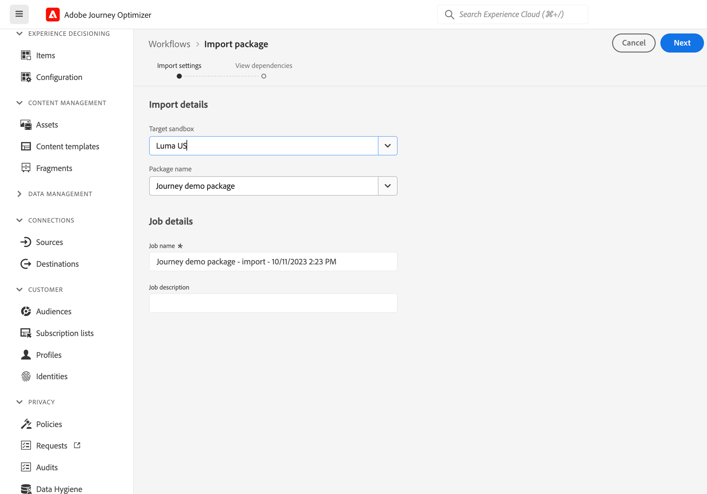
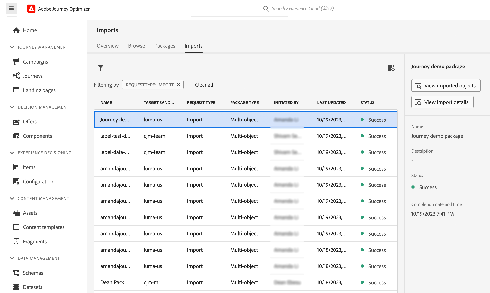

# Kopiera en resa till en annan sandlåda {#copy-to-sandbox}

<!--
>[!CONTEXTUALHELP]
>id="ajo_journey_copy_main"
>title="Copy a journey to another sandbox"
>abstract="Journey Optimizer allows you to copy an entire journey from one sandbox to another. For example, you can copy a journey from the Stage sandbox environment to your Production sandbox. In addition to the Journey itself, Journey Optimizer also copies most of the objects the journey depends on."

>[!CONTEXTUALHELP]
>id="ajo_journey_copy_sandbox_details"
>title="Sandbox details"
>abstract="Select the destination sandbox you want to copy the journey to. Only sandboxes within your organization are available."

>[!CONTEXTUALHELP]
>id="ajo_journey_copy_object_details"
>title="Object details"
>abstract="This is the journey you are going to copy."

>[!CONTEXTUALHELP]
>id="ajo_journey_copy_dependent_objects"
>title="Dependent objects"
>abstract="This is the list of associated objects used in the journey. This list displays the name, the object type, as well as the internal Journey Optimizer ID."
-->

Med Sandbox Tooling kan du kopiera objekt över flera sandlådor genom att utnyttja export och import av paket. Ett paket kan bestå av ett eller flera objekt. Alla objekt som ingår i ett paket måste komma från samma sandlåda.

Den här sidan beskriver hur du använder sandlådeverktyg i Journey Optimizer. Mer information om själva funktionen finns i [Experience Platform dokumentation](https://experienceleague.corp.adobe.com/docs/experience-platform/sandbox/ui/sandbox-tooling.html).

>[!NOTE]
>
>Den här funktionen kräver följande behörigheter: manage-sandbox (eller view-sandbox) och manage-package.

## Kom igång med sandlådeverktyg{#sandbox-gs}

Med Journey Optimizer kan du kopiera en hel resa från en sandlåda till en annan. Du kan t.ex. kopiera en resa från sandlådemiljön på scenen till produktionssandlådan. Förutom själva resan kopierar Journey Optimizer även de flesta av de objekt som resan är beroende av: målgrupper, scheman, händelser och handlingar. Mer information om kopierade objekt finns i [section](https://experienceleague.adobe.com/docs/experience-platform/sandbox/ui/sandbox-tooling.html#abobe-journey-optimizer-objects).

>[!CAUTION]
>
>Vi garanterar inte att alla länkade element kopieras till målsandlådan. Vi rekommenderar att du gör en grundlig kontroll innan du publicerar resan. På så sätt kan du identifiera eventuella saknade objekt.

De kopierade objekten i målsandlådan är unika och det finns ingen risk för att befintliga element skrivs över. Både resan och alla meddelanden under resan överförs i utkastläge. På så sätt kan du utföra en grundlig validering innan den publiceras i målsandlådan. Kopieringsprocessen kopierar bara metadata om resan och objekten i den resan. Inga profil- eller datauppsättningsdata kopieras som en del av den här processen.

Kopieringsprocessen utförs via en paketexport och import mellan käll- och målsandlådorna. Här är de allmänna stegen för att kopiera en resa från en sandlåda till en annan:

1. Lägg till resan som ett paket i källsandlådan.
1. Exportera paketet till målsandlådan.

## Lägg till resan som ett paket{#export}

Om du vill kopiera en resa till en annan sandlåda måste du först lägga till resan som ett paket i källsandlådan. Följ de här stegen:

1. Klicka på **[!UICONTROL Journeys]**. Listan över resor visas.

1. Sök efter den resa du vill kopiera och klicka på **Fler åtgärder** ikon (de tre punkterna bredvid resans namn) och klicka på **Lägg till i paket**.

   

   The **Lägg till i paket** visas.

   

1. Välj om du vill lägga till resan i ett befintligt paket eller skapa ett nytt paket:

   * **Befintligt paket**: välj paketet i listrutan.
   * **Skapa ett nytt paket**: skriv paketnamnet. Du kan också lägga till en beskrivning.

1. Klicka på **[!UICONTROL Sandboxes]** väljer du **Paket** och klicka på det paket som du vill exportera.

   

1. Markera de objekt som du vill exportera och klicka på **Publicera**

   

   Om publiceringen misslyckas kan du kontrollera loggarna för att identifiera felorsaken. Öppna paketet, klicka på **Se misslyckade jobb**, markera importjobbet och klicka på **Visa importinformation**.

   

## Exportera paketet till målsandlådan {#import}

När paketet har publicerats måste du exportera det till målsandlådan.

1. Klicka på **[!UICONTROL Sandboxes]** väljer du **Paket** och klicka på ikonen + bredvid det paket som du vill exportera.

   

1. Välj **Målsandlåda** i listrutan och klicka på **Nästa**. Endast sandlådor i din organisation är tillgängliga.

   

1. Granska paketobjekten och beroendena. Det här är listan över associerade objekt som används under resan. I den här listan visas namnet och objekttypen. För varje objekt kan du välja att skapa ett nytt eller använda ett befintligt objekt i målsandlådan.

   

1. Klicka på **Slutför** i det övre högra hörnet för att börja kopiera paketet till målsandlådan. Kopieringsprocessen varierar beroende på hur komplicerad resan är och hur många objekt som behöver kopieras.

1. Klicka på importjobbet för att granska kopieringsresultatet:

   * Klicka **Visa importerade objekt** för att visa varje enskilt objekt som har kopierats.
   * Klicka **Visa importinformation** om du vill kontrollera importresultaten för varje objekt.

   

1. Få åtkomst till målsandlådan och kontrollera alla kopierade objekt noggrant.
