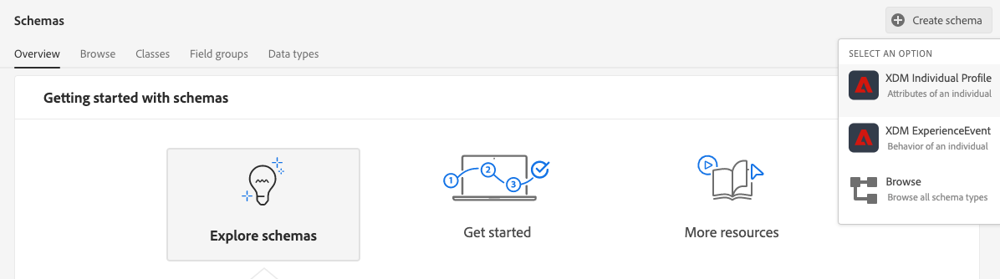
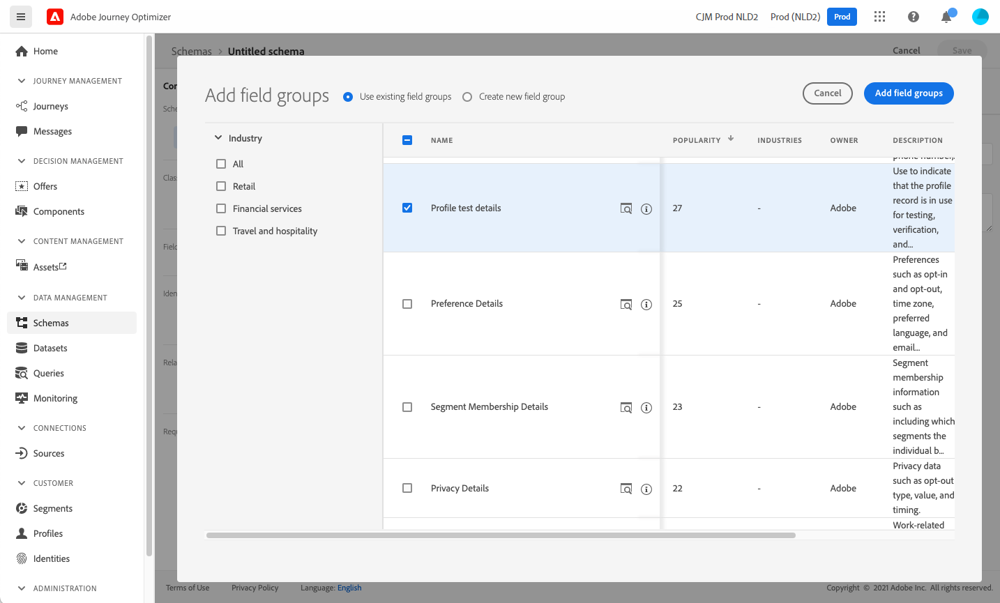
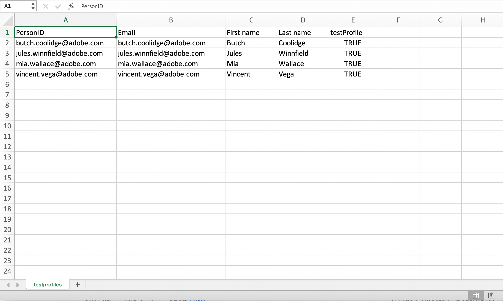

# Skapa testprofiler {#create-test-profiles}

Testprofiler krävs när du använder testläget Om du vill lära dig hur du använder testläget [på en resa och [förhandsgranska och testa meddelanden](../preview.md).](../building-journeys/testing-the-journey.md)

Tillgängliga metoder för att skapa testprofiler beskrivs nedan:

* Du kan omvandla en [befintlig profil](#turning-profile-into-test) till en testprofil

* Du kan skapa en testprofil genom att överföra en [csv-fil](#create-test-profiles-csv) eller använda [API-anrop](#create-test-profiles-api). Förutom dessa två metoder har Adobe Journey Optimizer ett specifikt [produktexempel](#use-case-1) som underlättar skapandet av testprofiler.

* Du kan också överföra en json-fil i en datauppsättning. Mer information finns i [dokumentationen för datainmatning](https://experienceleague.adobe.com/docs/experience-platform/ingestion/tutorials/ingest-batch-data.html#add-data-to-dataset).

Observera att det liknar att skapa en testprofil att skapa vanliga profiler i Adobe Experience Platform. Mer information finns i [dokumentationen för kundprofilen i realtid](https://experienceleague.adobe.com/docs/experience-platform/profile/home.html).

## Förutsättningar {#test-profile-prerequisites}

För att kunna skapa profiler måste du först skapa ett schema och en datauppsättning i Adobe [!DNL Journey Optimizer].

Först måste du **skapa ett schema**. Följ de här stegen:

1. Klicka på **[!UICONTROL Schemas]** i menyavsnittet DATAHANTERING.
   
1. Klicka på **[!UICONTROL Create schema]** i det övre högra hörnet och välj sedan en schematyp, till exempel **XDM Individual Profile**.
   
1. Välj rätt fältgrupper. Se till att du lägger till fältgruppen **Profiltestinformation**.
   
När du är klar klickar du på  **[!UICONTROL Add field groups]**: listan över fältgrupper visas på schemaöversiktsskärmen.
   

   >[!NOTE]
   >
   >* Klicka på schemats namn för att ändra det och uppdatera dess egenskaper.
      >
      >
   * Klicka på knappen **[!UICONTROL Add]** i avsnittet Fältgrupper för att välja andra fältgrupper att lägga till i schemat


1. I listan med fält klickar du på det fält som du vill definiera som primär identitet.
   
1. I den högra rutan **[!UICONTROL Field properties]** kontrollerar du alternativen **[!UICONTROL Identity]** och **[!UICONTROL Primary Identity]** och väljer ett namnutrymme. Om du vill att den primära identiteten ska vara en e-postadress väljer du namnutrymmet **[!UICONTROL Email]**. Klicka på **[!UICONTROL Apply]**.
   
1. Markera schemat och aktivera alternativet **[!UICONTROL Profile]** i rutan **[!UICONTROL Schema properties]**.
   
1. Klicka på **Spara**.

>[!NOTE]
>
>Mer information om schemaskapande finns i [XDM-dokumentationen](https://experienceleague.adobe.com/docs/experience-platform/xdm/ui/resources/schemas.html#prerequisites).

Sedan måste du **skapa datauppsättningen** som profilerna ska importeras i. Följ de här stegen:

1. Bläddra till **[!UICONTROL Datasets]** och klicka sedan på **[!UICONTROL Create dataset]**.
   
1. Välj **[!UICONTROL Create dataset from schema]**.
   
1. Markera det tidigare skapade schemat och klicka sedan på **[!UICONTROL Next]**.
   
1. Välj ett namn och klicka sedan på **[!UICONTROL Finish]**.
   
1. Aktivera alternativet **[!UICONTROL Profile]**.
   

>[!NOTE]
>
> Mer information om hur du skapar datauppsättningar finns i [dokumentationen för katalogtjänsten](https://experienceleague.adobe.com/docs/experience-platform/catalog/datasets/user-guide.html#getting-started).

## Exempel på användning i produkten{#use-case-1}

På Adobe Journey Optimizer hemsida kan du använda testprofilerna i programmet. Det här användningsexemplet underlättar skapandet av testprofiler som används för att testa resor före publicering.


Klicka på knappen **[!UICONTROL Begin]** för att starta användningsfallet.

Följande information krävs:

1. **Identitetsnamnutrymme**: Det  [ID-](https://experienceleague.adobe.com/docs/experience-platform/identity/namespaces.html) namn som används för att unikt identifiera testprofilerna. Om du till exempel använder e-post för att identifiera testprofilerna ska identitetsnamnrymden **E-post** vara markerad. Om den unika identifieraren är telefonnumret ska identitetsnamnutrymmet **Telefon** väljas.

2. **CSV-fil**: En kommaavgränsad fil som innehåller listan med testprofiler som ska skapas. Användningsfallet förväntar sig ett fördefinierat format för CSV-filen som innehåller listan med testprofiler som ska skapas. Varje rad i filen ska innehålla följande fält i rätt ordning:

   1. **Person-ID**: Unik identifierare för testprofilen. Värdena för det här fältet bör återspegla det valda identitetsnamnutrymmet. (Om du till exempel väljer **Telefon** för identitetsnamnutrymmet bör värdena i det här fältet vara telefonnummer. Om **E-post** är markerat bör värdena i det här fältet vara e-postmeddelanden)
   1. **E-post**: Testa profilens e-postadress. (Fältet **Person-ID** och fältet **E-post** kan innehålla samma värden om **E-post** har valts som identitetsnamnområde)
   1. **Förnamn**: Testa profilens förnamn.
   1. **Efternamn**: Efternamn för testprofil.
   1. **Ort**: Testprofilens ort
   1. **Land**: Testprofilland
   1. **Kön**: Testprofilens kön. Tillgängliga värden är **man**, **kvinna** och **ej specificerade**

När du har valt identitetsnamnutrymmet och angett en CSV-fil baserat på formatet ovan, klickar du på **[!UICONTROL Run]** längst upp till höger. Användningsexemplet kan ta några minuter att slutföra. När användningsärendet har slutförts och testprofilerna har skapats skickas ett meddelande till användaren.

>[!NOTE]
>
>Testprofiler kan åsidosätta befintliga profiler. Kontrollera att CSV-filen bara innehåller testprofiler och att den körs mot rätt sandlåda innan du kör användningsfallet.

## Förvandla en profil till en testprofil{#turning-profile-into-test}

Du kan omvandla en befintlig profil till en testprofil: Du kan uppdatera profilattribut på samma sätt som när du skapar en profil.

Ett enkelt sätt att göra detta är att använda en **[!UICONTROL Update Profile]**-åtgärd på en resa och ändra det booleska fältet testProfile från false till true.

Din resa består av en **[!UICONTROL Read Segment]**- och **[!UICONTROL Update Profile]**-aktivitet. Du måste först skapa ett segment som riktar sig till de profiler du vill omvandla till testprofiler.

>[!NOTE]
>
> Eftersom du kommer att uppdatera fältet **testProfile** måste de valda profilerna innehålla det här fältet. Det relaterade schemat måste ha fältgruppen **Profiltestinformation**. Se [det här avsnittet](../building-journeys/creating-test-profiles.md#test-profiles-prerequisites).

1. Bläddra till **Segment** och **Skapa segment** i det övre högra hörnet.
   
1. Definiera ett namn för segmentet och bygg segmentet: välj fält och värden för de profiler som du vill använda.
   
1. Klicka på **Spara** och kontrollera att profilerna har rätt mål för segmentet.
   

   >[!NOTE]
   >
   > Segmentberäkning kan ta lite tid. Läs mer om segment i [det här avsnittet](../segment/about-segments.md).

1. Skapa nu en ny resa och börja med en **[!UICONTROL Read Segment]**-koordinationsaktivitet.
1. Välj det segment som skapats tidigare och det namnutrymme som profilerna använder.
   
1. Lägg till en **[!UICONTROL Update Profile]**-åtgärdsaktivitet.
1. Markera schemat, fältet **testProfiles**, datauppsättningen och ange värdet **True**. Om du vill göra det klickar du på ikonen **Ritstift** till höger i fältet **[!UICONTROL VALUE]** och anger **true**.**[!UICONTROL Advanced mode]**
   
1. Lägg till en **End**-aktivitet och klicka på **[!UICONTROL Publish]**.
1. Kontrollera att profilerna har uppdaterats korrekt i avsnittet **[!UICONTROL Segments]**.
   

   >[!NOTE]
   >
   > Mer information om aktiviteten **[!UICONTROL Update Profile]** finns i [det här avsnittet](../building-journeys/update-profiles.md).

## Skapa en testprofil med en CSV-fil{#create-test-profiles-csv}

I Adobe Experience Platform kan du skapa profiler genom att överföra en CSV-fil som innehåller de olika profilfälten till datauppsättningen. Det här är den enklaste metoden.

1. Skapa en enkel csv-fil med ett kalkylprogram.
1. Lägg till en kolumn för varje fält som behövs. Se till att du lägger till det primära identitetsfältet (&quot;personID&quot; i exemplet ovan) och att fältet&quot;testProfile&quot; är inställt på&quot;true&quot;.
   
1. Lägg till en rad per profil och fyll i värdena för varje fält.
   
1. Spara kalkylbladet som en CSV-fil. Se till att kommatecken används som avgränsare.
1. Bläddra till Adobe Experience Platform **arbetsflöden**.
   
1. Välj **Mappa CSV till XDM-schema** och klicka sedan på **Starta**.
   
1. Markera den datauppsättning som du vill importera profilerna till. Klicka på **Nästa**.
   
1. Klicka på **Välj filer** och välj din CSV-fil. När filen har överförts klickar du på **Nästa**.
   
1. Mappa CSV-källfälten till schemafälten och klicka sedan på **Slutför**.
   
1. Dataimporten börjar. Statusen kommer att flyttas från **Bearbetning** till **Lyckades**. Klicka på **Förhandsgranska datauppsättning** i det övre högra hörnet.
   
1. Kontrollera att testprofilerna har lagts till korrekt.
   

Testprofilerna läggs till och kan nu användas när du testar en resa. Se [det här avsnittet](../building-journeys/testing-the-journey.md).
>[!NOTE]
>
> Mer information om csv-import finns i [dokumentationen för datainmatning](https://experienceleague.adobe.com/docs/experience-platform/ingestion/tutorials/map-a-csv-file.html#tutorials).

## Skapa testprofiler med API-anrop{#create-test-profiles-api}

Du kan också skapa testprofiler via API-anrop. Läs mer på den här [sidan](https://experienceleague.adobe.com/docs/experience-platform/profile/home.html).

Du måste använda ett profilschema som innehåller fältgruppen &quot;Profiltestinformation&quot;. Flaggan testProfile ingår i den här fältgruppen.
När du skapar en profil måste du skicka värdet: testProfile = true.

Observera att du även kan uppdatera en befintlig profil för att ändra dess testProfile-flagga till &quot;true&quot;.

Här är ett exempel på ett API-anrop för att skapa en testprofil:

```
curl -X POST \
'https://dcs.adobedc.net/collection/xxxxxxxxxxxxxx' \
-H 'Cache-Control: no-cache' \
-H 'Content-Type: application/json' \
-H 'Postman-Token: xxxxx' \
-H 'cache-control: no-cache' \
-H 'x-api-key: xxxxx' \
-H 'x-gw-ims-org-id: xxxxx' \
-d '{
"header": {
"msgType": "xdmEntityCreate",
"msgId": "xxxxx",
"msgVersion": "xxxxx",
"xactionid":"xxxxx",
"datasetId": "xxxxx",
"imsOrgId": "xxxxx",
"source": {
"name": "Postman"
},
"schemaRef": {
"id": "https://example.adobe.com/mobile/schemas/xxxxx",
"contentType": "application/vnd.adobe.xed-full+json;version=1"
}
},
"body": {
"xdmMeta": {
"schemaRef": {
"contentType": "application/vnd.adobe.xed-full+json;version=1"
}
},
"xdmEntity": {
"_id": "xxxxx",
"_mobile":{
"ECID": "xxxxx"
},
"testProfile":true
}
}
}'
```
