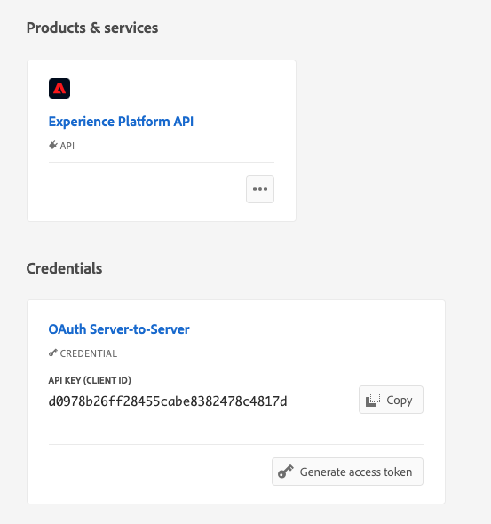

# Använda anpassade åtgärder för att skriva reseventen i Experience Platform {#custom-action-aep}

Det här användningsexemplet förklarar hur du skriver anpassade händelser till Adobe Experience Platform från Journeys med hjälp av anpassade åtgärder och autentiserade samtal.

## Konfigurera ett utvecklarprojekt {#custom-action-aep-IO}

1. Klicka på **Projekt** i Adobe Developer Console och öppna IO-projektet.

1. Klicka på **OAuth Server-to-Server** i avsnittet **Autentiseringsuppgifter**.

   

1. Klicka på **Visa cURL-kommando**.

   

1. Kopiera kommandot cURL och lagra client_id, client_secrets, grant_type och scope.

```
curl -X POST 'https://ims-na1.adobelogin.com/ims/token/v3' -H 'Content-Type: application/x-www-form-urlencoded' -d 'grant_type=client_credentials&client_id=1234&client_secret=5678&scope=openid,AdobeID,read_organizations,additional_info.projectedProductContext,session'
```

>[!CAUTION]
>
>När du har skapat ditt projekt på Adobe Developer Console måste du ge utvecklare och API-åtkomstkontroll med rätt behörigheter. Läs mer i [Adobe Experience Platform-dokumentationen](https://experienceleague.adobe.com/sv/docs/experience-platform/landing/platform-apis/api-authentication#grant-developer-and-api-access-control){target="_blank"}

## Konfigurera källan med HTTP API Inlet

1. Skapa en slutpunkt i Adobe Experience Platform för att skriva data från resor.

1. I Adobe Experience Platform klickar du på **Källor** under **Anslutningar** i den vänstra menyn. Klicka på **Lägg till data** under **HTTP API**.

   

1. Välj **Nytt konto** och aktivera autentisering. Välj **Anslut till Source**.

   

1. Välj **Nästa** och den datauppsättning där du vill skriva data. Klicka på **Nästa** och **Slutför**.

   

1. Öppna det nya dataflödet. Kopiera schemanyttolasten och spara den i din anteckningsruta.

```
{
"header": {
"schemaRef": {
"id": "https://ns.adobe.com/<your_org>/schemas/<schema_id>",
"contentType": "application/vnd.adobe.xed-full+json;version=1.0"
},
"imsOrgId": "<org_id>",
"datasetId": "<dataset_id>",
"source": {
"name": "Custom Journey Events"
}
},
"body": {
"xdmMeta": {
"schemaRef": {
"id": "https://ns.adobe.com/<your_org>/schemas/<schema_id>",
"contentType": "application/vnd.adobe.xed-full+json;version=1.0"
}
},
"xdmEntity": {
"_id": "test1",
"<your_org>": {
"journeyVersionId": "",
"nodeId": "", "customer_Id":""
},
"eventMergeId": "",
"eventType": "",
"producedBy": "self",
"timestamp": "2018-11-12T20:20:39+00:00"
}
}
}
```

## Konfigurera den anpassade åtgärden {#custom-action-config}

Konfigurationen av anpassade åtgärder anges på [den här sidan](../action/about-custom-action-configuration.md).

I det här exemplet gör du så här:

1. Öppna Adobe Journey Optimizer och klicka på **Konfigurationer** under **Administration** i den vänstra menyn. Under **Åtgärder** klickar du på **Hantera** och sedan på **Skapa åtgärd**.

1. Ange URL-adressen och välj metoden Post.

   `https://dcs.adobedc.net/collection/<collection_id>?syncValidation=false`

1. Kontrollera att rubrikerna (Content-Type, Charset, sandbox-name) är konfigurerade.

   

### Konfigurera autentiseringen {#custom-action-aep-authentication}

1. Välj **Type** som **Custom** med följande nyttolast.

1. Klistra in client_secrets, client_id, scope och grant_type (från IO-projektets nyttolast som användes tidigare).

   ```
   {
   "type": "customAuthorization",
   "authorizationType": "Bearer",
   "endpoint": "https://ims-na1.adobelogin.com/ims/token/v3",
   "method": "POST",
   "headers": {},
   "body": {
   "bodyType": "form",
   "bodyParams": {
   "grant_type": "client_credentials",
   "client_secret": "********",
   "client_id": "<client_id>",
   "scope": "openid,AdobeID,read_organizations,additional_info.projectedProductContext,session"
   }
   },
   "tokenInResponse": "json://access_token",
   "cacheDuration": {
   "duration": 28000,
   "timeUnit": "seconds"
   }
   }
   ```

1. Använd **Klicka för att testa autentiserings**-knappen för att testa anslutningen.

   

### Ställ in nyttolasten {#custom-action-aep-payload}

1. Klistra in nyttolasten från den tidigare källanslutningen i fälten **Begäran** och **Svar**.

   ```
   {
   "xdmMeta": {
   "schemaRef": {
   "id": "https://ns.adobe.com/<your_org>/schemas/<schema_id>",
   "contentType": "application/vnd.adobe.xed-full+json;version=1.0"
   }
   },
   "xdmEntity": {
   "_id": "/uri-reference",
   "<your_org>": {
   "journeyVersionId": "Sample value",
   "nodeId": "Sample value",
   "customer_Id":""
   },
   "eventMergeId": "Sample value",
   "eventType": "advertising.completes,
   "producedBy": "self",
   "timestamp": "2018-11-12T20:20:39+00:00"
   }
   }
   ```

1. Ändra fältkonfigurationen från **Konstant** till **Variabel** för fält som fylls i dynamiskt.

1. Spara den anpassade åtgärden.

## Resa

1. Slutligen kan du använda den här anpassade åtgärden i en resa för att skriva anpassade resehändelser.

1. Fyll i resans versions-ID, nod-ID, nodnamn och andra attribut enligt ditt användningsexempel.

   
