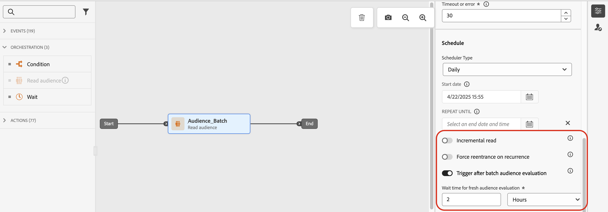

# Profilingångshantering {#entry-management}

Hanteringen av profilentréer beror på typen av resa. I Adobe Journey Optimizer finns följande typer av resor:

* **Unitary event**-resor: de här resorna börjar med en Unitary-händelse. När händelsen tas emot kommer den associerade profilen in i resan. [Läs mer](#entry-unitary)

* **Affärshändelse** resor: dessa resor börjar med en Business-händelse omedelbart följt av en **Läs målgruppsaktivitet**. När evenemanget tas emot går profiler som tillhör målgruppen in på resan. En instans av den här resan skapas för varje profil. [Läs mer](#entry-business)

* **Läs målgrupper** resor: de här resorna börjar med en **Läs målgrupp**-aktivitet. När resan är genomförd kommer profiler som tillhör målgruppen in på resan. En instans av den här resan skapas för varje profil. Resorna kan vara återkommande eller &quot;engångsvisa&quot;. [Läs mer](#entry-read-audience)

* **Målgruppskvalificering** resor: dessa resor börjar med en Audience-kvalificeringshändelse. Dessa resor lyssnar på ingångar och utgångar för profiler i målgrupper. När detta händer kommer den associerade profilen in på resan. [Läs mer](#entry-unitary)

I alla typer av resor kan en profil inte finnas flera gånger i samma resa samtidigt. Om du vill kontrollera att en person befinner sig på en resa används profilidentiteten som en nyckel. Systemet tillåter inte att samma nyckel, till exempel nyckeln CRMID=3224, finns på olika platser under samma resa.

## Unitär event- och målgruppskompetens{#entry-unitary}

I **Unitary event**- och **Audience-kvalificering**-resor kan du aktivera eller inaktivera återinträde:

* Om återinträde är aktiverat kan en profil gå in på en resa flera gånger, men kan inte göra det förrän han har avslutat hela den tidigare instansen av resan.

* Om återinträde är inaktiverat kan en profil inte ange flera gånger samma resa inom den globala resetidsgränsen. Se [avsnittet](../building-journeys/journey-properties.md#global_timeout).

Som standard tillåter resor återinträde. När alternativet **Tillåt återinträde** är aktiverat visas fältet **Återinträde av vänteperiod**. Det gör att du kan definiera väntetiden innan du tillåter att en profil går in på resan igen. Detta förhindrar att resor utlöses felaktigt flera gånger för samma händelse. Som standard är fältet inställt på 5 minuter. Maximala längden är 91 dagar ([global timeout](journey-properties.md#global_timeout)).

<!--
When a journey ends, its status is **[!UICONTROL Closed]**. New individuals can no longer enter the journey. Persons already in the journey automatically exit the journey. 
-->

Efter återinträdesperioden kan profilerna återinträda i resan. För att undvika detta och helt inaktivera återinträde för dessa profiler kan du lägga till ett villkor som testar om profilen redan har angetts eller inte, med hjälp av profil- eller målgruppsdata.

<!--
Due to the 30-day journey timeout, when journey re-entrance is not allowed, we cannot make sure the re-entrance blocking will work more than 91 days. Indeed, as we remove all information about persons who entered the journey 91 days after they enter, we cannot know the person entered previously, more than 91 days ago. -->

## Affärsresor {#entry-business}

<!--
Business events follow re-entrance rules in the same way as for unitary events. If a journey allows re-entrance, the next business event will be processed.
-->

Aktivera motsvarande alternativ i avsnittet **[!UICONTROL Execution]** i resans egenskaper om du vill tillåta flera körningar av affärshändelser i **Affärsresor**.

När det gäller affärshändelser återanvänds målgruppsdata som hämtas vid den första exekveringen under en timmes tid för en viss resa.

En profil kan finnas flera gånger på samma resa, samtidigt, men i samband med olika affärshändelser.

Mer information finns i [avsnittet](../event/about-creating-business.md)

## Läs målgruppsresor {#entry-read-audience}

**Läsande målgrupp** resor kan vara återkommande eller&quot;engångsbruk&quot;:

* För icke-återkommande/engångsresor: profilen anges endast en gång under resan.

* För återkommande resor: Som standard anges resan för varje återkommande resa i alla profiler som tillhör målgruppen. De måste slutföra resan innan de kan komma in på nytt i en annan händelse.

Det finns två alternativ för återkommande målgruppsresor:

* **Inkrementell läsning**: När en resa med en återkommande **läsmålgrupp** körs för första gången kommer alla profiler i målgruppen in på resan. Med det här alternativet kan du efter första tillfället bara rikta in dig på de personer som har gått in i målgruppen sedan den senaste körningen av resan.

  >[!NOTE]
  >
  >Om du har en [anpassad uppladdningsmålgrupp](../audience/about-audiences.md#segments-in-journey-optimizer) som mål för din resa hämtas profiler endast vid den första upprepningen om det här alternativet är aktiverat under en återkommande resa, eftersom dessa målgrupper är fasta.

* **Tvinga återinträde vid upprepning**: Med det här alternativet kan du göra så att alla profiler som fortfarande finns i resan automatiskt avslutar den vid nästa körning. Om livscykeln för dina profiler under den här resan kan vara längre än frekvensen för återkommande (till exempel om du använder vänteaktiviteter) ska du inte aktivera det här alternativet för att se till att profilerna kan slutföra sin resa.

Mer information finns i [avsnittet](../building-journeys/read-audience.md#configuring-segment-trigger-activity)

<!--
After 91 days, a Read audience journey switches to the **Finished** status. This behavior is set for 91 days only (i.e. journey timeout default value) as all information about profiles who entered the journey is removed 91 days after they entered. Persons still in the journey automatically are impacted. They exit the journey after the 30 day timeout. 
-->
