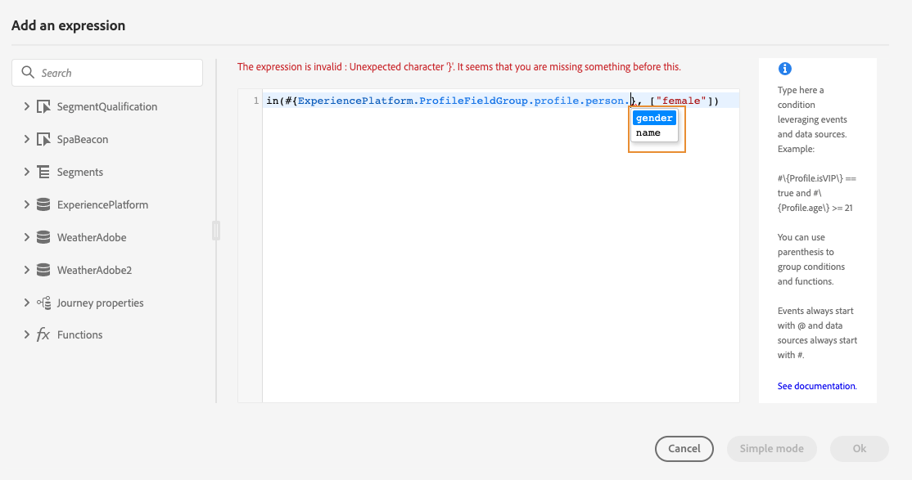

# Arbeta med den avancerade uttrycksredigeraren {#about-the-advanced-expression-editor}

>[!CONTEXTUALHELP]
>id="ajo_journey_expression_advanced"
>title="Om den avancerade uttrycksredigeraren"
>abstract="Använd den avancerade uttrycksredigeraren för att skapa avancerade uttryck på olika skärmar i gränssnittet. Du kan till exempel skapa uttryck när du konfigurerar och använder resor och när du definierar ett datakällsvillkor."

Använd den avancerade uttrycksredigeraren Journey för att skapa avancerade uttryck på olika skärmar i gränssnittet. Du kan till exempel skapa uttryck när du konfigurerar och använder resor och när du definierar ett datakällsvillkor.

Den är också tillgänglig varje gång du behöver definiera åtgärdsparametrar som kräver specifika dataändringar. Du kan utnyttja data från händelser eller ytterligare information som hämtats från datakällan. I en resa är den lista med händelsefält som visas sammanhangsberoende och varierar beroende på vilka händelser som läggs till i resan.

Den avancerade uttrycksredigeraren har en uppsättning inbyggda funktioner och operatorer som du använder för att manipulera värden och definiera ett uttryck som passar dina behov. Med den avancerade uttrycksredigeraren kan du också definiera värden för den externa datakällparametern, manipulera mappningsfält och samlingar.

>[!NOTE]
>
>De funktioner och funktioner som är tillgängliga i den avancerade uttrycksredigeraren för Journey skiljer sig från dem som är tillgängliga i [personaliseringsredigeraren](../../personalization/functions/functions.md).

## Åtkomst till den avancerade uttrycksredigeraren {#accessing-the-advanced-expression-editor}

Den avancerade uttrycksredigeraren kan användas till att:

* skapa [avancerade villkor](../condition-activity.md#about_condition) för datakällor och händelseinformation
* definiera anpassade [vänteaktiviteter](../wait-activity.md#custom)
* definiera kartläggning av åtgärdsparametrar

När det är möjligt kan du växla mellan de två lägena med hjälp av knappen **[!UICONTROL Advanced mode]**/**[!UICONTROL Simple mode]** . Det enkla läget beskrivs [här](../condition-activity.md#about_condition).

>[!NOTE]
>
>* Villkor kan definieras i den enkla eller avancerade uttrycksredigeraren. De returnerar alltid en boolesk typ.
>
>* Åtgärdsparametrar kan definieras genom fältval eller via den avancerade uttrycksredigeraren. De returnerar en viss datatyp enligt sina uttryck.

Du kan komma åt den avancerade uttrycksredigeraren på olika sätt.

* När du skapar ett villkor för datakällan kan du klicka på **[!UICONTROL Advanced mode]** för att komma åt den avancerade redigeraren.

  

* När du skapar en anpassad timer visas den avancerade redigeraren direkt.
* Klicka på **[!UICONTROL Advanced mode]** när du kartlägger en åtgärdsparameter.

## Upptäck gränssnittet {#discovering-the-interface}

Med den här skärmen kan du ange ett uttryck manuellt.

Till vänster på skärmen visas tillgängliga fält och funktioner:

* **[!UICONTROL Events]**: välj ett av fälten som har tagits emot från den inkommande händelsen. Den visade listan med händelsefält är sammanhangsberoende och varierar beroende på vilka händelser som läggs till under resan. [Läs mer](../../event/about-events.md)

  >[!CAUTION]
  >
  >Det går inte att skapa uttryck med upplevelsehändelser. Det finns referenser till alternativa metoder och bästa praxis för att skapa uttryck/logik med upplevelsehändelser [här](../../building-journeys/exp-event-lookup.md)

* **[!UICONTROL Audiences]**: Om du har släppt en **[!UICONTROL Audience qualification]** -händelse väljer du den målgrupp du vill använda i ditt uttryck. [Läs mer](../condition-activity.md#using-a-segment)
* **[!UICONTROL Data Sources]**: välj i listan över fält som är tillgängliga från fältgrupperna i datakällorna. [Läs mer](../../datasource/about-data-sources.md)
* **[!UICONTROL Journey properties]**: I det här avsnittet grupperas de tekniska fält som är relaterade till resan för en viss profil om. [Läs mer](journey-properties.md)
* **[!UICONTROL Functions]**: välj i listan bland inbyggda funktioner som du använder för att utföra komplex filtrering. Funktionerna är ordnade efter kategorier. [Läs mer](functions.md)

En mekanism för automatisk komplettering visar sammanhangsberoende förslag.

En mekanism för syntaxvalidering kontrollerar kodens integritet. Fel visas överst på redigeraren.

>[!TIP]
>
>När du skapar villkor i den avancerade uttrycksredigeraren ska du se till att uttrycken inte innehåller dolda eller ej utskrivbara tecken. Använd dessutom enkelradsuttryck för att undvika tolkningsfel.

**Behovet av parametrar när du skapar villkor med den avancerade uttrycksredigeraren**

Om du väljer ett fält från en extern datakälla som kräver att en parameter anropas (se [den här sidan](../../datasource/external-data-sources.md)) visas en ny flik till höger där du kan ange den här parametern. Parametervärdet kan komma från händelser som placerats under resan eller Experience Platform-datakällan (och inte från andra externa datakällor). I en väderrelaterad datakälla används till exempel parametern &quot;city&quot; ofta. Därför måste du välja var du vill hämta den här parametern &quot;city&quot;. Funktioner kan även tillämpas på parametrar om man vill utföra formateringsändringar eller sammansättningar.

För mer komplicerade användningsfall kan du definiera parametrarnas värden med nyckelordet &quot;params&quot; för att inkludera dem från datakällan i huvuduttrycket. Läs [den här sidan](../expression/field-references.md).
