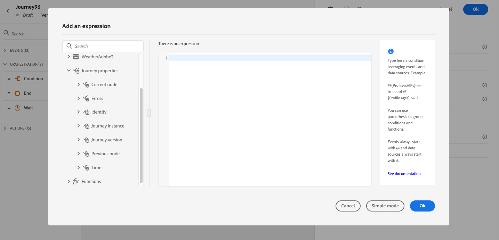

# Attribut för reseegenskaper {#journey-properties}

I den [enkla uttrycksredigeraren](../condition-activity.md#about_condition) och i den [avancerade uttrycksredigeraren](../expression/expressionadvanced.md), under kategorierna **Event** och **Data source**, har du tillgång till kategorin **Reseegenskaper** . Denna kategori innehåller tekniska fält som rör resan för en viss profil. Det här är den information som hämtats av systemet från direktresor, t.ex. rese-ID:t, eller de specifika fel som påträffats.

Den innehåller information om:

* reseversion: reseversion, resversion-id, instansens-uid, osv.
* fel: datahämtning, åtgärdskörning osv.
* aktuellt steg, senaste aktuella steg osv.
* ignorerade profiler

  Listan med fält är tillgänglig [&#x200B; i det här avsnittet](#journey-properties-fields).

Du kan använda dessa fält för att skapa uttryck. Under körningen hämtas värdena direkt från resan.

Nedan följer några exempel på användningsområden:

* **Logga ignorerade profiler**: Du kan skicka alla profiler som har uteslutits från ett meddelande via en begränsningsregel till ett tredjepartssystem för loggning. För detta anger du en sökväg i händelse av timeout och fel och lägger till ett villkor som ska filtreras efter en viss feltyp, t.ex.&quot;ignorera personer genom att appa regel&quot;. Du kan sedan överföra de borttagna profilerna till ett tredjepartssystem via en anpassad åtgärd.

* **Skicka aviseringar vid fel**: du kan skicka ett meddelande till ett tredjepartssystem varje gång ett fel inträffar i ett meddelande. För detta anger du en sökväg om ett fel uppstår, lägger till ett villkor och en anpassad åtgärd. Du kan till exempel skicka ett meddelande på en Slack-kanal med en beskrivning av det fel som uppstod.

* **Förfina fel i rapportering** : I stället för att bara ha en sökväg för felmeddelanden kan du definiera ett villkor per feltyp. På så sätt kan du förfina rapporteringen och visa alla feltyper och data.

## Fältlista {#journey-properties-fields}

| Kategori | Fältnamn | Etikett | Beskrivning |
|---|---|---|------------|
| Reseversion | travelUID | Reseidentifierare | |
| | travelVersionUID | Reseversionsidentifierare | |
| | travelVersionName | Namn på reseversion | |
| | travelVersionDescription | Beskrivning av reseversion | |
| | travelVersion | Reseversion | |
| Reseinstans | instanceUID | Journey-instans-ID | ID för instansen |
| | externalKey | Extern nyckel | Individuell identifierare som utlöser resan |
| | organizationId | Organisationens identifierare | Varumärkesorganisation |
| | sandboxName | Namn på sandlåda | Namn på sandlådan |
| Identitet | profileId | Identifierare för profilidentitet | Identifierare för profilen i resan |
| | namespace | Namnområde för profilidentitet | Profilens namnområde under resan (exempel: ECID) |
| Aktuell nod | currentNodeId | Aktuell nodidentifierare | Identifierare för den aktuella aktiviteten (nod) |
| | currentNodeName | Aktuellt nodnamn | Namn på aktuell aktivitet (nod) |
| Föregående nod | previousNodeId | Föregående nodidentifierare | Identifierare för föregående aktivitet (nod) |
| | previousNodeName | Tidigare nodnamn | Namn på föregående aktivitet (nod) |
| Fel | lastNodeUIDInError | Senaste nodidentifierare i fel | Identifierare för den senaste aktiviteten (nod) vid fel |
| | lastNodeNameInError | Senaste nodnamn i fel | Namn på den senaste aktiviteten (nod) med fel |
| | lastNodeTypeInError | Senaste nodtyp i fel | Feltyp för den senaste aktiviteten (nod). Möjliga typer:<ul><li>Händelser: Händelser, reaktioner, SQ (exempel: Målgruppskvalifikation)</li><li>Flödeskontroll: Slut, Villkor, Vänta</li><li>Åtgärder: ACS-åtgärder, Hoppa, Anpassad åtgärd</li></ul> |
| | lastErrorCode | Senaste felkod | Felkod för den senaste aktiviteten (nod). Möjliga fel: <ul><li>HTTP-felkoder</li><li>mappad</li><li>timedOut</li><li>fel (exempel: standard om ett oväntat fel inträffar. Ska inte/mycket sällan inträffa)</li></ul> |
| | lastExecutedActionErrorCode | Felkod för senaste körda åtgärd | Felkod för den senaste felåtgärden |
| | lastDataFetchErrorCode | Felkod för senaste datainhämtning | Felkod för den senaste datahämtningen från datakällor |
| Tid | lastActionExecutionElapsedTime | Senaste körningstid för åtgärd | Tid som har använts för att köra den senaste åtgärden |
| | lastDataFetchElapsedTime | Senaste tid för datahämtning | Den tid som har använts för att köra den senaste datahämtningen från datakällor |
