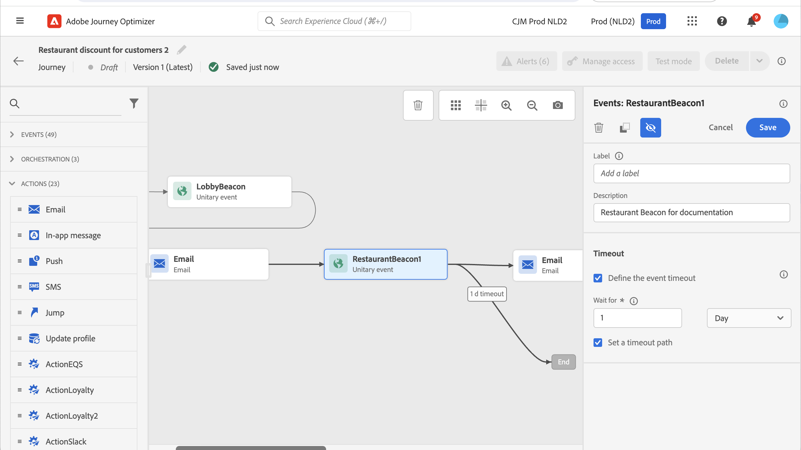

# Allmänna händelser {#general-events}

>[!CONTEXTUALHELP]
>id="ajo_journey_event_custom"
>title="Allmänna händelser"
>abstract="Med händelser kan ni utlösa era resor helt och hållet för att skicka meddelanden i realtid till den person som flyger in på resan. För den här händelsetypen kan du bara lägga till en etikett och en beskrivning. Händelsekonfigurationen utförs av en datatekniker och kan inte redigeras."

Med händelser kan ni utlösa era resor helt och hållet för att skicka meddelanden i realtid till den person som flyger in på resan.

För den här händelsetypen kan du bara lägga till en etikett och en beskrivning. Resten av konfigurationen kan inte redigeras. Den utfördes av den tekniska användaren. Läs [den här sidan](../event/about-events.md).

När du släpper en affärshändelse läggs en **Läs målgrupp** aktivitet. Mer information om affärshändelser finns i [det här avsnittet](../event/about-events.md)

## Lyssna på händelser under en viss tid {#events-specific-time}

En händelseaktivitet som placeras på resan lyssnar på händelser i oändlighet. Om du bara vill lyssna på en händelse under en viss tid måste du konfigurera en timeout för händelsen.

Resan lyssnar sedan på händelsen under den tid som anges i tidsgränsen. Om en händelse tas emot under den perioden kommer personen att flöda in i händelsens sökväg. Annars kommer kunden antingen att flöda in i en tidsgräns eller avsluta sin resa.

Så här konfigurerar du en timeout för en händelse:

1. Aktivera **[!UICONTROL Define the event timeout]** från händelseegenskaperna.

1. Ange hur lång tid resan ska vänta på händelsen.

1. Om du vill skicka personerna till en timeout-sökväg när ingen händelse tas emot inom den angivna tidsgränsen aktiverar du **[!UICONTROL Set a timeout path]** alternativ. Om det här alternativet inte är aktiverat avslutas kundresan för personen när tidsgränsen nås.

   

I det här exemplet skickar resan en första välkomstknuff till en kund. Sedan skickas en reklamfilm för måltidsrabatt endast om kunden kommer in på restaurangen nästa dag. Därför har vi konfigurerat restaurangevenemanget med en 1-dagars timeout:

* Om restauranghändelsen tas emot mindre än 1 dag efter välkomstsändningen skickas push-aktiviteten för måltidsrabatt.
* Om ingen restauranghändelse tas emot under nästa dag flödar personen genom timeoutvägen.

Observera att om du vill konfigurera en timeout för flera händelser som placerats efter en **[!UICONTROL Wait]** behöver du bara konfigurera timeout för en av dessa händelser.

Tidsgränsen gäller för alla händelser som placerats efter **[!UICONTROL Wait]** aktivitet. Om ingen händelse tas emot före den angivna tidsgränsen kommer individerna att flyta in i en enda tidsgräns eller avsluta sin resa.

