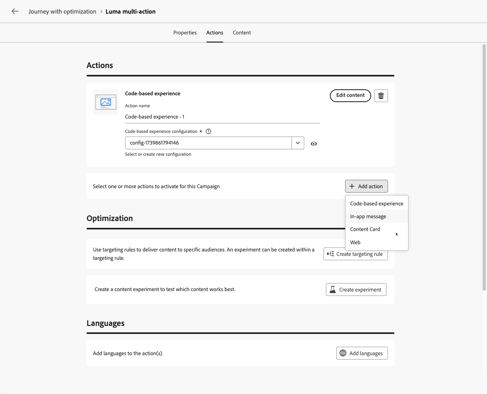

# Använda aktiviteten Åtgärd {#add-a-message-in-a-journey}

>[!CONTEXTUALHELP]
>id="ajo_action_activity"
>title="Åtgärdsaktivitet"
>abstract="Med den generiska **åtgärden** kan du konfigurera en enskild ursprunglig kanalåtgärd och flera inkommande aktiviteter med möjlighet att lägga till optimering till alla inbyggda kanalåtgärder."

[!DNL Journey Optimizer] innehåller en ny allmän **Åtgärd**-aktivitet som gör att du kan konfigurera en enda inbyggd kanalåtgärd och även flera inkommande aktiviteter.

Det gör det möjligt att

* En förenklad inbyggd åtgärdskonfiguration på arbetsytan för resan.
* Kapaciteten för att skapa inkommande åtgärdsgrupper med flera åtgärder.
* Möjlighet att lägga till optimering till alla inbyggda kanalåtgärder.

>[!NOTE]
>
>Alla inbyggda kanaler är nu tillgängliga via aktivitetens reseaktivitet. Gamla inbyggda kanalaktiviteter kommer att bli inaktuella i mars-versionen. Befintliga resor med äldre åtgärder kommer att fortsätta att fungera som de är - ingen migrering krävs.

Du kan också konfigurera anpassade åtgärder för att skicka meddelanden i [!DNL Journey Optimizer]. [Läs mer](#recommendation)

## Lägga till en åtgärd för en resa  {#add-action}

Följ stegen nedan om du vill lägga till en inbyggd kanalåtgärd för en resa.

1. Starta din resa med en [Event](general-events.md)- eller [Read Audience](read-audience.md)-aktivitet.

1. Dra och släpp en **[!UICONTROL Actions]**-aktivitet på arbetsytan från delen **[!UICONTROL Action]** på paletten.

1. Välj den inbyggda kanalaktivitet som du vill använda under resan.

   

1. Lägg till en etikett till åtgärden och välj **[!UICONTROL Configure action]**.

   {width="80%"}

1. Du dirigeras till fliken **[!UICONTROL Actions]** på konfigurationsskärmen för reseåtgärder.

   Välj den konfiguration som ska användas för den valda kanalen.

   

1. Om du har valt en inkommande kanal kan du lägga till flera åtgärder. [Läs mer](#multi-action)

1. Konfigurera aktiviteten enligt den valda kanalen. Lär dig konfigurera inbyggda kanalåtgärder i [det här avsnittet](journeys-message.md).

1. Använd avsnittet **[!UICONTROL Optimization]** för att köra innehållsexperiment, utnyttja målinriktningsregler eller använda avancerade kombinationer av både experiment och målinriktning.

   Dessa olika alternativ och de steg som ska följas beskrivs i [det här avsnittet](../content-management/gs-message-optimization.md).

1. Använd avsnittet **[!UICONTROL Languages]** för att skapa innehåll på flera språk i din reseåtgärd. Om du vill göra det klickar du på knappen **[!UICONTROL Add languages]** och väljer önskad **[!UICONTROL Language settings]**.

   Detaljerad information om hur du konfigurerar och använder flerspråkiga funktioner finns i [det här avsnittet](../content-management/multilingual-gs.md).

Ytterligare inställningar är tillgängliga beroende på den valda kommunikationskanalen. Expandera avsnitten nedan om du vill ha mer information.

+++**Använd regler för begränsning** (e-post, push, SMS)

I listrutan **[!UICONTROL Business rules]** väljer du en regeluppsättning för att tillämpa regler för appning på din reseåtgärd.

Genom att utnyttja kanalregeluppsättningar kan ni ange frekvensbegränsning efter kommunikationstyp för att förhindra att kunder med liknande meddelanden överbelastas.

[Lär dig arbeta med regeluppsättningar](../conflict-prioritization/rule-sets.md)

+++

+++**Spåra engagemang** (e-post, SMS).

Använd avsnittet **[!UICONTROL Action tracking]** för att spåra hur dina mottagare svarar på dina e-post- eller SMS-leveranser.

Spåra resultaten kan nås från reserapporten när resan är genomförd.

[Läs mer om reserapporter](../reports/journey-global-report-cja.md)

+++

+++**Aktivera läget Snabb leverans** (push).

Snabb leverans är ett [!DNL Journey Optimizer]-tillägg som tillåter mycket snabba push-meddelanden som skickas i stora volymer via kampanjer.

Snabba leveranser används när fördröjningar i meddelandeleverans är affärskritiska när du vill skicka en snabb push-varning på mobiltelefoner, till exempel nyheter till användare som har installerat din nyhetskanalapp.

Lär dig hur du aktiverar läget Snabb leverans för push-meddelanden [på den här sidan](../push/create-push.md#rapid-delivery).

Mer information om prestanda när du använder läget Snabb leverans finns i [[!DNL Adobe Journey Optimizer] produktbeskrivningen](https://helpx.adobe.com/legal/product-descriptions/adobe-journey-optimizer.html){target="_blank"}.

+++

+++**Tilldela prioritetspoäng** (webb, i appen, kodbaserad)

I avsnittet **[!UICONTROL Conflict management]** kan du tilldela en prioritetspoäng till reseåtgärden, så att du kan prioritera en inkommande åtgärd när det finns flera reseåtgärder eller kampanjer som använder samma kanalkonfiguration.

Som standard ärvs prioritetspoängen för åtgärden från den övergripande prioritetspoängen för resan.

[Lär dig hur du tilldelar prioritetspoäng till kanalåtgärder](../conflict-prioritization/priority-scores.md#priority-action)

+++

+++**Ange ytterligare leveransregler** (innehållskort)

För innehållskortresor kan du aktivera ytterligare leveransregler för att välja vilka händelser och villkor som utlöser meddelandet.

[Lär dig hur du skapar innehållskort](../content-card/create-content-card.md)

+++

+++**Definiera utlösare** (i appen)

För meddelanden i programmet kan du använda knappen **[!UICONTROL Edit triggers]** för att välja händelser och villkor som utlöser meddelandet.

[Lär dig hur du skapar ett meddelande i appen](../in-app/create-in-app.md)

+++

## Lägg till flera inkommande åtgärder {#multi-action}

>[!CONTEXTUALHELP]
>id="ajo_multi_action_journey"
>title="Lägg till flera inkommande åtgärder"
>abstract="Du kan välja flera inkommande åtgärder inuti en enskild resa. Med den här funktionen kan ni leverera flera kodbaserade upplevelser, meddelanden i appen, innehållskort eller webbåtgärder till olika platser samtidigt, och varje åtgärd innehåller ett visst innehåll."

För att förenkla kundresan kan ni definiera flera inkommande åtgärder inuti en enskild reseåtgärd.

>[!NOTE]
>
>Den här kapaciteten är endast tillgänglig för inkommande kanaler. För närvarande stöds inte utgående kanaler som e-post.

Med den här kapaciteten kan ni leverera olika kodbaserade upplevelser, meddelanden i appen, innehållskort eller webbåtgärder till olika platser samtidigt, utan att behöva skapa flera olika reseåtgärder. Det gör driftsättningen av kundresan enklare och ger smidigare rapportering där alla data samlas i en enda resa.

Du kan till exempel skicka en kodbaserad upplevelse till flera slutpunkter med något annorlunda innehåll. Det gör du genom att skapa flera kodbaserade åtgärder inom samma reseåtgärd, var och en med olika slutpunktskonfigurationer.

Följ stegen nedan för att definiera flera inkommande åtgärder i en enda åtgärdsnod för resan.

1. Starta din resa med en [Event](general-events.md)- eller [Read Audience](read-audience.md)-aktivitet.

1. Dra och släpp en **[!UICONTROL Actions]**-aktivitet på arbetsytan från delen **[!UICONTROL Action]** på paletten.

1. Välj **[!UICONTROL Multi action]** som åtgärdstyp.

   

1. Lägg till en etikett om det behövs och välj **[!UICONTROL Configure action]**.

   {width="60%"}

1. Du dirigeras till fliken **[!UICONTROL Actions]** på konfigurationsskärmen för reseåtgärder.

   {width="70%"}

1. Välj en inkommande åtgärd (**Kodbaserad upplevelse**, **Meddelande i appen**, **Innehållskort** eller **webb**) i avsnittet **[!UICONTROL Actions]**.

1. Välj kanalkonfigurationen och definiera ett specifikt innehåll för den åtgärden.

1. Använd knappen **[!UICONTROL Add action]** för att välja en annan inkommande åtgärd från listrutan.

   {width="80%"}

1. Fortsätt på samma sätt om du vill lägga till fler åtgärder. Du kan lägga till upp till 10 inkommande åtgärder i en åtgärdsgrupp för resan.

När resan är [live](publish-journey.md) aktiveras alla åtgärder samtidigt.
<!--
## Next steps {#next}

Once your action is configured, you can design its content. [Learn more]-->
