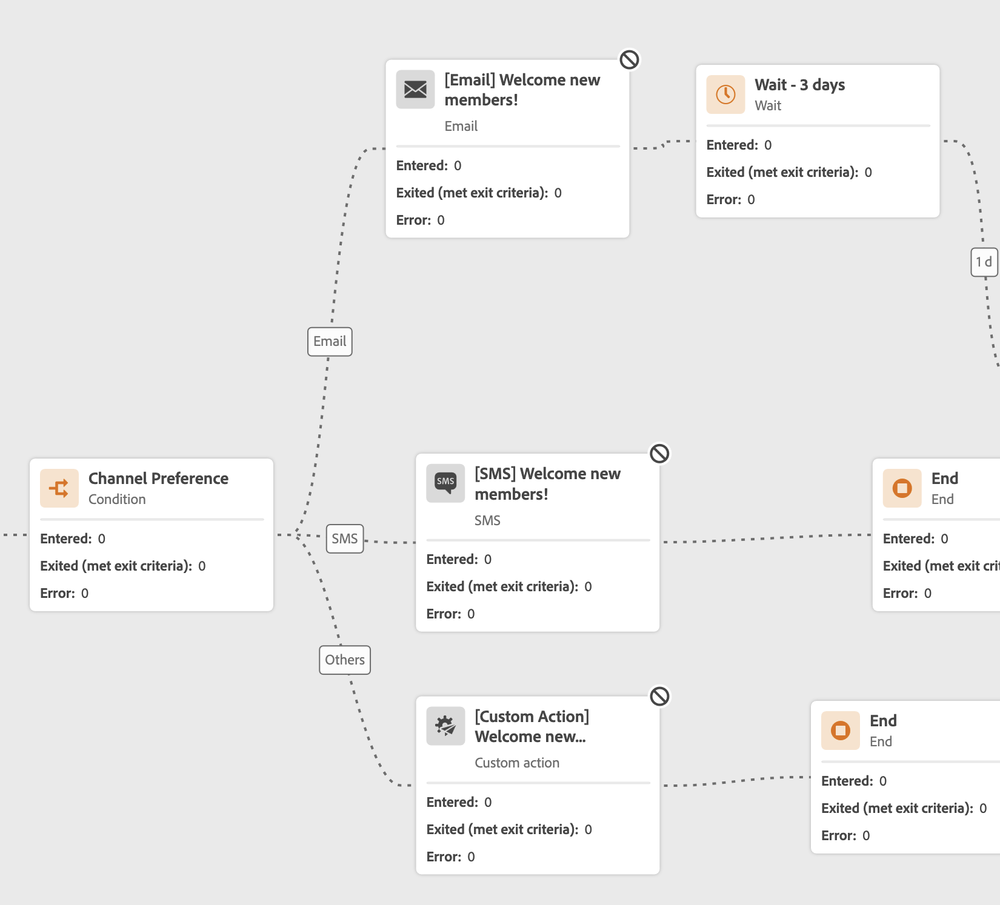
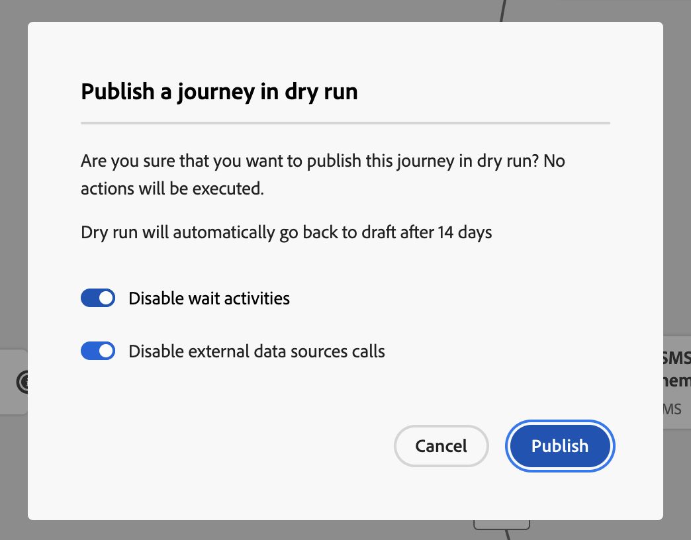
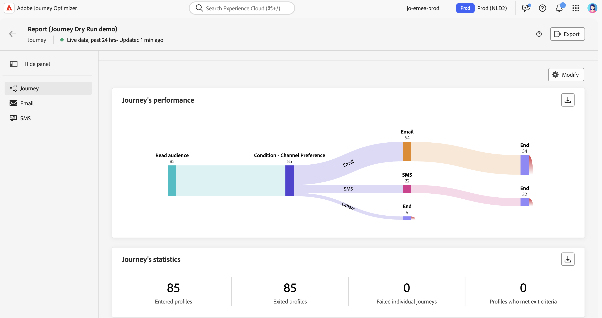

# Körning av resetorr {#journey-dry-run}

>[!CONTEXTUALHELP]
>id="ajo_journey_dry_run"
>title="Torr körning"
>abstract="Den här resan är i Torrkörning. Körning av Rundtur är ett särskilt läge för resepublicering i [!DNL Adobe Journey Optimizer] som gör att resenärerna kan testa en resa med hjälp av verkliga produktionsdata utan att behöva kontakta riktiga kunder eller uppdatera profilinformation.  Den här funktionen hjälper resenärer att få förtroende för sin resedesign och målgruppsanpassning innan de publicerar den live."

>[!CONTEXTUALHELP]
>id="ajo_journey_dry_run_start"
>title="Publicera en resa i torrkörningsläge"
>abstract="Körningen av Rundtur är ett särskilt publiceringsläge för resan i [!DNL Adobe Journey Optimizer] som gör det möjligt för resenärer att testa en resa med hjälp av verkliga produktionsdata. När du har utformat din resa kan du utföra en torr körning för att bekräfta att den fungerar och se till att stegen är korrekta. I det här publiceringsläget kan du röka en resa utan att skicka kommunikation till någon profil."

Körning av Rundtur är ett särskilt läge för resepublicering i [!DNL Adobe Journey Optimizer] som gör att resenärerna kan testa en resa med hjälp av verkliga produktionsdata utan att behöva kontakta riktiga kunder eller uppdatera profilinformation.  Den här funktionen hjälper resenärer att få förtroende för sin resedesign och målgruppsanpassning innan de publicerar den live.

➡️ [Läs mer om torr körning av resor i den här videon](#dry-run-video)

## Viktiga fördelar {#journey-dry-run-benefits}

Rundtur Dry-körningen ökar yrkesutövarnas förtroende och framgångar genom att möjliggöra säker, datadriven testning av kundresor med hjälp av verkliga produktionsdata, utan risk för att kontakta kunder eller ändra profilinformation. Den här funktionen gör det möjligt för resenärer att validera målgruppernas räckvidd och grenlogik innan de publicerar, vilket säkerställer att resorna överensstämmer med deras avsedda affärsmål.

Med Journey Dry-körningen får ni möjlighet att identifiera problem tidigt, optimera målinriktningsstrategier och förbättra resedesignen baserat på faktiska data - inte antaganden. Dry run är integrerat direkt i arbetsytan och ger intuitiv rapportering och insyn i viktiga resultatindikatorer så att teamen kan iterera säkert och effektivisera godkännandearbetsflödena. Detta förbättrar effektiviteten, minskar startriskerna och ger bättre resultat när det gäller kundengagemang.

I slutänden förbättrar den här funktionen time-to-value och minskar antalet misslyckade kundresor.

Journey Dry-körningen ger

1. **Säker testmiljö**: Profiler i torr körningsläge kontaktas inte, vilket säkerställer att det inte finns någon risk för att meddelanden skickas eller att livedata påverkas.
1. **Målgruppsinsikter**: Reseutövare kan förutsäga målgruppernas nåbarhet på olika kundnoder, inklusive avanmälan och undantag baserat på resevillkor.
1. **Återkoppling i realtid**: Mätvärden visas direkt på arbetsytan i realtid, på liknande sätt som live-rapportering, vilket gör det möjligt för resenärerna att förfina sin resedesign.

## Körningslogik för torr körning {#journey-dry-run-exec}

Under körningen körs resan i simuleringsläge och följande specifika beteenden tillämpas på varje reseaktivitet utan att utlösa verkliga åtgärder:

* **Kanalåtgärd** - noder som e-post, SMS eller push-meddelanden körs inte.
* **Anpassade åtgärder** inaktiveras under körning av Dry och deras svar anges till null.

  För att förbättra läsbarheten visas anpassade åtgärder och kanalaktiviteter nedtonade under körningen av en torr körning.

  {width="80%" align="left"}

* **Datakällor**, inklusive externa datakällor, och **Wait**-aktiviteter inaktiveras som standard under torr körning. Du kan dock ändra det här beteendet [när du aktiverar körningsläget Torr](#journey-dry-run-start).

* **Reaktion**-noder har inte körts: alla profiler som anges avslutas utan fel. Följande prioriteringsregler gäller dock:
   * Om en **Reaction**-nod används med en eller flera **unitary event** -noder parallellt, kommer profiler alltid att gå igenom reaktionshändelsen.
   * Om en **Reaction**-nod används med en eller flera **reaktionshändelse** -noder parallellt, går profiler alltid igenom den första på arbetsytan (den översta).

>[!CAUTION]
>
>* Behörigheter att starta en torr körning är begränsade till användare med hög behörighet på **[!DNL Publish journeys]**. Behörigheter att stoppa en torr körning är begränsade till användare med hög behörighet på **[!DNL Manage journeys]**. Läs mer om hur du hanterar [!DNL Journey Optimizer] användares åtkomsträttigheter i [det här avsnittet](../administration/permissions-overview.md).
>
>* Innan du börjar använda funktionen för torr körning ska du [läsa igenom GuarDRAils and Limitations](#journey-dry-run-limitations).

## Starta en torr körning {#journey-dry-run-start}

Du kan använda körningsfunktionen Torr i alla utkast-resor utan fel.

Så här aktiverar du Torr körning:

1. Öppna den resa du vill testa.
1. Markera knappen **[!UICONTROL Dry run]**.

   

1. Markera alternativet om du vill aktivera eller inaktivera **Wait**-aktiviteter och **externa datakällor** anrop och bekräfta publikationen Dry run.

   {width="50%" align="left"}

   Ett statusmeddelande, **[!UICONTROL Activating Dry run]**, visas medan övergången pågår.

1. När den har aktiverats går resan in i **[!UICONTROL Dry run]**-läge.

## Övervaka en torr körning {#journey-dry-monitor}

När Dry Mode-publikationen har startats kan du visualisera körningen av resan och hur profiler utvecklas genom resegrenar och noder.

Mätvärden visas direkt på arbetsytan. Läs mer om live-rapportering och statistik för resan i [Live-rapporten på arbetsytan](report-journey.md).

Du kan även komma åt **Senaste 24-timmarsrapporterna** och **heltidsrapporterna** för torr körning. Klicka på knappen **Visa rapport** i det övre högra hörnet av arbetsytan för att få åtkomst till dessa rapporter.

>[!CAUTION]
>
> Rapporteringsdata är bara tillgängliga när Torr körning är **aktiv**.  När den har stoppats är rapportdata inte längre tillgängliga. Använd knappen **Exportera** ovanför rapporterna om du vill hämta dem vid behov.

## Stoppa en torr körning {#journey-dry-run-stop}

Efter 14 dagar övergår Dry Run-resor automatiskt till statusen **[!UICONTROL Draft]**.

Torra körningar kan också stoppas manuellt. Så här inaktiverar du körningsläget Torr:

1. Öppna den torra körningsresa du vill stoppa.
1. Välj knappen **[!UICONTROL Close]** för att avsluta testet.
Länkar till de senaste 24 timmarna och alla tidsrapporter är tillgängliga på bekräftelseskärmen.

   {width="50%" align="left"}

1. Klicka på **[!UICONTROL Back to Draft]** för att bekräfta.

## Skyddsritningar och begränsningar {#journey-dry-run-limitations}

* Profiler i torr körningsläge räknas mot [Aktiverbara profiler](../audience/license-usage.md)
* Resor i torr körning räknas som en del av kvoten för direktfärd
* Torra resor påverkar inte affärsreglerna
  <!--* When creating a new journey version, if a previous journey version is **Live**, then the Dry run activation is not allowed on the new version.-->
* **Hoppåtgärder** är inte aktiverade i Torr körning.
När en källresa utlöser en **Hoppa** -händelse till ett mål, kommer denna hopphändelse inte att gälla för en version av en torr körningsresa. Om till exempel den senaste versionen av en resa är körd i Torr körning och den föregående är **Live**, kommer hopphändelsen att ignorera körningsversionen av Torr och endast gälla för **Live** .

## Resestegshändelser och torr körning {#journey-step-events}

Körning av körning av resedagring genererar **stepEvents**. Dessa stepEvents har en specifik flagga och Dry-ID: `inDryRun` och `dryRunID`.

* `_experience.journeyOrchestration.stepEvents.inDryRun` returnerar `true` om Torr-körningen är aktiverad, i annat fall `false`
* `_experience.journeyOrchestration.stepEvents.dryRunID` returnerar ID:t för en instans med torr körning

Om du exporterar stepEvent-data till **externa system** kan du filtrera körningar med flaggan `inDryRun`.

Vid analys av **reserapporteringsmått** med hjälp av [!DNL Adobe Experience Platform]-frågetjänsten måste händelser som genererats av Dry Run uteslutas. Om du vill göra det anger du flaggan `inDryRun` till `false`.

## Instruktionsvideo {#dry-run-video}

Lär dig hur du torkar dina resor i den här videon.

>[!VIDEO](https://video.tv.adobe.com/v/3464681/?learn=on&enablevpops)
