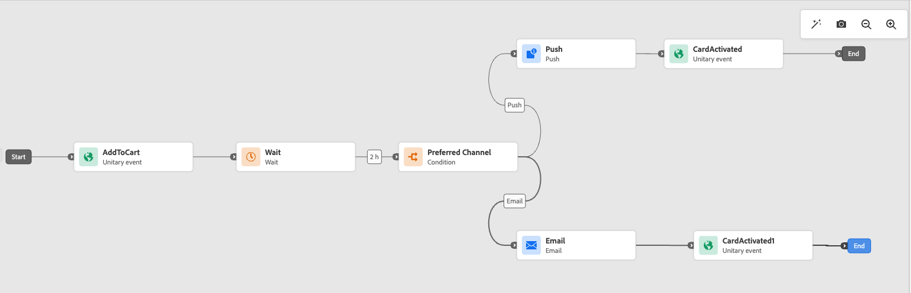

# Pausa en resa {#journey-pause}

>[!CONTEXTUALHELP]
>id="ajo_journey_pause"
>title="Pausa din resa"
>abstract="Pausa en live-resa för att förhindra att nya profiler kommer in. Välj om du vill ta bort profiler som finns på resan eller behålla dem på plats. Om de behålls kommer de att återuppta körningen vid nästa åtgärdsaktivitet när resan har startats om. Perfekt för uppdateringar eller nödstopp utan att förlora några framsteg."

Du kan pausa dina resor, utföra alla ändringar som behövs och återuppta dem igen när som helst.<!--You can choose whether the journey is resumed at the end of the pause period, or whether it stops completely. --> Under pausen kan du [använda avslutningskriterier för profilattribut](#journey-exit-criteria) för att exkludera profiler baserat på deras attribut. Resan återupptas automatiskt i slutet av pausperioden. Du kan även [återuppta det manuellt](#journey-resume-steps).

## Viktiga fördelar {#journey-pause-benefits}

Pausa och återuppta resor ger resenärerna större kontroll och flexibilitet genom att tillåta att direktresor tillfälligt avbryts utan att störa kundupplevelsen. När det är pausat skickas ingen kommunikation och profilerna förblir i ett uppehåll tills resan återupptas.

Denna funktion minskar risken för att skicka oavsiktliga meddelanden vid fel eller uppdateringar (t.ex. ändring av meddelandeinnehåll), stöder säkrare resehantering och ökar administratörens förtroende. Synligheten till pausade resor och deras status direkt i användargränssnittet ökar insynen och flexibiliteten ytterligare.

>[!CAUTION]
>
>* Behörigheter att pausa och återuppta resor är begränsade till användare med högnivåbehörighet **[!DNL Publish journeys]**. Läs mer om hur du hanterar [!DNL Journey Optimizer] användares åtkomsträttigheter i [det här avsnittet](../administration/permissions-overview.md).
>
>* Innan du börjar använda funktionen för paus/återupptagning ska du [läsa igenom GuarDRAils och begränsningar](#journey-pause-guardrails).


## Pausa en resa {#journey-pause-steps}

Du kan pausa alla **Live**-resor.

Så här pausar du din resa:

1. Öppna den resa du vill pausa.
1. Klicka på knappen **...Mer** i den övre högra delen av arbetsytan för resan och välj **Paus**.

   

1. Välj hur du vill hantera profiler som för närvarande är på resan.

   {width="50%" align="left"}

   Du kan:

   * **Håll**-profiler - Profilerna väntar på nästa **Åtgärdsnod** för att resan ska återupptas
   * **Ignorera** profiler - Profiler exkluderas från resan på nästa **Åtgärd**-nod

   När du pausar en resa antas du att du planerar att återuppta den någon gång. En resa kan dock inte pausas i oändlighet. För att förhindra detta kan du definiera hur länge resan ska pausas (mellan 1 och 14 dagar). Efter det valda antalet dagar återupptas resan automatiskt.

1. Bekräfta genom att klicka på knappen **Paus**.

Det maximala antalet profiler som kan hållas på pausade resor för din organisation visas i reseinventeringen. Den syns bara när minst en resa är pausad. Denna indikator visar också det totala antalet pausade resor. Den uppdateras var 30:e minut. Mer information finns i [GuarDRAils and Limitation](#guardrails-and-limitations).

{width="50%" align="left"}

I listan över dina resor kan du pausa en eller flera **Live**-resor. Om du vill pausa en grupp resor (_masspaus_) markerar du dem i listan och klickar på knappen **Paus** i det blå fältet längst ned på skärmen. Knappen **Paus** är bara tillgänglig när **Live**-resor har valts.


## Logik för körning av pausade resor {#journey-pause-exec}

När en resa pausas, förkastas alltid färska ingångar, oavsett om de är i läget Håll kvar eller Kasta.

När en resa pausas beror profilhantering och aktivitetskörning på aktiviteten. Beteenden beskrivs nedan. Mer information finns även i [Exemplet från början till slut](#journey-pause-sample).


| Reseverksamhet | När resan pausas |
|-------------------------|--------------------------------------------------|
| [Målgruppskvalifikation](audience-qualification-events.md) | <ul> <li>Vid den första noden på arbetsytan: Alla profilkvalificeringar för målgruppen tas bort </li><li>I andra noder: Samma beteende som i en direktresa, men om målgruppskvalifikationen är efter en <strong>åtgärd</strong> -aktivitet och användaren är pausad på den åtgärden, ignoreras målgruppsklassificeringen. </li></ul> |
| [Enhetlig händelse](general-events.md) | <ul> <li>Vid den första noden på arbetsytan: Händelsen ignoreras</li><li>I andra noder: Samma beteende som i en direktresa, men om händelsen inträffar efter en <strong>åtgärd</strong>-aktivitet och användaren pausas på den åtgärden, ignoreras händelsen. </li></ul> |
| [Läs målgrupp](read-audience.md) | Samma beteende som i en direktresa, med några få särdrag: <ol> <li> Om <strong>Pause</strong> trycktes ned efter att aktiviteten <strong>Läs målgrupp</strong> hade startats, fortsätter profiler som har gått in i resan (till nästa <strong>Åtgärd</strong> -aktivitet). När resan läser målgrupper med en viss hastighet kommer återstående profiler i kön att ignoreras om hela målgruppen inte har gått in ännu.</li><li> För enstaka körningar: Inget fel visas vid återupptagningstid om det schemalagda datumet infaller före återupptagsdatumet. Det schemat ignoreras.</li><li>För inkrementella resor: <ul><li>Om paus inträffar före den första förekomsten spelas hela målgruppen upp när du återupptar den. </li><li>Om en paus inträffar t.ex. den 4:e dagen av en daglig upprepning och resa förblir pausad till den 9:e dagen så inkluderas alla profiler som har gått in från den 4:e till 9  </li></ul></ol> |
| [Reaktion](reaction-events.md) | Samma beteende som i en direktresa, men om reaktionen inträffar efter en <strong>åtgärd</strong> -aktivitet och användaren pausas på den åtgärden, ignoreras reaktionshändelsen. |
| [Vänta](wait-activity.md) | Samma beteende som i en direktresa |
| [Villkor](condition-activity.md) | Samma beteende som i en direktresa |
| [Innehållsbeslut](content-decision.md) | Profilerna parkeras eller ignoreras baserat på vad användaren har valt när resan har pausats |
| [Kanalåtgärd](journeys-message.md) | Profilerna parkeras eller ignoreras baserat på vad användaren har valt när resan har pausats |
| [Anpassad åtgärd](../action/action.md) | Profilerna parkeras eller ignoreras baserat på vad användaren har valt när resan har pausats |
| [Uppdatera profil](update-profiles.md) &amp; [Hoppa](jump.md) | Profilerna parkeras eller ignoreras baserat på vad användaren har valt när resan har pausats |
| [Externa data, Source](../datasource/external-data-sources.md) | Samma beteende som i en direktresa |
| [Avsluta villkor](journey-properties.md#exit-criteria) | Samma beteende som i en direktresa |


Lär dig hur du felsöker ignorerade filer i [det här avsnittet](#discards-troubleshoot).

## Så här återupptar du en pausad resa {#journey-resume-steps}

>[!CONTEXTUALHELP]
>id="ajo_journey_resume"
>title="Återuppta resan"
>abstract="Återuppta en pausad resa så att nya profiler kan komma in igen. Om profiler väntade under pausen fortsätter de sin resa. Perfekt för säker återstart av resor efter uppdateringar eller pauser."

Pausade resor återupptas automatiskt vid slutet av den maximala pausperioden på 14 dagar. De kan när som helst återupptas manuellt. Om du återupptar en pausad resa kan nya profiler komma in igen. Om profiler väntade under pausen fortsätter de sin resa. Perfekt för säker återstart av resor efter uppdateringar eller pauser.

Så här återupptar du en pausad resa och börjar lyssna på resehändelser igen:

1. Öppna den resa du vill återuppta.
1. Markera knappen **...Mer** i den övre högra delen av arbetsytan och sedan **Återuppta**.

   Resan växlar till statusen **Återupptar**. När resan återupptas börjar nya ingångar inom en minut. Det kan ta en stund att återuppta profiler - profilerna återupptas med en hastighet på 5 000 bit/s.  Eftersom alla profiler måste återupptas för att resan ska bli **Live** igen kan övergången från **Återuppta** till **Live** ta lite tid.

1. Bekräfta genom att klicka på knappen **Återuppta**.


I listan över dina resor kan du återuppta en eller flera **Pausade** resor. Om du vill återuppta en grupp av resor (_massåteruppta_) markerar du dem och klickar på knappen **Återuppta** i det blå fältet längst ned på skärmen. Observera att knappen **Återuppta** endast är tillgänglig när **Pausade** resor har valts.


## Använda ett utträdesvillkor i en pausad resa {#journey-exit-criteria}

När en resa pausas kan du använda ett avslutningskriterium baserat på profilattribut. Det här filtret gör att profiler som matchar det definierade uttrycket utesluts vid återupptagningstid. När de profilattributbaserade avslutningskriterierna har angetts kommer de att tillämpas på åtgärdsnoder, även för nya profilentréer. Befintliga profiler som matchar villkoren och nya profiler som går in på resan kommer att exkluderas från resan **på nästa åtgärdsnod** som påträffas.

Så här utesluter du till exempel alla franska kunder från en pausad resa:

1. Bläddra till den pausade resa som du vill ändra.

1. Välj ikonen **Avsluta villkor** .

   

1. Klicka på **Lägg till avslutsvillkor** i inställningarna för **Avsluta villkor** för att definiera ett filter baserat på profilattribut.

1. Ange uttrycket för att exkludera profiler där landattributet är lika med Frankrike.

   

1. Spara filtret och klicka på knappen **Uppdatera resa** för att tillämpa ändringarna.

1. [Fortsätt resan](#journey-resume-steps).

   Vid CV utesluts alla profiler med landattributet inställt på Frankrike automatiskt från resan vid nästa åtgärdsnod. Alla nya profiler med landattributet inställt på Frankrike som försöker ta sig in på resan blockeras också vid nästa åtgärdsnod.

Observera att profilundantag för profiler som för närvarande är på resan och för nya profiler bara inträffar **när de når en åtgärdsnod**.

>[!CAUTION]
>
>* Du kan bara ange **ett**-profilattributbaserade avslutningskriterier per resa.
>
>* Du kan bara skapa, uppdatera eller ta bort ett profilattributsbaserat avslutningsvillkor i **Pausade** resor.
>
>* Läs mer om det profilattributbaserade avslutningskriteriet [i det här avsnittet](journey-properties.md#profile-exit-criteria).

## Skyddsritningar och begränsningar {#journey-pause-guardrails}

* En reseversion kan pausas i upp till **14 dagar**, men högst **10 miljoner profiler** tillåts på pausade resor i hela organisationen.
Denna gräns avser det totala antalet profiler som finns på alla pausade resor, inte distinkta profiler. Om till exempel samma 5 MB-profiler hålls på två pausade resor, nås gränsen på 10 MB.
Den här gränsen kontrolleras var 30:e minut. Detta innebär att du tillfälligt kan överskrida tröskelvärdet på 10 miljoner, men när systemet upptäcker det kommer eventuella ytterligare profiler automatiskt att ignoreras.

  Om du återupptar resor för att få tillbaka antalet hållna profiler under gränsen återupptas resan omedelbart, men det kan ta upp till 30 minuter innan profilantalet uppdateras. Under den tiden kan systemet fortfarande betrakta profilerna som pausade.

* För resor som innehåller [inkommande aktiviteter](../channels/gs-channels.md#inbound-channels) (t.ex. i appen, på webben, osv.) avbryts inte kommunikation som redan har utlösts om resan pausas. Om en profil har kvalificerat sig för en inkommande aktivitet innan paus, kommer motsvarande meddelande fortfarande att levereras. Om du vill stoppa all inkommande kommunikation helt måste du stoppa resan.
* Pausade resor räknas in i kvoten för direktfärd
* Profiler som hade passerat resan men ignorerats under pausen räknas fortfarande som profiler som kan användas
* Pausade resor beaktas i alla affärsregler, på samma sätt som om de var levande
* Den globala tidsgränsen för resan gäller fortfarande för pausade resor. Om en profil till exempel har varit under en resa i 90 dagar och resan har pausats, kommer den här profilen fortfarande att avsluta resan den 91:e dagen
* Profilerna **tas bort** i en pausad resa när de når en åtgärdsaktivitet. Om de stannar på en väntetid under den tid som en resa pausas och avslutar som väntar efter att den har återupptagits, fortsätter resan och tas inte bort. [Se exempelkoden från början till slut](#journey-pause-sample)
* Även efter pausen kommer dessa händelser att räknas in i antalet resthändelser per sekund, efter vilken strypningen görs för att skapa en enhet
* När profiler hålls i en pausad resa uppdateras profilattributen vid återupptagningstid
* Villkor körs fortfarande i pausade resor, så om en resa har pausats på grund av problem med datakvaliteten kan alla villkor som föregår en åtgärdsnod utvärderas med felaktiga data
* För inkrementella målgruppsbaserade **målgruppsresor** beaktas pausad varaktighet. Detta gäller inte för målgruppskvalifikationer eller händelsebaserade resor (om en målgruppskompetens eller ett evenemang tas emot under en paus och de är den första aktiviteten på resan ignoreras dessa händelser)
* Om profiler hålls på en resa och den här resan automatiskt återupptas efter några dagar, fortsätter profilerna resan och släpps inte. Om du vill släppa dem måste du stoppa resan
* Vid pausade resor utlöses inga larm för [batchsegmentsvarning](../reports/alerts.md#alert-read-audiences)
* Det finns inga granskningsloggar i systemet när efter 14 dagar pausläget för resan har avslutats
* Vissa ignorerade profiler kan vara synliga i resesegmenthändelsen men inte synliga i rapporteringen. Exempel:
   * Ignorera affärshändelser för **Läs målgrupp**
   * **Jobb för läsning av målgrupp** tas bort på grund av pausad resa
   * Händelser ignorerades när aktiviteten **Event** utfördes efter en åtgärd där profilen väntade


## Exemplet från början till slut {#journey-pause-sample}

Låt oss ta exemplet på resan nedan:

{zoomable="yes"}

När du pausar den här resan väljer du om profiler är **Ignorerade** eller **Håll** och sedan är profilhanteringen följande:

1. **AddToCart**-aktivitet: alla nya profiler blockeras. Om en profil redan har gått in på resan före en paus fortsätter de till nästa åtgärdsnod.
1. **Vänta**-aktivitet: profiler fortsätter att vänta normalt på noden och kommer att avsluta den, även om resan är i pausläge.
1. **Villkor**: Profilerna fortsätter att gå igenom villkoren och flyttas till den högra grenen, baserat på uttrycket som definierats för villkoret.
1. **Push**/**Email**-aktiviteter: under en pausad resa börjar profiler vänta eller tas bort (baserat på det val som användaren gjorde vid tiden för paus) på nästa åtgärdsnod. Profilerna kommer att börja vänta eller kastas bort där.
1. **Händelser** efter **Action**-noder: Om en profil väntar på en **Action**-nod och det finns en **Event**-aktivitet efter den ignoreras händelsen om den utlöses.

Enligt det här beteendet kan du se profilnummer öka på pausad resa, främst i aktiviteter före **Åtgärd** -aktiviteter. I det exemplet är till exempel aktiviteten **Wait** fortfarande aktiverad, vilket ökar antalet profiler som går igenom aktiviteten **Condition** när de avslutar den.

När du återupptar den här resan:

1. Färska reseingångar börjar inom en minut.
1. Profiler som för närvarande väntade på resan för **Åtgärdsaktiviteter** återupptas med en hastighet på 5 000 steg. De kan sedan ange den **åtgärd** de väntade på och fortsätta resan.

## Felsöka uteblivna profiler under pausade resor {#discards-troubleshoot}

Du kan använda [Adobe Experience Platform Query Service](https://experienceleague.adobe.com/docs/experience-platform/query/api/getting-started.html){target="_blank"} för att fråga efter steghändelser, som kan ge mer information om ignorerade profiler, beroende på när de inträffar.

* Använd följande kod för att ta bort filer som inträffar innan profilen kommer in på resan:

  ```sql
  SELECT
  TIMESTAMP,
  _experience.journeyOrchestration.profile.ID,
  to_json(_experience.journeyOrchestration)
  FROM
  journey_step_events
  WHERE
  _experience.journeyOrchestration.serviceEvents.dispatcher.eventType = 'PAUSED_JOURNEY_VERSION'
  AND _experience.journeyOrchestration.journey.versionID=<jvId>  
  ```

  Här listas de utkast som gjordes vid ingången till resan:

   1. När en målgruppsresa körs och den första noden fortfarande bearbetas, ignoreras alla obearbetade profiler om resan pausas.

   1. När en ny enhetshändelse anländer för startnoden (för att utlösa en entré) medan resan pausas, ignoreras händelsen.

* Använd följande kod för att ta bort filer som inträffar när profilen redan används:

  ```sql
  SELECT
  TIMESTAMP,
  _experience.journeyOrchestration.profile.ID,
  to_json(_experience.journeyOrchestration)
  FROM
  journey_step_events
  WHERE
  _experience.journeyOrchestration.serviceEvents.stateMachine.eventType = 'JOURNEY_IN_PAUSED_STATE'
  AND _experience.journeyOrchestration.journey.versionID=<jvId> 
  ```

  Det här kommandot listar de ignoreringar som har gjorts när profiler är på en resa:

   1. Om resan pausas med alternativet Ignorera aktiverat och en profil redan har angetts före pausen, kommer den profilen att ignoreras när den kommer till nästa åtgärdsnod.

   1. Om resan pausades med alternativet för att hålla kvar valt men profiler ignorerades på grund av att kvoten på 10 miljoner överskrids, kommer dessa profiler fortfarande att ignoreras när de kommer till nästa åtgärdsnod.


