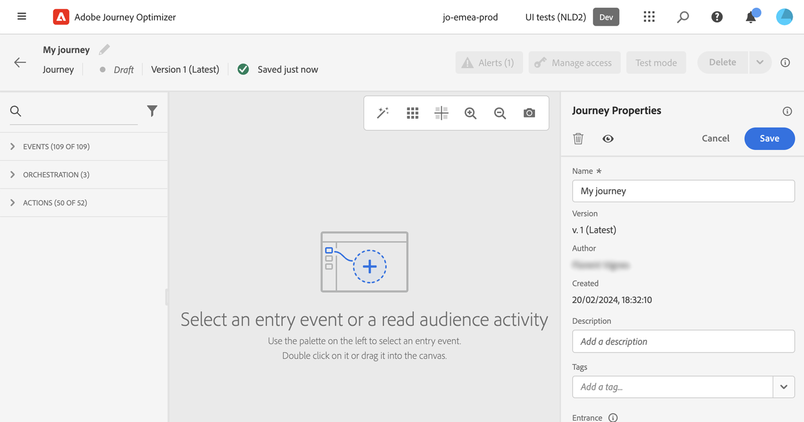

# Ange egenskaper för din resa {#jo-properties}

>[!CONTEXTUALHELP]
>id="ajo_journey_properties"
>title="Resans egenskaper"
>abstract="I det här avsnittet visas resans egenskaper. Som standard är skrivskyddade parametrar dolda. Vilka inställningar som är tillgängliga beror på resans status, på dina behörigheter och din produktkonfiguration."

## Åtkomst till egenskaperna för en resa {#access-properties}

Resans egenskaper är centraliserade i rätt spår. Det här avsnittet visas som standard när du skapar en ny resa. Klicka på pennikonen bredvid resans namn för att öppna befintliga resor.

I det här avsnittet kan du definiera namnet på resan, lägga till en beskrivning och:

* hantera [inträde och återinträde](#entrance),
* välj start och slut [datum](#dates),
* hantera [åtkomst till data](#manage-access),
* definiera en [timeout-varaktighet](#timeout) i reseaktiviteter (endast för administratörsanvändare),
* välj resan och profilen [tidszoner](#timezone)
* Tilldela enhetliga Adobe Experience Platform-taggar till din resa för att enkelt klassificera dem och förbättra sökningen från kampanjlistan. [Lär dig arbeta med taggar](../start/search-filter-categorize.md#tags)

>[!NOTE]
>
>För direktresor visar den här skärmen endast publiceringsdatumet och namnet på den användare som publicerade resan.

Med den tekniska informationen för **Kopiera** kan du kopiera teknisk information om den resa som supportteamet kan använda för att felsöka. Följande information kopieras: `JourneyVersion UID`, `OrgID`, `orgName`, `sandboxName`, `lastDeployedBy`, `lastDeployedAt`.

Läs mer om tekniska fält som rör en resa för en viss profil och hur du använder dem [på den här sidan](expression/journey-properties.md).

## Ingång och återinträde {#entrance}

Profilinmatningsläget definieras på resenivån i den högra konfigurationsrutan. Inställningarna beskrivs nedan.

Profilingångshantering beror på typen av resor. Läs mer om hantering av profilinträde och återinträde på webben på [den här sidan](entry-management.md).

### Tillåt återinträde  {#allow-reentrance}

>[!CONTEXTUALHELP]
>id="ajo_journey_properties_entrance"
>title="Tillåt återinträde"
>abstract="Som standard tillåter nya resor återinträde. Du kan avmarkera alternativet **Tillåt återinträde** till exempel om du vill erbjuda en engångspresentation när en person går in i en affär."
>additional-url="https://experienceleague.adobe.com/en/docs/journey-optimizer/using/orchestrate-journeys/manage-journey/entry-management" text="Profilingångshantering"

Som standard tillåter nya resor återinträde. Du kan avmarkera alternativet **Tillåt återinträde** för engångsresor, till exempel om du vill erbjuda en engångsgåva när en person går till en affär.

### Vänteperiod för återinträde  {#reentrance-wait}

>[!CONTEXTUALHELP]
>id="ajo_journey_properties_re-entrance_wait"
>title="Vänteperiod för återinträde"
>abstract="Ange en väntetid innan du tillåter att en profil går in på resan igen på en resa. Detta förhindrar att användarna kommer in på resan igen under en viss tid. Maximal varaktighet: 90 dagar."
>additional-url="https://experienceleague.adobe.com/en/docs/journey-optimizer/using/orchestrate-journeys/manage-journey/entry-management" text="Profilingångshantering"

När alternativet **Tillåt återinträde** är aktiverat visas fältet **Återkommande vänteperiod**. I det här fältet kan du definiera väntetiden innan du tillåter en profil att gå in på resan igen med en enda resa (med början från en händelse eller en målgruppskvalifikation). Detta förhindrar att resor utlöses felaktigt flera gånger för samma händelse. Som standard är fältet inställt på 5 minuter. Maximala längden är 90 dagar.

## Hantera åtkomst {#manage-access}

Klicka på knappen **[!UICONTROL Manage access]** om du vill tilldela anpassade eller grundläggande dataanvändningsetiketter till resan. [Läs mer om OLAC (Object Level Access Control)](../administration/object-based-access.md)

## Tidszoner för resa och profil {#timezone}

Tidszonen definieras på resenivå. Du kan ange en fast tidszon eller använda Adobe Experience Platform-profiler för att definiera resetidszonen. Om en tidszon definieras i Adobe Experience Platform-profilen kan den hämtas under resan.

Mer information om hantering av tidszoner finns på [den här sidan](../building-journeys/timezone-management.md).

## Start- och slutdatum {#dates}

>[!CONTEXTUALHELP]
>id="ajo_journey_properties_start_date"
>title="Startdatum"
>abstract="Välj det datum då resan kan börja. Om inget startdatum anges anges det automatiskt vid publiceringstidpunkten."

>[!CONTEXTUALHELP]
>id="ajo_journey_properties_end_date"
>title="Slutdatum"
>abstract="Välj slutdatum för din resa. När det datumet har nåtts avslutar profiler på den resan automatiskt och nya kan inte längre komma in i den."

Du kan definiera ett **startdatum**. Om du inte har angett någon sådan kommer den att definieras automatiskt vid publiceringstidpunkten.

Du kan också lägga till ett **slutdatum**. Detta gör att profiler kan avslutas automatiskt när datumet nås. Om inget slutdatum anges kan profiler stanna tills den [globala resetidsgränsen](#global_timeout) (som vanligtvis är 91 dagar). Det enda undantaget är återkommande läsmålgruppsresor med **Tvinga återinträde vid upprepning** aktiverat, som slutar vid startdatumet för nästa förekomst.

## Timeout {#timeout}

### Tidsgräns eller fel i reseaktiviteter {#timeout_and_error}

>[!CONTEXTUALHELP]
>id="ajo_journey_properties_timeout"
>title="Timeout"
>abstract="Ange hur lång tid resan ska försöka utföra en åtgärd eller verifiera ett villkor innan det betraktas som en timeout."

När du redigerar en åtgärd eller villkorsaktivitet kan du definiera en alternativ sökväg om ett fel eller en timeout inträffar. Om bearbetningen av aktiviteten som förhör ett tredjepartssystem överskrider tidsgränsen som anges i fältet **[!UICONTROL Timeout or error]** för resans egenskaper, väljs den andra sökvägen för att utföra en eventuell reservåtgärd.

Giltiga värden är mellan 1 och 30 sekunder.

Vi rekommenderar att du definierar ett mycket kort **[!UICONTROL Timeout or error]**-värde om din resa är tidskänslig (exempel: reagerar på en persons realtidsplats) eftersom du inte kan fördröja åtgärden i mer än några sekunder. Om resan är mindre tidskänslig kan du använda ett längre värde för att ge mer tid till det system som anropas för att skicka ett giltigt svar.

Journeys använder också en global tidsgräns enligt informationen nedan.

### Tidsgräns för global resa {#global_timeout}

Utöver den [timeout](#timeout_and_error) som används i reseaktiviteter används en timeout för den globala resan. Den visas inte i gränssnittet och kan inte ändras.

Den här globala tidsgränsen avbryter förloppet för personer på resan **91 dagar** efter att de har gått in. Det innebär att en persons resa inte kan vara längre än 91 dagar. Efter denna timeout-period tas personens data bort. Individer som fortfarande flyter i resan i slutet av timeoutperioden kommer att stoppas och de kommer inte att beaktas vid rapporteringen. Du kan därför se fler människor komma in på resan än att gå ut.

På grund av den 91-dagars tidsgränsen för resor, när återinträde inte tillåts, kan vi inte säkerställa att återinträdesspärren fungerar mer än 91 dagar. Eftersom vi tar bort all information om personer som tagit sig in på resan 91 dagar efter ankomsten, kan vi inte veta vem som tagit sig in tidigare, mer än 91 dagar sedan.

En enskild person kan bara förlägga en vänteaktivitet om han eller hon har tillräckligt med tid kvar på resan för att slutföra väntetiden innan tidsgränsen på 91 dagar för en resa är slut. Läs [den här sidan](../building-journeys/wait-activity.md).

#### TTL (Time-to-Live) och datalagring - frågor och svar {#timeout-faq}

Från och med Adobe Journey Optimizer-versionen från juni 2024 har den globala tidsgränsen för resan flyttats från 30 till 91 dagar. Effekter listas i Frågor och svar nedan:

**För Unitary Journeys**
<table style="table-layout:auto">
  <tr style="border: 1;">
    <td>
      
Vad händer med den resa som publiceras efter att TTL-tillägget lanserats?

    </td>
    <td>
      
Profiler som kommer in på den nya resan får automatiskt en TTL på 91 dagar.

    </td>
  </tr>
  <tr style="border: 1;">
    <td>
      
Vad händer med en profil som går in på en resa som publicerades innan TTL-tillägget startades?

    </td>
    <td>
      
Profilen kommer att ha en TTL på 30 dagar (7 dagar för HIPAA), vilket motsvarar den tid då resan ursprungligen publicerades.

    </td>
  </tr>
  <tr style="border: 1;">
    <td>
      
Vad händer med en profil som redan har registrerat en resa när TTL-tillägget startas?

    </td>
    <td>
      
Profilen behåller en TTL på 30 dagar (7 dagar för HIPAA) enligt den ursprungliga publiceringstiden för resan.

    </td>
  </tr>
  <tr style="border: 1;">
    <td>
      
Vad händer med en profil i en tidigare version som publiceras om efter att TTL-tillägget startats?

    </td>
    <td>
      
Profilen behåller en TTL på 30 dagar (7 dagar för HIPAA), i linje med den ursprungliga reseversionens publiceringstid.

    </td>
  </tr>
  <tr style="border: 1;">
    <td>
      
Vad händer med en ny profil som anger en återpublicerad reseversion efter att TTL-tillägget har startats?

    </td>
    <td>
      
Profilen kommer att ha en TTL på 91 dagar, vilket matchar TTL-värdet för den nypublicerade reseversionen.

    </td>
  </tr>
</table>

**För segmentutlösarresor**

<table style="table-layout:auto">
  <tr style="border: 1;">
    <td>
      
Vad händer med nya engångsresor som publiceras efter tillägget för TTL?

    </td>
    <td>
      
Profiler som kommer in på den nya resan kommer att ha en TTL på 91 dagar automatiskt.

    </td>
  </tr>
  <tr style="border: 1;">
    <td>
      
Vad händer med nya återkommande resor utan tvingad återinträde som publiceras efter tillägget för TTL?

    </td>
    <td>
      
Profiler som kommer in på den nya resan kommer att ha en TTL på 91 dagar automatiskt.

    </td>
  </tr>
  <tr style="border: 1;">
    <td>
      
Vad händer med nya återkommande resor med tvingad återinträde som publiceras efter tillägget för TTL?

    </td>
    <td>
      
Profiler som går in på den nya resan kommer att ha en TTL som motsvarar upprepningsperioden. Om resan till exempel körs dagligen är TTL 1 dag.

    </td>
  </tr>
  <tr style="border: 1;">
    <td>
      
Vad händer med en profil som går in på en resa som publicerades innan TTL-tillägget startades?

    </td>
    <td>
      
Profilen kommer att ha en TTL på 30 dagar (7 dagar för HIPAA), vilket överensstämmer med den ursprungliga publiceringstiden. För återkommande resor med tvingad återinträde kommer TTL-värdet att matcha upprepningsperioden.

    </td>
  </tr>
  <tr style="border: 1;">
    <td>
      
Vad händer med en profil som körs genom en resa när TTL-tillägget startas?

    </td>
    <td>
      
Profilen behåller en TTL på 30 dagar (7 dagar för HIPAA) enligt den ursprungliga publiceringstiden för resan. För återkommande resor med tvingad återinträde kommer TTL-värdet att matcha upprepningsperioden.

    </td>
  </tr>
  <tr style="border: 1;">
    <td>
      
Vad händer med en profil som körs i en tidigare version som publiceras om efter att tillägget TTL har startats?

    </td>
    <td>
      
Profilen behåller en TTL på 30 dagar (7 dagar för HIPPA), i linje med den ursprungliga reseversionens publiceringstid. För återkommande resor med tvingad återinträde kommer TTL-värdet att matcha upprepningsperioden.

    </td>
  </tr>
  <tr style="border: 1;">
    <td>
      
Vad händer med en ny profil som anger en återpublicerad reseversion efter att TTL-tillägget har startats?

    </td>
    <td>
      
Profilen kommer att ha en TTL på 91 dagar, vilket matchar TTL-värdet för den nypublicerade reseversionen. För återkommande resor med tvingad återinträde kommer TTL-värdet att matcha upprepningsperioden.

    </td>
  </tr>
</table>

## Sammanfoga profiler {#merge-policies}

Resan använder sammanfogningsprinciper när profildata hämtas från Adobe Experience Platform. Beroende på resetyp används olika kopplingsprofiler:

* På läs målgrupps- eller målgruppsklassificeringsresor: målgruppspolicyn används
* Vid Unitary-händelseresor: standardprincipen för sammanslagning används
* Vid affärsevenemangsresor: sammanfogningspolicyn från målgruppen i följande Läs målgruppsaktivitet används

Resan kommer att respektera den sammanslagningspolicy som används under hela resan. Om flera målgrupper används i en resa (t.ex. i&quot;inAudience&quot;-funktioner), vilket skapar inkonsekvenser med den sammanfogningspolicy som används under resan, uppstår därför ett fel och publiceringen blockeras. Men om en inkonsekvent målgrupp används i meddelandepersonalisering visas ingen varning trots inkonsekvensen. Därför rekommenderar vi att du kontrollerar vilken sammanfogningspolicy som är kopplad till målgruppen när den här målgruppen används i meddelandepersonalisering.

Mer information om sammanfogningsprinciper finns i [Adobe Experience Platform-dokumentationen](https://experienceleague.adobe.com/en/docs/experience-platform/profile/merge-policies/overview){target="_blank"}.

## Avslutningskriterier {#exit-criteria}

>[!CONTEXTUALHELP]
>id="ajo_journey_exit_criterias"
>title="Utträdeskriterier för resor"
>abstract="I det här avsnittet visas alternativen för avslutningskriterier. Du kan skapa en eller flera regler för avslutningskriterier för din resa."

### Beskrivning {#exit-criteria-desc}

Genom att lägga till kriterier för att avsluta resan gör du så att profilerna avslutas så snart en händelse inträffar (t.ex. köp) eller så kvalificerar de sig för en viss målgrupp. Detta förhindrar användaren från att få ut mer information från resan.

Du kanske vill ta bort profiler från en resa när de inte längre uppfyller resans syfte. Detta kan uppnås med **globala avslutningskriterier**, som är nära kopplade till målhantering.

**Exempel på användning**

En marknadsförare har en marknadsföringsresa som har en serie kommunikationer. Alla dessa meddelanden syftar till att få kunden att göra ett inköp. Så snart köpet är klart bör kunden inte få resten av meddelandena i serien. Genom att definiera ett avslutningskriterium tas alla profiler som har gjort ett köp bort från resan.

### Konfiguration och användning {#exit-criteria-config}

Avslutskriterier ställs in på resenivå. En resa kan ha flera exitkriterier. När du har angett flera avslutsvillkor utförs utvärderingen uppifrån och ned med en `OR`-logik. Om du har avslutningskriterier A och avslutningskriterier B utvärderas det som A **OR** B. Kriterierna utvärderas under varje steg av resan.

Följ de här stegen för att **skapa** och avsluta villkor:

1. Öppna din resa.

1. Klicka på ikonen **[!UICONTROL Show Exit Criteria]** som finns i det övre högra avsnittet på arbetsytan.
   {width="40%" align="left"}
1. Klicka på knappen **[!UICONTROL Add exit criteria]**.
   {width="40%" align="left"}
1. Ange en **etikett** och välj om ditt avslutsvillkor är baserat på en **händelse** eller en **publik**.

* För avslutningskriterier baserade på en händelse väljer du endast en händelse.
* Välj en målgrupp för avslutningskriterier som baseras på en målgrupp. Obs! Det kan ta upp till 10 minuter innan avslutningskriterierna används för att bli effektiva.

Du kan lägga till flera avslutningskriterier.

{width="40%" align="left"}

### Skyddsritningar och begränsningar {#exit-criteria-guardrails}

Följande skyddsförslag och begränsningar gäller för möjligheten att avsluta resan:

* Utgångskriterier definieras endast i utkastläge
* Samstämmighet mellan händelser och händelsebaserade kriterier för utträde på resan

