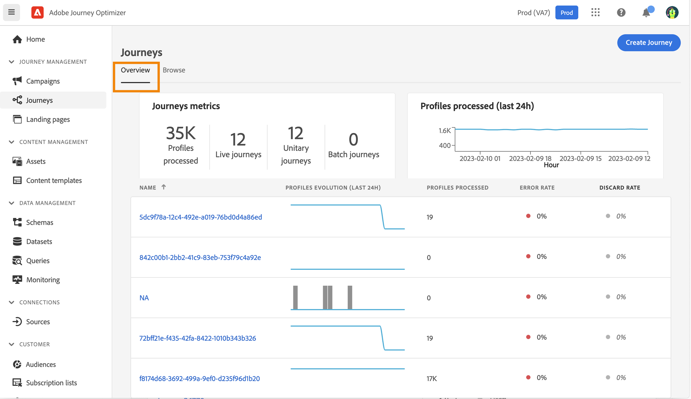
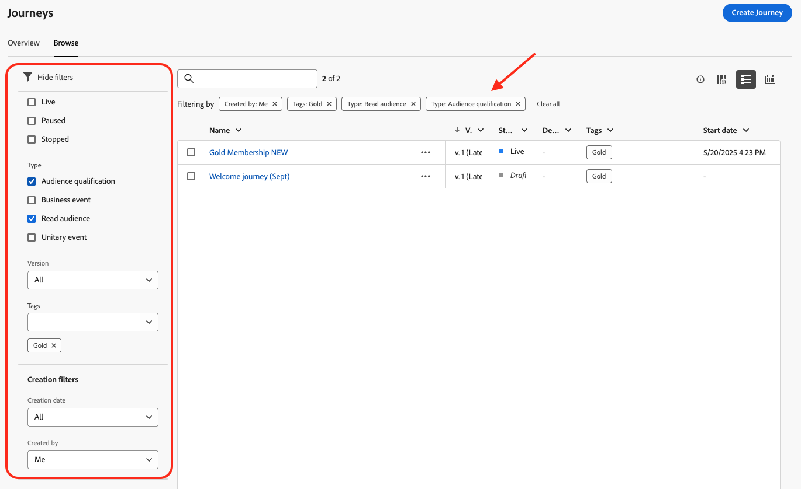

# Bläddra och filtrera dina resor {#browse-journeys}

## Kontrollpanel för resan {#dashboard-jo}

>[!CONTEXTUALHELP]
>id="ajo_journey_view"
>title="Resetabell- och tidslinjevyer"
>abstract="Resetabell- och tidslinjevyer"

Klicka på **[!UICONTROL Journeys]** på menyn RESURSHANTERING. Det finns två flikar: **[!UICONTROL Overview]** och **[!UICONTROL Browse]**.

* Fliken **[!UICONTROL Overview]** visar en instrumentpanel med nyckelvärden för dina resor.

  

   * **Bearbetade profiler**: totalt antal profiler som har bearbetats under de senaste 24 timmarna
   * **Live-resor**: Totalt antal live-resor med trafik under de senaste 24 timmarna. Live-resor omfattar **Unitary-resor** (händelsebaserade) och **Batch-resor** (läs målgrupp).
   * **Felfrekvens**: förhållandet mellan alla felaktiga profiler och det totala antalet profiler som har angetts under de senaste 24 timmarna.
   * **Ignorera frekvens**: förhållandet mellan alla ignorerade profiler och det totala antalet profiler som har angetts under de senaste 24 timmarna. En ignorerad profil representerar en person som inte är berättigad att delta i resan, till exempel på grund av ett felaktigt namnutrymme eller på grund av återinträdesregler.

  >[!NOTE]
  >
  >På denna kontrollpanel beaktas trafiken under de senaste 24 timmarna. Endast de resor du har åtkomst till visas. Mätvärdena uppdateras var 30:e minut och endast när nya data är tillgängliga.

* Fliken **[!UICONTROL Browse]** visar en lista över befintliga resor. Du kan söka efter resor, använda filter och utföra grundläggande åtgärder för varje element. Du kan till exempel skapa dubbletter eller radera en post.

  

## Filtrera dina resor {#journey-filter}

I listan över resor kan du använda olika filter för att förfina listan över resor.

Du kan filtrera resor utifrån deras [status](#journey-statuses), [typ](#journey-types), [version](#journey-versions) och tilldelade [taggar](../start/search-filter-categorize.md#tags) från **[!UICONTROL Status and version filters]**.

Använd **[!UICONTROL Creation filters]** om du vill filtrera resorna efter när de skapades eller efter den användare som skapade dem.

Visa resor som använder en specifik händelse, fältgrupp eller åtgärd från **[!UICONTROL Activity filters]** och **[!UICONTROL Data filters]**.

Använd **[!UICONTROL Publication filters]** för att välja ett publiceringsdatum eller en användare. Du kan till exempel välja att visa de senaste versionerna av direktresor som publicerades igår.

Om du vill filtrera resor baserat på ett visst datumintervall väljer du **[!UICONTROL Custom]** i listrutan **[!UICONTROL Published]**.

I konfigurationsrutorna Händelse, Datakälla och Åtgärd visar fältet **[!UICONTROL Used in]** dessutom antalet resor som använder just den händelsen, fältgruppen eller åtgärden. Du kan klicka på knappen **[!UICONTROL View journeys]** för att visa en lista över motsvarande resor.

## Resetyper {#journey-types}

Vilken typ av resa det är beror på vilka aktiviteter som används under resan. Den kan vara:

* **[!UICONTROL Unitary event]** - Rutiner för enhetshändelser är kopplade till en viss profil. Händelser som rör en persons beteende eller något som händer i samband med en person (en person har till exempel nått 10 000 poäng för lojalitet). [Läs mer](../event/about-events.md).
* **[!UICONTROL Business event]**. Affärsevenemangets resa börjar med en händelse som inte är profilrelaterad. Händelsekonfigurationen utförs av en teknisk användare och kan inte redigeras. [Läs mer](../event/about-events.md).
* **[!UICONTROL Audience Qualification]** - Publikkvalificeringsresor lyssnar på ingångar och utgångar för profiler i Adobe Experience Platform-målgrupper för att få individer att komma in på eller gå framåt under en resa. [Läs mer](audience-qualification-events.md).
* **[!UICONTROL Read audience]** - Vid målgruppsresor för läsning kommer alla personer i målgruppen in på resan och får de meddelanden som ingår i din resa.  [Läs mer](read-audience.md).

Läs mer om resetyper och hantering av associerade poster på [den här sidan](entry-management.md).

## Resestatyer {#journey-statuses}

Resans status beror på dess livscykel. Den kan vara:

* **Stängd**: resan har stängts med knappen **Stäng till nya ingångar**. Resan slutar med att nya individer kan komma in på resan. Personer som redan är på resan kan slutföra resan normalt.
* **Utkast**: resan är i det första steget. Den har inte publicerats än.
* **Utkast (test)**: Testläget har aktiverats med knappen **Testläge** .
* **Slutförd**: resan växlar automatiskt till den här statusen efter den globala tidsgränsen på 91 dagar . Profiler som redan finns på resan slutför normalt. Nya profiler kan inte längre komma in på resan.
* **Live**: resan har publicerats med knappen **Publicera** .
* **Stoppad**: resan har inaktiverats med knappen **Stoppa**. Alla individer lämnar resan direkt.

>[!NOTE]
>
>* Reseutvecklingscykeln innehåller också en uppsättning mellanliggande statusvärden som inte är tillgängliga för filtrering: &quot;Publicera&quot; (mellan &quot;Utkast&quot; och &quot;Live&quot;), &quot;Aktivera testläge&quot; eller &quot;Inaktivera testläge&quot; (mellan &quot;Utkast&quot; och &quot;Utkast (test)&quot;) och &quot;Stoppar&quot; (mellan &quot;Live&quot; och &quot;Stoppad&quot;). När en resa befinner sig i ett mellanliggande tillstånd är den skrivskyddad.
>
>* Om du behöver ändra till en **live**-resa [skapar du en ny version](#journey-versions) av din resa.

## Reseversioner {#journey-versions}

I reselistan visas alla reseversioner med versionsnumret. När du söker efter en resa visas de senaste versionerna högst upp i listan första gången programmet öppnas. Sedan kan du definiera den sortering som du vill ha så att programmet behåller den som en användarinställning. Färdens version visas också överst i reseupplagans gränssnitt, ovanför arbetsytan.

>[!NOTE]
>
>Vanligtvis kan en profil inte finnas flera gånger på samma resa samtidigt. Om återinträde är aktiverat kan en profil återansluta en resa, men kan inte göra det förrän den tidigare instansen av resan har avslutats helt. [Läs mer](end-journey.md).

### Skapa en ny version av en resa {#journey-create-new-version}

Om du behöver ändra till en direktresa skapar du en ny version av din resa. Så här skapar du en ny version av en befintlig resa:

1. Öppna den senaste versionen av din liveresa, klicka på **[!UICONTROL Create a new version]** och bekräfta.

   

   >[!NOTE]
   >
   >Du kan bara skapa en ny version av den senaste versionen av en resa.

1. Gör ändringarna, klicka på **[!UICONTROL Publish]** och bekräfta.

Från det att resan har publicerats kommer individerna att börja flöda in i den senaste versionen av resan. Personer som redan har gått in i en tidigare version stannar kvar tills de är klara med resan. Om de senare kommer in på samma resa igen kommer de att gå in i den senaste versionen.

Reseversioner kan stoppas individuellt. Alla versioner av resor har samma namn.

När du publicerar en ny version av en resa avslutas den tidigare versionen automatiskt och ändras till statusen **Stängd** . Ingen inträde på resan kan ske. Även om du stoppar den senaste versionen förblir den tidigare versionen stängd.

## Duplicera en resa {#duplicate-a-journey}

Du kan duplicera en befintlig resa från fliken **Bläddra**. Alla objekt och inställningar dupliceras till kopian av resan.

Gör så här:

1. Navigera till den resa du vill kopiera och klicka på ikonen **Fler åtgärder** (de tre punkterna bredvid resans namn).
1. Välj **Duplicera**.

   

1. Ange namnet på resan och bekräfta. Du kan också ändra namnet på skärmen för reseegenskaper. Som standard anges namnet på följande sätt: `[JOURNEY-NAME]_copy`

   

1. Den nya resan skapas och är tillgänglig i reselistan.
