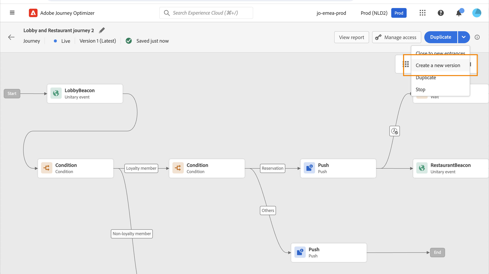

# Allmän princip{#jo-general-principle}

[!DNL Journey Optimizer] gör att du kan skapa användningsfall för realtidssamordning med hjälp av kontextuella data som lagras i händelser eller datakällor.

Utforma avancerade scenarier i flera steg med följande funktioner:

* Skicka i realtid **enhetlig leverans** aktiveras när en händelse tas emot, eller **i batch** med Adobe Experience Platform-segment.

* Utnyttja **kontextuella data** från händelser, information från Adobe Experience Platform eller data från API-tjänster från tredje part.

* Använd **inbyggda funktionsmakron** för att skicka meddelanden som [!DNL Journey Optimizer] eller skapa **anpassade åtgärder** om du använder ett tredjepartssystem för att skicka meddelanden.

* Med **resedesigner** bygg upp flerstegstillämpningar: enkelt dra och släppa en tävlingshändelse eller en aktivitet i ett lässegment, lägga till villkor och skicka personaliserade meddelanden.

## Resans livscykel{#journey-lifecyle}

### Profiler under resor{#profile-journey}

På en enhetlig resa:

* Om återinträde är aktiverat kan en profil gå in på en resa flera gånger, men kan inte göra det förrän den tidigare instansen av resan har avslutats helt.

* Om återinträde är inaktiverat kan en profil inte ange flera gånger samma resa

Mer information om återinträde av profiler finns i [section](../building-journeys/journey-gs.md#change-properties).

I en läsande segmentresa:

* För icke återkommande resor: profilen anger en gång och endast en gång under resan.
* för återkommande resor: profilen kommer in på resan vid varje upprepning, om han/hon befinner sig i segmentet/förväntad status. Om han fortfarande var på resan från en tidigare upprepning, kommer han att återuppta den från början.

Vid affärshändelseresor som börjar med ett lässegment:

Eftersom den här resan baseras på mottagningen av en affärshändelse, och om profilen är kvalificerad i det förväntade segmentet, kommer han att gå in på resan för varje mottagen affärshändelse, vilket innebär att profilen kan vara flera gånger under samma resa samtidigt, men i samband med olika affärshändelser.

Enhetsresor (med början vid en händelse eller en segmentkvalificering) innehåller ett skyddsräcke som förhindrar att resorna aktiveras felaktigt flera gånger för samma händelse. Återinträde av profiler blockeras tillfälligt som standard i 5 minuter. Om en händelse till exempel utlöser en resa kl. 12:01 för en viss profil och en annan tar emot kl. 12:03 (oavsett om det är samma händelse eller en annan som utlöser samma resa) kommer den resan inte att starta igen för den här profilen.

### Reseslut{#journey-ending}

En resa kan ta slut för en individ i två specifika sammanhang:

* Personen kommer till den sista aktiviteten i en bana.
* Personen kommer till **Villkor** aktivitet (eller **Vänta** aktivitet med ett villkor) och matchar inte något av villkoren.

Personen kan sedan återinträda i resan om återinträde tillåts. Läs [den här sidan](../building-journeys/journey-gs.md#change-properties)

Om du vill avsluta en direktresa rekommenderar vi att du stänger den. Nya kunders ankomst till resan kommer då att blockeras. Kunder som redan är med på resan kan uppleva det hela tiden. Se [det här avsnittet](../building-journeys/journey.md#close-journey)

Du kan bara stoppa en resa om en kris inträffar och all behandling måste avslutas omedelbart under en resa. Personer som redan har gått in i en resa stoppas under hela resan. Se [det här avsnittet](../building-journeys/journey.md#stop-journey)

>[!NOTE]
>
>Observera att du inte kan återuppta en stängd eller stoppad resa.

#### Sluttagg för resa{#end-tag}

När du skapar en resa visas sluttaggen i slutet av varje bana. Den här noden kan inte läggas till av en användare, kan inte tas bort och bara dess etikett kan ändras. Det markerar slutet på varje väg på resan. Om resan har flera sökvägar rekommenderar vi att du lägger till en etikett i varje ände för att göra rapporter enklare att läsa. Läs [den här sidan](../reports/live-report.md).

<!--

### End activity{#journey-end-activity}

The **[!UICONTROL End]** activity allows you to mark the end of each path of the journey. It is not mandatory but recommended for visual clarity. See [this page](../building-journeys/end-activity.md)

-->

#### Stänga en resa{#close-journey}

En resa kan avslutas på grund av följande orsaker:

* Resan stängs manuellt via **[!UICONTROL Close to new entrances]** -knappen.
* En segmentbaserad resa som utförts i ett enda steg.
* Efter den sista förekomsten av en återkommande segmentbaserad resa.

Genom att stänga en resa manuellt försäkrar du dig om att kunder som redan har gått in på resan kan slutföra sin resa, men att nya användare inte kan ta sig in på resan. När en resa stängs (av någon av anledningarna ovan) får den statusen **[!UICONTROL Closed]**. Resan slutar med att nya individer kan komma in på resan. Personer som redan är på resan kan slutföra resan normalt. Efter den globala standardtidsgränsen på 30 dagar växlar resan till **Slutförd** status. Se det här [section](../building-journeys/journey-gs.md#global_timeout).

En stängd reseversion kan inte startas om eller tas bort. Du kan skapa en ny version av den eller duplicera den. Endast slutförda resor kan tas bort.

Om du vill stänga en resa från listan över resor klickar du på **[!UICONTROL Ellipsis]** knapp som finns till höger om resenamnet och väljer **[!UICONTROL Close to new entrances]**.

Du kan även:

1. I **[!UICONTROL Journeys]** klickar du på den resa du vill stänga.
1. Klicka på nedpilen längst upp till höger.

   

1. Klicka **[!UICONTROL Close to new entrances]** och bekräfta i dialogrutan.

#### Stoppa en resa{#stop-journey}

Om ni behöver stoppa alla personers framsteg på resan kan ni stoppa den. Om du stoppar resan kommer alla personer på resan att tidsgränsen för timeout. Att stoppa en resa innebär dock att alla som redan har tagit sig in på en resa stoppas under resan. Resan är i stort sett avstängd. Om du vill avsluta en resa rekommenderar vi att du stänger den.

Det går inte att starta om en stoppad reseversion.

När det stoppas anges resans status till **[!UICONTROL Stopped]**.

Du kan till exempel stoppa en resa om en marknadsförare upptäcker att resan riktar sig mot fel målgrupp eller en anpassad åtgärd som ska leverera meddelanden inte fungerar korrekt. Om du vill stoppa en resa från listan över resor klickar du på **[!UICONTROL Ellipsis]** knapp som finns till höger om resenamnet och väljer **[!UICONTROL Stop]**.

Du kan även:

1. I **[!UICONTROL Journeys]** klickar du på den resa du vill stoppa.
1. Klicka på nedpilen i det övre högra hörnet.
   
1. Klicka **[!UICONTROL Stop]** och bekräfta i dialogrutan.

## Reseversioner{#journey-versions}

I reselistan visas alla reseversioner med versionsnumret. Läs [den här sidan](../building-journeys/using-the-journey-designer.md).

När du söker efter en resa visas de senaste versionerna högst upp i listan första gången programmet öppnas. Sedan kan du definiera den sortering som du vill ha så att programmet behåller den som en användarinställning. Färdens version visas också överst i reseupplagans gränssnitt, ovanför arbetsytan.

>[!NOTE]
>
>I de flesta fall kan en profil inte finnas flera gånger på samma resa samtidigt. Om återinträde är aktiverat kan en profil återansluta en resa, men kan inte göra det förrän den tidigare instansen av resan har avslutats helt. [Läs mer](#journey-ending)

Om du behöver ändra till en direktresa skapar du en ny version av din resa.

1. Öppna den senaste versionen av din liveresa och klicka **[!UICONTROL Create a new version]** och bekräfta.

   

   >[!NOTE]
   >
   >Du kan bara skapa en ny version av den senaste versionen av en resa.

1. Gör ändringarna genom att klicka **[!UICONTROL Publish]** och bekräfta.

   

Från det att resan har publicerats kommer individerna att börja flöda in i den senaste versionen av resan. Personer som redan har gått in i en tidigare version stannar kvar tills de är klara med resan. Om de senare återgår till samma resa, kommer de att gå till den senaste versionen.

Reseversioner kan stoppas individuellt. Alla versioner av resor har samma namn.

När du publicerar en ny version av en resa upphör den tidigare versionen automatiskt och växlar till **Stängd** status. Ingen inträde på resan kan ske. Även om du stoppar den senaste versionen förblir den tidigare versionen stängd.

>[!NOTE]
>
>Läs mer om säkerhetsregler och begränsningar för olika reseversioner i [den här sidan](../start/guardrails.md#journey-versions-limitations)