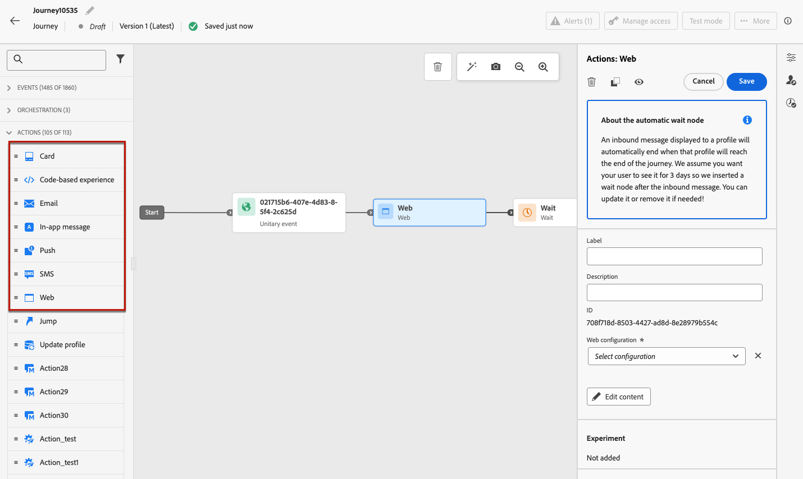
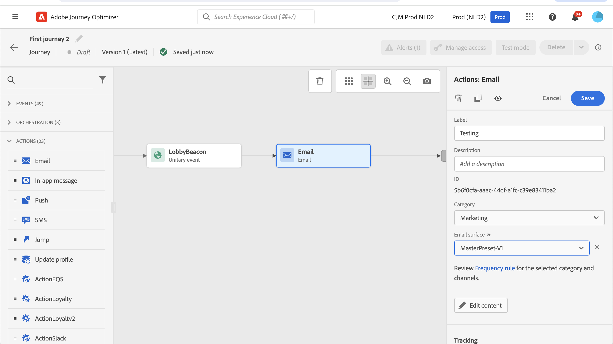

# Använd inbyggda kanalåtgärder {#add-a-message-in-a-journey}

>[!CONTEXTUALHELP]
>id="ajo_message_activity"
>title="Inbyggd kanalåtgärd"
>abstract="Journey Optimizer har inbyggda funktioner för kanalåtgärder. Du kan bara lägga till en meddelandeaktivitet (e-post, SMS/MMS), push) eller en inkommande upplevelse (In-app, webb, kodbaserad upplevelse, innehållskort) och definiera inställningar och innehåll. Sedan utförs den och skickas i samband med resan."

[!DNL Journey Optimizer] innehåller inbyggda funktioner för kanalåtgärder som används för att skicka meddelanden: när en profil anger den här aktiviteten skickas ett meddelande till dem.

Om du vill lägga till en inbyggd kanalåtgärd till din resa drar och släpper du en kanalaktivitet och definierar dess inställningar och innehåll. Sedan utförs den och skickas i samband med resan.

>[!NOTE]
>
>Du kan också konfigurera anpassade åtgärder för att skicka meddelanden i [!DNL Journey Optimizer]. [Läs mer](#recommendation)

## Lägg till ett meddelande i en resa  {#add-msg-in-journey}

Med inbyggda kanalåtgärder kan du konfigurera utgående eller inkommande meddelanden. Mer information om vilka kanaler som är tillgängliga under resor finns i tabellen i det här avsnittet: [Kanaler under resor och kampanjer](../channels/gs-channels.md#channels).

Följ stegen nedan om du vill lägga till en inbyggd kanalåtgärd för en resa.

1. Starta din resa med en [Event](general-events.md)- eller [Read Audience](read-audience.md)-aktivitet.

1. Dra och släpp en kanalaktivitet på arbetsytan från avsnittet **Åtgärder** på paletten.

   

1. Du kan också välja aktiviteten **[!UICONTROL Action]**, som gör att du kan välja flera inkommande åtgärder. [Läs mer](journey-action.md)

1. Konfigurera aktiviteten. Detaljerade konfigurationsriktlinjer finns på länkarna nedan.

   * Lär dig de detaljerade stegen för att skapa en utgående åtgärd på följande sätt:

     <table style="table-layout:fixed">
      <tr style="border: 0;">
      <td>
      
      
<a href="../email/create-email.md"><strong>Skapa e-post</strong>
      

      

      </td>
      <td>
      
      

      <a href="../push/create-push.md"><strong>Skapa push-meddelanden<strong></a>
      

      

      </td>
      <td>
      
      

      <a href="../sms/create-sms.md"><strong>Skapa textmeddelanden (SMS/MMS)</strong></a>
      

      

      </td>
      </tr>
      </table>

   * Lär dig de detaljerade stegen för att skapa en inkommande åtgärd på följande sätt:

     <table style="table-layout:fixed">
      <tr style="border: 0;">
      <td>
      
      
<a href="../in-app/create-in-app.md"><strong>Skapa meddelanden i programmet</strong>
      

      

      </td>
      <td>
      
      
<a href="../web/create-web.md"><strong>Skapa webbupplevelser</strong>
      

      

      </td>
      <td>
      
      
<a href="../content-card/create-content-card.md"><strong>Skapa innehållskort</strong>
      

      

      </td>
      <td>
      
      

      <a href="../code-based/create-code-based.md"><strong>Skapa kodbaserade upplevelser<strong></a>
      

      

      </td>
      </tr>
      </table>

   >[!NOTE]
   >
   >* Varje inkommande upplevelseaktivitet levereras med en 3-dagars **Wait**-aktivitet. [Läs mer](wait-activity.md#auto-wait-node)
   >
   >* För e-postmeddelanden och push-meddelanden kan du aktivera optimering av sändningstid. [Läs mer](send-time-optimization.md)

1. Beroende på aktiviteten kan du visa avancerade parametrar som är specifika för den valda kanalen och åsidosätta vissa standardvärden, till exempel körningsadressen. [Läs mer](about-journey-activities.md#advanced-parameters)

   >[!NOTE]
   >
   >Om de avancerade parametrarna är dolda klickar du på knappen **[!UICONTROL Show read-only fields]** överst i den högra rutan.

## Uppdatera ett direktinnehåll {#update-live-content}

Ni kan uppdatera innehållet i en inbyggd kanalåtgärd i en direktresa.

Det gör du genom att öppna din direktresa, välja kanalaktiviteten och klicka på **Redigera innehåll**.

Du kan dock inte ändra de attribut som används i personaliseringen, vare sig det är profilattribut eller kontextuella data (från händelse- eller reseegenskaper).

Om du ändrade sammanhangsbaserade data visas följande felmeddelande: `ERR_AUTHORING_JOURNEYVERSION_201`

Om du ändrade profilattribut visas följande felmeddelande: `ERR_AUTHORING_JOURNEYVERSION_202`

Observera att för aktiviteten i appen kan ändringar göras i innehållet medan resan pågår, men utlösare i appen kan inte ändras.

## Skicka med anpassade åtgärder {#recommendation}

I stället för att använda de inbyggda meddelandefunktionerna kan du använda anpassade åtgärder för att konfigurera anslutningen för ett tredjepartssystem för att skicka meddelanden eller API-anrop.

* Om du använder ett tredjepartssystem för att skicka meddelanden kan du skapa en anpassad åtgärd. [Läs mer](../action/action.md)

* Om du arbetar med Adobe Campaign, se följande avsnitt:

   * [[!DNL Journey Optimizer] och Campaign v7/v8](../action/acc-action.md)
   * [[!DNL Journey Optimizer] och Campaign Standard](../action/acs-action.md)