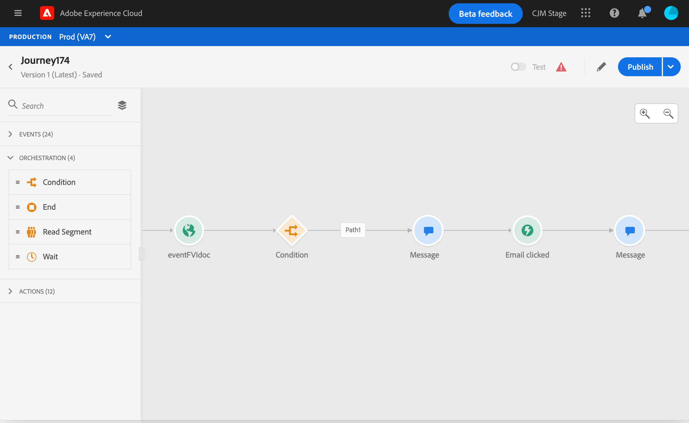

# Lägg till ett meddelande i en resa

[!DNL Journey Optimizer] meddelandefunktionerna är inbyggda, du behöver bara utforma innehållet och publicera meddelandet. Se [det här avsnittet](../get-started-content.md). Sedan lägger du bara till ett push- eller e-postmeddelande som utformats med Journey Optimizer under resan.

Om du använder ett tredjepartssystem för att skicka meddelanden kan du skapa en anpassad åtgärd. Läs mer i det här [avsnittet](../action/action.md).

## Lägga till en meddelandeaktivitet

1. Som alltid ska du påbörja din resa med en aktivitet eller en **Läs-aktivitet**.

   

1. Dra och släpp en **aktivitet av typen Meddelande** på arbetsytan i **avsnittet Åtgärder** på paletten.

   

1. Lägg till en etikett och en beskrivning.

   

1. Klicka i fältet **Meddelande**. En lista över tillgängliga meddelanden som utformats i Journey Optimizer visas. Du kan filtrera listan efter status.

   

1. Välj ett meddelande och klicka på **Välj**. Du kan också skapa ett nytt meddelande direkt från den här skärmen genom att klicka på **Skapa nytt**.

   

   Om du vill kontrollera meddelandet kan du klicka på ikonen **Öppna meddelandet** i fältet **Meddelande**. Meddelandet öppnas på en ny flik.

   

1. Lägg till nästa steg på din resa.

## Kanalparametrar

Parametrarna **Kanal** visas. Dessa fält är skrivskyddade. Den här konfigurationen utförs när meddelandet skapas. Se [det här avsnittet](../get-started-content.md).

Du kan använda ikonen **Aktivera redigeringsfält** till höger om fältet för att framtvinga ett visst värde. Detta kan vara användbart i testsyfte. Du kan till exempel lägga till din e-postadress för ett e-postmeddelande. När du publicerar resan skickas e-postmeddelandet till dig.
