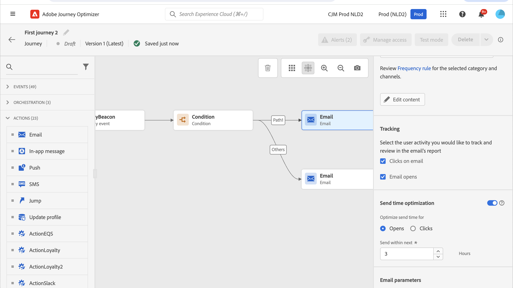

# Skicka e-post, meddelanden i appen, push-meddelanden och textmeddelanden {#add-a-message-in-a-journey}

>[!CONTEXTUALHELP]
>id="ajo_message_activity"
>title="Meddelandeaktivitet"
>abstract="Journey Optimizer har inbyggda meddelandefunktioner. Du kan enkelt lägga till ett push-meddelande (SMS/MMS), en meddelandeaktivitet i appen eller ett e-postmeddelande under resan och definiera inställningar och innehåll. Sedan utförs den och skickas i samband med resan."

[!DNL Journey Optimizer] har inbyggda meddelandefunktioner. Du kan enkelt lägga till en push-funktion, ett SMS/MMS-meddelande, en aktivitet i appen eller ett e-postmeddelande under resan och definiera inställningar och innehåll. Sedan utförs den och skickas i samband med resan.

Du kan också ange specifika åtgärder för att skicka meddelanden till dig:

* Om du använder ett tredjepartssystem för att skicka meddelanden kan du skapa en anpassad åtgärd. Läs mer i det här [avsnittet](../action/action.md).

* Om du arbetar med Campaign och Journey Optimizer, se följande avsnitt:

   * [[!DNL Journey Optimizer] och Campaign v7/v8](../action/acc-action.md)
   * [[!DNL Journey Optimizer] och Campaign Standard](../action/acs-action.md)

Följ stegen nedan om du vill lägga till ett meddelande under en resa:

1. Starta din resa med en [Event](general-events.md)- eller [Read Audience](read-audience.md)-aktivitet.

1. Dra och släpp en **e-postadress**, en **i appen**, en **SMS** eller en **push** -aktivitet på arbetsytan från **Åtgärder** på paletten.

1. Konfigurera aktiviteten.

   Lär dig detaljerade steg för att skapa meddelandeinnehåll på följande sidor:

   <table style="table-layout:fixed">
   <tr style="border: 0;">
   <td>
   
   
<a href="../email/create-email.md"><strong>Skapa e-post</strong>
   

   

   </td>
   <td>
   
   
<a href="../in-app/create-in-app.md"><strong>Skapa meddelanden i programmet</strong>
   

   

   </td>
   <td>
   
   

   <a href="../push/create-push.md"><strong>Skapa push-meddelanden<strong></a>
   

   

   </td>
   <td>
   
   

   <a href="../sms/create-sms.md"><strong>Skapa textmeddelanden (SMS/MMS)</strong></a>
   

   

   </td>
   </tr>
   </table>

>[!NOTE]
>
>Varje inkommande meddelandeaktivitet (meddelande i appen, kodbaserad upplevelse eller kort) levereras med en 3-dagars **Wait** -aktivitet. [Läs mer](../building-journeys/wait-activity.md#auto-wait-node)
>

## Uppdatera liveinnehåll{#update-live-content}

Du kan uppdatera innehållet i ett meddelande (e-post, i appen, push, SMS) under en direktresa.

Det gör du genom att öppna din liveresa, välja meddelandeaktiviteten och klicka på **Redigera innehåll**.

Du kan dock inte ändra de attribut som används i personaliseringen, vare sig det är profilattribut eller kontextuella data (från händelse- eller reseegenskaper).

Om du ändrade sammanhangsberoende data visas följande felmeddelande: ERR_AUTHORING_JOURNEYVERSION_201

Om du har ändrat profilattribut visas följande felmeddelande: ERR_AUTHORING_JOURNEYVERSION_202

Observera att för aktiviteten i appen kan ändringar göras i innehållet medan resan pågår, men utlösare i appen kan inte ändras.

## Sändningsoptimering{#send-time-optimization}

>[!CONTEXTUALHELP]
>id="jo_bestsendtime_disabled"
>title="Om Tidsoptimering för Skickat"
>abstract="Adobe Journey Optimizer funktion för optimering av sändningstid, som bygger på Adobe AI-tjänster, kan förutsäga den bästa tidpunkten för att skicka e-post eller push-meddelanden för att maximera engagemanget baserat på tidigare öppnings- och klickfrekvenser."

>[!NOTE]
>
>Den här funktionen är inte aktiverad som standard. Du kan kontakta din Adobe-representant för att aktivera den.

### Om optimering vid sändning {#about-send-time}

Adobe Journey Optimizer funktion för optimering av sändningstid, som bygger på Adobe AI-tjänster, kan förutsäga den bästa tidpunkten för att skicka e-post eller push-meddelanden för att maximera engagemanget baserat på tidigare öppnings- och klickfrekvenser. Använd vår maskininlärningsmodell för att schemalägga personliga sändningstider för varje användare så att de kan utöka öppnings- och klickfrekvensen för dina meddelanden.

Modellen för optimering av sändningstid (Send-Time Optimization) innehåller information om dina Adobe Journey Optimizer-data och tittar på användarnivå som är öppen (för e-post och push) och klickar (för e-post) för att avgöra när kunderna är mest benägna att interagera med dina meddelanden. För optimering av sändningstid krävs minst en månads meddelandespårningsdata för att kunna ge välgrundade rekommendationer. För varje användare väljer systemet automatiskt den bästa tiden med följande poäng:

* Den bästa timmen varje dag i veckan för att maximera engagemanget
* Den bästa veckodagen för maximerat engagemang
* Den bästa timmen på den bästa veckodagen för att maximera engagemanget

Modellen varierar oavsett om du talar om poängsättning eller utbildning. Utbildningen genomförs varje vecka, inledningsvis och därefter varje kvartal. Poängen är en gång i veckan och därefter en gång i månaden.

* Utbildning - utveckling av den algoritm som används för att göra poängen
* Poäng - poängsättning för enskilda profiler baserat på den tränade modellen

Den här informationen lagras med användarens profil och hänvisas till vid körning av resan för att tala om för Adobe Journey Optimizer när meddelandet ska skickas.

### Vanliga frågor {#faq-send-time}

+++ Vad kan optimering av sändningstid göra? Hur hanteras nya profiler? Sprider den sändningen över ett 24-12-12-timmarsfönster?

Tidsoptimering försöker förutse den bästa tiden att interagera med kunderna och optimera öppnings-/klickfrekvensen för e-postmeddelanden. Poängen har formatet `3*7*24` attribut för varje profil. Attributen `7*24` beskriver rangordningen för den förväntade bästa tiden att skicka ut e-postmeddelanden till mottagaren och 3 är för att optimera öppningsfrekvensen för e-post, klickfrekvensen för e-post och push-öppningsfrekvensen.

+++

+++Var kan jag se den förväntade sändningstiden för varje profil?

Du kan se det övergripande poängtalet i gränssnittet **Profiler**. För var och en av de tre uppsättningarna med 168 poäng går rangordningarna från -83 till 84. Ju högre rankning desto bättre tid valdes att interagera med mottagaren. Eftersom du kan definiera start och varaktighet för en resa kanske den bästa rangordningen (84) inte hamnar i det tidsfönstret. I det här fallet rekommenderar vi att du väljer en timme med det högsta rangvärdet.

+++

+++Vilken rapportering finns tillgänglig?

Kom åt din resa genom att klicka på knappen **Visa rapport** i det övre högra hörnet och välja fliken **Resa** till vänster. [Läs mer](../reports/journey-global-report.md)

+++

+++Hur påverkar data för Send-Time Optimization profilens detaljrikedom?

Sändningsoptimering lägger till poäng/attribut i varje profil, men ingen ny profil skapas.

+++

### Aktivera optimering av sändningstid{#activate-send-time-optimization}

>[!CONTEXTUALHELP]
>id="jo_bestsendtime_email"
>title="Aktivera optimering av sändningstid"
>abstract="Välj om du vill optimera e-postöppningen eller skicka e-postklick genom att välja lämplig alternativknapp. Du kan också välja att klamra de sändningstider som används av systemet genom att ange ett värde för Skicka i nästa alternativ."

>[!CONTEXTUALHELP]
>id="jo_bestsendtime_push"
>title="Aktivera optimering av sändningstid"
>abstract="Standardinställningen för push-meddelanden är öppningsalternativet, eftersom klickningar inte kan användas för push-meddelanden. Du kan också välja att klamra de sändningstider som används av systemet genom att ange ett värde för Skicka i nästa alternativ."

Aktivera Send-Time Optimization för ett e-postmeddelande eller push-meddelande genom att välja **Send-Time Optimization** från aktivitetsparametrarna.

För e-postmeddelanden väljer du om du vill optimera e-postöppningar eller e-postklick genom att välja lämplig alternativknapp. Standardinställningen för push-meddelanden är öppningsalternativet, eftersom klickningar inte kan användas för push-meddelanden.

Du kan också välja att klamra de sändningstider som används av systemet genom att ange ett värde för alternativet **Skicka inom nästa**. Om du väljer&quot;sex timmar&quot; som värde kontrollerar [!DNL Journey Optimizer] varje användarprofil och väljer den optimala sändningstiden inom sex timmar från körningstiden för resan.

**Vad händer om den optimala tiden ligger utanför fönstret?**

Låt oss ta ett exempel med följande inställningar:

* Optimera med klick
* Åtgärden ska börja kl. 10.00
* Fönstret är 3 timmar

En profil kan ha en optimal öppningstid som ligger utanför fönstret. John är till exempel bäst öppen vid klick vid 17:00.

På profilnivå finns poäng för varje timme i veckan. I det här exemplet skickas e-postmeddelandet alltid i fönstret. Vid körning kontrollerar systemet listan över bakgrundsmusik i det fönstret (3-timmarsfönster med början kl. 10.00). Systemet jämför sedan poängen för 10, 11 och 10 och väljer den högsta. E-postmeddelandet skickas då.
