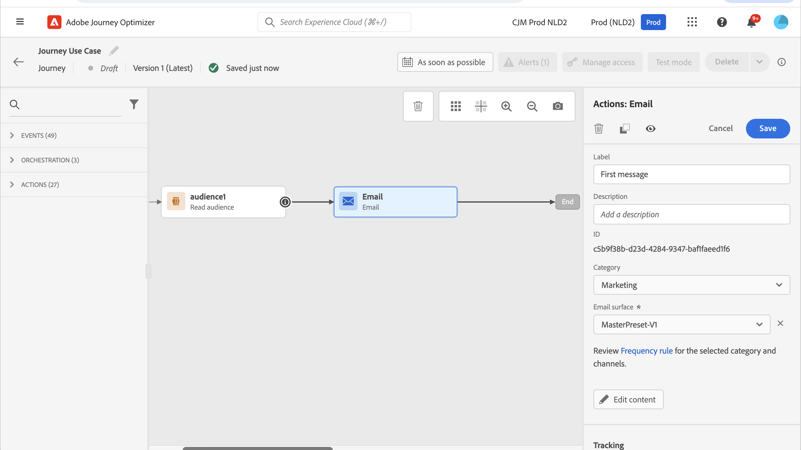

# Användningsfall: skicka flerkanalsmeddelanden{#send-multi-channel-messages}

I det här avsnittet visas ett användningsexempel som kombinerar en Läs publik, en händelse, reaktionshändelser och e-post/push-meddelanden.

## Beskrivning av användningsfallet

I det här fallet vill vi skicka ett första e-postmeddelande till alla kunder som tillhör en viss målgrupp.

Baserat på deras reaktion på det första meddelandet vill vi skicka specifika meddelanden.

Om kunden öppnar e-postmeddelandet väntar vi på ett köp och skickar ett push-meddelande som tackar kunden.

Om vi inte får någon reaktion skickar vi ett uppföljningsmejl till dem.

## Förhandskrav

För att detta ska fungera måste du konfigurera följande:

* en målgrupp för alla kunder som bor i Atlanta, San Francisco eller Seattle och som är födda efter 1980.
* en köphändelse

### Skapa målgruppen

Under vår resa vill vi lyfta fram en specifik kundgrupp. Alla personer som tillhör målgruppen deltar i resan och följer de olika stegen. I vårt exempel behöver vi en målgrupp för alla kunder som bor i Atlanta, San Francisco eller Seattle och som är födda efter 1980.

Mer information om målgrupper finns på [sidan](../audience/about-audiences.md).

1. Välj **[!UICONTROL Audiences]** i KUNDENS menyavsnitt.

1. Klicka på knappen **[!UICONTROL Create audience]** som finns längst upp till höger i målgruppslistan.

1. Ange ett namn för målgruppen i rutan **[!UICONTROL Audience properties]**.

1. Dra och släpp önskade fält från den vänstra rutan till arbetsytan i mitten och konfigurera dem sedan efter behov. I det här exemplet använder vi attributfälten **City** och **Birth year** .

1. Klicka på **[!UICONTROL Save]**.

   

Publiken är nu skapad och redo att användas på din resa. Med en **Läs målgrupp**-aktivitet kan du få alla personer som tillhör målgruppen att komma in på resan.

### Konfigurera händelsen

Du måste konfigurera ett evenemang som skickas till din resa när en kund gör ett köp. När resan tar emot händelsen utlöses meddelandet&quot;Tack&quot;.

För detta använder vi en regelbaserad händelse. Mer information om händelser finns på [sidan](../event/about-events.md).

1. I avsnittet ADMINISTRATION-meny väljer du **[!UICONTROL Configurations]** och klickar sedan på **[!UICONTROL Events]**. Klicka på **[!UICONTROL Create event]** för att skapa en ny händelse.

1. Ange namnet på händelsen.

1. Markera **[!UICONTROL Event ID type]** i fältet **[!UICONTROL Rule Based]**.

1. Definiera **[!UICONTROL Schema]** och nyttolasten **[!UICONTROL Fields]**. Du kan använda flera fält, till exempel den köpta produkten, inköpsdatumet och inköps-ID:t.

1. I fältet **[!UICONTROL Event ID condition]** definierar du villkoret som används av systemet för att identifiera de händelser som utlöser din resa. Du kan till exempel lägga till ett `purchaseMessage`-fält och definiera följande regel: `purchaseMessage="thank you"`

1. Definiera **[!UICONTROL Namespace]** och **[!UICONTROL Profile Identifier]**.

1. Klicka på **[!UICONTROL Save]**.

   

Händelsen är nu konfigurerad och klar att användas under din resa. Genom att använda motsvarande händelseaktivitet kan du aktivera en åtgärd varje gång en kund gör ett köp.

## Designa resan

1. Starta resan med aktiviteten **Läs målgrupp**. Välj den målgrupp som skapats tidigare. Alla personer som tillhör målgruppen deltar i resan.

   

1. Släpp en **e-postaktivitet** och definiera innehållet i det&quot;första meddelandet&quot;. Det här meddelandet skickas till alla personer på resan. Läs i det här [avsnittet](../email/create-email.md) om du vill veta mer om hur du konfigurerar och utformar ett e-postmeddelande.

   

1. Lägg till en **reaktion**-händelse och välj **E-post öppnad**. Händelsen utlöses när en person som tillhör målgruppen öppnar e-postmeddelandet.

1. Markera rutan **Definiera tidsgräns för händelse**, definiera en varaktighet (1 dag i vårt exempel) och markera **Ange en tidsgräns**. Detta skapar en ny sökväg för personer som inte öppnar det första push- eller e-postmeddelandet.

1. Släpp en **E-post** -åtgärdsaktivitet i timeoutsökvägen och definiera innehållet i &quot;uppföljningsmeddelandet&quot;. Det här meddelandet skickas till de personer som inte öppnar e-postmeddelandet eller skickar det första meddelandet nästa dag. Läs i det här [avsnittet](../email/create-email.md) om du vill veta mer om hur du konfigurerar och utformar ett e-postmeddelande.

1. Lägg till den inköpshändelse som skapades tidigare i den första sökvägen. Händelsen utlöses när en person gör ett köp.

1. Efter händelsen släpper du en **push**-åtgärd och definierar innehållet i tackmeddelandet. Läs i det här [avsnittet](../push/create-push.md) om du vill veta mer om hur du konfigurerar och utformar en push-funktion.

## Testa och publicera resan

1. Innan du testar din resa kontrollerar du att den är giltig och att det inte finns något fel.

1. Klicka på **Testa** i det övre högra hörnet för att aktivera testläget. Mer information om hur du använder testläget finns i [avsnittet](testing-the-journey.md).

1. När resan är klar publicerar du den med knappen **Publish** som finns i det övre högra hörnet.
