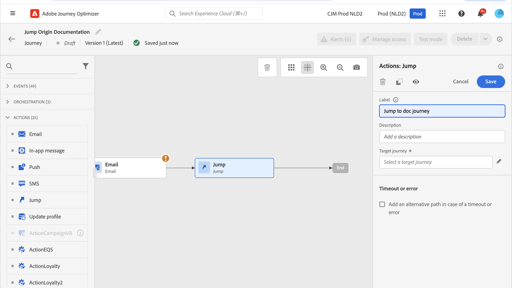
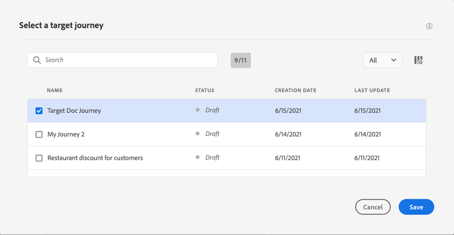

# Hoppa från en resa till en annan {#jump}

>[!CONTEXTUALHELP]
>id="ajo_journey_jump"
>title="Hoppaktivitet"
>abstract="Med en hoppåtgärd kan ni föra människor från en resa till en annan. Med den här funktionen kan du förenkla utformningen av mycket komplexa resor och skapa resor baserat på gemensamma och återanvändbara resemönster."

Åtgärdsaktiviteten **[!UICONTROL Jump]** gör att du kan flytta personer från en resa till en annan. Med den här funktionen kan du:

* förenkla utformningen av mycket komplexa resor genom att dela upp dem i flera.
* bygga resor baserat på gemensamma och återanvändbara resemönster

Lägg till en **[!UICONTROL Jump]**-aktivitet i den ursprungliga resan och välj en målresa. När personen går in i steget **[!UICONTROL Jump]** skickas en intern händelse till den första händelsen i målresan. Om åtgärden **[!UICONTROL Jump]** lyckas fortsätter personen att gå vidare i resan. Beteendet liknar andra åtgärder.

I målresan gör den första händelsen som utlöses internt av aktiviteten **[!UICONTROL Jump]** det individuella flödet i resan.

## Livscykel {#jump-lifecycle}

Anta att du har lagt till en **[!UICONTROL Jump]**-aktivitet i resa A till resa B. Resa A är den **ursprungliga resan** och resa B är den **målresan**.

Här är de olika stegen i körningsprocessen:

**Resan A** utlöses från en extern händelse:

1. Resa A får en extern händelse som rör en individ.
1. Personen når steget **[!UICONTROL Jump]**.
1. Personen flyttas till resa B och fortsätter till nästa steg i resa A, efter steget **[!UICONTROL Jump]**.

Under resa B utlöses den första händelsen internt via aktiviteten **[!UICONTROL Jump]** från resa A:

1. Resa B får ett internt evenemang från resa A.
1. Personen börjar att flöda under resa B.

>[!NOTE]
>
>Resa B kan också utlösas via en extern händelse.

## God praxis och begränsningar {#jump-limitations}

Använd de här riktlinjerna om du vill att beteendet för hoppaktivitet ska vara förutsägbart och säkert.

### Redigering {#jump-limitations-authoring}

* Aktiviteten **[!UICONTROL Jump]** är bara tillgänglig på resor som använder ett namnutrymme.
* Du kan bara hoppa till en resa som använder samma namnutrymme som ursprungsresan.
* Du kan inte hoppa till en resa som börjar med en **publikkvalificeringshändelse** eller **Läs målgrupp**.
* Du kan inte ha en **[!UICONTROL Jump]**-aktivitet och en **publikkvalificeringshändelse** eller **Läs målgrupp** under samma resa.
* Du kan inkludera så många **[!UICONTROL Jump]** aktiviteter som behövs under en resa. Efter en **[!UICONTROL Jump]** kan du lägga till alla aktiviteter som behövs.
* Du kan ha så många hoppnivåer som behövs. Exempel: resa A hoppar till resa B, som hoppar till resa C och så vidare.
* Målresan kan även innehålla så många **[!UICONTROL Jump]** aktiviteter som behövs.
* Loopmönster stöds inte. Det finns inget sätt att länka samman två eller flera resor, vilket skulle skapa en oändlig slinga. Aktivitetskonfigurationsskärmen **[!UICONTROL Jump]** förhindrar dig från att göra detta.

### Körning {#jump-limitations-exec}

* När aktiviteten **[!UICONTROL Jump]** körs aktiveras den senaste versionen av målresan.
* En unik individ kan bara vara närvarande en gång under samma resa. Om den person som har skjutits ut från ursprungsresan redan befinner sig på målresan, kommer den personen alltså inte att ta sig in på målresan. Inget fel kommer att rapporteras för aktiviteten **[!UICONTROL Jump]** eftersom detta är ett normalt beteende.

## Konfigurera hoppaktiviteten {#jump-configure}

1. Utforma din **ursprungliga resa**.

   

1. Lägg till en **[!UICONTROL Jump]**-aktivitet från kategorin **[!UICONTROL ACTIONS]** när som helst under resan. Lägg till en etikett och en beskrivning.

   

1. Klicka i fältet **Målresa**.
I listan visas alla reseversioner som är utkast, live eller i testläge. Resor som använder ett annat namnutrymme eller som börjar med en **målgruppskvalificeringshändelse** är inte tillgängliga. Målresor som skulle skapa ett slingmönster filtreras också bort.

   

   >[!NOTE]
   >
   >Du kan klicka på ikonen **Öppna målresa** till höger för att öppna målresan på en ny flik.

1. Välj den målresa som du vill hoppa till.
Fältet **Första händelsen** är förifyllt med namnet på målresans första händelse. Om målresan innehåller flera händelser tillåts endast **[!UICONTROL Jump]** för den första händelsen.

   

1. Avsnittet **Åtgärdsparametrar** visar alla fält i målhändelsen. Mappa varje fält med fält från ursprungshändelsen eller datakällan, precis som med andra typer av åtgärder. Den här informationen skickas till målresan vid körning.
1. Lägg till nästa aktiviteter för att slutföra din ursprungliga resa.

   

   >[!NOTE]
   >
   >Personens identitet mappas automatiskt. Den här informationen visas inte i gränssnittet.

Din **[!UICONTROL Jump]**-aktivitet har konfigurerats. Så snart din resa är live eller i testläge kommer personer som når steget **[!UICONTROL Jump]** att föras vidare till målresan.

När en **[!UICONTROL Jump]**-aktivitet har konfigurerats på en resa läggs en **[!UICONTROL Jump]**-postikon automatiskt till i början av målresan. Detta hjälper dig att identifiera att resan kan utlösas externt men också internt från en **[!UICONTROL Jump]**-aktivitet.

## Felsökning {#jump-troubleshoot}

Fel uppstår om:

* Målresan finns inte längre
* Målresan är utkast, avslutad eller stoppad
* Den första händelsen i målresan har ändrats och mappningen är bruten

