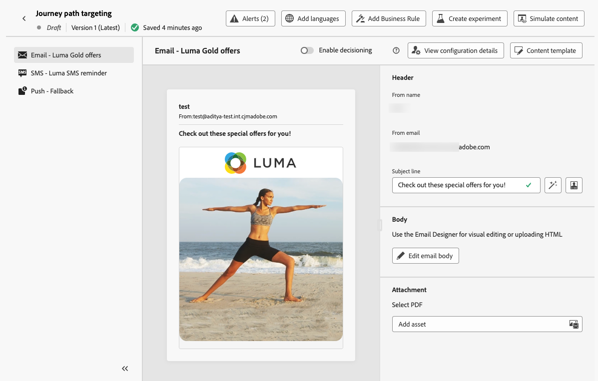

# Optimera aktivitet {#journey-path-optimization}

>[!CONTEXTUALHELP]
>id="ajo_journey_optimize"
>title="Optimera aktivitet"
>abstract="Med aktiviteten **Optimera** kan du definiera hur enskilda personer ska gå igenom din resa genom att skapa flera sökvägar baserat på specifika kriterier, inklusive experiment, målinriktning och specifika villkor."

>[!AVAILABILITY]
>
>Den här funktionen är tillgänglig med begränsad tillgänglighet. Kontakta din Adobe-representant för att få åtkomst.

Med aktiviteten **Optimera** kan du definiera hur enskilda personer ska gå igenom din resa genom att skapa flera **sökvägar** baserat på specifika kriterier, inklusive experiment, målgruppsanpassning och specifika villkor, vilket ger ett maximalt engagemang och framgång för att skapa välanpassade och effektiva resor.

En resa **sökväg** kan bestå av något av följande: sekvensering av kommunikationen, tid mellan dem, antal kommunikationer eller en kombination av dessa tre variabler.

En sökväg kan till exempel innehålla ett e-postmeddelande, en annan kan innehålla två SMS-meddelanden och en tredje kan innehålla ett e-postmeddelande, en Wait-nod på två timmar och sedan ett SMS-meddelande.

<!--With this feature, [!DNL Journey Optimizer] empowers you with the tools to deliver personalized and optimized paths to your audience, ensuring maximum engagement and success to create highly customized and effective journeys.-->

Genom aktiviteten **Optimera** kan du utföra följande åtgärder på de resulterande sökvägarna:

* Kör [sökvägsexperiment](#experimentation)
* Utnyttja [målinriktningsreglerna](#targeting) i varje resesökväg
* Använd [villkor](#conditions) på dina sökvägar

När resan är live utvärderas profiler mot de definierade kriterierna, och baserat på matchningskriterier skickas de vidare längs lämplig väg från resan.

## Använd experimenterande {#experimentation}

>[!CONTEXTUALHELP]
>id="ajo_path_experiment_success_metric"
>title="Resultatmått"
>abstract="Resultatmått används för att spåra och utvärdera den bästa behandlingen i ett experiment."
>additional-url="https://experienceleague.adobe.com/en/docs/journey-optimizer/using/orchestrate-journeys/create-journey/success-metrics" text="Konfigurera och spåra dina resemått"

Experimentation gör att du kan testa olika banor baserat på en slumpmässig delning för att avgöra vilken som fungerar bäst baserat på fördefinierade framgångsmått.

Följ stegen nedan för att konfigurera sökvägsexperiment under en resa.

Låt oss säga att du vill jämföra tre banor:

* en sökväg med ett e-postmeddelande,
* en andra sökväg med en **[!UICONTROL Wait]**-nod på två dagar och ett e-postmeddelande,
* en tredje sökväg med ett e-postmeddelande och sedan ett SMS-meddelande.

1. Dra och släpp **[!UICONTROL Orchestration]**-aktiviteten från avsnittet **[!UICONTROL Optimize]** till arbetsytan för resan.

1. Lägg till en valfri etikett, som kan vara användbar för att identifiera aktiviteten i loggar för rapportering och testläge.

1. Välj **[!UICONTROL Experiment]** i listrutan **[!UICONTROL Method]**.

   {width=65%}

1. Klicka på **[!UICONTROL Create experiment]**.

1. Välj den **[!UICONTROL Success metric]** som du vill ange för ditt experiment. Läs mer om tillgängliga mätvärden och hur du konfigurerar listan i [det här avsnittet](success-metrics.md).

   {width=80%}

1. Du kan lägga till en **[!UICONTROL Holdout]**-grupp i leveransen. Den här gruppen kommer inte att ange någon sökväg från det här experimentet.

   >[!NOTE]
   >
   >Om du aktiverar alternativfältet tar det automatiskt 10 % av din befolkning. Du kan justera procentandelen om det behövs.

   <!--
    DOES THIS APPLY TO PATH EXPERIMENT?
    IMPORTANT: When a holdout group is used in an action for path experimentation, the holdout assignment only applies to that specific action. After the action is completed, profiles in the holdout group will continue down the journey path and can receive messages from other actions. Therefore, ensure that any subsequent messages do not rely on the receipt of a message by a profile that might be in a holdout group. If they do, you may need to remove the holdout assignment.-->

1. Du kan tilldela en exakt procentandel till varje **[!UICONTROL Treatment]**, eller bara växla på **[!UICONTROL Distribute evenly]**-växlingsfältet.

   {width=80%}

1. Klicka på **[!UICONTROL Create]**.

1. Definiera elementen som du vill ha för varje gren som är resultatet av Experiment, till exempel:

   * Dra och släpp en [e-post](../email/create-email.md)-aktivitet till den första grenen (**Behandling A**).

   * Dra och släpp en [Wait](wait-activity.md)-aktivitet på två dagar till den första grenen, följt av en [Email](../email/create-email.md)-aktivitet (**Treatment B**).

   * Dra och släpp en [e-post](../email/create-email.md)-aktivitet till den tredje grenen, följt av en [SMS](../sms/create-sms.md)-aktivitet (**Behandling C**).

   {width=100%}

1. Du kan också använda **[!UICONTROL Add an alternative path in case of a timeout or an error]** för att definiera en reservåtgärd. [Läs mer](using-the-journey-designer.md#paths)

1. Välj en kanalåtgärd och använd knappen **[!UICONTROL Edit content]** för att komma åt designverktygen.

   {width=70%}

1. Därifrån kan du i den vänstra rutan navigera mellan olika innehåll för varje åtgärd i ditt experiment. Markera varje innehåll och utforma det efter behov.

   {width=100%}

1. [Publicera](publish-journey.md) din resa.

När resan är live tilldelas användarna slumpvis olika vägar. [!DNL Journey Optimizer] spårar vilken sökväg som fungerar bäst och ger åtgärdbara insikter.

Följ framgången på din resa med rapporten&quot;Journey Path Experiment&quot;. [Läs mer](../reports/journey-global-report-cja-experimentation.md)

### Exempel på användningsområden {#uc-experiment}

I följande exempel visas hur du använder aktiviteten **[!UICONTROL Optimize]** med metoden **[!UICONTROL Experiment]** för att avgöra vilken sökväg som fungerar bäst generellt.

+++Kanaleffektivitet

Testa om det första meddelandet skickas via e-post eller SMS leder till högre konverteringar.

➡️ Använd konverteringsgraden som framgångsmått (till exempel köp, registreringar).

+++

+++Meddelandefrekvens

Kör ett experiment för att kontrollera om ett e-postmeddelande eller tre e-postmeddelanden under en vecka leder till fler inköp.

➡️ Använd köp eller avbeställningsfrekvensen som framgångsmått.

+++

+++Väntetid mellan kommunikation

Jämför en 24-timmars väntan jämfört med en 72-timmars väntan före en uppföljning för att avgöra vilken tidpunkt som maximerar engagemanget.

➡️ Använd genomklickningsfrekvensen eller intäkterna som framgångsmått.

+++

## Utnyttja målgruppsanpassning {#targeting}

>[!CONTEXTUALHELP]
>id="ajo_path_targeting_fallback"
>title="Vad är en reservsökväg?"
>abstract="Reservbanor gör att målgruppen kan ange en alternativ sökväg när inga målinriktningsregler är kvalificerade.  Om du inte väljer det här alternativet kommer ingen målgrupp som inte är berättigad till en målgruppsregel att gå in i reservsökvägen och avsluta resan."

Målreglerna gör att du kan fastställa specifika regler eller kvalifikationer som måste uppfyllas för att en kund ska vara berättigad att ange en av kundresan, baserat på specifika målgruppssegment <!-- depending on profile attributes or contextual attributes-->.

Till skillnad från experiment, som är en slumpmässig tilldelning av en viss bana, är målinriktning avgörande för att säkerställa att rätt målgrupp eller profil kommer in på den angivna banan.

<!--With targeting, specific rules can be defined based on:

* **User profile attributes** such as location (eg. geo-targeting), age, or preferences. For example, users in the US receive a "Golden Gate" promotion, while users in France receive an "Eiffel Tower" promotion.

* **Contextual data** such as device type (eg. device-targeting), time of day, or session details. For example, desktop users receive desktop-optimized content, while mobile users receive mobile-optimized content.

* **Audiences** which can be used to include or exclude profiles that have a particular audience membership.-->

Följ stegen nedan för att konfigurera målinriktning på en resa.

1. Dra och släpp **[!UICONTROL Orchestration]**-aktiviteten från avsnittet **[!UICONTROL Optimize]** till arbetsytan för resan.

1. Lägg till en valfri etikett, som kan vara användbar för att identifiera aktiviteten i loggar för rapportering och testläge.

1. Välj **[!UICONTROL Targeting rule]** i listrutan **[!UICONTROL Method]**.

   {width=60%}

1. Klicka på **[!UICONTROL Create targeting rule]**.

1. Klicka på **[!UICONTROL Create rule]** > **[!UICONTROL Create new]** och använd regelverktyget för att definiera villkoren.

   {width=100%}

   Du kan till exempel definiera en regel för Guldmedlemmar i bonusprogrammet (`loyalty.status.equals("Gold", false)`) och en regel för de andra medlemmarna (`loyalty.status.notEqualTo("Gold", false)`).

   

1. Du kan också klicka på **[!UICONTROL Create rule]** > **[!UICONTROL Select rule]** för att välja en befintlig målinriktningsregel som har skapats på menyn **[!UICONTROL Rules]**. [Läs mer](../experience-decisioning/rules.md)

   {width=70%}

   I det här fallet kopieras formeln som utgör regeln helt enkelt till reseaktiviteten. Eventuella senare ändringar av den regeln från menyn **[!UICONTROL Rules]** påverkar inte kopian av resan.

   >[!AVAILABILITY]
   >
   >[Det går för närvarande att skapa målgruppsregler](../experience-decisioning/rules.md#create) från den dedikerade [!DNL Journey Optimizer]-menyn för organisationer som har köpt erbjudandet om tillägg till beslut, och de är tillgängliga på begäran för andra organisationer (begränsad tillgänglighet).
   >
   >Denna kapacitet kommer att successivt lanseras för alla kunder. Under tiden kontaktar du Adobe för att få åtkomst.

1. När du har lagt till en regel kan du fortfarande ändra den. Välj **[!UICONTROL Edit inline]** om du vill uppdatera den när du är i farten med regelverktyget eller **[!UICONTROL Select rule]** om du vill hämta en annan befintlig regel.

   {width=100%}

   >[!NOTE]
   >
   >När du redigerar en infogad regel påverkas inte den befintliga regel som den härstammar från.

1. Välj alternativet **[!UICONTROL Enable fallback path]** efter behov. Den här åtgärden skapar en reservbana för målgruppen som inte uppfyller någon av målgruppsreglerna som definieras ovan.

   >[!NOTE]
   >
   >Om du inte väljer det här alternativet kommer målgrupper som inte är kvalificerade för en målinriktningsregel inte in i reservbanan och avslutar resan.

1. Klicka på **[!UICONTROL Create]** om du vill spara målarregelinställningarna.

1. Tillbaka på resan, släpp specifika åtgärder för att anpassa varje bana. Skapa till exempel ett e-postmeddelande med personliga erbjudanden för Gold Loyalty-medlemmar och en SMS-påminnelse för alla andra medlemmar.

   

1. Om du valde alternativet **[!UICONTROL Enable fallback content]** när du definierade regelinställningarna definierar du en eller flera åtgärder för den återställningssökväg som lades till automatiskt.

   {width=70%}

1. Du kan även använda **[!UICONTROL Add an alternative path in case of a timeout or an error]** för att definiera en alternativ åtgärd om det uppstår problem. [Läs mer](using-the-journey-designer.md#paths)

1. Utforma lämpligt innehåll för varje åtgärd som motsvarar varje grupp som definieras av målarregelinställningarna. Du kan smidigt navigera mellan olika innehåll för varje åtgärd.

   

   I det här exemplet skapar du ett e-postmeddelande med specialerbjudanden för guldmedlemmar och en SMS-påminnelse för de andra medlemmarna.

1. [Publicera](publish-journey.md) din resa.

När resan är live behandlas den sökväg som anges för varje segment så att Guld-medlemmar anger sökvägen med e-posterbjudandena, medan de andra medlemmarna anger sökvägen med SMS-påminnelsen.

Följ hur framgångsrik din resa är med reserapporten. [Läs mer](../reports/journey-global-report-cja.md#targeting)

### Användningsfall för målregel {#uc-targeting}

I följande exempel visas hur du använder aktiviteten **[!UICONTROL Optimize]** med metoden **[!UICONTROL Targeting rule]** för att anpassa sökvägar för olika undergrupper.

+++Segmentspecifika kanaler

Gold-status som lojalitetsmedlemmar kan få personaliserade erbjudanden via e-post, medan alla andra medlemmar dirigeras till SMS-påminnelser.

<!--➡️ Use the revenue per profile or conversion rate as the optimization metric.-->

+++

+++Beteendebaserad målinriktning

Kunder som har öppnat ett e-postmeddelande men inte klickat kan få ett push-meddelande, medan de som inte öppnat alls får ett SMS.

<!--➡️ Use the click-through rate or downstream conversions as the optimization metric.-->

+++

+++Målinriktning mot inköpshistorik

Kunder som nyligen har köpt kan gå in på en kort&quot;Tack + Korsförsäljning&quot;-väg, medan kunder som inte har någon köphistorik går in på en längre vårdsresa.

<!--➡️ Use the repeat purchase rate or engagement rate as the optimization metric.-->

+++

### Lägg till ett villkor {#conditions}

Villkor är en typ av [målgruppsregler](#targeting) som gör att du kan definiera hur enskilda personer ska gå igenom din resa genom att skapa flera sökvägar baserat på specifika kriterier.

Lär dig definiera ett villkor i [det här avsnittet](conditions.md).

Följande typer av villkor är tillgängliga:

* [Source-villkor för data](condition-activity.md#data_source_condition)
* [Tidsvillkor](condition-activity.md#time_condition)
* [Procentandel av delning](condition-activity.md#percentage_split)
* [Datumvillkor](condition-activity.md#date_condition)
* [Profilände](condition-activity.md#profile_cap)
