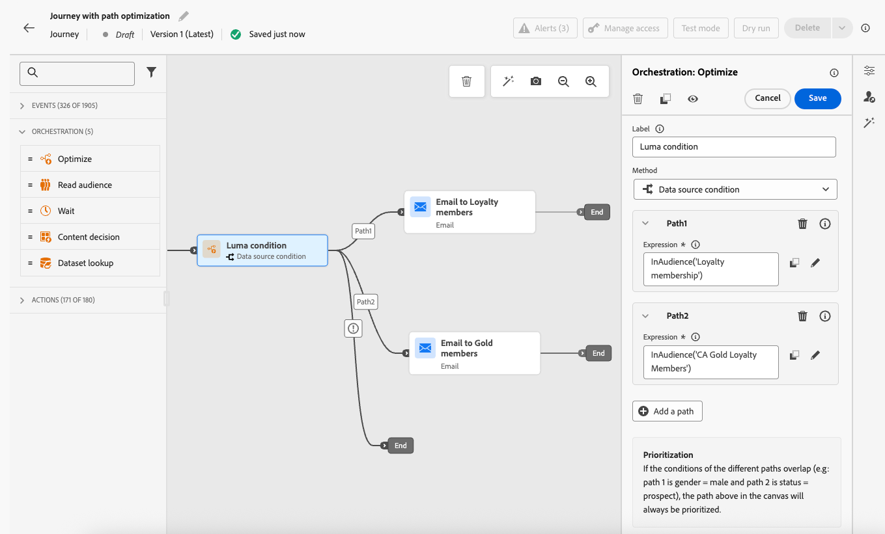

# Optimera aktivitet {#journey-path-optimization}

>[!CONTEXTUALHELP]
>id="ajo_journey_optimize"
>title="Optimera aktivitet"
>abstract="Med aktiviteten **Optimera** kan du definiera hur enskilda personer ska gå igenom din resa genom att skapa flera sökvägar baserat på specifika kriterier, inklusive experiment, målinriktning och specifika villkor."

>[!AVAILABILITY]
>
>Den här funktionen är tillgänglig med begränsad tillgänglighet. Kontakta din Adobe-representant för att få åtkomst.

Med aktiviteten **Optimera** kan du definiera hur enskilda personer ska gå igenom din resa genom att skapa flera **sökvägar** baserat på specifika kriterier, inklusive experiment, målgruppsanpassning och specifika villkor, vilket ger ett maximalt engagemang och framgång för att skapa välanpassade och effektiva resor.

En **resesökväg** kan bestå av något av följande:

* sekvensering av kommunikationen,
* tiden mellan dem,
* antal meddelanden,
* eller en kombination av dessa tre variabler.

En sökväg kan till exempel innehålla ett e-postmeddelande, en annan kan innehålla två SMS-meddelanden och en tredje kan innehålla ett e-postmeddelande, en [Wait](wait-activity.md)-nod på två timmar och sedan ett SMS-meddelande.

<!--With this feature, [!DNL Journey Optimizer] empowers you with the tools to deliver personalized and optimized paths to your audience, ensuring maximum engagement and success to create highly customized and effective journeys.-->

Genom aktiviteten **Optimera** kan du:

* Kör [sökvägsexperiment](#experimentation)
* Utnyttja [målinriktningsreglerna](#targeting) i varje resesökväg
* Använd [villkor](#conditions) på dina sökvägar

När resan är live utvärderas profiler mot de definierade kriterierna, och baserat på matchningskriterier skickas de vidare längs lämplig väg från resan.

## Använd experimenterande {#experimentation}

Experimentation gör att du kan testa olika banor baserat på en slumpmässig delning för att avgöra vilken som fungerar bäst baserat på fördefinierade framgångsmått.

Följ stegen nedan när du vill börja experimentera under en resa.

Låt oss säga att du vill jämföra tre banor:

* en sökväg med ett e-postmeddelande,
* en andra sökväg med en Wait-nod på två dagar och ett e-postmeddelande,
* en tredje sökväg med ett e-postmeddelande och sedan ett SMS-meddelande.

1. Släpp aktiviteten **[!UICONTROL Optimize]** på arbetsytan för resan.

1. Lägg till en valfri etikett för att identifiera aktiviteten i loggar för rapportering och testläge.

1. Välj **[!UICONTROL Experiment]** i listrutan **[!UICONTROL Method]**.

   {width=85%}

1. Klicka på **[!UICONTROL Experiment settings]**.

1. Designa och konfigurera ditt experiment som du vill. [Lär dig hur](../content-management/content-experiment.md)

   <!--
    {width=85%}
    Replace with appropriate screenshot
    The experiment applies to all the activities in the journey.TBC
   -->

När resan är live tilldelas användarna slumpvis olika vägar. [!DNL Journey Optimizer] spårar vilken sökväg som driver fler inköp och ger åtgärdbara insikter.

<!--Follow the success of your journey with the [Experimentation journey report](../reports/campaign-global-report-cja-experimentation.md). Is there a report specific to experimentation in journey?-->

### Användningsexempel med Experiment {#uc-experiment}

I följande exempel visas hur du använder aktiviteten **[!UICONTROL Optimize]** med metoden **[!UICONTROL Experiment]** för att avgöra vilken sökväg som fungerar bäst generellt.

**Kanaleffekt**

Testa om det första meddelandet skickas via e-post eller SMS leder till högre konverteringar.

* Använd konverteringsgraden som optimeringsmått (till exempel inköp, registreringar).

**Meddelandefrekvens**

Kör ett experiment för att kontrollera om ett e-postmeddelande eller tre e-postmeddelanden under en vecka leder till fler inköp.

* Använd köp eller avbeställningsfrekvensen som optimeringsmått.

**Väntetid mellan kommunikation**

Jämför en 24-timmars väntan jämfört med en 72-timmars väntan före en uppföljning för att avgöra vilken tidpunkt som maximerar engagemanget.

* Använd klickfrekvensen eller intäkterna som optimeringsmått.

## Utnyttja målgruppsanpassning {#targeting}

Med målgruppsanpassning kan du fastställa specifika regler eller kvalifikationer som måste uppfyllas för att en kund ska vara berättigad att ange en av kundresan, baserat på specifika målgruppssegment <!-- depending on profile attributes or contextual attributes-->.

Till skillnad från experiment, som är en slumpmässig tilldelning av en viss bana, är målinriktning avgörande för att säkerställa att rätt målgrupp eller profil kommer in på den angivna banan.

Med målinriktning kan specifika regler definieras baserat på:

* **Användarprofilattribut**, t.ex. plats (t.ex. geoanpassning), ålder eller önskemål. Användare i USA kan till exempel se en kampanj för&quot;Golden Gate&quot;, medan användare i Frankrike ser en kampanj för&quot;Eiffeltornet&quot;.

* **Sammanhangsberoende data**, t.ex. enhetstyp (t.ex. målgruppsanpassning), tid på dygnet eller sessionsinformation. Datoranvändare får till exempel datoroptimerat innehåll, medan mobilanvändare får mobiloptimerat innehåll.

* **Publiker** som kan användas för att inkludera eller exkludera profiler som har ett visst målgruppsmedlemskap.

Följ stegen nedan för att konfigurera målinriktning på en resa.

1. Släpp aktiviteten **[!UICONTROL Optimize]** på arbetsytan för resan.

1. Lägg till en valfri etikett för att identifiera aktiviteten i loggar för rapportering och testläge.

1. Välj **[!UICONTROL Targeting]** i listrutan **[!UICONTROL Method]**.

   {width=85%}

1. Klicka på **[!UICONTROL Create targeting rule]**.

1. Använd regelbyggaren för att definiera dina villkor. Definiera t.ex. en regel för amerikanska medborgare, en regel för franska medborgare och en regel för indiska medborgare.

   

1. Välj **[!UICONTROL Enable fallback content]** efter behov. Reservinnehåll gör att målgruppen kan få ett standardinnehåll när inga målinriktningsregler är kvalificerade. Om du inte markerar det här alternativet kommer målgrupper som inte är kvalificerade för en målregel som definieras ovan inte att ange en reservsökväg.

1. Spara målinriktningsregelinställningarna.

1. Tillbaka på resan, släpp specifika åtgärder för att anpassa varje bana. Du kan till exempel skapa ett specifikt e-postmeddelande för amerikanska medborgare, ett annat e-postmeddelande för franska medborgare och så vidare.

   

1. Utforma lämpligt innehåll för varje grupp som definieras av målregelinställningarna. Du kan smidigt navigera mellan de olika sökvägarna.

   

   I det här exemplet utformar du en specifik väg för amerikanska medborgare, en annan väg för franska medborgare och en annan väg för indiska medborgare.

När resan är live behandlas den väg som är angiven för varje segment så att amerikanska medborgare anger en viss väg, franska medborgare anger en annan väg och så vidare.

### Användningsexempel med riktad marknadsföring {#uc-targeting}

I följande exempel visas hur du använder aktiviteten **[!UICONTROL Optimize]** med metoden **[!UICONTROL Targeting]** för att anpassa sökvägar för olika undergrupper.

**Segmentspecifika kanaler**

Gold-status som lojalitetsmedlemmar kan få personaliserade erbjudanden via e-post, medan alla andra medlemmar dirigeras till SMS-påminnelser.

* Använd intäkten per profil eller konverteringsgrad som optimeringsmått.

**Beteendebaserad målinriktning**

Kunder som har öppnat ett e-postmeddelande men inte klickat kan få ett push-meddelande, medan de som inte öppnat alls får ett SMS.

* Använd genomklickningsfrekvensen eller nedströmskonverteringar som optimeringsmått.

**Målinriktning för inköpshistorik**

Kunder som nyligen har köpt kan gå in på en kort&quot;Tack + Korsförsäljning&quot;-väg, medan kunder som inte har någon köphistorik går in på en längre vårdsresa.

* Använd den upprepade inköpstakten eller engagemangsfrekvensen som optimeringsmått.

## Lägg till ett villkor {#conditions}

Du kan lägga till ett villkor för att definiera hur enskilda personer ska gå igenom din resa genom att skapa flera banor som baseras på specifika kriterier. Du kan också konfigurera en alternativ sökväg för att hantera timeout eller fel, vilket ger en smidig upplevelse.

Lär dig definiera ett villkor i [det här avsnittet](conditions.md).

Följande typer av villkor är tillgängliga:

* [Source-villkor för data](condition-activity.md#data_source_condition)
* [Tidsvillkor](condition-activity.md#time_condition)
* [Procentandel av delning](condition-activity.md#percentage_split)
* [Datumvillkor](condition-activity.md#date_condition)
* [Profilände](condition-activity.md#profile_cap)
