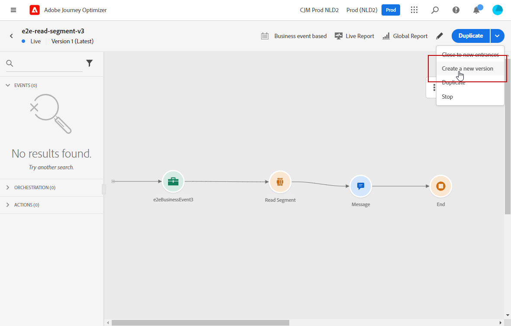

# Publicera din resa {#publishing-the-journey}

Du måste publicera en resa för att aktivera den och göra den tillgänglig för nya profiler för att komma in på resan. Innan du publicerar din resa kontrollerar du att den är giltig och att inga fel har uppstått. Du kan inte publicera en resa med fel.

➡️ [Upptäck den här funktionen i en video](#video)

## Publiceringsprocess {#journey-publication}

Steg för att publicera en resa beskrivs nedan:

1. Innan du publicerar din resa kontrollerar du att den är giltig och att inga fel har uppstått. Du kan inte publicera en resa med fel.

   * Lär dig testa din resa på [den här sidan](testing-the-journey.md).
   * Lär dig hur du felsöker dina resefel i [det här avsnittet](../building-journeys/troubleshooting.md#activity-errors).

1. Om du vill publicera resan klickar du på alternativet **[!UICONTROL Publish]** som finns i den övre högra menyn.

   >[!NOTE]
   >
   > Om din resa omfattas av en policy för godkännande måste du begära godkännande för att publicera din resa. [Läs mer](../test-approve/gs-approval.md)

   

När resan publiceras är den i **skrivskyddat**-läge. I skrivskyddat läge kan du bara ändra aktivitetsetiketter och beskrivningar, kundens namn och resans beskrivning. Om du behöver göra ytterligare ändringar i en publicerad resa skapar du [en ny version](journey-ui.md#journey-filter) av din resa.

När du avbryter en resa stoppas den permanent. Alla personer som passerar genom resan stoppas permanent, och resan avbryts så att nya deltagare kan komma in. Om du behöver göra om resan duplicerar du den och publicerar den nya resan.

>[!IMPORTANT]
>
>Om ett beslut om erbjudande som används i ett resemeddelande ändras måste du avpublicera resan och publicera den på nytt. Detta säkerställer att ändringarna införlivas i kundens budskap och att meddelandet överensstämmer med de senaste uppdateringarna.

## Reseversioner {#journey-versions}

I reselistan visas alla reseversioner med versionsnumret. När du söker efter en resa visas de senaste versionerna högst upp i listan första gången programmet öppnas. Sedan kan du definiera den sortering som du vill ha så att programmet behåller den som en användarinställning. Färdens version visas också överst i reseupplagans gränssnitt, ovanför arbetsytan.

>[!NOTE]
>
>Normalt kan en profil inte finnas flera gånger på samma resa, samtidigt, för alla aktiva versioner av resan. Om återinträde är aktiverat kan en profil återansluta en resa, men kan inte göra det förrän den tidigare instansen av resan har avslutats helt. [Läs mer](entry-management.md).

### Skapa en ny version av en resa {#journey-create-new-version}

Om du behöver ändra till en direktresa skapar du en ny version av din resa. Så här skapar du en ny version av en befintlig resa:

1. Öppna den senaste versionen av din liveresa, klicka på **[!UICONTROL Create a new version]** och bekräfta.

   

   >[!NOTE]
   >
   >Du kan bara skapa en ny version av den senaste versionen av en resa.

1. Gör ändringarna, klicka på **[!UICONTROL Publish]** och bekräfta.

Från det att resan har publicerats kommer individerna att börja flöda in i den senaste versionen av resan. Personer som redan har gått in i en tidigare version stannar kvar tills de är klara med resan. Om de senare kommer in på samma resa igen kommer de att gå in i den senaste versionen.

Reseversioner kan stoppas individuellt. Alla versioner av resor har samma namn.

När du publicerar en ny version av en resa avslutas den tidigare versionen automatiskt och ändras till statusen **Stängd** . Ingen inträde på resan kan ske. Även om du stoppar den senaste versionen förblir den tidigare versionen stängd.

>[!NOTE]
>
>Särskilda skyddsräcken och begränsningar gäller för versionshantering av resorna. Läs mer på [den här sidan](../start/guardrails.md#journey-versions-g).

## Instruktionsvideo {#video}

Lär dig hur du publicerar en resa i den här videon:

>[!VIDEO](https://video.tv.adobe.com/v/3427940?captions=swe&quality=12)