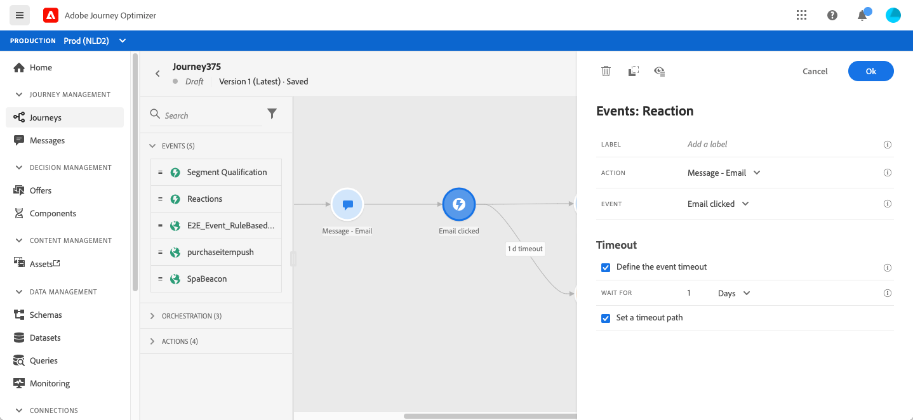

# Reaktionshändelser {#section_dhx_gss_dgb}

Bland de olika händelseaktiviteterna som finns på paletten finns den inbyggda **[!UICONTROL Reactions]**-händelsen. Med den här aktiviteten kan du reagera på spårningsdata som är relaterade till ett meddelande som skickas inom samma resa. Vi hämtar denna information i realtid när den delas med Adobe Experience Platform. För push-meddelanden kan du reagera på klickade, skickade eller misslyckade meddelanden. För SMS-meddelanden kan du reagera på skickade eller misslyckade meddelanden. För e-postmeddelanden kan du reagera på klickade, skickade, öppnade eller misslyckade meddelanden.

Du kan också använda den här funktionen för att utföra en åtgärd när det inte finns någon reaktion på dina meddelanden. Det gör du genom att skapa en andra sökväg parallellt med reaktionsaktiviteten och lägga till en vänteaktivitet. Om ingen reaktion inträffar under den period som anges i vänteaktiviteten väljs den andra banan. Du kan välja att skicka t.ex. ett uppföljningsmeddelande.

Observera att du bara kan använda en reaktionsaktivitet på arbetsytan om det finns en **Message**-aktivitet tidigare.

Se [Om åtgärdsaktiviteter](../building-journeys/about-journey-activities.md#action-activities).

Här följer de olika stegen för att konfigurera reaktionshändelser:

1. Lägg till en **[!UICONTROL Label]** i reaktionen. Det här steget är valfritt.
1. Välj den åtgärd som du vill reagera på i listrutan. Du kan välja vilken åtgärdsaktivitet som helst som placerats i banans tidigare steg.
1. Beroende på vilken åtgärd du har valt väljer du vad du vill reagera på.
1. Du kan definiera en timeout för en händelse (mellan 40 sekunder och 30 dagar) och en timeout-sökväg. Detta kommer att skapa en andra väg för individer som inte reagerade inom den definierade tidsperioden. När du testar en resa som använder en reaktionshändelse är standardläget **[!UICONTROL Wait time]** och det lägsta värdet 40 sekunder. Se [det här avsnittet](../building-journeys/testing-the-journey.md).

>[!NOTE]
>
>
>Reaktionshändelser kan inte spåra meddelanden som äger rum under en annan resa.
>
>Reaktionshändelser spårar klickningar på länkar av typen &quot;spårade&quot;. Ta inte hänsyn till länkar för att ta bort prenumerationer och spegla sidor.

>[!IMPORTANT]
>
>E-postklienter som Gmail tillåter bildblockering. E-postmeddelanden som öppnas spåras med en bild på 0 pixlar som ingår i e-postmeddelandet. Om bilder blockeras kommer e-postöppningar inte att beaktas.
