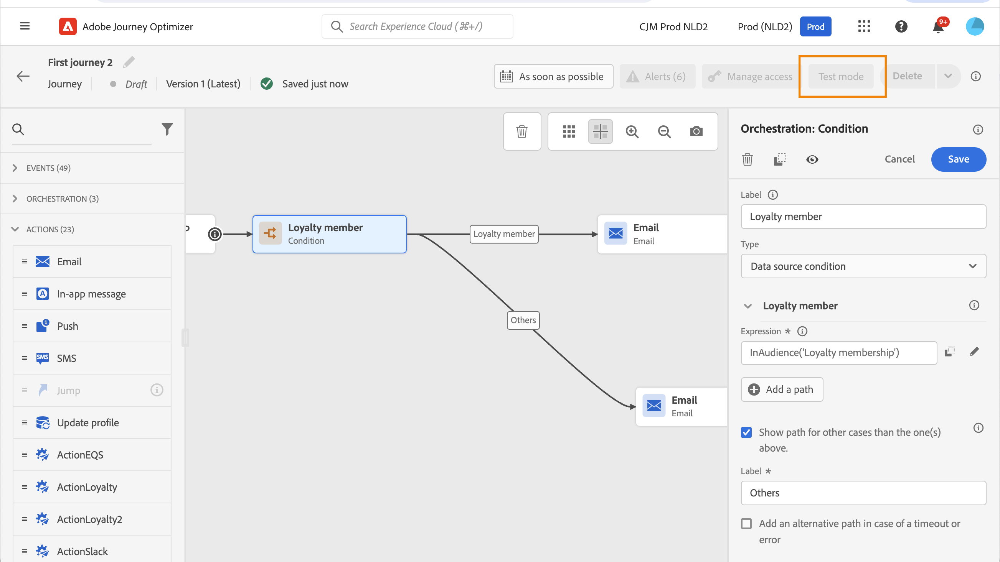

# Använda en målgrupp i en resa {#segment-trigger-activity}

Använd aktiviteten Läs målgrupp för att starta resor med definierade målgrupper. Ni väljer målgrupp och när den körs och använder sedan villkor, tidtagare och åtgärder för att anpassa varje profils väg.

## Om aktiviteten Läs målgrupp {#about-segment-trigger-activity}

>[!CONTEXTUALHELP]
>id="ajo_journey_read_segment"
>title="Läs målgruppsaktivitet"
>abstract="Lägg till alla kvalificerade profiler från en vald [!DNL Adobe Experience Platform]-målgrupp på den här resan. Kör en gång eller enligt ett schema."

Aktiviteten **Läs målgrupp** är den startpunktsaktivitet för resan som lägger till alla profiler från en vald [!DNL Adobe Experience Platform] målgrupp till en resa. Du kan köra ingången en gång eller enligt ett återkommande schema. I API:er och tekniska referenser kallas den här aktiviteten även för segmentutlösare eller målgruppsbaserad resepost.

**När ska jag använda behörigheten Läs publik kontra Målgrupp**

| Använd **Läs målgrupp** när | Använd **[målgruppskvalifikation](audience-qualification-events.md)** när |
|----------------------------|-----------------------------------------------------------------------|
| Du vill köra en resa en gång eller enligt ett schema (batch). | Ni behöver profiler för att komma in på resan i realtid när de kvalificerar er. |
| Din målgrupp är grupputvärderad (t.ex. ögonblicksbild varje dag). | Målgruppen är strömmande eller händelsebaserad. |
| Du är okej med en fördröjning mellan målgruppsutvärdering och reseanmälan. | Du måste ange omedelbart när en profil kvalificerar sig. |

**Nyckelbegränsningar:** En läsmålgrupp per resa (måste vara den första aktiviteten), en målgrupp per aktivitet, upp till fem samtidiga läsningar per organisation, 20 000 profiler per sekund per sandlåda, 12 timmars tidsgräns för jobb. Fullständig information i [Skrivbord och rekommendationer](#must-read).

**Förutsättningar:** En [!DNL Adobe Experience Platform] målgrupp som har byggts och utvärderats (Realized status), ett personbaserat ID-namnområde som har valts för resan och - för återkommande körningar - förståelse för [schemaläggnings- och genomströmningsbegränsningar](#must-read).

`Luma app opening and checkout`-målgruppen som skapats i [Skapa målgrupper](../audience/about-audiences.md) kan till exempel användas som startpunkt. Alla kvalificerade profiler går in på resan och förflyttar sig på individanpassade vägar med villkor, tidtagare, händelser och åtgärder.

➡️ [Upptäck den här funktionen i en video](#video)

>[!CAUTION]
>
>* Innan du använder aktiviteten Läs målgrupp ska du [läsa GuarDRAils and Limitation](#must-read).

## Konfigurera aktiviteten {#configuring-segment-trigger-activity}

Du anger: **Målgrupp** (obligatoriskt), **Namnområde** (obligatoriskt), **Läsfrekvens** (obligatoriskt, 5 000/s som standard) och **Schema** (när resan körs). Du kan också lägga till en **etikett** och **tilläggsidentifierare**. Stegen nedan vägleder dig genom varje inställning.

### Lägg till aktivitet och välj målgrupp {#add-activity-and-select-audience}

>[!CONTEXTUALHELP]
>id="ajo_journey_read_segment_label"
>title="Etikett"
>abstract="Valfri etikett som identifierar den här aktiviteten i loggar för rapportering och testläge."

>[!CONTEXTUALHELP]
>id="ajo_journey_read_segment_audience"
>title="Målgrupp"
>abstract="Välj den [!DNL Adobe Experience Platform] målgrupp vars profiler ska delta i den här resan."

>[!CONTEXTUALHELP]
>id="ajo_journey_read_segment_namespace"
>title="Namnutrymme"
>abstract="Välj vilken identitet (t.ex. e-post, ECID) som ska användas för att identifiera personer som deltar i resan. Välj det främsta alternativet i listan för bästa kompatibilitet med affärsregler och Capping."

1. Öppna kategorin **[!UICONTROL Orchestration]** och släpp en **[!UICONTROL Read Audience]**-aktivitet på arbetsytan.

   Aktiviteten måste placeras som det första steget i en resa.

1. Lägg till en **[!UICONTROL Label]** i aktiviteten (valfritt). En valfri etikett hjälper dig att identifiera aktiviteten i rapporter och i testlägesloggar.

1. I fältet **[!UICONTROL Audience]** väljer du den [!DNL Adobe Experience Platform]-målgrupp som ska delta i resan och klickar sedan på **[!UICONTROL Save]**. Du kan välja vilken [!DNL Adobe Experience Platform]-målgrupp som helst som har genererats med [segmentdefinitioner](../audience/creating-a-segment-definition.md).

   >[!NOTE]
   >
   >Dessutom kan du rikta in dig på [!DNL Adobe Experience Platform] målgrupper som skapats med [målgruppskompositioner](../audience/get-started-audience-orchestration.md).
   >Du kan även rikta in målgrupper [som har överförts från en CSV-fil](https://experienceleague.adobe.com/docs/experience-platform/segmentation/ui/overview.html#import-audience){target="_blank"}.
   >[Läs mer om hur du genererar och målgruppsanpassar i Journey Optimizer](../audience/about-audiences.md).

   Observera att du kan anpassa kolumnerna som visas i listan och sortera dem.

   ![Gränssnitt för målgruppsval som visar tillgängliga [!DNL Adobe Experience Platform] målgrupper &#x200B;](assets/read-segment-selection.png)

   När målgruppen har lagts till kan du med knappen **[!UICONTROL Copy]** kopiera dess namn och ID:

   `{"name":"Luma app opening and checkout","id":"8597c5dc-70e3-4b05-8fb9-7e938f5c07a3"}`

   

   >[!NOTE]
   >
   >Det är bara de personer som har **Realiserad**-målgruppsdeltagarstatus som går in på resan. Mer information om hur du utvärderar en målgrupp finns i [dokumentationen för segmenteringstjänsten](https://experienceleague.adobe.com/docs/experience-platform/segmentation/tutorials/evaluate-a-segment.html#interpret-segment-results){target="_blank"}.

1. I fältet **[!UICONTROL Namespace]** väljer du det namnutrymme som ska användas för att identifiera personerna. Som standard är fältet förifyllt med det senast använda namnutrymmet. [Läs mer om namnutrymmen](../event/about-creating.md#select-the-namespace).

   >[!NOTE]
   >
   >Individer som tillhör en målgrupp som inte har den valda identiteten (namnutrymmet) bland sina olika identiteter kan inte ta sig in på resan. Du kan bara välja ett personbaserat ID-namnutrymme. Om du har definierat ett namnområde för en uppslagstabell (till exempel: ProductID-namnområde för en produktsökning), är det inte tillgängligt i listrutan **Namespace**.

### Ytterligare identifierare {#read-audience-supplemental-id}

Du kan även aktivera **Använd en extra identifierare** för att köra resan i kontexten för en sekundär identifierare (till exempel ett order-ID eller boknings-ID) utöver profil-ID:t. Detta tillåter flera inmatningar av samma profil när den kompletterande identifieraren skiljer sig åt.

[Lär dig hur du använder tilläggsidentifierare i resor](supplemental-identifier.md). För målgruppsresor måste den kompletterande identifieraren vara ett profilattribut. Läsfrekvensen är begränsad till 500 profiler per sekund när extra ID används.

### Skyddsutkast och rekommendationer {#must-read}

* Endast en **[!UICONTROL Read Audience]**-aktivitet kan användas på en resa och måste vara den första aktiviteten på arbetsytan.

* Aktiviteten **[!UICONTROL Read audience]** kan bara ha en målgrupp som mål. Om det krävs flera målgrupper bör du överväga att slå samman dessa målgrupper till en enda innan du använder dem. [Lär dig hur du kombinerar målgrupper med arbetsflöden för disposition](../audience/get-started-audience-orchestration.md)

* För resor som använder en **Läs målgrupp**-aktivitet finns det ett maximalt antal resor som kan påbörjas exakt samtidigt. Nya försök utförs av systemet. Undvik dock att ha fler än fem resor (med **Läs målgrupp**, schemalagd eller starta&quot;så snart som möjligt&quot;) med början vid exakt samma tidpunkt. Det bästa är att sprida dem över tiden, till exempel mellan 5 och 10 minuter.

* Det går inte att använda fältgrupper för upplevelsehändelser på resor som börjar med en **läsmålgruppsaktivitet**, en **[målgruppsklassificeringsaktivitet](audience-qualification-events.md)** eller en affärshändelseaktivitet.

* Vi rekommenderar att du bara använder gruppmålgrupper i en **Läs målgrupp** -aktivitet. Detta ger en tillförlitlig och enhetlig räkning för de målgrupper som används under en resa. Läsarna är utformade för att gruppbearbetas. Om ditt användningsfall behöver realtidsdata använder du aktiviteten **[Målgruppskvalificering](audience-qualification-events.md)**.

* Publiker [som har importerats från en CSV-fil](https://experienceleague.adobe.com/docs/experience-platform/segmentation/ui/overview.html#import-audience) eller som är resultatet av [dispositionsarbetsflöden](../audience/get-started-audience-orchestration.md) kan väljas i aktiviteten **Läs målgrupp**. Dessa målgrupper är inte tillgängliga i aktiviteten **Målgruppskvalificering**.

* Concurrent Read Audience Limit per Organization: Varje organisation kan köra upp till fem Read Audience-instanser samtidigt. Detta omfattar både schemalagda körningar och körningar som utlöses av affärshändelser. Gränsen gäller för alla sandlådor och resor. Den här gränsen tillämpas för att säkerställa en rättvis och balanserad resursallokering för alla organisationer.

* Hantering av genomströmning i sandlådor: Systemet hanterar dynamiskt bearbetningen per sandlåda med en maximal gräns på 20 000 profiler per sekund som delas över alla Läs målgrupper-aktiviteter. Enskilda Läs Audience-aktiviteter kan konfigureras med en minsta frekvens på 500 profiler per sekund. Om genomströmningsgränserna på sandlådenivå nås, kan jobb ställas i kö för att säkerställa en rättvis resursallokering.

* Tidsgräns för jobbbearbetning: Läsa målgruppsjobb som inte kan bearbetas inom 12 timmar på grund av säkerhetsgränsen rensas automatiskt och körs aldrig. Detta förhindrar jobbackumulering och garanterar systemstabilitet.

* När du använder gruppsegment ska du se till att dina intag och uppdateringar av dagliga ögonblicksbilder är fullständiga långt innan resan börjar. Överväg en ytterligare vänteperiod om segmenten måste återspegla data som importerats samma dag. Om det är viktigt med omedelbar profilaktualitet använder du en händelsebaserad eller direktuppspelad strategi i stället för en daglig batchbaserad strategi. Du kan också infoga en väntemekanism som tillåter att uppdaterade data sprids före utvärderingen av resan.

Guardrutor för aktiviteten **Läs målgrupp** visas på [den här sidan](../start/guardrails.md#read-segment-g).

>[!CAUTION]
>
>[Garantier för kundprofildata och segmentering i realtid &#x200B;](https://experienceleague.adobe.com/docs/experience-platform/profile/guardrails.html){target="_blank"} gäller även [!DNL Adobe Journey Optimizer].

**Nästa:** Ange [läsfrekvens](#profile-entry-and-reading-rate) och [schema](#schedule) och [testa och publicera](#testing-publishing).

### Profilregistrering och läsfrekvens {#profile-entry-and-reading-rate}

>[!CONTEXTUALHELP]
>id="ajo_journey_read_segment_reading_rate"
>title="Läsfrekvens"
>abstract="Högsta antal profiler som går in på resan per sekund (500-20 000). Standardvärdet är 5 000."

Ange **[!UICONTROL Reading rate]** (obligatoriskt). Det här är det maximala antalet profiler som kan komma in på resan per sekund. Denna avgift gäller endast denna aktivitet och inga andra delar av resan. Om du till exempel vill definiera en begränsningsfrekvens för anpassade åtgärder måste du använda begränsnings-API:t. Se den här [sidan](../configuration/throttling.md).

Det här värdet lagras i transportversionens nyttolast. Standardvärdet är 5 000 profiler per sekund. Du kan ändra det här värdet från 500 till 20 000 profiler per sekund.

>[!NOTE]
>
>Den totala läshastigheten per sandlåda är satt till 20 000 profiler per sekund. Läsfrekvensen för alla läsmålgrupper som körs samtidigt i samma sandlåda uppgår därför till högst 20 000 profiler per sekund. Du kan inte ändra denna ände. Läs mer om resefrekvenser och dataflöde i [det här avsnittet](entry-management.md#journey-processing-rate).

### Schemalägg resan {#schedule}

>[!CONTEXTUALHELP]
>id="ajo_journey_read_segment_scheduler_start_date"
>title="Startdatum/tid"
>abstract="Definiera när den här resan ska påbörjas."

>[!CONTEXTUALHELP]
>id="ajo_journey_read_segment_scheduler_repeat_until"
>title="Upprepa tills"
>abstract="Definiera slutdatum för återkommande körningar."

>[!CONTEXTUALHELP]
>id="ajo_journey_read_segment_scheduler_repeat_every"
>title="Upprepa var"
>abstract="Hur ofta resan går (t.ex. varje dag eller varje vecka)."

>[!CONTEXTUALHELP]
>id="ajo_journey_read_segment_scheduler_incremental_read"
>title="Inkrementell läsning"
>abstract="Efter den första körningen kommer endast nya profiler som lagts till i målgruppen in på resan."

>[!CONTEXTUALHELP]
>id="ajo_journey_read_segment_scheduler_force_reentrance"
>title="Tvinga återinträde"
>abstract="Rensa alla deltagare från resan innan varje ny målgrupp läser."

>[!CONTEXTUALHELP]
>id="ajo_journey_read_segment_scheduler_synchronize_audience"
>title="Utlösare efter utvärdering av batchmålgrupp"
>abstract="Kör resan först när batchmålgruppen har utvärderats nyligen."

>[!CONTEXTUALHELP]
>id="ajo_journey_read_segment_scheduler_synchronize_audience_wait_time"
>title="Vänta på en ny målgruppsutvärdering"
>abstract="Hur länge ska resan vänta på nya målgruppsdata (1-6 timmar, i minuter eller timmar)."

Som standard är resor konfigurerade att köras en gång. Följ stegen nedan för att definiera ett specifikt datum/tid och hur ofta resan ska utföras.

>[!NOTE]
>
>En bild Läs målgruppsresor flyttar till statusen **Slutförd** 91 dagar ([global tidsgräns för resa](journey-properties.md#global_timeout)) efter resan. För schemalagda läsmålgrupper är det 91 dagar efter den sista förekomsten.

1. Välj **[!UICONTROL Read audience]** i aktivitetsegenskaperna för **[!UICONTROL Edit journey schedule]**.

   

1. Resans egenskaper visas. I listrutan **[!UICONTROL Scheduler type]** väljer du hur ofta du vill att resan ska köras.

   

>[!TIP]
>
>Om du vill leverera utgående meddelanden i grupper över tiden i stället för alla samtidigt, kan du konfigurera påfyllnadssändning i transportschemat. [Lär dig hur du skickar med vågor på resor](send-using-waves.md)

För återkommande resor finns det specifika alternativ som hjälper dig att hantera inmatningen av profiler på resan. Expandera avsnitten nedan om du vill ha mer information om varje alternativ.

+++**[!UICONTROL Incremental read]**

När en resa med en återkommande **läsmålgrupp** körs för första gången kommer alla profiler i målgruppen in på resan. Med det här alternativet kan du efter första tillfället bara rikta in dig på de personer som har gått in i målgruppen sedan den senaste körningen av resan.

När du använder det här alternativet ser systemet tillbaka **24 timmar** från tidpunkten för det senaste målgruppsutvärderingsjobbet som utfördes av [!DNL Adobe Experience Platform]s segmenteringstjänst.

När segmenteringen är klar påbörjas ett exportjobb för ögonblicksbilder av profiler, där Journey Optimizer kan identifiera och bearbeta nya profiler. Om resan schemaläggs mellan dessa två jobb kommer den inkrementella läsningen inte att hämta profiler som blivit medlemmar av målgruppen sedan den senaste körningen av resan.

Så här minimerar du risken för saknade profiler:
* Aktivera alternativet **[!UICONTROL Trigger after batch audience evaluation]** om du vill förlänga summeringsperioden till tidpunkten för den senaste lyckade resan, oavsett hur länge den pågick
* Schemalägg resor som ska köras bra efter dagliga batchsegmenteringsjobb slutförda (vanligen 2-3 timmars buffert)
* För tidskritiska användningsfall som kräver omedelbar profilinkludering bör du överväga att använda [målgruppskvalificeringsaktiviteter](audience-qualification-events.md) med direktuppspelade målgrupper istället

>[!CAUTION]
>
>Om du har en [anpassad uppladdningsmålgrupp](../audience/about-audiences.md#about-segments) som mål under din resa hämtas profiler endast vid den första upprepningen när det här alternativet är aktiverat under en återkommande resa. Dessa målgrupper är lagade.

+++

+++**[!UICONTROL Force reentrance on recurrence]**

Med det här alternativet kan du göra så att alla profiler fortfarande finns kvar i resan automatiskt avslutar den vid nästa körning.

Om du till exempel har en tvådagars väntan på en återkommande resa, flyttas profiler till nästa körning när du aktiverar det här alternativet. Det händer dagen efter, oavsett om de är i nästa omgång eller inte.

Om livscykeln för dina profiler under den här resan kan vara längre än frekvensen för återkommande aktiviteter ska du inte aktivera det här alternativet för att säkerställa att profilerna kan slutföra sin resa.

+++

+++**[!UICONTROL Trigger after batch audience evaluation]**

För resor som schemaläggs dagligen och som riktar sig till gruppmålgrupper kan du definiera ett tidsfönster på upp till 6 timmar innan resan väntar på nya målgruppsdata från batchsegmenteringsjobb. Om segmenteringsjobbet slutförs inom tidsfönstret utlöses resan. I annat fall hoppas resan över tills nästa förekomst uppstår. Det här alternativet ser till att resorna körs med korrekta och aktuella målgruppsdata.

Om en resa till exempel är schemalagd till 6 PM dagligen kan du ange ett antal minuter eller timmar att vänta innan resan körs. När resan återupptas kl. 18.00 söker programmet efter en ny målgrupp, vilket innebär en nyare målgrupp än den som användes under den föregående resan. Under den angivna tidsperioden verkställs resan omedelbart när den nya målgruppen identifieras. Om ingen ny målgrupp upptäcks kommer körningen att hoppas över den dagen.

+++

<!--

### Segment filters {#segment-filters}

[!CONTEXTUALHELP]
>id="jo_segment_filters"
>title="About segment filters"
>abstract="You can choose to target only the individuals who entered or exited a specific segment during a specific time window. For example, you can decide to only retrieve all the customers who entered the VIP segment since last week."

You can choose to target only the individuals who entered or exited a specific segment during a specific time window. For example, you can decide to only retrieve all the customers who entered the VIP segment since last week. Only the new VIP customers will be targeted. All the customers who were already part of the VIP segment before will be excluded.

To activate this mode, click the **Segment Filters** toggle. Two fields are displayed:

**Segment membership**: choose whether you want to listen to segment entrances or exits. 

**Lookback window**: define when you want to start to listen to entrances or exits. This lookback window is expressed in hours, starting from the moment the journey is triggered.  If you set this duration to 0, the journey will target all members of the segment. For recurring journeys, it will take into account all entrances/exits since the last time the journey was triggered.

-->

## Testa och publicera resan {#testing-publishing}

Med aktiviteten **[!UICONTROL Read Audience]** kan du testa resan med en enhetsprofil.

Det gör du genom att aktivera testläget.

Konfigurera och kör testläget som vanligt. [Lär dig testa en resa](testing-the-journey.md).

När testet har körts kan du med knappen **[!UICONTROL Show logs]** se testresultaten. Mer information finns i [det här avsnittet](testing-the-journey.md#viewing_logs)

När testerna har slutförts kan du publicera din resa (se [Publicera resan](../building-journeys/publish-journey.md)). Enskilda personer som tillhör målgruppen kommer att gå in på resan det datum/den tid som anges i avsnittet med egenskaper **[!UICONTROL Scheduler]** för resan.

>[!NOTE]
>
>För återkommande målgruppsbaserade resor stängs resan automatiskt när den sista förekomsten av den har utförts. Om inget slutdatum/sluttid har angetts måste du stänga resan till nya ingångar manuellt för att avsluta den.

## Målgruppsanpassning inom resor

Målgruppsbaserade resor börjar alltid med en **Läs målgrupp**-aktivitet för att hämta personer som tillhör en [!DNL Adobe Experience Platform] målgrupp. Dessa profiler läses en gång eller enligt ett återkommande schema.

När de har gått in i resan ordnar du dem med **Villkor**-aktiviteter: segmentera efter attribut eller beteende, exkludera delar av populationen eller slå samman grenar (union). Avsnitten nedan beskriver de olika mönstren.

**Segmentering**

Du kan använda villkor för att utföra segmentering med aktiviteten **Villkor**. Du kan t.ex. få VIP-användare att ta en viss väg och låta andra användare än VIP flöda i en annan bana.

Segmenteringen kan baseras på:

* datakälldata
* kontexten för händelser som ingår i resedata, till exempel: klickade en person på meddelandet som togs emot för en timme sedan?
* Ett datum, till exempel: Är vi i juni när en person går igenom resan?
* en tid, till exempel: är det morgon i personens tidszon?
* en algoritm som delar den målgrupp som flödar i resan baserat på en procentandel, till exempel: 90 % - 10 % för att utesluta en kontrollgrupp

>[!NOTE]
>
>När du använder schemaläggartypen Dagligen med en **[!UICONTROL Read Audience]**-aktivitet kan du definiera ett tidsfönster där resan ska vänta på nya målgruppsdata. Detta garanterar korrekt målinriktning och förhindrar problem som orsakas av förseningar i gruppsegmenteringsjobb. [Lär dig schemalägga en resa](#schedule)

**Uteslutning**

Med samma **villkorsaktivitet** som används för segmentering (se ovan) kan du även utesluta en del av populationen. Du kan till exempel utesluta VIP-personer genom att låta dem flöda in i en gren med ett slutsteg direkt efter.

Detta kan inträffa direkt efter det att målgruppen har hämtats, för att räkna antalet personer eller längs en flerstegsresa.

**Union**

Med Resor kan du skapa N-grenar och förena dem efter en segmentering. Det innebär att ni kan få två målgrupper att återvända till en gemensam upplevelse.

Om du till exempel har följt en annan upplevelse under tio dagar på en resa kan VIP- och icke-VIP-kunder återgå till samma resa. Efter en union kan du dela upp publiken igen genom att utföra en segmentering eller ett exkluderingsmoment.

## Felsökning {#audience-count-mismatch}

I det här avsnittet får du hjälp med att lösa **målgruppsfelmatchningar** (färre eller fler profiler än förväntat), **noll profiler bearbetade** (Läs målgruppsvarning eller inga poster) och **fördröjda eller saknade poster** (timing och dataspridning).

>[!NOTE]
>
>När en läsmålgruppsaktivitet körs genererar systemet interna händelser (så kallade `segmentExportJob`-händelser) som spårar målgruppsexportåtgärdens livscykel. Dessa händelser registreras på aktivitetsnivå, inte per enskild profil, och kan efterfrågas i övervaknings- och felsökningssyfte. Läs mer om [frågor om Read Audience-händelser](../reports/query-examples.md#read-segment-queries).

**Hitta ditt problem:**

| Symptom | Gå till |
|---------|--------|
| Färre (eller fler) profiler än målgruppens storlek | [Timing och dataspridning](#timing-and-data-propagation), [Datavalidering och övervakning](#data-validation-and-monitoring) |
| Läs målgruppen som behandlats med noll profiler; aviseringen utlöses | [Nollprofiler bearbetade](#zero-profiles-processed) |
| Poster som är fördröjda eller saknas för batchmålgrupper | [Timing och dataspridning](#timing-and-data-propagation) |
| Måste verifiera segmentjobbstatus eller namnområde | [Dataverifiering och övervakning](#data-validation-and-monitoring) |

### Nollprofiler har bearbetats {#zero-profiles-processed}

Om aktiviteten **Läs målgrupp** inte har bearbetat någon profil (du ser t.ex. aviseringen [Läs målgrupp](../reports/alerts.md#alert-read-audiences)):

1. **Kontrollera om målgruppen är tom** - I [!DNL Adobe Experience Platform] kontrollerar du målgruppens storlek och att profilerna har statusen **Realized**. En tom eller ännu ej utvärderad publik resulterar i noll poster.
2. **Kontrollera namnområde** - Det namnområde som valts i aktiviteten Läs målgrupp måste finnas i profilerna hos din målgrupp. Profiler utan den identiteten kan inte komma in på resan. [Läs mer om namnutrymmen](../event/about-creating.md#select-the-namespace).
3. **Granska aviseringar och försök igen** - Fel rapporteras i **Varningar**. Systemet försöker exportera jobb som skapats var 10:e minut i upp till 1 timme. [Läs mer om återförsök och aviseringar](#read-audience-retry).

Om problemet kvarstår efter dessa kontroller kan du läsa [Timing och dataspridning](#timing-and-data-propagation) och [Datavalidering och övervakning](#data-validation-and-monitoring) för att se om det finns några batch- och konfigurationsorsaker.

### Tidsplanering och dataspridning {#timing-and-data-propagation}

* **Slutförande av batchsegmenteringsjobb**: För batchmålgrupper kontrollerar du att det dagliga batchsegmenteringsjobbet har slutförts och att ögonblicksbilder uppdateras innan resan körs. Batchmålgrupper blir klara att använda cirka **2 timmar** efter att segmenteringsjobbet har slutförts. Läs mer om [metoder för målgruppsutvärdering](https://experienceleague.adobe.com/docs/experience-platform/segmentation/home.html#evaluate-segments){target="_blank"}.

* **Tidsåtgång för datainförsel**: Verifiera att inmatningen av profildata har slutförts innan resan kördes. Om profiler förtärdes kort innan resan påbörjas kanske de ännu inte återspeglas i målgruppen. Läs mer om [dataöverföring i [!DNL Adobe Experience Platform]](https://experienceleague.adobe.com/docs/experience-platform/ingestion/home.html){target="_blank"}.

* **Använd alternativet Utlösare efter utvärdering av gruppmålgrupp**: För dagliga schemalagda resor med gruppmålgrupper bör du överväga att aktivera alternativet **[!UICONTROL Trigger after batch audience evaluation]**. Detta garanterar att resan väntar på nya målgruppsdata (upp till 6 timmar) innan den körs. [Läs mer om schemaläggning](#schedule)

* **Lägg till en vänteaktivitet**: För direktuppspelande målgrupper med nyligen inspelade data bör du lägga till en **Wait**-aktivitet i början av resan, så att du kan använda tiden för dataspridning och profilkvalificering. [Läs mer om aktiviteten Vänta](wait-activity.md)

### Dataverifiering {#data-validation-and-monitoring}

* **Kontrollera segmenteringsjobbstatus**: Övervaka jobbslutförandetider för gruppsegmentering på [!DNL Adobe Experience Platform] [kontrollpanelen för övervakning](https://experienceleague.adobe.com/docs/experience-platform/dataflows/ui/monitor-segments.html){target="_blank"}. Använd det för att verifiera när målgruppsdata är klara.

* **Verifiera sammanfogningsprinciper**: Kontrollera att den sammanfogningsprincip som har konfigurerats för din målgrupp matchar det förväntade beteendet för att kombinera profildata från olika källor. Läs mer om [sammanslagningsprinciper i [!DNL Adobe Experience Platform]](https://experienceleague.adobe.com/docs/experience-platform/profile/merge-policies/overview.html){target="_blank"}.

* **Granska segmentdefinitioner**: Bekräfta att segmentdefinitionerna är korrekt konfigurerade och inkludera alla förväntade kvalificeringskriterier. Läs mer om att [bygga målgrupper](../audience/creating-a-segment-definition.md). Var särskilt uppmärksam på:
   * Tidsbaserade villkor som kan exkludera profiler baserade på händelsetidsstämplar
   * Attributkvalifikationer som är beroende av nyligen uppdaterade data
   * Utvärderingsmetoder för direktuppspelning kontra batchbearbetning

* **Verifiera namnområdeskonfiguration**: Kontrollera att det namnutrymme som valts i aktiviteten **Läs målgrupp** matchar den primära identitet som används av profilerna i målgruppen. Profiler utan det valda namnutrymmet kommer inte att gå in på resan. Läs mer om [identitetsnamnutrymmen](../event/about-creating.md#select-the-namespace).

### Bästa praxis

* **Schemalägg resor efter segmentering**: För batchmålgrupper schemalägger du körning av resan minst 2-3 timmar efter den typiska jobbslutstiden för batchsegmentering. [Läs mer om schemaläggning av resor](#schedule)

* **Använd direktuppspelade målgrupper för användningsfall i realtid**: Om du behöver omedelbar profilkvalificering och resepost använder du [Målgruppskvalificering](audience-qualification-events.md)-aktiviteter med direktuppspelade målgrupper i stället för **Läs målgrupper** med gruppmålgrupper.

* **Testa med mindre målgrupper först**: Innan du startar storskaliga resor bör du testa med en mindre delmängd för att verifiera att antalet matchar förväntningarna. [Lär dig hur du testar en resa](testing-the-journey.md)

* **Övervaka regelbundet**: Ställ in regelbunden övervakning av målgruppsstorlekar och resemätvärden för att upptäcka avvikelser tidigt. Läs mer om [resefrekvenser och hantering av inträde](entry-management.md).

### Kontakta supporten

Om antalet avvikelser eller nollprofilen kvarstår efter att du följt instruktionerna ovan kontaktar du Adobe support. Ha klart: målgruppsnamn/ID, resenamn/ID, schemalagd körtid(er), sandlåda och en kort beskrivning av diskrepansen (t.ex.&quot;Målgruppen visar 10 kB realiserat, endast 2 kB gick in på resan [date]&quot;).

## Försök igen {#read-audience-retry}

Återförsök används som standard på målgruppsinlösta resor (med början från en **Läs målgrupp** eller en **affärshändelse**) när exportjobbet hämtas. Om ett fel inträffar när exportjobbet skapas görs nya försök var 10:e minut (max 1 timme). Efter det kommer vi att betrakta det som ett misslyckande. Dessa typer av resor kan därför utföras upp till en timme efter den schemalagda tiden.

**Misslyckade utlösare för läsning** fångas in och visas i **Varningar**. Varningen **Läs målgrupp** varnar dig om en **Läs målgrupp**-aktivitet inte har bearbetat någon profil 10 minuter efter den schemalagda körningstiden. Felet kan bero på tekniska problem eller en tom publik. Om felet beror på tekniska problem kan försök fortfarande göras beroende på problemtypen. Om det t.ex. inte går att skapa exportjobb, försöker vi igen var 10:e minut i upp till 1 timme. [Läs mer](../reports/alerts.md#alert-read-audiences)

## Relaterade ämnen

* [Bygg målgrupper](../audience/about-audiences.md)
* [Målgruppskvalificeringsaktivitet](audience-qualification-events.md)
* [Använd tilläggsidentifierare under resor](supplemental-identifier.md)
* [Resetillgångar och skyddsräcken](../start/guardrails.md#read-segment-g)
* [Bearbetningsgrad för resor och hantering av inträde](entry-management.md)
* [Testa en resa](testing-the-journey.md)
* [Publicera en resa](../building-journeys/publish-journey.md)

## Instruktionsvideo {#video}

Förstå tillämpliga användningsfall för en resa som triggas av läsmålgruppsaktiviteten. Lär dig hur du bygger batchbaserade resor och vilka metodtips som ska användas.

>[!VIDEO](https://video.tv.adobe.com/v/3424997?quality=12)
